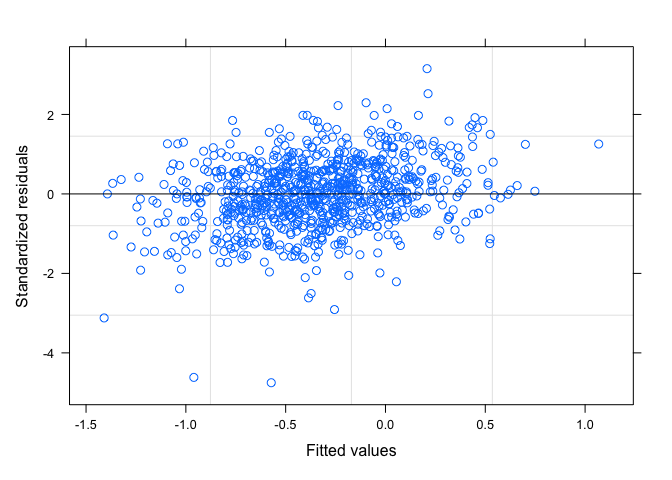
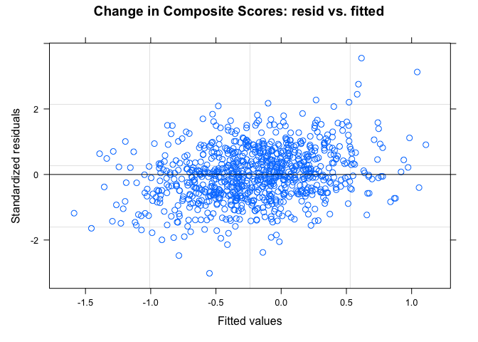

investigations
================
Paula Wu
5/11/2022

``` r
m2_df = 
  read_csv("./data/m2_df.csv") %>% 
  select(-1) %>% 
  filter(B3TCOMPZ3 != 8 & B3TEMZ3 != 8 & B3TEFZ3 != 8) %>% 
  filter(B4QCT_SA != 98 & B4QCT_EN != 98 & B4QCT_MD != 8 & B4QCT_PN != 98 & B4QCT_EA != 98 & B4QCT_PA != 98) %>% 
  select(-c(37:47))

#m2_df = read_csv("./data/m2_df.csv") %>% 
#  select(-1) %>% 
#  filter(!(B3TCOMPZ3 == 8 | B3TEMZ3 == 8 | B3TEFZ3 == 8)) %>% 
#  filter(!(B4QCT_SA == 98 | B4QCT_EN == 98 | B4QCT_MD == 8 | B4QCT_PN == 98 | B4QCT_EA == 98 | B4QCT_PA == 98)) %>% 
#  select(-c(37:47))
```

## SES and Spouse SES Investigation

For now, I’m thinking about impute those missing numbers with their
spouse’s SES, if any. First, investigate: how many people have their
spouse’s SES filled (out of 334)

``` r
m2_df %>% 
  filter(B1PTSEI == 999) %>% 
  select(M2ID, M2FAMNUM, B1PTSEI, B1PTSEIS) %>% 
  mutate(nul = ifelse(B1PTSEIS == 999, 1, 0)) %>% 
  group_by(nul) %>% 
  summarize(n = n())
```

    ## # A tibble: 2 × 2
    ##     nul     n
    ##   <dbl> <int>
    ## 1     0   209
    ## 2     1   125

Out of 334 missing, 125 of them still don’t have the spouse SES while
209 of them did.

### imputation - Jun 2nd (final) version:

Impute spouses’ SES for those who doesn’t have SES; for the rest use LM
(education as predictor) for imputation

``` r
# for those whose spouse has a valid SES
with_sps = 
  m2_df %>% 
  filter(B1PTSEI == 999) %>% 
  select(M2ID, M2FAMNUM, B1PTSEI, B1PTSEIS) %>% 
  filter(B1PTSEIS != 999) %>% 
  pull(M2ID)
m2_df[m2_df$M2ID %in% with_sps, which(colnames(m2_df) == "B1PTSEI")] = m2_df[m2_df$M2ID %in% with_sps, which(colnames(m2_df) == "B1PTSEIS")]

# for those whose spouse doesn't have a valid SES, fit an LM 
m2_df_lm = m2_df %>% 
  select(B1PTSEI, B1PAGE_M2, B1PB1) %>% 
  filter(B1PTSEI != 999 & B1PB1 != 97)
lm_ses = lm(B1PTSEI ~ B1PB1, data = m2_df_lm)


# prediction
m2_pred_id = m2_df %>% 
  filter(B1PTSEI == 999) %>% 
  pull(M2ID)

for (i in m2_pred_id){
  edu = m2_df[m2_df$M2ID == i, which(colnames(m2_df) == "B1PB1")]
  pred_ses = predict(lm_ses, newdata = edu)
  m2_df[m2_df$M2ID == i, which(colnames(m2_df) == "B1PTSEI")] = pred_ses
}
```

``` r
m2_df_copy = m2_df
m2_df_invalid = 
  m2_df_copy %>% 
  mutate(B3TCOMPZ3_ = ifelse(B3TCOMPZ3 == 8, 1, 0),
         B3TEMZ3_ = ifelse(B3TEMZ3 == 8, 1, 0),
         B3TEFZ3_ = ifelse(B3TEFZ3 == 8, 1, 0),
         B4QCT_SA_ = ifelse(B4QCT_SA == 98, 1, 0),
         B4QCT_EN_ = ifelse(B4QCT_EN == 98, 1, 0),
         B4QCT_MD_ = ifelse(B4QCT_MD == 8, 1, 0),
         B4QCT_PN_ = ifelse(B4QCT_PN == 98, 1, 0),
         B4QCT_EA_ = ifelse(B4QCT_EA == 98, 1, 0),
         B4QCT_PA_ = ifelse(B4QCT_PA == 98, 1, 0),
         B1PTSEI_ = ifelse(B1PTSEI == 999, 1, 0),
         B4HMETMW_ = ifelse(B4HMETMW == 99998, 1, 0),
         B1PB1_ = ifelse(B1PB1 == 97, 1, 0),
         B1PF7A_ = ifelse(B1PF7A >= 7, 1, 0),
         B1SA62A_ = ifelse(B1SA62A == 8, 1, 0),
         B1SA62B_ = ifelse(B1SA62B == 8, 1, 0),
         B1SA62C_ = ifelse(B1SA62C == 8, 1, 0),
         B1SA62D_ = ifelse(B1SA62D == 8, 1, 0),
         B1SA62E_ = ifelse(B1SA62E == 8, 1, 0),
         B1SA62F_ = ifelse(B1SA62F == 8, 1, 0),
         B1SA62G_ = ifelse(B1SA62G == 8, 1, 0),
         B1SA62H_ = ifelse(B1SA62H == 8, 1, 0),
         B1SA62I_ = ifelse(B1SA62I == 8, 1, 0),
         B1SA62J_ = ifelse(B1SA62J == 8, 1, 0),
         B1SPWBA2_ = ifelse(B1SPWBA2 == 98, 1, 0),
         B1SPWBE2_ = ifelse(B1SPWBE2 == 98, 1, 0),
         B1SPWBG2_ = ifelse(B1SPWBG2 == 98, 1, 0),
         B1SPWBR2_ = ifelse(B1SPWBR2 == 98, 1, 0),
         B1SPWBU2_ = ifelse(B1SPWBU2 == 98, 1, 0),
         B1SPWBS2_ = ifelse(B1SPWBS2 == 98, 1, 0),
         B1SMASTE_ = ifelse(B1SMASTE == 8, 1, 0),
         B1SCONST_ = ifelse(B1SCONST == 8, 1, 0),
         B1SCTRL_ = ifelse(B1SCTRL == 8, 1, 0),
         B1SESTEE_ = ifelse(B1SESTEE == 98, 1, 0),
         B1SINTER_ = ifelse(B1SINTER == 8, 1, 0),
         BASINTER_ = ifelse(B1SINTER == 98, 1, 0),
         B1SINDEP_ = ifelse(B1SINDEP == 8, 1, 0),
         BASINDEP_ = ifelse(B1SINDEP == 98, 1, 0),
         B1SAGENC_ = ifelse(B1SAGENC == 8, 1, 0),
         B1SAGREE_ = ifelse(B1SAGREE == 8, 1, 0),
         B1SEXTRA_ = ifelse(B1SEXTRA == 8, 1, 0),
         B1SNEURO_ = ifelse(B1SNEURO == 8, 1, 0),
         B1SCONS1_ = ifelse(B1SCONS1 == 8, 1, 0),
         invalid_ind = NA) %>% 
  select(-c(2:60)) %>% 
  select(M2ID, invalid_ind, everything()) %>% 
  rename_at(.vars = vars(ends_with("_")),
            .funs = funs(sub("_$", "", .)))


for (i in 1:1099){
  obs = m2_df_invalid[i,]
  invalid_str = invalid_var(obs)
  m2_df_invalid[i,2] = invalid_str
}
invalid_full = 
  m2_df_invalid %>% 
  select(M2ID, invalid_ind) %>% 
  filter(!invalid_ind == "") %>% 
  mutate(invalid_count = str_count(invalid_ind, pattern = ","))

invalid_full %>% 
  group_by(invalid_count) %>% 
  summarize(n = n()) %>% 
  knitr::kable()

invalid_full %>% 
  ggplot(aes(x = invalid_count))+
  geom_histogram() +
  stat_bin(aes(y=..count.., label=ifelse(..count..== 0,"",..count..)), geom="text", vjust= -0.5)
```

``` r
a = m2_df %>% 
  filter(!(B4QCT_EA == 98 | B4QCT_EN == 98 | B4QCT_SA == 98 | B4QCT_PA == 98 | B4QCT_PN == 98 | B4QCT_MD == 8 )) %>% 
  mutate(ctq_total = B4QCT_EA + B4QCT_EN + B4QCT_SA + B4QCT_PA + B4QCT_PN + B4QCT_MD)

mean_ctq = a %>% 
  pull(ctq_total) %>% 
  mean() %>% 
  signif(6)

median_ctq = a %>% 
  pull(ctq_total) %>% 
  median() %>% 
  signif(6)

a %>% 
  ggplot(aes(x = ctq_total)) +
  geom_density()+
  geom_vline(xintercept=mean_ctq, size=0.5, color="red")+
  geom_text(aes(x=mean_ctq + 5, label=paste0("Mean\n",mean_ctq), y=0.03), color = "red")+
  geom_vline(xintercept=median_ctq, size=0.5, color="blue")+
  geom_text(aes(x=median_ctq - 3, label=paste0("Median\n",median_ctq), y=0.03), color = "blue")+
  theme(legend.position = "none")+
  xlab("CTQ Total Score")+
  ylab("Density")
```

<!-- -->

``` r
a %>% 
  mutate(below_49 = ifelse(ctq_total <= 39, 1, 0)) %>% 
  group_by(below_49) %>% 
  summarize(n = n())
```

    ## # A tibble: 2 × 2
    ##   below_49     n
    ##      <dbl> <int>
    ## 1        0   341
    ## 2        1   758

``` r
#ggsave("ctq_density.jpeg", width = 10, height = 7)
```

## Invalid investigation, after imputation

``` r
m2_df_cc = m2_df %>% 
  mutate(B1PTSEI_ = ifelse(B1PTSEI == 999, 1, 0),
         B4HMETMW_ = ifelse(B4HMETMW == 99998, 1, 0),
         B1PB1_ = ifelse(B1PB1 == 97, 1, 0),
         B1PF7A_ = ifelse(B1PF7A >= 7, 1, 0),
         B1SA62A_ = ifelse(B1SA62A == 8, 1, 0),
         B1SA62B_ = ifelse(B1SA62B == 8, 1, 0),
         B1SA62C_ = ifelse(B1SA62C == 8, 1, 0),
         B1SA62D_ = ifelse(B1SA62D == 8, 1, 0),
         B1SA62E_ = ifelse(B1SA62E == 8, 1, 0),
         B1SA62F_ = ifelse(B1SA62F == 8, 1, 0),
         B1SA62G_ = ifelse(B1SA62G == 8, 1, 0),
         B1SA62H_ = ifelse(B1SA62H == 8, 1, 0),
         B1SA62I_ = ifelse(B1SA62I == 8, 1, 0),
         B1SA62J_ = ifelse(B1SA62J == 8, 1, 0),
         B1SPWBA2_ = ifelse(B1SPWBA2 == 98, 1, 0),
         B1SPWBE2_ = ifelse(B1SPWBE2 == 98, 1, 0),
         B1SPWBG2_ = ifelse(B1SPWBG2 == 98, 1, 0),
         B1SPWBR2_ = ifelse(B1SPWBR2 == 98, 1, 0),
         B1SPWBU2_ = ifelse(B1SPWBU2 == 98, 1, 0),
         B1SPWBS2_ = ifelse(B1SPWBS2 == 98, 1, 0),
         invalid_ind = NA) %>% 
  select(-c(2:49)) %>% 
  select(M2ID, invalid_ind, everything()) %>% 
  rename_at(.vars = vars(ends_with("_")),
            .funs = funs(sub("_$", "", .)))

invalid_var = function(obs){
  invalid_str = ""
  for (i in 3:22){
    cell = as.numeric(obs[i])
    if(cell == 1){
      invalid_str = paste0(invalid_str, colnames(obs)[i], sep = ", ")
    }
  }
  return(invalid_str)
}
for (i in 1:1099){
  obs = m2_df_cc[i,]
  invalid_str = invalid_var(obs)
  m2_df_cc[i,2] = invalid_str
}
invalid_cc = 
  m2_df_cc %>% 
  select(M2ID, invalid_ind) %>% 
  filter(!invalid_ind == "") %>% 
  mutate(invalid_count = str_count(invalid_ind, pattern = ","))

# quick summary: invalid entries of each variable
colSums(m2_df_cc[3:22])
```

    ##  B1PTSEI B4HMETMW    B1PB1   B1PF7A  B1SA62A  B1SA62B  B1SA62C  B1SA62D 
    ##        0        5        3        2        3        3        4        3 
    ##  B1SA62E  B1SA62F  B1SA62G  B1SA62H  B1SA62I  B1SA62J B1SPWBA2 B1SPWBE2 
    ##        4        6        4        3        3        4        3        3 
    ## B1SPWBG2 B1SPWBR2 B1SPWBU2 B1SPWBS2 
    ##        3        3        3        3

``` r
# quick summary: count of people for different numbers of invalid entries. Total: 40 subjects
invalid_cc %>% 
  group_by(invalid_count) %>% 
  summarize(n = n()) %>% 
  bind_rows(summarise_all(., ~if(is.numeric(.)) sum(.) else "Total")) %>% 
  mutate(invalid_count = ifelse(row_number() == 6, "Total", invalid_count)) %>% 
  knitr::kable()
```

| invalid_count |   n |
|:--------------|----:|
| 1             |  16 |
| 2             |   1 |
| 6             |   3 |
| 9             |   1 |
| 10            |   2 |
| Total         |  23 |

``` r
# deselect unnecessary variables, deselect invalid entries
invalid_cc_id = invalid_cc %>% 
  pull(M2ID) %>% 
  unique()

m2_df = m2_df %>% 
  select(-c(B3PIDATE_MO, B3PIDATE_YR, B1PTSEIS, B1PA37, B1PA38A, B1SA11Z, B4H33, B4H34, B4H36, B4H38, B4H40)) %>% 
  filter(!(M2ID %in% invalid_cc_id))
```

# M3 dataframe

``` r
m2_id = m2_df %>% pull(M2ID)
length(m2_id)
```

    ## [1] 1076

``` r
m3_df = 
  read_csv("./data/m3_df.csv") %>% 
  select(-1)


# only 911 left after joining, the rest 165 don't have M3 record
# 868 left after filtering out invalid entries
full_df = 
  inner_join(m2_df, m3_df, by = "M2ID") %>% 
  select(-M2FAMNUM.y) %>% 
  rename(M2FAMNUM = M2FAMNUM.x) %>%
  filter(C3TCOMP != 8 & C3TEM != 8) %>% 
  mutate(D3TCOMP = C3TCOMP - B3TCOMPZ3,
         D3TEM = C3TEM - B3TEMZ3,
         D3TEF = C3TEF - B3TEFZ3,
         D1PB19 = C1PB19 - B1PB19,
         B1PF7A = as.factor(B1PF7A),
         B1PA39 = as.factor(B1PA39))
```

# Univariate Analysis

### Demographic information of subjects by MIDUS study

Table is displayed in another latex file

``` r
m2_df_demog = m2_df %>% 
  mutate(ctq_total = B4QCT_EA + B4QCT_EN + B4QCT_SA + B4QCT_PA + B4QCT_PN + B4QCT_MD) %>% 
  select(B3TCOMPZ3, B3TEMZ3, B3TEFZ3, ctq_total, B1PAGE_M2, B1PRSEX, B1PF7A, B1PB1, B1PTSEI, B1PB19, B4HMETMW, B1SA11W, B1PA6A)

a = skimr::skim(m2_df_demog)
summary(m2_df_demog)
m2_df_demog %>% 
  group_by(B1PF7A) %>% 
  summarize(n = n())
```

### Univariate Analysis of Cognition, CTQ total

``` r
full_df_no_invalid = full_df %>% 
  mutate(ctq_total = B4QCT_EA + B4QCT_EN + B4QCT_SA + B4QCT_PA + B4QCT_PN + B4QCT_MD,
         B1PRSEX = as.factor(B1PRSEX),
         B4ALCOH = factor(B4ALCOH, levels = c("former_light/abs", "former_moderate", "former_heavy", "current_light", "current_moderate", "current_heavy")),
         D1PB19 = factor(D1PB19, levels = c(-1,0,1)),
         B1PF7A = ifelse(as.numeric(B1PF7A) != 1, 2, as.numeric(B1PF7A)),
         B1PF7A = as.factor(B1PF7A)
  ) %>% 
   mutate_each_(funs(scale(.)), c(6,10,14:30, 37))

#write.csv(full_df_no_invalid, "./data/full_df.csv")
```

# Modeling

I completely filter out all the observations with at least one invalid
feature, in total there are 23 of them, which is an arbitrarily small
number.

first, fit the model with a list of covariates

-   ctq total score
-   age
-   sex
-   race
-   education
-   (imputed) SES
-   changes in marital status
-   changes in stroke
-   smoking, drug use, alcohol consumption

``` r
# just showing one example
lmm_base = lme(D3TCOMP~ ctq_total + B3TCOMPZ3, random = ~1 | M2FAMNUM, data = full_df_no_invalid)
summary(lmm_base)
```

    ## Linear mixed-effects model fit by REML
    ##   Data: full_df_no_invalid 
    ##        AIC      BIC    logLik
    ##   982.7214 1006.535 -486.3607
    ## 
    ## Random effects:
    ##  Formula: ~1 | M2FAMNUM
    ##         (Intercept)  Residual
    ## StdDev:   0.2331791 0.3504156
    ## 
    ## Fixed effects:  D3TCOMP ~ ctq_total + B3TCOMPZ3 
    ##                  Value  Std.Error  DF    t-value p-value
    ## (Intercept) -0.0490315 0.04325859 766  -1.133451  0.2574
    ## ctq_total   -0.0014582 0.00105071  99  -1.387843  0.1683
    ## B3TCOMPZ3   -0.4324906 0.01589590  99 -27.207690  0.0000
    ##  Correlation: 
    ##           (Intr) ctq_tt
    ## ctq_total -0.937       
    ## B3TCOMPZ3 -0.146  0.073
    ## 
    ## Standardized Within-Group Residuals:
    ##          Min           Q1          Med           Q3          Max 
    ## -2.743606400 -0.537368118 -0.003094094  0.498816876  3.529852931 
    ## 
    ## Number of Observations: 868
    ## Number of Groups: 767

``` r
plot(lmm_base)
```

<!-- -->

``` r
lmm1 = lme(D3TCOMP ~ ctq_total + B3TCOMPZ3 + B1PAGE_M2 + B1PTSEI + B1PB1 + B1PF7A + D1PB19 + B1PRSEX + B1PA39 + B4HMETMW + B1SA11W + B4ALCOH + B1SA62A + B1SA62B + B1SA62C + B1SA62D + B1SA62E + B1SA62F + B1SA62G + B1SA62H + B1SA62I, random = ~1 | M2FAMNUM, data = full_df_no_invalid, method = "REML") 
summary(lmm1)
```

    ## Linear mixed-effects model fit by REML
    ##   Data: full_df_no_invalid 
    ##        AIC      BIC    logLik
    ##   1037.914 1179.916 -488.9571
    ## 
    ## Random effects:
    ##  Formula: ~1 | M2FAMNUM
    ##         (Intercept)  Residual
    ## StdDev:   0.2284437 0.3218906
    ## 
    ## Fixed effects:  D3TCOMP ~ ctq_total + B3TCOMPZ3 + B1PAGE_M2 + B1PTSEI + B1PB1 +      B1PF7A + D1PB19 + B1PRSEX + B1PA39 + B4HMETMW + B1SA11W +      B4ALCOH + B1SA62A + B1SA62B + B1SA62C + B1SA62D + B1SA62E +      B1SA62F + B1SA62G + B1SA62H + B1SA62I 
    ##                              Value  Std.Error  DF    t-value p-value
    ## (Intercept)             -0.2570873 0.09643596 762  -2.665886  0.0078
    ## ctq_total               -0.0016618 0.00105471  78  -1.575577  0.1192
    ## B3TCOMPZ3               -0.5250179 0.01795830  78 -29.235381  0.0000
    ## B1PAGE_M2               -0.1389842 0.01548119  78  -8.977620  0.0000
    ## B1PTSEI                  0.0267093 0.01603873  78   1.665297  0.0999
    ## B1PB1                    0.0205971 0.00687719  78   2.994988  0.0037
    ## B1PF7A2                 -0.1169477 0.04090160  78  -2.859245  0.0054
    ## D1PB190                  0.0155297 0.04561834  78   0.340428  0.7344
    ## D1PB191                  0.0105624 0.07799397  78   0.135426  0.8926
    ## B1PRSEX2                 0.0251450 0.02933086  78   0.857288  0.3939
    ## B1PA392                  0.0233698 0.04487946  78   0.520723  0.6040
    ## B1PA399                  0.0041471 0.05062147  78   0.081923  0.9349
    ## B4HMETMW                 0.0213106 0.01356340  78   1.571183  0.1202
    ## B1SA11W                  0.0262832 0.01410889  78   1.862880  0.0662
    ## B4ALCOHformer_moderate   0.0827974 0.05384246  78   1.537771  0.1282
    ## B4ALCOHformer_heavy      0.0564136 0.05997182  78   0.940669  0.3498
    ## B4ALCOHcurrent_light     0.0368997 0.06931738  78   0.532330  0.5960
    ## B4ALCOHcurrent_moderate  0.1098093 0.04501637  78   2.439320  0.0170
    ## B4ALCOHcurrent_heavy     0.0154356 0.04686953  78   0.329332  0.7428
    ## B1SA62A                  0.0252415 0.01434469  78   1.759643  0.0824
    ## B1SA62B                 -0.0132156 0.01475421  78  -0.895715  0.3732
    ## B1SA62C                 -0.0017495 0.01507826 762  -0.116027  0.9077
    ## B1SA62D                  0.0165449 0.01413289  78   1.170668  0.2453
    ## B1SA62E                  0.0358209 0.01431792  78   2.501824  0.0144
    ## B1SA62F                 -0.0390825 0.02057890 762  -1.899155  0.0579
    ## B1SA62G                 -0.0050627 0.01554975  78  -0.325584  0.7456
    ## B1SA62H                 -0.0223688 0.01616280 762  -1.383968  0.1668
    ## B1SA62I                  0.0548690 0.02069035 762   2.651914  0.0082
    ##  Correlation: 
    ##                         (Intr) ctq_tt B3TCOM B1PAGE B1PTSE B1PB1  B1PF7A
    ## ctq_total               -0.437                                          
    ## B3TCOMPZ3                0.094  0.048                                   
    ## B1PAGE_M2               -0.093  0.113  0.324                            
    ## B1PTSEI                  0.277  0.010 -0.108 -0.046                     
    ## B1PB1                   -0.516  0.052 -0.248  0.004 -0.442              
    ## B1PF7A2                 -0.054 -0.046  0.296  0.187  0.044 -0.014       
    ## D1PB190                 -0.431 -0.015 -0.049  0.017  0.001 -0.012 -0.031
    ## D1PB191                 -0.225 -0.043 -0.032  0.060  0.009 -0.049 -0.032
    ## B1PRSEX2                -0.189 -0.100 -0.098  0.008  0.040  0.086 -0.086
    ## B1PA392                 -0.373  0.084  0.009 -0.080 -0.069 -0.086  0.034
    ## B1PA399                 -0.394  0.096 -0.004  0.020 -0.104 -0.097  0.038
    ## B4HMETMW                -0.019  0.006 -0.021  0.007  0.078  0.019  0.017
    ## B1SA11W                 -0.092  0.184 -0.031  0.017 -0.054  0.007  0.059
    ## B4ALCOHformer_moderate  -0.240 -0.077  0.026  0.034 -0.002 -0.063  0.021
    ## B4ALCOHformer_heavy     -0.290 -0.068 -0.036  0.048 -0.032  0.020 -0.055
    ## B4ALCOHcurrent_light    -0.138 -0.023  0.024 -0.040 -0.009 -0.057  0.055
    ## B4ALCOHcurrent_moderate -0.321 -0.058 -0.021  0.054 -0.027 -0.051  0.038
    ## B4ALCOHcurrent_heavy    -0.367 -0.032 -0.007  0.090 -0.029 -0.019  0.044
    ## B1SA62A                  0.006  0.044  0.063  0.044  0.029 -0.014  0.008
    ## B1SA62B                 -0.016  0.033  0.003  0.003 -0.017 -0.020 -0.011
    ## B1SA62C                 -0.009  0.067 -0.058 -0.044  0.001  0.001 -0.059
    ## B1SA62D                 -0.023  0.012  0.013 -0.020 -0.001  0.029  0.000
    ## B1SA62E                 -0.043  0.036 -0.048 -0.054 -0.001  0.007  0.007
    ## B1SA62F                 -0.044 -0.016  0.022  0.015 -0.051  0.031  0.025
    ## B1SA62G                  0.089  0.014  0.081 -0.081  0.009 -0.062  0.080
    ## B1SA62H                  0.044 -0.029 -0.049 -0.069  0.008 -0.001  0.038
    ## B1SA62I                  0.051 -0.033 -0.008  0.011  0.053 -0.045  0.029
    ##                         D1PB190 D1PB191 B1PRSE B1PA392 B1PA399 B4HMET B1SA11
    ## ctq_total                                                                   
    ## B3TCOMPZ3                                                                   
    ## B1PAGE_M2                                                                   
    ## B1PTSEI                                                                     
    ## B1PB1                                                                       
    ## B1PF7A2                                                                     
    ## D1PB190                                                                     
    ## D1PB191                  0.512                                              
    ## B1PRSEX2                 0.055   0.030                                      
    ## B1PA392                 -0.004   0.051  -0.043                              
    ## B1PA399                 -0.009   0.068  -0.094  0.768                       
    ## B4HMETMW                -0.039   0.003   0.129  0.061   0.026               
    ## B1SA11W                  0.014   0.029   0.087 -0.041   0.003  -0.017       
    ## B4ALCOHformer_moderate   0.035  -0.001   0.007  0.024   0.108  -0.031 -0.052
    ## B4ALCOHformer_heavy      0.046  -0.012   0.085  0.017   0.153  -0.051 -0.019
    ## B4ALCOHcurrent_light    -0.018  -0.021  -0.076 -0.023   0.030  -0.039 -0.061
    ## B4ALCOHcurrent_moderate  0.051   0.018   0.060 -0.032   0.133  -0.043  0.007
    ## B4ALCOHcurrent_heavy     0.040   0.008   0.088  0.012   0.185  -0.067  0.023
    ## B1SA62A                 -0.008  -0.056   0.057 -0.048  -0.055   0.002 -0.052
    ## B1SA62B                 -0.029   0.027  -0.010  0.059   0.041  -0.042 -0.021
    ## B1SA62C                  0.004  -0.020   0.048 -0.062  -0.050   0.001  0.033
    ## B1SA62D                 -0.012   0.055   0.001  0.000  -0.036   0.036 -0.057
    ## B1SA62E                  0.044  -0.006   0.020  0.003  -0.028  -0.020  0.016
    ## B1SA62F                  0.069   0.043  -0.013  0.011   0.025   0.019  0.087
    ## B1SA62G                 -0.039  -0.043  -0.106 -0.116  -0.106   0.040  0.020
    ## B1SA62H                  0.006   0.009  -0.003 -0.097  -0.072  -0.004  0.024
    ## B1SA62I                 -0.090  -0.054  -0.034  0.080   0.055  -0.022 -0.112
    ##                         B4ALCOHfrmr_m B4ALCOHfrmr_h B4ALCOHcrrnt_l
    ## ctq_total                                                         
    ## B3TCOMPZ3                                                         
    ## B1PAGE_M2                                                         
    ## B1PTSEI                                                           
    ## B1PB1                                                             
    ## B1PF7A2                                                           
    ## D1PB190                                                           
    ## D1PB191                                                           
    ## B1PRSEX2                                                          
    ## B1PA392                                                           
    ## B1PA399                                                           
    ## B4HMETMW                                                          
    ## B1SA11W                                                           
    ## B4ALCOHformer_moderate                                            
    ## B4ALCOHformer_heavy      0.435                                    
    ## B4ALCOHcurrent_light     0.357         0.312                      
    ## B4ALCOHcurrent_moderate  0.578         0.547         0.430        
    ## B4ALCOHcurrent_heavy     0.564         0.548         0.407        
    ## B1SA62A                 -0.020         0.012        -0.006        
    ## B1SA62B                 -0.012        -0.017        -0.021        
    ## B1SA62C                  0.013        -0.025        -0.005        
    ## B1SA62D                  0.008         0.002         0.021        
    ## B1SA62E                 -0.019         0.076         0.000        
    ## B1SA62F                  0.002        -0.065        -0.003        
    ## B1SA62G                  0.005         0.008         0.020        
    ## B1SA62H                 -0.005         0.011         0.013        
    ## B1SA62I                  0.006         0.065         0.008        
    ##                         B4ALCOHcrrnt_m B4ALCOHcrrnt_h B1SA62A B1SA62B B1SA62C
    ## ctq_total                                                                    
    ## B3TCOMPZ3                                                                    
    ## B1PAGE_M2                                                                    
    ## B1PTSEI                                                                      
    ## B1PB1                                                                        
    ## B1PF7A2                                                                      
    ## D1PB190                                                                      
    ## D1PB191                                                                      
    ## B1PRSEX2                                                                     
    ## B1PA392                                                                      
    ## B1PA399                                                                      
    ## B4HMETMW                                                                     
    ## B1SA11W                                                                      
    ## B4ALCOHformer_moderate                                                       
    ## B4ALCOHformer_heavy                                                          
    ## B4ALCOHcurrent_light                                                         
    ## B4ALCOHcurrent_moderate                                                      
    ## B4ALCOHcurrent_heavy     0.710                                               
    ## B1SA62A                 -0.021          0.005                                
    ## B1SA62B                  0.023          0.025         -0.212                 
    ## B1SA62C                  0.041         -0.011         -0.110   0.075         
    ## B1SA62D                  0.022          0.032         -0.130  -0.049  -0.122 
    ## B1SA62E                  0.017          0.021         -0.019  -0.060  -0.093 
    ## B1SA62F                 -0.014          0.015         -0.069  -0.136  -0.203 
    ## B1SA62G                  0.024          0.067          0.020  -0.094  -0.186 
    ## B1SA62H                  0.009          0.016          0.007  -0.195   0.072 
    ## B1SA62I                 -0.010         -0.022          0.001   0.088  -0.007 
    ##                         B1SA62D B1SA62E B1SA62F B1SA62G B1SA62H
    ## ctq_total                                                      
    ## B3TCOMPZ3                                                      
    ## B1PAGE_M2                                                      
    ## B1PTSEI                                                        
    ## B1PB1                                                          
    ## B1PF7A2                                                        
    ## D1PB190                                                        
    ## D1PB191                                                        
    ## B1PRSEX2                                                       
    ## B1PA392                                                        
    ## B1PA399                                                        
    ## B4HMETMW                                                       
    ## B1SA11W                                                        
    ## B4ALCOHformer_moderate                                         
    ## B4ALCOHformer_heavy                                            
    ## B4ALCOHcurrent_light                                           
    ## B4ALCOHcurrent_moderate                                        
    ## B4ALCOHcurrent_heavy                                           
    ## B1SA62A                                                        
    ## B1SA62B                                                        
    ## B1SA62C                                                        
    ## B1SA62D                                                        
    ## B1SA62E                 -0.009                                 
    ## B1SA62F                 -0.057  -0.186                         
    ## B1SA62G                 -0.077   0.006   0.071                 
    ## B1SA62H                 -0.108   0.035   0.021  -0.188         
    ## B1SA62I                  0.057  -0.004  -0.642  -0.080  -0.317 
    ## 
    ## Standardized Within-Group Residuals:
    ##          Min           Q1          Med           Q3          Max 
    ## -3.017919707 -0.550482074 -0.004913827  0.544596719  3.554572270 
    ## 
    ## Number of Observations: 868
    ## Number of Groups: 767

``` r
#anova(lmm1)
plot(lmm1)
```

<!-- -->

``` r
lmm2 = lme(D3TEM ~ ctq_total + B3TEMZ3 + B1PAGE_M2 + B1PTSEI + B1PB1 + B1PF7A + D1PB19 + B1PRSEX + B1PA39 + B4HMETMW + B1SA11W + B4ALCOH + B1SA62A + B1SA62B + B1SA62C + B1SA62D + B1SA62E + B1SA62F + B1SA62G + B1SA62H + B1SA62I, random = ~1 | M2FAMNUM, data = full_df_no_invalid, method = "REML") 
summary(lmm2)
```

    ## Linear mixed-effects model fit by REML
    ##   Data: full_df_no_invalid 
    ##        AIC      BIC    logLik
    ##   2195.634 2337.636 -1067.817
    ## 
    ## Random effects:
    ##  Formula: ~1 | M2FAMNUM
    ##         (Intercept)  Residual
    ## StdDev:   0.4307766 0.6563205
    ## 
    ## Fixed effects:  D3TEM ~ ctq_total + B3TEMZ3 + B1PAGE_M2 + B1PTSEI + B1PB1 + B1PF7A +      D1PB19 + B1PRSEX + B1PA39 + B4HMETMW + B1SA11W + B4ALCOH +      B1SA62A + B1SA62B + B1SA62C + B1SA62D + B1SA62E + B1SA62F +      B1SA62G + B1SA62H + B1SA62I 
    ##                              Value  Std.Error  DF    t-value p-value
    ## (Intercept)             -0.6013486 0.19189843 762  -3.133682  0.0018
    ## ctq_total               -0.0054317 0.00209559  78  -2.591945  0.0114
    ## B3TEMZ3                 -0.5645818 0.03326784  78 -16.970801  0.0000
    ## B1PAGE_M2               -0.2004451 0.02951733  78  -6.790758  0.0000
    ## B1PTSEI                  0.0163994 0.03187179  78   0.514543  0.6083
    ## B1PB1                    0.0277426 0.01340698  78   2.069265  0.0418
    ## B1PF7A2                 -0.0298073 0.07845691  78  -0.379919  0.7050
    ## D1PB190                  0.1131458 0.09087413  78   1.245083  0.2168
    ## D1PB191                  0.0865146 0.15577332  78   0.555388  0.5802
    ## B1PRSEX2                 0.4438158 0.06120935  78   7.250785  0.0000
    ## B1PA392                  0.1844856 0.08946030  78   2.062206  0.0425
    ## B1PA399                  0.1192196 0.10087227  78   1.181887  0.2408
    ## B4HMETMW                 0.0538882 0.02705908  78   1.991500  0.0499
    ## B1SA11W                 -0.0018226 0.02810163  78  -0.064858  0.9485
    ## B4ALCOHformer_moderate   0.1120614 0.10724443  78   1.044916  0.2993
    ## B4ALCOHformer_heavy      0.0739072 0.11940604  78   0.618957  0.5377
    ## B4ALCOHcurrent_light     0.1885782 0.13824351  78   1.364102  0.1765
    ## B4ALCOHcurrent_moderate  0.1665085 0.08969696  78   1.856345  0.0672
    ## B4ALCOHcurrent_heavy    -0.0358544 0.09332910  78  -0.384172  0.7019
    ## B1SA62A                  0.0327242 0.02857854  78   1.145063  0.2557
    ## B1SA62B                 -0.0682338 0.02936914  78  -2.323316  0.0228
    ## B1SA62C                  0.0105188 0.02999278 762   0.350712  0.7259
    ## B1SA62D                  0.0262754 0.02820098  78   0.931720  0.3544
    ## B1SA62E                  0.0424516 0.02849169  78   1.489966  0.1403
    ## B1SA62F                 -0.0196959 0.04093359 762  -0.481167  0.6305
    ## B1SA62G                 -0.0666790 0.03084568  78  -2.161698  0.0337
    ## B1SA62H                  0.0233912 0.03211210 762   0.728424  0.4666
    ## B1SA62I                  0.0488474 0.04115414 762   1.186937  0.2356
    ##  Correlation: 
    ##                         (Intr) ctq_tt B3TEMZ B1PAGE B1PTSE B1PB1  B1PF7A
    ## ctq_total               -0.439                                          
    ## B3TEMZ3                  0.090  0.020                                   
    ## B1PAGE_M2               -0.114  0.105  0.172                            
    ## B1PTSEI                  0.283  0.015 -0.063 -0.022                     
    ## B1PB1                   -0.516  0.062 -0.144  0.065 -0.471              
    ## B1PF7A2                 -0.072 -0.060  0.141  0.122  0.071  0.043       
    ## D1PB190                 -0.431 -0.013 -0.036  0.028 -0.002 -0.020 -0.022
    ## D1PB191                 -0.225 -0.042 -0.023  0.071  0.006 -0.055 -0.027
    ## B1PRSEX2                -0.200 -0.098 -0.317 -0.014  0.048  0.106 -0.101
    ## B1PA392                 -0.372  0.084  0.025 -0.083 -0.070 -0.089  0.036
    ## B1PA399                 -0.395  0.096 -0.007  0.021 -0.104 -0.100  0.040
    ## B4HMETMW                -0.016  0.008  0.014  0.017  0.077  0.012  0.026
    ## B1SA11W                 -0.091  0.186 -0.025  0.025 -0.057  0.003  0.067
    ## B4ALCOHformer_moderate  -0.240 -0.078  0.025  0.031  0.000 -0.062  0.017
    ## B4ALCOHformer_heavy     -0.287 -0.065  0.012  0.064 -0.037  0.010 -0.045
    ## B4ALCOHcurrent_light    -0.137 -0.023  0.039 -0.043 -0.009 -0.058  0.054
    ## B4ALCOHcurrent_moderate -0.316 -0.056  0.033  0.069 -0.032 -0.063  0.051
    ## B4ALCOHcurrent_heavy    -0.365 -0.032  0.019  0.100 -0.031 -0.024  0.049
    ## B1SA62A                  0.005  0.041  0.048  0.034  0.034 -0.005 -0.004
    ## B1SA62B                 -0.018  0.033 -0.017  0.000 -0.016 -0.016 -0.015
    ## B1SA62C                 -0.009  0.069 -0.060 -0.037 -0.002 -0.005 -0.051
    ## B1SA62D                 -0.022  0.012  0.023 -0.021 -0.001  0.029 -0.001
    ## B1SA62E                 -0.041  0.039 -0.016 -0.042 -0.004 -0.003  0.021
    ## B1SA62F                 -0.044 -0.017  0.021  0.011 -0.050  0.035  0.022
    ## B1SA62G                  0.088  0.011  0.068 -0.100  0.014 -0.054  0.067
    ## B1SA62H                  0.047 -0.026 -0.014 -0.057  0.004 -0.012  0.053
    ## B1SA62I                  0.051 -0.033 -0.009  0.013  0.053 -0.047  0.031
    ##                         D1PB190 D1PB191 B1PRSE B1PA392 B1PA399 B4HMET B1SA11
    ## ctq_total                                                                   
    ## B3TEMZ3                                                                     
    ## B1PAGE_M2                                                                   
    ## B1PTSEI                                                                     
    ## B1PB1                                                                       
    ## B1PF7A2                                                                     
    ## D1PB190                                                                     
    ## D1PB191                  0.512                                              
    ## B1PRSEX2                 0.059   0.033                                      
    ## B1PA392                 -0.005   0.051  -0.048                              
    ## B1PA399                 -0.009   0.068  -0.088  0.767                       
    ## B4HMETMW                -0.041   0.002   0.117  0.061   0.025               
    ## B1SA11W                  0.013   0.030   0.087 -0.041   0.003  -0.018       
    ## B4ALCOHformer_moderate   0.035   0.000   0.001  0.025   0.110  -0.029 -0.052
    ## B4ALCOHformer_heavy      0.045  -0.011   0.074  0.018   0.154  -0.052 -0.019
    ## B4ALCOHcurrent_light    -0.018  -0.020  -0.083 -0.021   0.030  -0.039 -0.061
    ## B4ALCOHcurrent_moderate  0.049   0.017   0.044 -0.031   0.134  -0.043  0.005
    ## B4ALCOHcurrent_heavy     0.039   0.008   0.076  0.013   0.187  -0.067  0.022
    ## B1SA62A                 -0.006  -0.055   0.045 -0.048  -0.055   0.003 -0.051
    ## B1SA62B                 -0.028   0.028  -0.004  0.059   0.041  -0.043 -0.021
    ## B1SA62C                  0.003  -0.021   0.059 -0.064  -0.051  -0.001  0.033
    ## B1SA62D                 -0.011   0.055  -0.005  0.001  -0.036   0.036 -0.057
    ## B1SA62E                  0.043  -0.007   0.021  0.003  -0.028  -0.021  0.016
    ## B1SA62F                  0.069   0.043  -0.017  0.012   0.025   0.020  0.087
    ## B1SA62G                 -0.037  -0.043  -0.115 -0.114  -0.105   0.043  0.020
    ## B1SA62H                  0.004   0.008  -0.003 -0.097  -0.072  -0.005  0.023
    ## B1SA62I                 -0.091  -0.055  -0.030  0.080   0.055  -0.023 -0.112
    ##                         B4ALCOHfrmr_m B4ALCOHfrmr_h B4ALCOHcrrnt_l
    ## ctq_total                                                         
    ## B3TEMZ3                                                           
    ## B1PAGE_M2                                                         
    ## B1PTSEI                                                           
    ## B1PB1                                                             
    ## B1PF7A2                                                           
    ## D1PB190                                                           
    ## D1PB191                                                           
    ## B1PRSEX2                                                          
    ## B1PA392                                                           
    ## B1PA399                                                           
    ## B4HMETMW                                                          
    ## B1SA11W                                                           
    ## B4ALCOHformer_moderate                                            
    ## B4ALCOHformer_heavy      0.437                                    
    ## B4ALCOHcurrent_light     0.357         0.313                      
    ## B4ALCOHcurrent_moderate  0.579         0.546         0.430        
    ## B4ALCOHcurrent_heavy     0.564         0.548         0.407        
    ## B1SA62A                 -0.021         0.015        -0.006        
    ## B1SA62B                 -0.013        -0.018        -0.020        
    ## B1SA62C                  0.013        -0.027        -0.006        
    ## B1SA62D                  0.009         0.003         0.020        
    ## B1SA62E                 -0.017         0.074         0.001        
    ## B1SA62F                  0.002        -0.064        -0.003        
    ## B1SA62G                  0.004         0.011         0.020        
    ## B1SA62H                 -0.004         0.009         0.013        
    ## B1SA62I                  0.006         0.065         0.008        
    ##                         B4ALCOHcrrnt_m B4ALCOHcrrnt_h B1SA62A B1SA62B B1SA62C
    ## ctq_total                                                                    
    ## B3TEMZ3                                                                      
    ## B1PAGE_M2                                                                    
    ## B1PTSEI                                                                      
    ## B1PB1                                                                        
    ## B1PF7A2                                                                      
    ## D1PB190                                                                      
    ## D1PB191                                                                      
    ## B1PRSEX2                                                                     
    ## B1PA392                                                                      
    ## B1PA399                                                                      
    ## B4HMETMW                                                                     
    ## B1SA11W                                                                      
    ## B4ALCOHformer_moderate                                                       
    ## B4ALCOHformer_heavy                                                          
    ## B4ALCOHcurrent_light                                                         
    ## B4ALCOHcurrent_moderate                                                      
    ## B4ALCOHcurrent_heavy     0.710                                               
    ## B1SA62A                 -0.019          0.006                                
    ## B1SA62B                  0.022          0.024         -0.213                 
    ## B1SA62C                  0.038         -0.013         -0.110   0.076         
    ## B1SA62D                  0.022          0.033         -0.131  -0.050  -0.123 
    ## B1SA62E                  0.016          0.020         -0.017  -0.060  -0.095 
    ## B1SA62F                 -0.013          0.015         -0.069  -0.136  -0.203 
    ## B1SA62G                  0.028          0.068          0.018  -0.096  -0.185 
    ## B1SA62H                  0.008          0.016          0.009  -0.195   0.070 
    ## B1SA62I                 -0.010         -0.022          0.001   0.089  -0.007 
    ##                         B1SA62D B1SA62E B1SA62F B1SA62G B1SA62H
    ## ctq_total                                                      
    ## B3TEMZ3                                                        
    ## B1PAGE_M2                                                      
    ## B1PTSEI                                                        
    ## B1PB1                                                          
    ## B1PF7A2                                                        
    ## D1PB190                                                        
    ## D1PB191                                                        
    ## B1PRSEX2                                                       
    ## B1PA392                                                        
    ## B1PA399                                                        
    ## B4HMETMW                                                       
    ## B1SA11W                                                        
    ## B4ALCOHformer_moderate                                         
    ## B4ALCOHformer_heavy                                            
    ## B4ALCOHcurrent_light                                           
    ## B4ALCOHcurrent_moderate                                        
    ## B4ALCOHcurrent_heavy                                           
    ## B1SA62A                                                        
    ## B1SA62B                                                        
    ## B1SA62C                                                        
    ## B1SA62D                                                        
    ## B1SA62E                 -0.008                                 
    ## B1SA62F                 -0.057  -0.186                         
    ## B1SA62G                 -0.077   0.009   0.071                 
    ## B1SA62H                 -0.109   0.032   0.022  -0.185         
    ## B1SA62I                  0.057  -0.004  -0.642  -0.080  -0.318 
    ## 
    ## Standardized Within-Group Residuals:
    ##         Min          Q1         Med          Q3         Max 
    ## -2.43896380 -0.56950404 -0.06487966  0.48401360  2.67730904 
    ## 
    ## Number of Observations: 868
    ## Number of Groups: 767

``` r
plot(lmm2)
```

<!-- -->

``` r
lmm3 = lme(D3TEF ~ ctq_total + B3TEFZ3 + B1PAGE_M2 + B1PTSEI + B1PB1 + B1PF7A + D1PB19 + B1PRSEX + B1PA39 + B4HMETMW + B1SA11W + B4ALCOH + B1SA62A + B1SA62B + B1SA62C + B1SA62D + B1SA62E + B1SA62F + B1SA62G + B1SA62H + B1SA62I, random = ~1 | M2FAMNUM, data = full_df_no_invalid, method = "REML") 
summary(lmm3)
```

    ## Linear mixed-effects model fit by REML
    ##   Data: full_df_no_invalid 
    ##        AIC      BIC    logLik
    ##   1157.073 1299.075 -548.5366
    ## 
    ## Random effects:
    ##  Formula: ~1 | M2FAMNUM
    ##         (Intercept)  Residual
    ## StdDev:   0.2191214 0.3613935
    ## 
    ## Fixed effects:  D3TEF ~ ctq_total + B3TEFZ3 + B1PAGE_M2 + B1PTSEI + B1PB1 + B1PF7A +      D1PB19 + B1PRSEX + B1PA39 + B4HMETMW + B1SA11W + B4ALCOH +      B1SA62A + B1SA62B + B1SA62C + B1SA62D + B1SA62E + B1SA62F +      B1SA62G + B1SA62H + B1SA62I 
    ##                              Value  Std.Error  DF    t-value p-value
    ## (Intercept)             -0.2945942 0.10319296 762  -2.854790  0.0044
    ## ctq_total                0.0006339 0.00112865  78   0.561615  0.5760
    ## B3TEFZ3                 -0.4665013 0.02007247  78 -23.240855  0.0000
    ## B1PAGE_M2               -0.1317538 0.01656098  78  -7.955676  0.0000
    ## B1PTSEI                  0.0322591 0.01725959  78   1.869056  0.0654
    ## B1PB1                    0.0142150 0.00735388  78   1.932995  0.0569
    ## B1PF7A2                 -0.1167199 0.04378720  78  -2.665618  0.0093
    ## D1PB190                 -0.0694931 0.04901524  78  -1.417786  0.1602
    ## D1PB191                 -0.0190498 0.08419054  78  -0.226271  0.8216
    ## B1PRSEX2                -0.0599176 0.03125429  78  -1.917099  0.0589
    ## B1PA392                  0.0223865 0.04821873  78   0.464271  0.6437
    ## B1PA399                  0.0301159 0.05438412  78   0.553762  0.5813
    ## B4HMETMW                 0.0162858 0.01460834  78   1.114828  0.2683
    ## B1SA11W                  0.0234892 0.01515213  78   1.550224  0.1251
    ## B4ALCOHformer_moderate   0.0557868 0.05778164  78   0.965477  0.3373
    ## B4ALCOHformer_heavy      0.0582662 0.06446590  78   0.903829  0.3689
    ## B4ALCOHcurrent_light    -0.0569940 0.07449335  78  -0.765089  0.4465
    ## B4ALCOHcurrent_moderate  0.0525802 0.04834677  78   1.087565  0.2801
    ## B4ALCOHcurrent_heavy     0.0161908 0.05028089  78   0.322006  0.7483
    ## B1SA62A                  0.0322125 0.01542086  78   2.088893  0.0400
    ## B1SA62B                 -0.0046228 0.01581720  78  -0.292265  0.7709
    ## B1SA62C                  0.0022102 0.01613488 762   0.136984  0.8911
    ## B1SA62D                 -0.0004181 0.01521831  78  -0.027476  0.9782
    ## B1SA62E                  0.0374863 0.01539342  78   2.435217  0.0172
    ## B1SA62F                 -0.0570307 0.02203747 762  -2.587897  0.0098
    ## B1SA62G                  0.0017769 0.01657920  78   0.107178  0.9149
    ## B1SA62H                 -0.0330805 0.01730348 762  -1.911783  0.0563
    ## B1SA62I                  0.0789449 0.02215552 762   3.563215  0.0004
    ##  Correlation: 
    ##                         (Intr) ctq_tt B3TEFZ B1PAGE B1PTSE B1PB1  B1PF7A
    ## ctq_total               -0.438                                          
    ## B3TEFZ3                  0.069  0.045                                   
    ## B1PAGE_M2               -0.101  0.112  0.331                            
    ## B1PTSEI                  0.280  0.013 -0.104 -0.046                     
    ## B1PB1                   -0.510  0.053 -0.235  0.007 -0.446              
    ## B1PF7A2                 -0.060 -0.048  0.298  0.188  0.046 -0.010       
    ## D1PB190                 -0.431 -0.013 -0.040  0.020  0.000 -0.016 -0.029
    ## D1PB191                 -0.227 -0.042 -0.031  0.062  0.007 -0.050 -0.032
    ## B1PRSEX2                -0.179 -0.097  0.015  0.046  0.028  0.059 -0.052
    ## B1PA392                 -0.376  0.083 -0.004 -0.085 -0.067 -0.083  0.030
    ## B1PA399                 -0.396  0.095 -0.014  0.017 -0.102 -0.097  0.036
    ## B4HMETMW                -0.019  0.007 -0.024  0.006  0.081  0.019  0.017
    ## B1SA11W                 -0.092  0.185 -0.036  0.016 -0.055  0.008  0.057
    ## B4ALCOHformer_moderate  -0.242 -0.077  0.008  0.028  0.001 -0.060  0.016
    ## B4ALCOHformer_heavy     -0.293 -0.068 -0.059  0.041 -0.030  0.025 -0.062
    ## B4ALCOHcurrent_light    -0.141 -0.023  0.002 -0.047 -0.006 -0.052  0.047
    ## B4ALCOHcurrent_moderate -0.321 -0.059 -0.038  0.049 -0.027 -0.049  0.033
    ## B4ALCOHcurrent_heavy    -0.368 -0.034 -0.023  0.085 -0.028 -0.016  0.038
    ## B1SA62A                  0.005  0.042  0.054  0.043  0.032 -0.011  0.006
    ## B1SA62B                 -0.016  0.033  0.004  0.004 -0.018 -0.019 -0.011
    ## B1SA62C                 -0.006  0.068 -0.047 -0.040 -0.001 -0.002 -0.055
    ## B1SA62D                 -0.023  0.012  0.015 -0.019 -0.002  0.028  0.000
    ## B1SA62E                 -0.046  0.038 -0.070 -0.061  0.003  0.012  0.002
    ## B1SA62F                 -0.045 -0.016  0.020  0.014 -0.051  0.032  0.024
    ## B1SA62G                  0.087  0.013  0.071 -0.084  0.011 -0.061  0.077
    ## B1SA62H                  0.045 -0.028 -0.045 -0.067  0.008 -0.003  0.040
    ## B1SA62I                  0.052 -0.032  0.006  0.016  0.052 -0.049  0.033
    ##                         D1PB190 D1PB191 B1PRSE B1PA392 B1PA399 B4HMET B1SA11
    ## ctq_total                                                                   
    ## B3TEFZ3                                                                     
    ## B1PAGE_M2                                                                   
    ## B1PTSEI                                                                     
    ## B1PB1                                                                       
    ## B1PF7A2                                                                     
    ## D1PB190                                                                     
    ## D1PB191                  0.513                                              
    ## B1PRSEX2                 0.049   0.027                                      
    ## B1PA392                 -0.004   0.052  -0.043                              
    ## B1PA399                 -0.008   0.068  -0.096  0.767                       
    ## B4HMETMW                -0.039   0.003   0.129  0.060   0.025               
    ## B1SA11W                  0.013   0.031   0.083 -0.041   0.004  -0.016       
    ## B4ALCOHformer_moderate   0.035   0.000   0.009  0.025   0.111  -0.028 -0.052
    ## B4ALCOHformer_heavy      0.049  -0.007   0.081  0.018   0.155  -0.051 -0.016
    ## B4ALCOHcurrent_light    -0.017  -0.018  -0.074 -0.022   0.032  -0.039 -0.060
    ## B4ALCOHcurrent_moderate  0.051   0.021   0.056 -0.031   0.136  -0.042  0.007
    ## B4ALCOHcurrent_heavy     0.042   0.011   0.086  0.013   0.189  -0.066  0.023
    ## B1SA62A                 -0.007  -0.056   0.065 -0.050  -0.055   0.000 -0.051
    ## B1SA62B                 -0.029   0.027  -0.010  0.060   0.041  -0.043 -0.021
    ## B1SA62C                  0.002  -0.021   0.041 -0.062  -0.051   0.001  0.033
    ## B1SA62D                 -0.010   0.054   0.002  0.001  -0.036   0.035 -0.057
    ## B1SA62E                  0.045  -0.005   0.016  0.004  -0.027  -0.020  0.020
    ## B1SA62F                  0.069   0.043  -0.011  0.011   0.025   0.020  0.086
    ## B1SA62G                 -0.037  -0.044  -0.097 -0.116  -0.105   0.041  0.019
    ## B1SA62H                  0.005   0.009  -0.009 -0.097  -0.072  -0.004  0.025
    ## B1SA62I                 -0.091  -0.055  -0.034  0.081   0.055  -0.023 -0.112
    ##                         B4ALCOHfrmr_m B4ALCOHfrmr_h B4ALCOHcrrnt_l
    ## ctq_total                                                         
    ## B3TEFZ3                                                           
    ## B1PAGE_M2                                                         
    ## B1PTSEI                                                           
    ## B1PB1                                                             
    ## B1PF7A2                                                           
    ## D1PB190                                                           
    ## D1PB191                                                           
    ## B1PRSEX2                                                          
    ## B1PA392                                                           
    ## B1PA399                                                           
    ## B4HMETMW                                                          
    ## B1SA11W                                                           
    ## B4ALCOHformer_moderate                                            
    ## B4ALCOHformer_heavy      0.436                                    
    ## B4ALCOHcurrent_light     0.356         0.312                      
    ## B4ALCOHcurrent_moderate  0.577         0.547         0.428        
    ## B4ALCOHcurrent_heavy     0.563         0.548         0.406        
    ## B1SA62A                 -0.022         0.012        -0.007        
    ## B1SA62B                 -0.013        -0.018        -0.018        
    ## B1SA62C                  0.014        -0.024        -0.004        
    ## B1SA62D                  0.010         0.002         0.018        
    ## B1SA62E                 -0.017         0.078         0.001        
    ## B1SA62F                  0.001        -0.066        -0.004        
    ## B1SA62G                  0.002         0.005         0.016        
    ## B1SA62H                 -0.004         0.012         0.014        
    ## B1SA62I                  0.007         0.064         0.009        
    ##                         B4ALCOHcrrnt_m B4ALCOHcrrnt_h B1SA62A B1SA62B B1SA62C
    ## ctq_total                                                                    
    ## B3TEFZ3                                                                      
    ## B1PAGE_M2                                                                    
    ## B1PTSEI                                                                      
    ## B1PB1                                                                        
    ## B1PF7A2                                                                      
    ## D1PB190                                                                      
    ## D1PB191                                                                      
    ## B1PRSEX2                                                                     
    ## B1PA392                                                                      
    ## B1PA399                                                                      
    ## B4HMETMW                                                                     
    ## B1SA11W                                                                      
    ## B4ALCOHformer_moderate                                                       
    ## B4ALCOHformer_heavy                                                          
    ## B4ALCOHcurrent_light                                                         
    ## B4ALCOHcurrent_moderate                                                      
    ## B4ALCOHcurrent_heavy     0.709                                               
    ## B1SA62A                 -0.023          0.003                                
    ## B1SA62B                  0.023          0.024         -0.211                 
    ## B1SA62C                  0.042         -0.010         -0.110   0.075         
    ## B1SA62D                  0.020          0.032         -0.132  -0.050  -0.122 
    ## B1SA62E                  0.019          0.022         -0.020  -0.061  -0.092 
    ## B1SA62F                 -0.015          0.015         -0.070  -0.135  -0.202 
    ## B1SA62G                  0.022          0.065          0.018  -0.094  -0.184 
    ## B1SA62H                  0.010          0.017          0.008  -0.196   0.071 
    ## B1SA62I                 -0.010         -0.022          0.002   0.088  -0.008 
    ##                         B1SA62D B1SA62E B1SA62F B1SA62G B1SA62H
    ## ctq_total                                                      
    ## B3TEFZ3                                                        
    ## B1PAGE_M2                                                      
    ## B1PTSEI                                                        
    ## B1PB1                                                          
    ## B1PF7A2                                                        
    ## D1PB190                                                        
    ## D1PB191                                                        
    ## B1PRSEX2                                                       
    ## B1PA392                                                        
    ## B1PA399                                                        
    ## B4HMETMW                                                       
    ## B1SA11W                                                        
    ## B4ALCOHformer_moderate                                         
    ## B4ALCOHformer_heavy                                            
    ## B4ALCOHcurrent_light                                           
    ## B4ALCOHcurrent_moderate                                        
    ## B4ALCOHcurrent_heavy                                           
    ## B1SA62A                                                        
    ## B1SA62B                                                        
    ## B1SA62C                                                        
    ## B1SA62D                                                        
    ## B1SA62E                 -0.009                                 
    ## B1SA62F                 -0.057  -0.186                         
    ## B1SA62G                 -0.077   0.005   0.071                 
    ## B1SA62H                 -0.109   0.035   0.021  -0.187         
    ## B1SA62I                  0.058  -0.005  -0.642  -0.079  -0.318 
    ## 
    ## Standardized Within-Group Residuals:
    ##         Min          Q1         Med          Q3         Max 
    ## -4.70518609 -0.50479549  0.02961077  0.55989119  3.09521294 
    ## 
    ## Number of Observations: 868
    ## Number of Groups: 767

``` r
plot(lmm3)
```

<!-- -->

``` r
# dependent variable normally distributed
full_df_no_invalid %>% 
  ggplot(aes(x = D3TCOMP)) + 
  geom_density()
```

<!-- -->

``` r
full_df_no_invalid %>% 
  ggplot(aes(x = B1PAGE_M2, y = C3TCOMP)) + 
  geom_point() +
  geom_smooth()
```

<!-- -->

``` r
full_df_no_invalid %>% 
  ggplot(aes(x = B1PAGE_M2, y = B3TCOMPZ3)) + 
  geom_point() +
  geom_smooth()
```

<!-- -->

``` r
lm1 = lm(D3TCOMP ~ ctq_total + B1PAGE_M2, data = full_df_no_invalid)
summary(lm1)
```

    ## 
    ## Call:
    ## lm(formula = D3TCOMP ~ ctq_total + B1PAGE_M2, data = full_df_no_invalid)
    ## 
    ## Residuals:
    ##      Min       1Q   Median       3Q      Max 
    ## -1.78169 -0.38568  0.01444  0.36483  2.24857 
    ## 
    ## Coefficients:
    ##               Estimate Std. Error t value Pr(>|t|)    
    ## (Intercept) -0.2222805  0.0573871  -3.873 0.000115 ***
    ## ctq_total    0.0005813  0.0014110   0.412 0.680457    
    ## B1PAGE_M2    0.0070839  0.0195289   0.363 0.716888    
    ## ---
    ## Signif. codes:  0 '***' 0.001 '**' 0.01 '*' 0.05 '.' 0.1 ' ' 1
    ## 
    ## Residual standard error: 0.5701 on 865 degrees of freedom
    ## Multiple R-squared:  0.0003083,  Adjusted R-squared:  -0.002003 
    ## F-statistic: 0.1334 on 2 and 865 DF,  p-value: 0.8751

``` r
full_df_no_invalid
```

    ## # A tibble: 868 × 52
    ##     M2ID M2FAMNUM B3TCOMPZ3 B3TEMZ3 B3TEFZ3 B1PAGE_M2[,1] B1PRSEX B1PF7A B1PB1
    ##    <dbl>    <dbl>     <dbl>   <dbl>   <dbl>         <dbl> <fct>   <fct>  <dbl>
    ##  1 10002   100001    -0.258  -1.24    0.221         1.45  1       1         12
    ##  2 10019   100009     1.56    0.839   1.54         -0.246 1       1          9
    ##  3 10040   100018     0.006   0.013  -0.25         -0.434 1       1          7
    ##  4 10047   100022     0.577   0.411   0.596        -0.810 2       1          5
    ##  5 10060   100028    -1.08   -1.07   -0.554         0.412 1       1         10
    ##  6 10061   100029     0.694  -0.872   0.569         2.57  1       1         11
    ##  7 10063   120288    -0.339  -0.415  -0.112        -0.528 2       1         11
    ##  8 10079    10079    -0.418   1.50   -1.08         -0.434 2       2          9
    ##  9 10080    10080    -1.09    1.52   -1.53         -1.28  2       2          6
    ## 10 10087   120731     1.60    2.58    1.10         -0.904 2       1          9
    ## # … with 858 more rows, and 43 more variables: B1PTSEI <dbl[,1]>, B1PB19 <dbl>,
    ## #   B1PA6A <dbl>, B1PA39 <fct>, B1SA11W <dbl[,1]>, B1SA62A <dbl[,1]>,
    ## #   B1SA62B <dbl[,1]>, B1SA62C <dbl[,1]>, B1SA62D <dbl[,1]>, B1SA62E <dbl[,1]>,
    ## #   B1SA62F <dbl[,1]>, B1SA62G <dbl[,1]>, B1SA62H <dbl[,1]>, B1SA62I <dbl[,1]>,
    ## #   B1SA62J <dbl[,1]>, B1SPWBA2 <dbl[,1]>, B1SPWBE2 <dbl[,1]>,
    ## #   B1SPWBG2 <dbl[,1]>, B1SPWBR2 <dbl[,1]>, B1SPWBU2 <dbl[,1]>,
    ## #   B1SPWBS2 <dbl[,1]>, B4QCT_EA <dbl>, B4QCT_EN <dbl>, B4QCT_MD <dbl>, …

# Modifiers

-   Stratified analysis can be one way to analyze the effect
    modification; however, as this analysis is usually done in a 2-by-2
    table, we either need dichotomous variables (e.g. sex) or an
    arbitrary cutoff point for continuous variables.

The following part is to investigate whether adding an interaction term
will improve the model fit. Use **likelihood-ratio test** for model
comparison. Need to refit the model using maximum likelihood (ML).

Autonomy (B1SPWBA2)

``` r
# Composite
lmm1_1 = lme(D3TCOMP ~ ctq_total + B3TCOMPZ3 + B1PAGE_M2 + B1PTSEI + B1PB1 + B1PF7A + D1PB19 + B1PRSEX + B1PA39 + B4HMETMW + B1SA11W + B4ALCOH + B1SA62A + B1SA62B + B1SA62C + B1SA62D + B1SA62E + B1SA62F + B1SA62G + B1SA62H + B1SA62I, random = ~1 | M2FAMNUM, data = full_df_no_invalid, method = "ML") 
lmm1_autonomy = lme(D3TCOMP ~ ctq_total + B3TCOMPZ3 + B1PAGE_M2 + B1PTSEI + B1PB1 + B1PF7A + D1PB19 + B1PRSEX + B1PA39 + B4HMETMW + B1SA11W + B4ALCOH + B1SA62A + B1SA62B + B1SA62C + B1SA62D + B1SA62E + B1SA62F + B1SA62G + B1SA62H + B1SA62I + ctq_total*B1SPWBA2, random = ~1 | M2FAMNUM, data = full_df_no_invalid, method = "ML") 
anova(lmm1_1, lmm1_autonomy)
```

    ##               Model df      AIC      BIC    logLik   Test   L.Ratio p-value
    ## lmm1_1            1 30 868.7248 1011.711 -404.3624                         
    ## lmm1_autonomy     2 32 872.6164 1025.134 -404.3082 1 vs 2 0.1083597  0.9473

``` r
# EM
lmm2_1 = lme(D3TEM ~ ctq_total + B3TEMZ3 + B1PAGE_M2 + B1PTSEI + B1PB1 + B1PF7A + D1PB19 + B1PRSEX + B1PA39 + B4HMETMW + B1SA11W + B4ALCOH + B1SA62A + B1SA62B + B1SA62C + B1SA62D + B1SA62E + B1SA62F + B1SA62G + B1SA62H + B1SA62I, random = ~1 | M2FAMNUM, data = full_df_no_invalid, method = "ML")
lmm2_autonomy = lme(D3TEM ~ ctq_total + B3TEMZ3 + B1PAGE_M2 + B1PTSEI + B1PB1 + B1PF7A + D1PB19 + B1PRSEX + B1PA39 + B4HMETMW + B1SA11W + B4ALCOH + B1SA62A + B1SA62B + B1SA62C + B1SA62D + B1SA62E + B1SA62F + B1SA62G + B1SA62H + B1SA62I + ctq_total*B1SPWBA2, random = ~1 | M2FAMNUM, data = full_df_no_invalid, method = "ML") 
anova(lmm2_1, lmm2_autonomy)
```

    ##               Model df      AIC      BIC    logLik   Test   L.Ratio p-value
    ## lmm2_1            1 30 2064.866 2207.851 -1002.433                         
    ## lmm2_autonomy     2 32 2068.299 2220.817 -1002.149 1 vs 2 0.5670239  0.7531

``` r
plot(lmm2_autonomy)
```

<!-- -->

``` r
# EF
lmm3_1 = lme(D3TEF ~ ctq_total + B3TEFZ3 + B1PAGE_M2 + B1PTSEI + B1PB1 + B1PF7A + D1PB19 + B1PRSEX + B1PA39 + B4HMETMW + B1SA11W + B4ALCOH + B1SA62A + B1SA62B + B1SA62C + B1SA62D + B1SA62E + B1SA62F + B1SA62G + B1SA62H + B1SA62I, random = ~1 | M2FAMNUM, data = full_df_no_invalid, method = "ML")
lmm3_autonomy = lme(D3TEF ~ ctq_total + B3TEFZ3 + B1PAGE_M2 + B1PTSEI + B1PB1 + B1PF7A + D1PB19 + B1PRSEX + B1PA39 + B4HMETMW + B1SA11W + B4ALCOH + B1SA62A + B1SA62B + B1SA62C + B1SA62D + B1SA62E + B1SA62F + B1SA62G + B1SA62H + B1SA62I + ctq_total*B1SPWBA2, random = ~1 | M2FAMNUM, data = full_df_no_invalid, method = "ML") 
anova(lmm3_1, lmm3_autonomy)
```

    ##               Model df      AIC      BIC    logLik   Test   L.Ratio p-value
    ## lmm3_1            1 30 991.8963 1134.882 -465.9481                         
    ## lmm3_autonomy     2 32 995.1069 1147.625 -465.5534 1 vs 2 0.7893909  0.6739

``` r
plot(lmm3_autonomy)
```

<!-- -->

Environmental Mastery (B1SPWBE2)

``` r
# Composite
lmm1_2 = lme(D3TCOMP ~ ctq_total + B3TCOMPZ3 + B1PAGE_M2 + B1PTSEI + B1PB1 + B1PF7A + D1PB19 + B1PRSEX + B1PA39 + B4HMETMW + B1SA11W + B4ALCOH + B1SA62A + B1SA62B + B1SA62C + B1SA62D + B1SA62E + B1SA62F + B1SA62G + B1SA62H + B1SA62I, random = ~1 | M2FAMNUM, data = full_df_no_invalid, method = "ML") 
lmm1_em = lme(D3TCOMP ~ ctq_total + B3TCOMPZ3 + B1PAGE_M2 + B1PTSEI + B1PB1 + B1PF7A + D1PB19 + B1PRSEX + B1PA39 + B4HMETMW + B1SA11W + B4ALCOH + B1SA62A + B1SA62B + B1SA62C + B1SA62D + B1SA62E + B1SA62F + B1SA62G + B1SA62H + B1SA62I + ctq_total*B1SPWBE2, random = ~1 | M2FAMNUM, data = full_df_no_invalid, method = "ML") 
anova(lmm1_2, lmm1_em)
```

    ##         Model df      AIC      BIC    logLik   Test L.Ratio p-value
    ## lmm1_2      1 30 868.7248 1011.711 -404.3624                       
    ## lmm1_em     2 32 870.7493 1023.267 -403.3746 1 vs 2 1.97548  0.3724

``` r
# EM
lmm2_2 = lme(D3TEM ~ ctq_total + B3TEMZ3 + B1PAGE_M2 + B1PTSEI + B1PB1 + B1PF7A + D1PB19 + B1PRSEX + B1PA39 + B4HMETMW + B1SA11W + B4ALCOH + B1SA62A + B1SA62B + B1SA62C + B1SA62D + B1SA62E + B1SA62F + B1SA62G + B1SA62H + B1SA62I, random = ~1 | M2FAMNUM, data = full_df_no_invalid, method = "ML")
lmm2_em = lme(D3TEM ~ ctq_total + B3TEMZ3 + B1PAGE_M2 + B1PTSEI + B1PB1 + B1PF7A + D1PB19 + B1PRSEX + B1PA39 + B4HMETMW + B1SA11W + B4ALCOH + B1SA62A + B1SA62B + B1SA62C + B1SA62D + B1SA62E + B1SA62F + B1SA62G + B1SA62H + B1SA62I + ctq_total*B1SPWBE2, random = ~1 | M2FAMNUM, data = full_df_no_invalid, method = "ML") 
anova(lmm2_2, lmm2_em)
```

    ##         Model df      AIC      BIC    logLik   Test   L.Ratio p-value
    ## lmm2_2      1 30 2064.866 2207.851 -1002.433                         
    ## lmm2_em     2 32 2068.301 2220.819 -1002.150 1 vs 2 0.5645344  0.7541

``` r
plot(lmm2_autonomy)
```

<!-- -->

``` r
# EF
lmm3_2 = lme(D3TEF ~ ctq_total + B3TEFZ3 + B1PAGE_M2 + B1PTSEI + B1PB1 + B1PF7A + D1PB19 + B1PRSEX + B1PA39 + B4HMETMW + B1SA11W + B4ALCOH + B1SA62A + B1SA62B + B1SA62C + B1SA62D + B1SA62E + B1SA62F + B1SA62G + B1SA62H + B1SA62I, random = ~1 | M2FAMNUM, data = full_df_no_invalid, method = "ML")
lmm3_em = lme(D3TEF ~ ctq_total + B3TEFZ3 + B1PAGE_M2 + B1PTSEI + B1PB1 + B1PF7A + D1PB19 + B1PRSEX + B1PA39 + B4HMETMW + B1SA11W + B4ALCOH + B1SA62A + B1SA62B + B1SA62C + B1SA62D + B1SA62E + B1SA62F + B1SA62G + B1SA62H + B1SA62I + ctq_total*B1SPWBA2, random = ~1 | M2FAMNUM, data = full_df_no_invalid, method = "ML") 
anova(lmm3_2, lmm3_em)
```

    ##         Model df      AIC      BIC    logLik   Test   L.Ratio p-value
    ## lmm3_2      1 30 991.8963 1134.882 -465.9481                         
    ## lmm3_em     2 32 995.1069 1147.625 -465.5534 1 vs 2 0.7893909  0.6739

Personal Growth (B1SPWBG2)

Positive Relations with Others (B1SPWBR2)

Purpose in Life (B1SPWBU2)

Self-Acceptance (B1SPWBS2)
