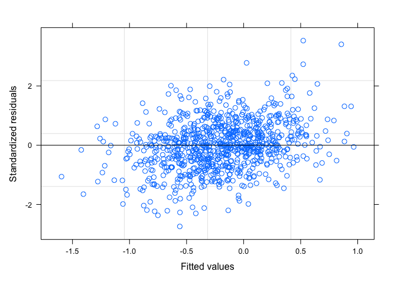
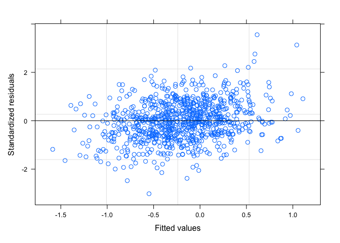
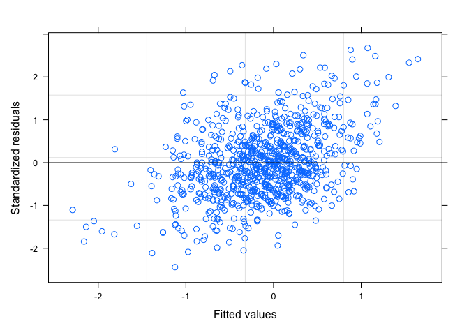
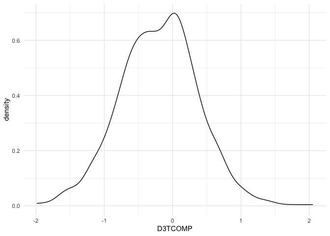
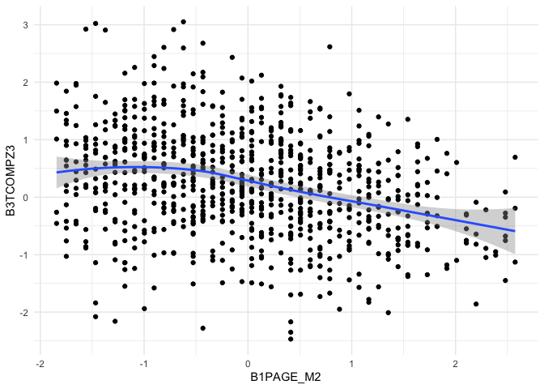

investigations
================
Paula Wu
5/11/2022

``` r
m2_df = 
  read_csv("./data/m2_df.csv") %>% 
  select(-1) %>% 
  filter(B3TCOMPZ3 != 8 & B3TEMZ3 != 8 & B3TEFZ3 != 8) %>% 
  filter(B4QCT_SA != 98 & B4QCT_EN != 98 & B4QCT_MD != 8 & B4QCT_PN != 98 & B4QCT_EA != 98 & B4QCT_PA != 98) %>% 
  select(-c(37:47))

#m2_df = read_csv("./data/m2_df.csv") %>% 
#  select(-1) %>% 
#  filter(!(B3TCOMPZ3 == 8 | B3TEMZ3 == 8 | B3TEFZ3 == 8)) %>% 
#  filter(!(B4QCT_SA == 98 | B4QCT_EN == 98 | B4QCT_MD == 8 | B4QCT_PN == 98 | B4QCT_EA == 98 | B4QCT_PA == 98)) %>% 
#  select(-c(37:47))
```

## SES and Spouse SES Investigation

For now, I’m thinking about impute those missing numbers with their
spouse’s SES, if any. First, investigate: how many people have their
spouse’s SES filled (out of 334)

``` r
m2_df %>% 
  filter(B1PTSEI == 999) %>% 
  select(M2ID, M2FAMNUM, B1PTSEI, B1PTSEIS) %>% 
  mutate(nul = ifelse(B1PTSEIS == 999, 1, 0)) %>% 
  group_by(nul) %>% 
  summarize(n = n())
```

    ## # A tibble: 2 × 2
    ##     nul     n
    ##   <dbl> <int>
    ## 1     0   209
    ## 2     1   125

Out of 334 missing, 125 of them still don’t have the spouse SES while
209 of them did.

### imputation - Jun 2nd (final) version:

Impute spouses’ SES for those who doesn’t have SES; for the rest use LM
(education as predictor) for imputation

``` r
# for those whose spouse has a valid SES
with_sps = 
  m2_df %>% 
  filter(B1PTSEI == 999) %>% 
  select(M2ID, M2FAMNUM, B1PTSEI, B1PTSEIS) %>% 
  filter(B1PTSEIS != 999) %>% 
  pull(M2ID)
m2_df[m2_df$M2ID %in% with_sps, which(colnames(m2_df) == "B1PTSEI")] = m2_df[m2_df$M2ID %in% with_sps, which(colnames(m2_df) == "B1PTSEIS")]

# for those whose spouse doesn't have a valid SES, fit an LM 
m2_df_lm = m2_df %>% 
  select(B1PTSEI, B1PAGE_M2, B1PB1) %>% 
  filter(B1PTSEI != 999 & B1PB1 != 97)
lm_ses = lm(B1PTSEI ~ B1PB1, data = m2_df_lm)


# prediction
m2_pred_id = m2_df %>% 
  filter(B1PTSEI == 999) %>% 
  pull(M2ID)

for (i in m2_pred_id){
  edu = m2_df[m2_df$M2ID == i, which(colnames(m2_df) == "B1PB1")]
  pred_ses = predict(lm_ses, newdata = edu)
  m2_df[m2_df$M2ID == i, which(colnames(m2_df) == "B1PTSEI")] = pred_ses
}
```

``` r
m2_df_copy = m2_df
m2_df_invalid = 
  m2_df_copy %>% 
  mutate(B3TCOMPZ3_ = ifelse(B3TCOMPZ3 == 8, 1, 0),
         B3TEMZ3_ = ifelse(B3TEMZ3 == 8, 1, 0),
         B3TEFZ3_ = ifelse(B3TEFZ3 == 8, 1, 0),
         B4QCT_SA_ = ifelse(B4QCT_SA == 98, 1, 0),
         B4QCT_EN_ = ifelse(B4QCT_EN == 98, 1, 0),
         B4QCT_MD_ = ifelse(B4QCT_MD == 8, 1, 0),
         B4QCT_PN_ = ifelse(B4QCT_PN == 98, 1, 0),
         B4QCT_EA_ = ifelse(B4QCT_EA == 98, 1, 0),
         B4QCT_PA_ = ifelse(B4QCT_PA == 98, 1, 0),
         B1PTSEI_ = ifelse(B1PTSEI == 999, 1, 0),
         B4HMETMW_ = ifelse(B4HMETMW == 99998, 1, 0),
         B1PB1_ = ifelse(B1PB1 == 97, 1, 0),
         B1PF7A_ = ifelse(B1PF7A >= 7, 1, 0),
         B1SA62A_ = ifelse(B1SA62A == 8, 1, 0),
         B1SA62B_ = ifelse(B1SA62B == 8, 1, 0),
         B1SA62C_ = ifelse(B1SA62C == 8, 1, 0),
         B1SA62D_ = ifelse(B1SA62D == 8, 1, 0),
         B1SA62E_ = ifelse(B1SA62E == 8, 1, 0),
         B1SA62F_ = ifelse(B1SA62F == 8, 1, 0),
         B1SA62G_ = ifelse(B1SA62G == 8, 1, 0),
         B1SA62H_ = ifelse(B1SA62H == 8, 1, 0),
         B1SA62I_ = ifelse(B1SA62I == 8, 1, 0),
         B1SA62J_ = ifelse(B1SA62J == 8, 1, 0),
         B1SPWBA2_ = ifelse(B1SPWBA2 == 98, 1, 0),
         B1SPWBE2_ = ifelse(B1SPWBE2 == 98, 1, 0),
         B1SPWBG2_ = ifelse(B1SPWBG2 == 98, 1, 0),
         B1SPWBR2_ = ifelse(B1SPWBR2 == 98, 1, 0),
         B1SPWBU2_ = ifelse(B1SPWBU2 == 98, 1, 0),
         B1SPWBS2_ = ifelse(B1SPWBS2 == 98, 1, 0),
         B1SMASTE_ = ifelse(B1SMASTE == 8, 1, 0),
         B1SCONST_ = ifelse(B1SCONST == 8, 1, 0),
         B1SCTRL_ = ifelse(B1SCTRL == 8, 1, 0),
         B1SESTEE_ = ifelse(B1SESTEE == 98, 1, 0),
         B1SINTER_ = ifelse(B1SINTER == 8, 1, 0),
         BASINTER_ = ifelse(B1SINTER == 98, 1, 0),
         B1SINDEP_ = ifelse(B1SINDEP == 8, 1, 0),
         BASINDEP_ = ifelse(B1SINDEP == 98, 1, 0),
         B1SAGENC_ = ifelse(B1SAGENC == 8, 1, 0),
         B1SAGREE_ = ifelse(B1SAGREE == 8, 1, 0),
         B1SEXTRA_ = ifelse(B1SEXTRA == 8, 1, 0),
         B1SNEURO_ = ifelse(B1SNEURO == 8, 1, 0),
         B1SCONS1_ = ifelse(B1SCONS1 == 8, 1, 0),
         invalid_ind = NA) %>% 
  select(-c(2:60)) %>% 
  select(M2ID, invalid_ind, everything()) %>% 
  rename_at(.vars = vars(ends_with("_")),
            .funs = funs(sub("_$", "", .)))


for (i in 1:1099){
  obs = m2_df_invalid[i,]
  invalid_str = invalid_var(obs)
  m2_df_invalid[i,2] = invalid_str
}
invalid_full = 
  m2_df_invalid %>% 
  select(M2ID, invalid_ind) %>% 
  filter(!invalid_ind == "") %>% 
  mutate(invalid_count = str_count(invalid_ind, pattern = ","))

invalid_full %>% 
  group_by(invalid_count) %>% 
  summarize(n = n()) %>% 
  knitr::kable()

invalid_full %>% 
  ggplot(aes(x = invalid_count))+
  geom_histogram() +
  stat_bin(aes(y=..count.., label=ifelse(..count..== 0,"",..count..)), geom="text", vjust= -0.5)
```

``` r
a = m2_df %>% 
  filter(!(B4QCT_EA == 98 | B4QCT_EN == 98 | B4QCT_SA == 98 | B4QCT_PA == 98 | B4QCT_PN == 98 | B4QCT_MD == 8 )) %>% 
  mutate(ctq_total = B4QCT_EA + B4QCT_EN + B4QCT_SA + B4QCT_PA + B4QCT_PN + B4QCT_MD)

mean_ctq = a %>% 
  pull(ctq_total) %>% 
  mean() %>% 
  signif(6)

median_ctq = a %>% 
  pull(ctq_total) %>% 
  median() %>% 
  signif(6)

a %>% 
  ggplot(aes(x = ctq_total)) +
  geom_density()+
  geom_vline(xintercept=mean_ctq, size=0.5, color="red")+
  geom_text(aes(x=mean_ctq + 5, label=paste0("Mean\n",mean_ctq), y=0.03), color = "red")+
  geom_vline(xintercept=median_ctq, size=0.5, color="blue")+
  geom_text(aes(x=median_ctq - 3, label=paste0("Median\n",median_ctq), y=0.03), color = "blue")+
  theme(legend.position = "none")+
  xlab("CTQ Total Score")+
  ylab("Density")
```

<!-- -->

``` r
a %>% 
  mutate(below_49 = ifelse(ctq_total <= 39, 1, 0)) %>% 
  group_by(below_49) %>% 
  summarize(n = n())
```

    ## # A tibble: 2 × 2
    ##   below_49     n
    ##      <dbl> <int>
    ## 1        0   341
    ## 2        1   758

``` r
#ggsave("ctq_density.jpeg", width = 10, height = 7)
```

## Invalid investigation, after imputation

``` r
m2_df_cc = m2_df %>% 
  mutate(B1PTSEI_ = ifelse(B1PTSEI == 999, 1, 0),
         B4HMETMW_ = ifelse(B4HMETMW == 99998, 1, 0),
         B1PB1_ = ifelse(B1PB1 == 97, 1, 0),
         B1PF7A_ = ifelse(B1PF7A >= 7, 1, 0),
         B1SA62A_ = ifelse(B1SA62A == 8, 1, 0),
         B1SA62B_ = ifelse(B1SA62B == 8, 1, 0),
         B1SA62C_ = ifelse(B1SA62C == 8, 1, 0),
         B1SA62D_ = ifelse(B1SA62D == 8, 1, 0),
         B1SA62E_ = ifelse(B1SA62E == 8, 1, 0),
         B1SA62F_ = ifelse(B1SA62F == 8, 1, 0),
         B1SA62G_ = ifelse(B1SA62G == 8, 1, 0),
         B1SA62H_ = ifelse(B1SA62H == 8, 1, 0),
         B1SA62I_ = ifelse(B1SA62I == 8, 1, 0),
         B1SA62J_ = ifelse(B1SA62J == 8, 1, 0),
         B1SPWBA2_ = ifelse(B1SPWBA2 == 98, 1, 0),
         B1SPWBE2_ = ifelse(B1SPWBE2 == 98, 1, 0),
         B1SPWBG2_ = ifelse(B1SPWBG2 == 98, 1, 0),
         B1SPWBR2_ = ifelse(B1SPWBR2 == 98, 1, 0),
         B1SPWBU2_ = ifelse(B1SPWBU2 == 98, 1, 0),
         B1SPWBS2_ = ifelse(B1SPWBS2 == 98, 1, 0),
         invalid_ind = NA) %>% 
  select(-c(2:49)) %>% 
  select(M2ID, invalid_ind, everything()) %>% 
  rename_at(.vars = vars(ends_with("_")),
            .funs = funs(sub("_$", "", .)))

invalid_var = function(obs){
  invalid_str = ""
  for (i in 3:22){
    cell = as.numeric(obs[i])
    if(cell == 1){
      invalid_str = paste0(invalid_str, colnames(obs)[i], sep = ", ")
    }
  }
  return(invalid_str)
}
for (i in 1:1099){
  obs = m2_df_cc[i,]
  invalid_str = invalid_var(obs)
  m2_df_cc[i,2] = invalid_str
}
invalid_cc = 
  m2_df_cc %>% 
  select(M2ID, invalid_ind) %>% 
  filter(!invalid_ind == "") %>% 
  mutate(invalid_count = str_count(invalid_ind, pattern = ","))

# quick summary: invalid entries of each variable
colSums(m2_df_cc[3:22])
```

    ##  B1PTSEI B4HMETMW    B1PB1   B1PF7A  B1SA62A  B1SA62B  B1SA62C  B1SA62D 
    ##        0        5        3        2        3        3        4        3 
    ##  B1SA62E  B1SA62F  B1SA62G  B1SA62H  B1SA62I  B1SA62J B1SPWBA2 B1SPWBE2 
    ##        4        6        4        3        3        4        3        3 
    ## B1SPWBG2 B1SPWBR2 B1SPWBU2 B1SPWBS2 
    ##        3        3        3        3

``` r
# quick summary: count of people for different numbers of invalid entries. Total: 40 subjects
invalid_cc %>% 
  group_by(invalid_count) %>% 
  summarize(n = n()) %>% 
  bind_rows(summarise_all(., ~if(is.numeric(.)) sum(.) else "Total")) %>% 
  mutate(invalid_count = ifelse(row_number() == 6, "Total", invalid_count)) %>% 
  knitr::kable()
```

| invalid_count |   n |
|:--------------|----:|
| 1             |  16 |
| 2             |   1 |
| 6             |   3 |
| 9             |   1 |
| 10            |   2 |
| Total         |  23 |

``` r
# deselect unnecessary variables, deselect invalid entries
invalid_cc_id = invalid_cc %>% 
  pull(M2ID) %>% 
  unique()

m2_df = m2_df %>% 
  select(-c(B3PIDATE_MO, B3PIDATE_YR, B1PTSEIS, B1PA37, B1PA38A, B1SA11Z, B4H33, B4H34, B4H36, B4H38, B4H40)) %>% 
  filter(!(M2ID %in% invalid_cc_id))
```

# M3 dataframe

``` r
m2_id = m2_df %>% pull(M2ID)
length(m2_id)
```

    ## [1] 1076

``` r
m3_df = 
  read_csv("./data/m3_df.csv") %>% 
  select(-1)


# only 911 left after joining, the rest 165 don't have M3 record
# 868 left after filtering out invalid entries
full_df = 
  inner_join(m2_df, m3_df, by = "M2ID") %>% 
  select(-M2FAMNUM.y) %>% 
  rename(M2FAMNUM = M2FAMNUM.x) %>%
  filter(C3TCOMP != 8 & C3TEM != 8) %>% 
  mutate(D3TCOMP = C3TCOMP - B3TCOMPZ3,
         D3TEM = C3TEM - B3TEMZ3,
         D3TEF = C3TEF - B3TEFZ3,
         D1PB19 = C1PB19 - B1PB19,
         B1PF7A = as.factor(B1PF7A),
         B1PA39 = as.factor(B1PA39))
```

# Univariate Analysis

### Demographic information of subjects by MIDUS study

Table is displayed in another latex file

``` r
m2_df_demog = m2_df %>% 
  mutate(ctq_total = B4QCT_EA + B4QCT_EN + B4QCT_SA + B4QCT_PA + B4QCT_PN + B4QCT_MD) %>% 
  select(B3TCOMPZ3, B3TEMZ3, B3TEFZ3, ctq_total, B1PAGE_M2, B1PRSEX, B1PF7A, B1PB1, B1PTSEI, B1PB19, B4HMETMW, B1SA11W, B1PA6A)

a = skimr::skim(m2_df_demog)
summary(m2_df_demog)
m2_df_demog %>% 
  group_by(B1PF7A) %>% 
  summarize(n = n())
```

### Univariate Analysis of Cognition, CTQ total

``` r
full_df_no_invalid = full_df %>% 
  mutate(ctq_total = B4QCT_EA + B4QCT_EN + B4QCT_SA + B4QCT_PA + B4QCT_PN + B4QCT_MD,
         B1PRSEX = as.factor(B1PRSEX),
         B4ALCOH = factor(B4ALCOH, levels = c("former_light/abs", "former_moderate", "former_heavy", "current_light", "current_moderate", "current_heavy")),
         D1PB19 = factor(D1PB19, levels = c(-1,0,1)),
         B1PF7A = ifelse(as.numeric(B1PF7A) != 1, 2, as.numeric(B1PF7A)),
         B1PF7A = as.factor(B1PF7A),
         B1SA11W = ifelse(B1SA11W == 2, 0, 1),
         B1SA62A = ifelse(B1SA62A == 2, 0, 1),
         B1SA62B = ifelse(B1SA62B == 2, 0, 1),
         B1SA62C = ifelse(B1SA62C == 2, 0, 1),
         B1SA62D = ifelse(B1SA62D == 2, 0, 1),
         B1SA62E = ifelse(B1SA62E == 2, 0, 1),
         B1SA62F = ifelse(B1SA62F == 2, 0, 1),
         B1SA62G = ifelse(B1SA62G == 2, 0, 1),
         B1SA62H = ifelse(B1SA62H == 2, 0, 1),
         B1SA62I = ifelse(B1SA62I == 2, 0, 1),
         B1SA62J = ifelse(B1SA62J == 2, 0, 1)
  )
#write.csv(full_df_no_invalid, "./data/full_df.csv")

full_df_no_invalid =  full_df_no_invalid %>% 
  mutate(B1SA11W = as.factor(B1SA11W),
         B1SA62A = as.factor(B1SA62A),
         B1SA62B = as.factor(B1SA62B),
         B1SA62C = as.factor(B1SA62C),
         B1SA62D = as.factor(B1SA62D),
         B1SA62E = as.factor(B1SA62E),
         B1SA62F = as.factor(B1SA62F),
         B1SA62G = as.factor(B1SA62G),
         B1SA62H = as.factor(B1SA62H),
         B1SA62I = as.factor(B1SA62I),
         B1SA62J = as.factor(B1SA62J)) %>% 
   mutate_each_(funs(scale(.)), c(6,10,25:30, 37))
```

# Modeling

I completely filter out all the observations with at least one invalid
feature, in total there are 23 of them, which is an arbitrarily small
number.

first, fit the model with a list of covariates

-   ctq total score
-   age
-   sex
-   race
-   education
-   (imputed) SES
-   changes in marital status
-   changes in stroke
-   smoking, drug use, alcohol consumption

``` r
# just showing one example
lmm_base = lme(D3TCOMP~ ctq_total + B3TCOMPZ3, random = ~1 | M2FAMNUM, data = full_df_no_invalid)
sumbase = summary(lmm_base)
sumbase$tTable %>% 
  knitr::kable()
```

|             |      Value | Std.Error |  DF |    t-value |   p-value |
|:------------|-----------:|----------:|----:|-----------:|----------:|
| (Intercept) | -0.0490315 | 0.0432586 | 766 |  -1.133451 | 0.2573795 |
| ctq_total   | -0.0014582 | 0.0010507 |  99 |  -1.387843 | 0.1683006 |
| B3TCOMPZ3   | -0.4324906 | 0.0158959 |  99 | -27.207690 | 0.0000000 |

``` r
plot(lmm_base)
```

<!-- -->

``` r
lmm1 = lme(D3TCOMP ~ ctq_total + B3TCOMPZ3 + B1PAGE_M2 + B1PTSEI + B1PB1 + B1PF7A + D1PB19 + B1PRSEX + B1PA39 + B4HMETMW + B1SA11W + B4ALCOH + B1SA62A + B1SA62B + B1SA62C + B1SA62D + B1SA62E + B1SA62F + B1SA62G + B1SA62H + B1SA62I, random = ~1 | M2FAMNUM, data = full_df_no_invalid, method = "REML") 
sum1 = summary(lmm1)
sum1$tTable %>% 
  knitr::kable()
```

|                         |      Value | Std.Error |  DF |     t-value |   p-value |
|:------------------------|-----------:|----------:|----:|------------:|----------:|
| (Intercept)             | -0.2406727 | 0.0964662 | 762 |  -2.4948899 | 0.0128103 |
| ctq_total               | -0.0016618 | 0.0010547 |  78 |  -1.5755775 | 0.1191707 |
| B3TCOMPZ3               | -0.5250179 | 0.0179583 |  78 | -29.2353806 | 0.0000000 |
| B1PAGE_M2               | -0.1389842 | 0.0154812 |  78 |  -8.9776205 | 0.0000000 |
| B1PTSEI                 |  0.0267093 | 0.0160387 |  78 |   1.6652970 | 0.0998654 |
| B1PB1                   |  0.0205971 | 0.0068772 |  78 |   2.9949881 | 0.0036769 |
| B1PF7A2                 | -0.1169477 | 0.0409016 |  78 |  -2.8592447 | 0.0054451 |
| D1PB190                 |  0.0155297 | 0.0456183 |  78 |   0.3404277 | 0.7344496 |
| D1PB191                 |  0.0105624 | 0.0779940 |  78 |   0.1354260 | 0.8926240 |
| B1PRSEX2                |  0.0251450 | 0.0293309 |  78 |   0.8572884 | 0.3939119 |
| B1PA392                 |  0.0233698 | 0.0448795 |  78 |   0.5207228 | 0.6040350 |
| B1PA399                 |  0.0041471 | 0.0506215 |  78 |   0.0819230 | 0.9349178 |
| B4HMETMW                |  0.0213106 | 0.0135634 |  78 |   1.5711826 | 0.1201882 |
| B1SA11W1                | -0.0837535 | 0.0449591 |  78 |  -1.8628796 | 0.0662440 |
| B4ALCOHformer_moderate  |  0.0827974 | 0.0538425 |  78 |   1.5377708 | 0.1281516 |
| B4ALCOHformer_heavy     |  0.0564136 | 0.0599718 |  78 |   0.9406691 | 0.3497786 |
| B4ALCOHcurrent_light    |  0.0368997 | 0.0693174 |  78 |   0.5323300 | 0.5960106 |
| B4ALCOHcurrent_moderate |  0.1098093 | 0.0450164 |  78 |   2.4393198 | 0.0169859 |
| B4ALCOHcurrent_heavy    |  0.0154356 | 0.0468695 |  78 |   0.3293316 | 0.7427878 |
| B1SA62A1                | -0.1538538 | 0.0874347 |  78 |  -1.7596426 | 0.0823894 |
| B1SA62B1                |  0.0902660 | 0.1007754 |  78 |   0.8957147 | 0.3731612 |
| B1SA62C1                |  0.0172609 | 0.1487657 | 762 |   0.1160275 | 0.9076613 |
| B1SA62D1                | -0.0818527 | 0.0699196 |  78 |  -1.1706679 | 0.2452965 |
| B1SA62E1                | -0.3354767 | 0.1340928 |  78 |  -2.5018244 | 0.0144489 |
| B1SA62F1                |  1.1514428 | 0.6062923 | 762 |   1.8991545 | 0.0579216 |
| B1SA62G1                |  0.0225861 | 0.0693710 |  78 |   0.3255835 | 0.7456113 |
| B1SA62H1                |  0.2094925 | 0.1513709 | 762 |   1.3839681 | 0.1667734 |
| B1SA62I1                | -1.1437278 | 0.4312839 | 762 |  -2.6519140 | 0.0081701 |

``` r
plot(lmm1)
```

<!-- -->

``` r
cor(full_df_no_invalid$B1PB1, full_df_no_invalid$B1PTSEI)
```

    ##           [,1]
    ## [1,] 0.5317444

``` r
lmm2 = lme(D3TEM ~ ctq_total + B3TEMZ3 + B1PAGE_M2 + B1PTSEI + B1PB1 + B1PF7A + D1PB19 + B1PRSEX + B1PA39 + B4HMETMW + B1SA11W + B4ALCOH + B1SA62A + B1SA62B + B1SA62C + B1SA62D + B1SA62E + B1SA62F + B1SA62G + B1SA62H + B1SA62I, random = ~1 | M2FAMNUM, data = full_df_no_invalid, method = "REML") 
sum2 = summary(lmm2)
sum2$tTable %>% 
  knitr::kable()
```

|                         |      Value | Std.Error |  DF |     t-value |   p-value |
|:------------------------|-----------:|----------:|----:|------------:|----------:|
| (Intercept)             | -0.6070431 | 0.1919645 | 762 |  -3.1622671 | 0.0016275 |
| ctq_total               | -0.0054317 | 0.0020956 |  78 |  -2.5919451 | 0.0113891 |
| B3TEMZ3                 | -0.5645818 | 0.0332678 |  78 | -16.9708007 | 0.0000000 |
| B1PAGE_M2               | -0.2004451 | 0.0295173 |  78 |  -6.7907579 | 0.0000000 |
| B1PTSEI                 |  0.0163994 | 0.0318718 |  78 |   0.5145427 | 0.6083275 |
| B1PB1                   |  0.0277426 | 0.0134070 |  78 |   2.0692651 | 0.0418330 |
| B1PF7A2                 | -0.0298073 | 0.0784569 |  78 |  -0.3799189 | 0.7050381 |
| D1PB190                 |  0.1131458 | 0.0908741 |  78 |   1.2450831 | 0.2168289 |
| D1PB191                 |  0.0865146 | 0.1557733 |  78 |   0.5553879 | 0.5802188 |
| B1PRSEX2                |  0.4438158 | 0.0612093 |  78 |   7.2507851 | 0.0000000 |
| B1PA392                 |  0.1844856 | 0.0894603 |  78 |   2.0622062 | 0.0425178 |
| B1PA399                 |  0.1192196 | 0.1008723 |  78 |   1.1818871 | 0.2408412 |
| B4HMETMW                |  0.0538882 | 0.0270591 |  78 |   1.9915001 | 0.0499267 |
| B1SA11W1                |  0.0058079 | 0.0895481 |  78 |   0.0648582 | 0.9484529 |
| B4ALCOHformer_moderate  |  0.1120614 | 0.1072444 |  78 |   1.0449162 | 0.2992892 |
| B4ALCOHformer_heavy     |  0.0739072 | 0.1194060 |  78 |   0.6189568 | 0.5377484 |
| B4ALCOHcurrent_light    |  0.1885782 | 0.1382435 |  78 |   1.3641019 | 0.1764588 |
| B4ALCOHcurrent_moderate |  0.1665085 | 0.0896970 |  78 |   1.8563453 | 0.0671806 |
| B4ALCOHcurrent_heavy    | -0.0358544 | 0.0933291 |  78 |  -0.3841715 | 0.7018966 |
| B1SA62A1                | -0.1994629 | 0.1741938 |  78 |  -1.1450633 | 0.2556843 |
| B1SA62B1                |  0.4660561 | 0.2005996 |  78 |   2.3233157 | 0.0227688 |
| B1SA62C1                | -0.1037812 | 0.2959159 | 762 |  -0.3507118 | 0.7259015 |
| B1SA62D1                | -0.1299923 | 0.1395187 |  78 |  -0.9317196 | 0.3543564 |
| B1SA62E1                | -0.3975761 | 0.2668357 |  78 |  -1.4899659 | 0.1402660 |
| B1SA62F1                |  0.5802775 | 1.2059790 | 762 |   0.4811672 | 0.6305358 |
| B1SA62G1                |  0.2974705 | 0.1376097 |  78 |   2.1616978 | 0.0337080 |
| B1SA62H1                | -0.2190679 | 0.3007423 | 762 |  -0.7284239 | 0.4665779 |
| B1SA62I1                | -1.0182080 | 0.8578454 | 762 |  -1.1869365 | 0.2356226 |

``` r
plot(lmm2)
```

<!-- -->

``` r
lmm3 = lme(D3TEF ~ ctq_total + B3TEFZ3 + B1PAGE_M2 + B1PTSEI + B1PB1 + B1PF7A + D1PB19 + B1PRSEX + B1PA39 + B4HMETMW + B1SA11W + B4ALCOH + B1SA62A + B1SA62B + B1SA62C + B1SA62D + B1SA62E + B1SA62F + B1SA62G + B1SA62H + B1SA62I, random = ~1 | M2FAMNUM, data = full_df_no_invalid, method = "REML") 
sum3 = summary(lmm3)
sum3$tTable %>% 
  knitr::kable()
```

|                         |      Value | Std.Error |  DF |     t-value |   p-value |
|:------------------------|-----------:|----------:|----:|------------:|----------:|
| (Intercept)             | -0.2786888 | 0.1032165 | 762 |  -2.7000412 | 0.0070869 |
| ctq_total               |  0.0006339 | 0.0011287 |  78 |   0.5616148 | 0.5759887 |
| B3TEFZ3                 | -0.4665013 | 0.0200725 |  78 | -23.2408553 | 0.0000000 |
| B1PAGE_M2               | -0.1317538 | 0.0165610 |  78 |  -7.9556758 | 0.0000000 |
| B1PTSEI                 |  0.0322591 | 0.0172596 |  78 |   1.8690564 | 0.0653687 |
| B1PB1                   |  0.0142150 | 0.0073539 |  78 |   1.9329951 | 0.0568661 |
| B1PF7A2                 | -0.1167199 | 0.0437872 |  78 |  -2.6656179 | 0.0093373 |
| D1PB190                 | -0.0694931 | 0.0490152 |  78 |  -1.4177861 | 0.1602359 |
| D1PB191                 | -0.0190498 | 0.0841905 |  78 |  -0.2262706 | 0.8215828 |
| B1PRSEX2                | -0.0599176 | 0.0312543 |  78 |  -1.9170991 | 0.0588872 |
| B1PA392                 |  0.0223865 | 0.0482187 |  78 |   0.4642707 | 0.6437471 |
| B1PA399                 |  0.0301159 | 0.0543841 |  78 |   0.5537622 | 0.5813256 |
| B4HMETMW                |  0.0162858 | 0.0146083 |  78 |   1.1148283 | 0.2683472 |
| B1SA11W1                | -0.0748503 | 0.0482835 |  78 |  -1.5502239 | 0.1251360 |
| B4ALCOHformer_moderate  |  0.0557868 | 0.0577816 |  78 |   0.9654769 | 0.3372899 |
| B4ALCOHformer_heavy     |  0.0582662 | 0.0644659 |  78 |   0.9038294 | 0.3688689 |
| B4ALCOHcurrent_light    | -0.0569940 | 0.0744934 |  78 |  -0.7650888 | 0.4465274 |
| B4ALCOHcurrent_moderate |  0.0525802 | 0.0483468 |  78 |   1.0875648 | 0.2801365 |
| B4ALCOHcurrent_heavy    |  0.0161908 | 0.0502809 |  78 |   0.3220065 | 0.7483092 |
| B1SA62A1                | -0.1963438 | 0.0939942 |  78 |  -2.0888933 | 0.0399787 |
| B1SA62B1                |  0.0315752 | 0.1080359 |  78 |   0.2922653 | 0.7708598 |
| B1SA62C1                | -0.0218066 | 0.1591906 | 762 |  -0.1369844 | 0.8910793 |
| B1SA62D1                |  0.0020686 | 0.0752895 |  78 |   0.0274756 | 0.9781506 |
| B1SA62E1                | -0.3510739 | 0.1441653 |  78 |  -2.4352169 | 0.0171656 |
| B1SA62F1                |  1.6802295 | 0.6492645 | 762 |   2.5878969 | 0.0098403 |
| B1SA62G1                | -0.0079273 | 0.0739636 |  78 |  -0.1071784 | 0.9149226 |
| B1SA62H1                |  0.3098117 | 0.1620538 | 762 |   1.9117826 | 0.0562789 |
| B1SA62I1                | -1.6455820 | 0.4618251 | 762 |  -3.5632150 | 0.0003891 |

``` r
plot(lmm3)
```

<!-- -->

``` r
# dependent variable normally distributed
full_df_no_invalid %>% 
  ggplot(aes(x = D3TCOMP)) + 
  geom_density()
```

<!-- -->

``` r
full_df_no_invalid %>% 
  ggplot(aes(x = B1PAGE_M2, y = C3TCOMP)) + 
  geom_point() +
  geom_smooth()
```

<!-- -->

``` r
full_df_no_invalid %>% 
  ggplot(aes(x = B1PAGE_M2, y = B3TCOMPZ3)) + 
  geom_point() +
  geom_smooth()
```

<!-- -->

# Modifiers

-   Stratified analysis can be one way to analyze the effect
    modification; however, as this analysis is usually done in a 2-by-2
    table, we either need dichotomous variables (e.g. sex) or an
    arbitrary cutoff point for continuous variables.

The following part is to investigate whether adding an interaction term
will improve the model fit. Use **likelihood-ratio test** for model
comparison. Need to refit the model using maximum likelihood (ML).

Autonomy (B1SPWBA2)

``` r
# Composite
lmm1_1 = lme(D3TCOMP ~ ctq_total + B3TCOMPZ3 + B1PAGE_M2 + B1PTSEI + B1PB1 + B1PF7A + D1PB19 + B1PRSEX + B1PA39 + B4HMETMW + B1SA11W + B4ALCOH + B1SA62A + B1SA62B + B1SA62C + B1SA62D + B1SA62E + B1SA62F + B1SA62G + B1SA62H + B1SA62I + B1SPWBA2, random = ~1 | M2FAMNUM, data = full_df_no_invalid, method = "ML") 
lmm1_autonomy = lme(D3TCOMP ~ ctq_total + B3TCOMPZ3 + B1PAGE_M2 + B1PTSEI + B1PB1 + B1PF7A + D1PB19 + B1PRSEX + B1PA39 + B4HMETMW + B1SA11W + B4ALCOH + B1SA62A + B1SA62B + B1SA62C + B1SA62D + B1SA62E + B1SA62F + B1SA62G + B1SA62H + B1SA62I + ctq_total*B1SPWBA2, random = ~1 | M2FAMNUM, data = full_df_no_invalid, method = "ML") 
anova(lmm1_1, lmm1_autonomy)
```

    ##               Model df      AIC      BIC    logLik   Test   L.Ratio p-value
    ## lmm1_1            1 31 870.7245 1018.476 -404.3623                         
    ## lmm1_autonomy     2 32 872.6164 1025.134 -404.3082 1 vs 2 0.1081292  0.7423

``` r
# EM
lmm2_1 = lme(D3TEM ~ ctq_total + B3TEMZ3 + B1PAGE_M2 + B1PTSEI + B1PB1 + B1PF7A + D1PB19 + B1PRSEX + B1PA39 + B4HMETMW + B1SA11W + B4ALCOH + B1SA62A + B1SA62B + B1SA62C + B1SA62D + B1SA62E + B1SA62F + B1SA62G + B1SA62H + B1SA62I + B1SPWBA2, random = ~1 | M2FAMNUM, data = full_df_no_invalid, method = "ML")
lmm2_autonomy = lme(D3TEM ~ ctq_total + B3TEMZ3 + B1PAGE_M2 + B1PTSEI + B1PB1 + B1PF7A + D1PB19 + B1PRSEX + B1PA39 + B4HMETMW + B1SA11W + B4ALCOH + B1SA62A + B1SA62B + B1SA62C + B1SA62D + B1SA62E + B1SA62F + B1SA62G + B1SA62H + B1SA62I + ctq_total*B1SPWBA2, random = ~1 | M2FAMNUM, data = full_df_no_invalid, method = "ML") 
anova(lmm2_1, lmm2_autonomy)
```

    ##               Model df      AIC      BIC    logLik   Test    L.Ratio p-value
    ## lmm2_1            1 31 2066.325 2214.077 -1002.163                          
    ## lmm2_autonomy     2 32 2068.299 2220.817 -1002.149 1 vs 2 0.02632208  0.8711

``` r
# EF
lmm3_1 = lme(D3TEF ~ ctq_total + B3TEFZ3 + B1PAGE_M2 + B1PTSEI + B1PB1 + B1PF7A + D1PB19 + B1PRSEX + B1PA39 + B4HMETMW + B1SA11W + B4ALCOH + B1SA62A + B1SA62B + B1SA62C + B1SA62D + B1SA62E + B1SA62F + B1SA62G + B1SA62H + B1SA62I + B1SPWBA2, random = ~1 | M2FAMNUM, data = full_df_no_invalid, method = "ML")
lmm3_autonomy = lme(D3TEF ~ ctq_total + B3TEFZ3 + B1PAGE_M2 + B1PTSEI + B1PB1 + B1PF7A + D1PB19 + B1PRSEX + B1PA39 + B4HMETMW + B1SA11W + B4ALCOH + B1SA62A + B1SA62B + B1SA62C + B1SA62D + B1SA62E + B1SA62F + B1SA62G + B1SA62H + B1SA62I + ctq_total*B1SPWBA2, random = ~1 | M2FAMNUM, data = full_df_no_invalid, method = "ML") 
anova(lmm3_1, lmm3_autonomy)
```

    ##               Model df      AIC      BIC    logLik   Test   L.Ratio p-value
    ## lmm3_1            1 31 993.2768 1141.029 -465.6384                         
    ## lmm3_autonomy     2 32 995.1069 1147.625 -465.5534 1 vs 2 0.1699544  0.6802

``` r
#plot(lmm3_autonomy)
```

Environmental Mastery (B1SPWBE2)

``` r
# Composite
lmm1_2 = lme(D3TCOMP ~ ctq_total + B3TCOMPZ3 + B1PAGE_M2 + B1PTSEI + B1PB1 + B1PF7A + D1PB19 + B1PRSEX + B1PA39 + B4HMETMW + B1SA11W + B4ALCOH + B1SA62A + B1SA62B + B1SA62C + B1SA62D + B1SA62E + B1SA62F + B1SA62G + B1SA62H + B1SA62I + B1SPWBE2, random = ~1 | M2FAMNUM, data = full_df_no_invalid, method = "ML") 
lmm1_em = lme(D3TCOMP ~ ctq_total + B3TCOMPZ3 + B1PAGE_M2 + B1PTSEI + B1PB1 + B1PF7A + D1PB19 + B1PRSEX + B1PA39 + B4HMETMW + B1SA11W + B4ALCOH + B1SA62A + B1SA62B + B1SA62C + B1SA62D + B1SA62E + B1SA62F + B1SA62G + B1SA62H + B1SA62I + ctq_total*B1SPWBE2, random = ~1 | M2FAMNUM, data = full_df_no_invalid, method = "ML") 
anova(lmm1_2, lmm1_em)
```

    ##         Model df      AIC      BIC    logLik   Test L.Ratio p-value
    ## lmm1_2      1 31 870.4468 1018.199 -404.2234                       
    ## lmm1_em     2 32 870.7493 1023.267 -403.3746 1 vs 2 1.69748  0.1926

``` r
# EM
lmm2_2 = lme(D3TEM ~ ctq_total + B3TEMZ3 + B1PAGE_M2 + B1PTSEI + B1PB1 + B1PF7A + D1PB19 + B1PRSEX + B1PA39 + B4HMETMW + B1SA11W + B4ALCOH + B1SA62A + B1SA62B + B1SA62C + B1SA62D + B1SA62E + B1SA62F + B1SA62G + B1SA62H + B1SA62I + B1SPWBE2, random = ~1 | M2FAMNUM, data = full_df_no_invalid, method = "ML")
lmm2_em = lme(D3TEM ~ ctq_total + B3TEMZ3 + B1PAGE_M2 + B1PTSEI + B1PB1 + B1PF7A + D1PB19 + B1PRSEX + B1PA39 + B4HMETMW + B1SA11W + B4ALCOH + B1SA62A + B1SA62B + B1SA62C + B1SA62D + B1SA62E + B1SA62F + B1SA62G + B1SA62H + B1SA62I + ctq_total*B1SPWBE2, random = ~1 | M2FAMNUM, data = full_df_no_invalid, method = "ML") 
anova(lmm2_2, lmm2_em)
```

    ##         Model df      AIC      BIC    logLik   Test   L.Ratio p-value
    ## lmm2_2      1 31 2066.468 2214.220 -1002.234                         
    ## lmm2_em     2 32 2068.301 2220.819 -1002.150 1 vs 2 0.1665076  0.6832

``` r
#plot(lmm2_autonomy)

# EF
lmm3_2 = lme(D3TEF ~ ctq_total + B3TEFZ3 + B1PAGE_M2 + B1PTSEI + B1PB1 + B1PF7A + D1PB19 + B1PRSEX + B1PA39 + B4HMETMW + B1SA11W + B4ALCOH + B1SA62A + B1SA62B + B1SA62C + B1SA62D + B1SA62E + B1SA62F + B1SA62G + B1SA62H + B1SA62I + B1SPWBE2, random = ~1 | M2FAMNUM, data = full_df_no_invalid, method = "ML")
lmm3_em = lme(D3TEF ~ ctq_total + B3TEFZ3 + B1PAGE_M2 + B1PTSEI + B1PB1 + B1PF7A + D1PB19 + B1PRSEX + B1PA39 + B4HMETMW + B1SA11W + B4ALCOH + B1SA62A + B1SA62B + B1SA62C + B1SA62D + B1SA62E + B1SA62F + B1SA62G + B1SA62H + B1SA62I + ctq_total*B1SPWBA2, random = ~1 | M2FAMNUM, data = full_df_no_invalid, method = "ML") 
anova(lmm3_2, lmm3_em)
```

    ##         Model df      AIC      BIC    logLik   Test   L.Ratio p-value
    ## lmm3_2      1 31 993.7792 1141.531 -465.8896                         
    ## lmm3_em     2 32 995.1069 1147.625 -465.5534 1 vs 2 0.6722893  0.4123

Personal Growth (B1SPWBG2)

``` r
# Composite
lmm1_3 = lme(D3TCOMP ~ ctq_total + B3TCOMPZ3 + B1PAGE_M2 + B1PTSEI + B1PB1 + B1PF7A + D1PB19 + B1PRSEX + B1PA39 + B4HMETMW + B1SA11W + B4ALCOH + B1SA62A + B1SA62B + B1SA62C + B1SA62D + B1SA62E + B1SA62F + B1SA62G + B1SA62H + B1SA62I + B1SPWBG2, random = ~1 | M2FAMNUM, data = full_df_no_invalid, method = "ML") 
lmm1_pg = lme(D3TCOMP ~ ctq_total + B3TCOMPZ3 + B1PAGE_M2 + B1PTSEI + B1PB1 + B1PF7A + D1PB19 + B1PRSEX + B1PA39 + B4HMETMW + B1SA11W + B4ALCOH + B1SA62A + B1SA62B + B1SA62C + B1SA62D + B1SA62E + B1SA62F + B1SA62G + B1SA62H + B1SA62I + ctq_total*B1SPWBG2, random = ~1 | M2FAMNUM, data = full_df_no_invalid, method = "ML") 
anova(lmm1_3, lmm1_pg)
```

    ##         Model df      AIC      BIC    logLik   Test   L.Ratio p-value
    ## lmm1_3      1 31 870.6803 1018.432 -404.3402                         
    ## lmm1_pg     2 32 872.2511 1024.769 -404.1256 1 vs 2 0.4292259  0.5124

``` r
# EM
lmm2_3 = lme(D3TEM ~ ctq_total + B3TEMZ3 + B1PAGE_M2 + B1PTSEI + B1PB1 + B1PF7A + D1PB19 + B1PRSEX + B1PA39 + B4HMETMW + B1SA11W + B4ALCOH + B1SA62A + B1SA62B + B1SA62C + B1SA62D + B1SA62E + B1SA62F + B1SA62G + B1SA62H + B1SA62I + B1SPWBG2, random = ~1 | M2FAMNUM, data = full_df_no_invalid, method = "ML")
lmm2_pg = lme(D3TEM ~ ctq_total + B3TEMZ3 + B1PAGE_M2 + B1PTSEI + B1PB1 + B1PF7A + D1PB19 + B1PRSEX + B1PA39 + B4HMETMW + B1SA11W + B4ALCOH + B1SA62A + B1SA62B + B1SA62C + B1SA62D + B1SA62E + B1SA62F + B1SA62G + B1SA62H + B1SA62I + ctq_total*B1SPWBG2, random = ~1 | M2FAMNUM, data = full_df_no_invalid, method = "ML") 
anova(lmm2_3, lmm2_pg)
```

    ##         Model df      AIC      BIC    logLik   Test   L.Ratio p-value
    ## lmm2_3      1 31 2066.865 2214.617 -1002.432                         
    ## lmm2_pg     2 32 2068.532 2221.050 -1002.266 1 vs 2 0.3330264  0.5639

``` r
# EF
lmm3_3 = lme(D3TEF ~ ctq_total + B3TEFZ3 + B1PAGE_M2 + B1PTSEI + B1PB1 + B1PF7A + D1PB19 + B1PRSEX + B1PA39 + B4HMETMW + B1SA11W + B4ALCOH + B1SA62A + B1SA62B + B1SA62C + B1SA62D + B1SA62E + B1SA62F + B1SA62G + B1SA62H + B1SA62I + B1SPWBG2, random = ~1 | M2FAMNUM, data = full_df_no_invalid, method = "ML")
lmm3_pg = lme(D3TEF ~ ctq_total + B3TEFZ3 + B1PAGE_M2 + B1PTSEI + B1PB1 + B1PF7A + D1PB19 + B1PRSEX + B1PA39 + B4HMETMW + B1SA11W + B4ALCOH + B1SA62A + B1SA62B + B1SA62C + B1SA62D + B1SA62E + B1SA62F + B1SA62G + B1SA62H + B1SA62I + ctq_total*B1SPWBG2, random = ~1 | M2FAMNUM, data = full_df_no_invalid, method = "ML") 
anova(lmm3_3, lmm3_pg)
```

    ##         Model df      AIC      BIC    logLik   Test  L.Ratio p-value
    ## lmm3_3      1 31 993.3564 1141.108 -465.6782                        
    ## lmm3_pg     2 32 993.7947 1146.313 -464.8973 1 vs 2 1.561721  0.2114

Positive Relations with Others (B1SPWBR2)

``` r
# Composite
lmm1_4 = lme(D3TCOMP ~ ctq_total + B3TCOMPZ3 + B1PAGE_M2 + B1PTSEI + B1PB1 + B1PF7A + D1PB19 + B1PRSEX + B1PA39 + B4HMETMW + B1SA11W + B4ALCOH + B1SA62A + B1SA62B + B1SA62C + B1SA62D + B1SA62E + B1SA62F + B1SA62G + B1SA62H + B1SA62I + B1SPWBR2, random = ~1 | M2FAMNUM, data = full_df_no_invalid, method = "ML") 
lmm1_pr = lme(D3TCOMP ~ ctq_total + B3TCOMPZ3 + B1PAGE_M2 + B1PTSEI + B1PB1 + B1PF7A + D1PB19 + B1PRSEX + B1PA39 + B4HMETMW + B1SA11W + B4ALCOH + B1SA62A + B1SA62B + B1SA62C + B1SA62D + B1SA62E + B1SA62F + B1SA62G + B1SA62H + B1SA62I + ctq_total*B1SPWBR2, random = ~1 | M2FAMNUM, data = full_df_no_invalid, method = "ML") 
anova(lmm1_4, lmm1_pr)
```

    ##         Model df      AIC      BIC    logLik   Test    L.Ratio p-value
    ## lmm1_4      1 31 868.7479 1016.500 -403.3739                          
    ## lmm1_pr     2 32 870.7377 1023.256 -403.3688 1 vs 2 0.01019686  0.9196

``` r
# EM
lmm2_4 = lme(D3TEM ~ ctq_total + B3TEMZ3 + B1PAGE_M2 + B1PTSEI + B1PB1 + B1PF7A + D1PB19 + B1PRSEX + B1PA39 + B4HMETMW + B1SA11W + B4ALCOH + B1SA62A + B1SA62B + B1SA62C + B1SA62D + B1SA62E + B1SA62F + B1SA62G + B1SA62H + B1SA62I + B1SPWBR2, random = ~1 | M2FAMNUM, data = full_df_no_invalid, method = "ML")
lmm2_pr = lme(D3TEM ~ ctq_total + B3TEMZ3 + B1PAGE_M2 + B1PTSEI + B1PB1 + B1PF7A + D1PB19 + B1PRSEX + B1PA39 + B4HMETMW + B1SA11W + B4ALCOH + B1SA62A + B1SA62B + B1SA62C + B1SA62D + B1SA62E + B1SA62F + B1SA62G + B1SA62H + B1SA62I + ctq_total*B1SPWBR2, random = ~1 | M2FAMNUM, data = full_df_no_invalid, method = "ML") 
anova(lmm2_4, lmm2_pr)
```

    ##         Model df      AIC      BIC    logLik   Test   L.Ratio p-value
    ## lmm2_4      1 31 2066.775 2214.527 -1002.388                         
    ## lmm2_pr     2 32 2068.671 2221.189 -1002.336 1 vs 2 0.1040053  0.7471

``` r
# EF
lmm3_4 = lme(D3TEF ~ ctq_total + B3TEFZ3 + B1PAGE_M2 + B1PTSEI + B1PB1 + B1PF7A + D1PB19 + B1PRSEX + B1PA39 + B4HMETMW + B1SA11W + B4ALCOH + B1SA62A + B1SA62B + B1SA62C + B1SA62D + B1SA62E + B1SA62F + B1SA62G + B1SA62H + B1SA62I + B1SPWBR2, random = ~1 | M2FAMNUM, data = full_df_no_invalid, method = "ML")
lmm3_pr = lme(D3TEF ~ ctq_total + B3TEFZ3 + B1PAGE_M2 + B1PTSEI + B1PB1 + B1PF7A + D1PB19 + B1PRSEX + B1PA39 + B4HMETMW + B1SA11W + B4ALCOH + B1SA62A + B1SA62B + B1SA62C + B1SA62D + B1SA62E + B1SA62F + B1SA62G + B1SA62H + B1SA62I + ctq_total*B1SPWBA2, random = ~1 | M2FAMNUM, data = full_df_no_invalid, method = "ML") 
anova(lmm3_4, lmm3_pr)
```

    ##         Model df      AIC      BIC    logLik   Test  L.Ratio p-value
    ## lmm3_4      1 31 993.5426 1141.295 -465.7713                        
    ## lmm3_pr     2 32 995.1069 1147.625 -465.5534 1 vs 2 0.435738  0.5092

Purpose in Life (B1SPWBU2)

``` r
# Composite
lmm1_5 = lme(D3TCOMP ~ ctq_total + B3TCOMPZ3 + B1PAGE_M2 + B1PTSEI + B1PB1 + B1PF7A + D1PB19 + B1PRSEX + B1PA39 + B4HMETMW + B1SA11W + B4ALCOH + B1SA62A + B1SA62B + B1SA62C + B1SA62D + B1SA62E + B1SA62F + B1SA62G + B1SA62H + B1SA62I + B1SPWBU2, random = ~1 | M2FAMNUM, data = full_df_no_invalid, method = "ML") 
lmm1_pl = lme(D3TCOMP ~ ctq_total + B3TCOMPZ3 + B1PAGE_M2 + B1PTSEI + B1PB1 + B1PF7A + D1PB19 + B1PRSEX + B1PA39 + B4HMETMW + B1SA11W + B4ALCOH + B1SA62A + B1SA62B + B1SA62C + B1SA62D + B1SA62E + B1SA62F + B1SA62G + B1SA62H + B1SA62I + ctq_total*B1SPWBU2, random = ~1 | M2FAMNUM, data = full_df_no_invalid, method = "ML") 
anova(lmm1_5, lmm1_pl)
```

    ##         Model df      AIC      BIC    logLik   Test   L.Ratio p-value
    ## lmm1_5      1 31 870.4938 1018.246 -404.2469                         
    ## lmm1_pl     2 32 872.3020 1024.820 -404.1510 1 vs 2 0.1918196  0.6614

``` r
# EM
lmm2_5 = lme(D3TEM ~ ctq_total + B3TEMZ3 + B1PAGE_M2 + B1PTSEI + B1PB1 + B1PF7A + D1PB19 + B1PRSEX + B1PA39 + B4HMETMW + B1SA11W + B4ALCOH + B1SA62A + B1SA62B + B1SA62C + B1SA62D + B1SA62E + B1SA62F + B1SA62G + B1SA62H + B1SA62I + B1SPWBU2, random = ~1 | M2FAMNUM, data = full_df_no_invalid, method = "ML")
lmm2_pl = lme(D3TEM ~ ctq_total + B3TEMZ3 + B1PAGE_M2 + B1PTSEI + B1PB1 + B1PF7A + D1PB19 + B1PRSEX + B1PA39 + B4HMETMW + B1SA11W + B4ALCOH + B1SA62A + B1SA62B + B1SA62C + B1SA62D + B1SA62E + B1SA62F + B1SA62G + B1SA62H + B1SA62I + ctq_total*B1SPWBU2, random = ~1 | M2FAMNUM, data = full_df_no_invalid, method = "ML") 
anova(lmm2_5, lmm2_pl)
```

    ##         Model df      AIC     BIC    logLik   Test  L.Ratio p-value
    ## lmm2_5      1 31 2066.618 2214.37 -1002.309                        
    ## lmm2_pl     2 32 2067.011 2219.53 -1001.506 1 vs 2 1.606388   0.205

``` r
# EF
lmm3_5 = lme(D3TEF ~ ctq_total + B3TEFZ3 + B1PAGE_M2 + B1PTSEI + B1PB1 + B1PF7A + D1PB19 + B1PRSEX + B1PA39 + B4HMETMW + B1SA11W + B4ALCOH + B1SA62A + B1SA62B + B1SA62C + B1SA62D + B1SA62E + B1SA62F + B1SA62G + B1SA62H + B1SA62I + B1SPWBU2, random = ~1 | M2FAMNUM, data = full_df_no_invalid, method = "ML")
lmm3_pl = lme(D3TEF ~ ctq_total + B3TEFZ3 + B1PAGE_M2 + B1PTSEI + B1PB1 + B1PF7A + D1PB19 + B1PRSEX + B1PA39 + B4HMETMW + B1SA11W + B4ALCOH + B1SA62A + B1SA62B + B1SA62C + B1SA62D + B1SA62E + B1SA62F + B1SA62G + B1SA62H + B1SA62I + ctq_total*B1SPWBU2, random = ~1 | M2FAMNUM, data = full_df_no_invalid, method = "ML") 
anova(lmm3_5, lmm3_pl)
```

    ##         Model df      AIC      BIC    logLik   Test    L.Ratio p-value
    ## lmm3_5      1 31 993.7984 1141.550 -465.8992                          
    ## lmm3_pl     2 32 995.7875 1148.306 -465.8937 1 vs 2 0.01094429  0.9167

Self-Acceptance (B1SPWBS2)

``` r
# Composite
lmm1_6 = lme(D3TCOMP ~ ctq_total + B3TCOMPZ3 + B1PAGE_M2 + B1PTSEI + B1PB1 + B1PF7A + D1PB19 + B1PRSEX + B1PA39 + B4HMETMW + B1SA11W + B4ALCOH + B1SA62A + B1SA62B + B1SA62C + B1SA62D + B1SA62E + B1SA62F + B1SA62G + B1SA62H + B1SA62I + B1SPWBS2, random = ~1 | M2FAMNUM, data = full_df_no_invalid, method = "ML") 
lmm1_sa = lme(D3TCOMP ~ ctq_total + B3TCOMPZ3 + B1PAGE_M2 + B1PTSEI + B1PB1 + B1PF7A + D1PB19 + B1PRSEX + B1PA39 + B4HMETMW + B1SA11W + B4ALCOH + B1SA62A + B1SA62B + B1SA62C + B1SA62D + B1SA62E + B1SA62F + B1SA62G + B1SA62H + B1SA62I + ctq_total*B1SPWBS2, random = ~1 | M2FAMNUM, data = full_df_no_invalid, method = "ML") 
anova(lmm1_6, lmm1_sa)
```

    ##         Model df      AIC      BIC    logLik   Test    L.Ratio p-value
    ## lmm1_6      1 31 868.5256 1016.278 -403.2628                          
    ## lmm1_sa     2 32 870.4265 1022.945 -403.2133 1 vs 2 0.09905913   0.753

``` r
# EM
lmm2_6 = lme(D3TEM ~ ctq_total + B3TEMZ3 + B1PAGE_M2 + B1PTSEI + B1PB1 + B1PF7A + D1PB19 + B1PRSEX + B1PA39 + B4HMETMW + B1SA11W + B4ALCOH + B1SA62A + B1SA62B + B1SA62C + B1SA62D + B1SA62E + B1SA62F + B1SA62G + B1SA62H + B1SA62I + B1SPWBS2, random = ~1 | M2FAMNUM, data = full_df_no_invalid, method = "ML")
lmm2_sa = lme(D3TEM ~ ctq_total + B3TEMZ3 + B1PAGE_M2 + B1PTSEI + B1PB1 + B1PF7A + D1PB19 + B1PRSEX + B1PA39 + B4HMETMW + B1SA11W + B4ALCOH + B1SA62A + B1SA62B + B1SA62C + B1SA62D + B1SA62E + B1SA62F + B1SA62G + B1SA62H + B1SA62I + ctq_total*B1SPWBS2, random = ~1 | M2FAMNUM, data = full_df_no_invalid, method = "ML") 
anova(lmm2_6, lmm2_sa)
```

    ##         Model df      AIC      BIC    logLik   Test    L.Ratio p-value
    ## lmm2_6      1 31 2066.802 2214.555 -1002.401                          
    ## lmm2_sa     2 32 2068.740 2221.259 -1002.370 1 vs 2 0.06206124  0.8033

``` r
# EF
lmm3_6 = lme(D3TEF ~ ctq_total + B3TEFZ3 + B1PAGE_M2 + B1PTSEI + B1PB1 + B1PF7A + D1PB19 + B1PRSEX + B1PA39 + B4HMETMW + B1SA11W + B4ALCOH + B1SA62A + B1SA62B + B1SA62C + B1SA62D + B1SA62E + B1SA62F + B1SA62G + B1SA62H + B1SA62I + B1SPWBS2, random = ~1 | M2FAMNUM, data = full_df_no_invalid, method = "ML")
lmm3_sa = lme(D3TEF ~ ctq_total + B3TEFZ3 + B1PAGE_M2 + B1PTSEI + B1PB1 + B1PF7A + D1PB19 + B1PRSEX + B1PA39 + B4HMETMW + B1SA11W + B4ALCOH + B1SA62A + B1SA62B + B1SA62C + B1SA62D + B1SA62E + B1SA62F + B1SA62G + B1SA62H + B1SA62I + ctq_total*B1SPWBS2, random = ~1 | M2FAMNUM, data = full_df_no_invalid, method = "ML") 
summary(lmm3_sa)
```

    ## Linear mixed-effects model fit by maximum likelihood
    ##   Data: full_df_no_invalid 
    ##        AIC      BIC    logLik
    ##   995.2857 1147.804 -465.6429
    ## 
    ## Random effects:
    ##  Formula: ~1 | M2FAMNUM
    ##         (Intercept)  Residual
    ## StdDev:   0.2099295 0.3584828
    ## 
    ## Fixed effects:  D3TEF ~ ctq_total + B3TEFZ3 + B1PAGE_M2 + B1PTSEI + B1PB1 + B1PF7A +      D1PB19 + B1PRSEX + B1PA39 + B4HMETMW + B1SA11W + B4ALCOH +      B1SA62A + B1SA62B + B1SA62C + B1SA62D + B1SA62E + B1SA62F +      B1SA62G + B1SA62H + B1SA62I + ctq_total * B1SPWBS2 
    ##                              Value Std.Error  DF    t-value p-value
    ## (Intercept)             -0.2758931 0.1035568 762  -2.664172  0.0079
    ## ctq_total                0.0004255 0.0012029  76   0.353684  0.7246
    ## B3TEFZ3                 -0.4652098 0.0201916  76 -23.039716  0.0000
    ## B1PAGE_M2               -0.1298426 0.0167594  76  -7.747428  0.0000
    ## B1PTSEI                  0.0332402 0.0173333  76   1.917708  0.0589
    ## B1PB1                    0.0145374 0.0073863  76   1.968164  0.0527
    ## B1PF7A2                 -0.1144825 0.0438848  76  -2.608702  0.0109
    ## D1PB190                 -0.0692400 0.0490936  76  -1.410368  0.1625
    ## D1PB191                 -0.0164724 0.0846103  76  -0.194685  0.8462
    ## B1PRSEX2                -0.0583187 0.0313368  76  -1.861028  0.0666
    ## B1PA392                  0.0252420 0.0484048  76   0.521477  0.6036
    ## B1PA399                  0.0320536 0.0545103  76   0.588028  0.5583
    ## B4HMETMW                 0.0167243 0.0146595  76   1.140855  0.2575
    ## B1SA11W1                -0.0793235 0.0488517  76  -1.623760  0.1086
    ## B4ALCOHformer_moderate   0.0549530 0.0578980  76   0.949135  0.3456
    ## B4ALCOHformer_heavy      0.0534771 0.0647830  76   0.825480  0.4117
    ## B4ALCOHcurrent_light    -0.0576752 0.0746377  76  -0.772735  0.4421
    ## B4ALCOHcurrent_moderate  0.0528227 0.0483913  76   1.091576  0.2785
    ## B4ALCOHcurrent_heavy     0.0148793 0.0503991  76   0.295229  0.7686
    ## B1SA62A1                -0.1970965 0.0941945  76  -2.092442  0.0397
    ## B1SA62B1                 0.0310436 0.1081731  76   0.286980  0.7749
    ## B1SA62C1                -0.0253527 0.1599401 762  -0.158514  0.8741
    ## B1SA62D1                 0.0022788 0.0754214  76   0.030214  0.9760
    ## B1SA62E1                -0.3562839 0.1444712  76  -2.466124  0.0159
    ## B1SA62F1                 1.6962180 0.6498670 762   2.610100  0.0092
    ## B1SA62G1                -0.0035566 0.0741516  76  -0.047964  0.9619
    ## B1SA62H1                 0.3005371 0.1625617 762   1.848757  0.0649
    ## B1SA62I1                -1.6408668 0.4621708 762  -3.550347  0.0004
    ## B1SPWBS2                -0.0135670 0.0427069  76  -0.317677  0.7516
    ## ctq_total:B1SPWBS2       0.0000297 0.0009725  76   0.030521  0.9757
    ##  Correlation: 
    ##                         (Intr) ctq_tt B3TEFZ B1PAGE B1PTSE B1PB1  B1PF7A
    ## ctq_total               -0.422                                          
    ## B3TEFZ3                  0.076  0.005                                   
    ## B1PAGE_M2               -0.097  0.062  0.338                            
    ## B1PTSEI                  0.279 -0.005 -0.098 -0.033                     
    ## B1PB1                   -0.511  0.051 -0.233  0.015 -0.438              
    ## B1PF7A2                 -0.050 -0.065  0.301  0.195  0.050 -0.008       
    ## D1PB190                 -0.429 -0.024 -0.037  0.023  0.001 -0.017 -0.027
    ## D1PB191                 -0.220 -0.066 -0.022  0.073  0.012 -0.048 -0.027
    ## B1PRSEX2                -0.172 -0.110  0.021  0.056  0.033  0.062 -0.048
    ## B1PA392                 -0.377  0.052  0.004 -0.073 -0.062 -0.080  0.035
    ## B1PA399                 -0.398  0.071 -0.008  0.024 -0.098 -0.097  0.038
    ## B4HMETMW                -0.014 -0.016 -0.017  0.014  0.084  0.019  0.020
    ## B1SA11W1                 0.032 -0.123  0.021 -0.037  0.045 -0.011 -0.065
    ## B4ALCOHformer_moderate  -0.244 -0.072  0.008  0.023 -0.001 -0.064  0.014
    ## B4ALCOHformer_heavy     -0.294 -0.041 -0.065  0.026 -0.037  0.020 -0.068
    ## B4ALCOHcurrent_light    -0.146 -0.007 -0.003 -0.050 -0.007 -0.050  0.045
    ## B4ALCOHcurrent_moderate -0.316 -0.062 -0.036  0.049 -0.027 -0.049  0.034
    ## B4ALCOHcurrent_heavy    -0.359 -0.036 -0.022  0.080 -0.031 -0.021  0.036
    ## B1SA62A1                -0.020 -0.026 -0.058 -0.045 -0.033  0.013 -0.008
    ## B1SA62B1                 0.011 -0.039 -0.001 -0.004  0.018  0.016  0.011
    ## B1SA62C1                -0.004 -0.034  0.037  0.033 -0.001  0.006  0.051
    ## B1SA62D1                 0.005 -0.005 -0.018  0.019  0.002 -0.025  0.000
    ## B1SA62E1                 0.033 -0.029  0.067  0.053 -0.007 -0.016 -0.005
    ## B1SA62F1                 0.050  0.008 -0.017 -0.009  0.054 -0.030 -0.022
    ## B1SA62G1                -0.111 -0.035 -0.064  0.095 -0.005  0.063 -0.071
    ## B1SA62H1                -0.050  0.042  0.040  0.054 -0.013 -0.002 -0.044
    ## B1SA62I1                -0.045  0.021 -0.004 -0.012 -0.051  0.048 -0.032
    ## B1SPWBS2                 0.046 -0.146  0.048 -0.035 -0.032 -0.080 -0.001
    ## ctq_total:B1SPWBS2      -0.064  0.253 -0.080 -0.024  0.003  0.062 -0.022
    ##                         D1PB190 D1PB191 B1PRSE B1PA392 B1PA399 B4HMET B1SA11
    ## ctq_total                                                                   
    ## B3TEFZ3                                                                     
    ## B1PAGE_M2                                                                   
    ## B1PTSEI                                                                     
    ## B1PB1                                                                       
    ## B1PF7A2                                                                     
    ## D1PB190                                                                     
    ## D1PB191                  0.513                                              
    ## B1PRSEX2                 0.051   0.032                                      
    ## B1PA392                 -0.002   0.057  -0.037                              
    ## B1PA399                 -0.007   0.072  -0.093  0.768                       
    ## B4HMETMW                -0.036   0.008   0.132  0.064   0.028               
    ## B1SA11W1                -0.017  -0.043  -0.091  0.029  -0.012   0.007       
    ## B4ALCOHformer_moderate   0.035   0.000   0.007  0.023   0.112  -0.028  0.054
    ## B4ALCOHformer_heavy      0.047  -0.012   0.074  0.012   0.151  -0.055  0.026
    ## B4ALCOHcurrent_light    -0.018  -0.020  -0.075 -0.024   0.030  -0.042  0.064
    ## B4ALCOHcurrent_moderate  0.052   0.022   0.056 -0.030   0.137  -0.040 -0.009
    ## B4ALCOHcurrent_heavy     0.043   0.011   0.083  0.012   0.190  -0.065 -0.022
    ## B1SA62A1                 0.005   0.053  -0.067  0.048   0.053  -0.003 -0.046
    ## B1SA62B1                 0.030  -0.026   0.010 -0.058  -0.039   0.044 -0.023
    ## B1SA62C1                -0.005   0.014  -0.043  0.057   0.046  -0.007  0.043
    ## B1SA62D1                 0.009  -0.055  -0.002 -0.002   0.035  -0.036 -0.054
    ## B1SA62E1                -0.045   0.003  -0.019 -0.006   0.026   0.018  0.025
    ## B1SA62F1                -0.069  -0.041   0.013 -0.009  -0.024  -0.019  0.081
    ## B1SA62G1                 0.039   0.050   0.102  0.121   0.108  -0.036  0.008
    ## B1SA62H1                -0.006  -0.014   0.004  0.092   0.069   0.001  0.033
    ## B1SA62I1                 0.092   0.057   0.035 -0.079  -0.054   0.025 -0.114
    ## B1SPWBS2                 0.019   0.017  -0.014  0.009   0.023   0.027 -0.026
    ## ctq_total:B1SPWBS2      -0.028  -0.045  -0.012 -0.037  -0.039  -0.047  0.078
    ##                         B4ALCOHfrmr_m B4ALCOHfrmr_h B4ALCOHcrrnt_l
    ## ctq_total                                                         
    ## B3TEFZ3                                                           
    ## B1PAGE_M2                                                         
    ## B1PTSEI                                                           
    ## B1PB1                                                             
    ## B1PF7A2                                                           
    ## D1PB190                                                           
    ## D1PB191                                                           
    ## B1PRSEX2                                                          
    ## B1PA392                                                           
    ## B1PA399                                                           
    ## B4HMETMW                                                          
    ## B1SA11W1                                                          
    ## B4ALCOHformer_moderate                                            
    ## B4ALCOHformer_heavy      0.437                                    
    ## B4ALCOHcurrent_light     0.354         0.312                      
    ## B4ALCOHcurrent_moderate  0.577         0.544         0.427        
    ## B4ALCOHcurrent_heavy     0.564         0.548         0.404        
    ## B1SA62A1                 0.021        -0.010         0.009        
    ## B1SA62B1                 0.014         0.018         0.016        
    ## B1SA62C1                -0.015         0.027         0.008        
    ## B1SA62D1                -0.011        -0.002        -0.017        
    ## B1SA62E1                 0.019        -0.074        -0.001        
    ## B1SA62F1                -0.002         0.063         0.003        
    ## B1SA62G1                -0.004        -0.011        -0.018        
    ## B1SA62H1                 0.007        -0.005        -0.013        
    ## B1SA62I1                -0.007        -0.065        -0.010        
    ## B1SPWBS2                 0.045         0.032        -0.032        
    ## ctq_total:B1SPWBS2      -0.033         0.002         0.041        
    ##                         B4ALCOHcrrnt_m B4ALCOHcrrnt_h B1SA62A B1SA62B B1SA62C
    ## ctq_total                                                                    
    ## B3TEFZ3                                                                      
    ## B1PAGE_M2                                                                    
    ## B1PTSEI                                                                      
    ## B1PB1                                                                        
    ## B1PF7A2                                                                      
    ## D1PB190                                                                      
    ## D1PB191                                                                      
    ## B1PRSEX2                                                                     
    ## B1PA392                                                                      
    ## B1PA399                                                                      
    ## B4HMETMW                                                                     
    ## B1SA11W1                                                                     
    ## B4ALCOHformer_moderate                                                       
    ## B4ALCOHformer_heavy                                                          
    ## B4ALCOHcurrent_light                                                         
    ## B4ALCOHcurrent_moderate                                                      
    ## B4ALCOHcurrent_heavy     0.708                                               
    ## B1SA62A1                 0.023         -0.005                                
    ## B1SA62B1                -0.023         -0.023         -0.212                 
    ## B1SA62C1                -0.043          0.007         -0.105   0.071         
    ## B1SA62D1                -0.021         -0.033         -0.131  -0.051  -0.120 
    ## B1SA62E1                -0.019         -0.020         -0.020  -0.060  -0.092 
    ## B1SA62F1                 0.015         -0.016         -0.070  -0.135  -0.202 
    ## B1SA62G1                -0.021         -0.066          0.016  -0.093  -0.187 
    ## B1SA62H1                -0.010         -0.015          0.008  -0.194   0.072 
    ## B1SA62I1                 0.011          0.023          0.001   0.089  -0.010 
    ## B1SPWBS2                 0.014          0.058         -0.034   0.035  -0.070 
    ## ctq_total:B1SPWBS2      -0.017         -0.048          0.042  -0.037   0.088 
    ##                         B1SA62D B1SA62E B1SA62F B1SA62G B1SA62H B1SA62I B1SPWB
    ## ctq_total                                                                     
    ## B3TEFZ3                                                                       
    ## B1PAGE_M2                                                                     
    ## B1PTSEI                                                                       
    ## B1PB1                                                                         
    ## B1PF7A2                                                                       
    ## D1PB190                                                                       
    ## D1PB191                                                                       
    ## B1PRSEX2                                                                      
    ## B1PA392                                                                       
    ## B1PA399                                                                       
    ## B4HMETMW                                                                      
    ## B1SA11W1                                                                      
    ## B4ALCOHformer_moderate                                                        
    ## B4ALCOHformer_heavy                                                           
    ## B4ALCOHcurrent_light                                                          
    ## B4ALCOHcurrent_moderate                                                       
    ## B4ALCOHcurrent_heavy                                                          
    ## B1SA62A1                                                                      
    ## B1SA62B1                                                                      
    ## B1SA62C1                                                                      
    ## B1SA62D1                                                                      
    ## B1SA62E1                -0.009                                                
    ## B1SA62F1                -0.057  -0.188                                        
    ## B1SA62G1                -0.077   0.002   0.073                                
    ## B1SA62H1                -0.110   0.039   0.019  -0.191                        
    ## B1SA62I1                 0.057  -0.005  -0.641  -0.077  -0.318                
    ## B1SPWBS2                -0.027   0.033  -0.013  -0.006   0.035   0.014        
    ## ctq_total:B1SPWBS2       0.028  -0.016   0.001  -0.023  -0.008  -0.021  -0.928
    ## 
    ## Standardized Within-Group Residuals:
    ##         Min          Q1         Med          Q3         Max 
    ## -4.86099079 -0.52965023  0.03493709  0.57831521  3.15007189 
    ## 
    ## Number of Observations: 868
    ## Number of Groups: 767

``` r
anova(lmm3_6, lmm3_sa)
```

    ##         Model df      AIC      BIC    logLik   Test      L.Ratio p-value
    ## lmm3_6      1 31 993.2867 1141.039 -465.6433                            
    ## lmm3_sa     2 32 995.2857 1147.804 -465.6429 1 vs 2 0.0009648838  0.9752

-   the results are the same using `lmer` package.
