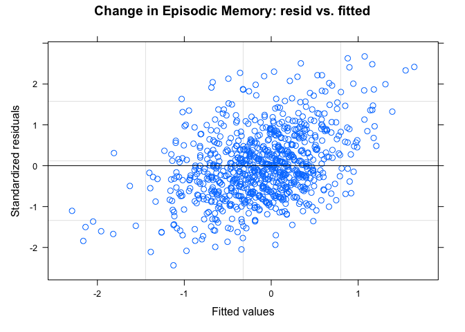
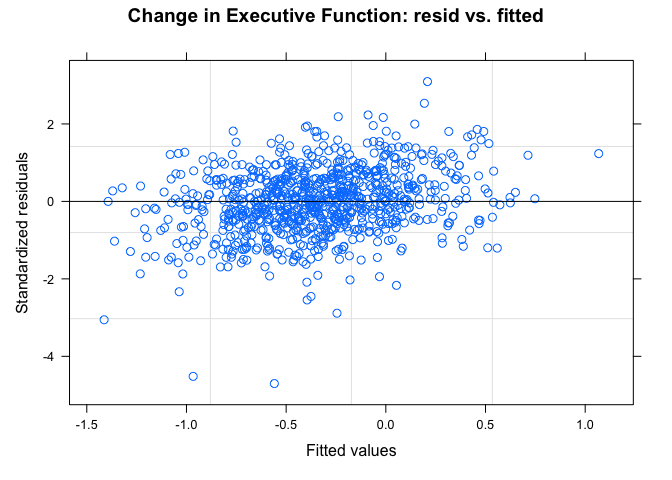

investigations
================
Paula Wu
5/11/2022

``` r
m2_df = 
  read_csv("./data/m2_df.csv") %>% 
  select(-1) %>% 
  filter(B3TCOMPZ3 != 8 & B3TEMZ3 != 8 & B3TEFZ3 != 8) %>% 
  filter(B4QCT_SA != 98 & B4QCT_EN != 98 & B4QCT_MD != 8 & B4QCT_PN != 98 & B4QCT_EA != 98 & B4QCT_PA != 98) %>% 
  select(-c(37:47))
```

## SES and Spouse SES Investigation

For now, I’m thinking about impute those missing numbers with their
spouse’s SES, if any. First, investigate: how many people have their
spouse’s SES filled (out of 334)

``` r
m2_df %>% 
  filter(B1PTSEI == 999) %>% 
  select(M2ID, M2FAMNUM, B1PTSEI, B1PTSEIS) %>% 
  mutate(nul = ifelse(B1PTSEIS == 999, 1, 0)) %>% 
  group_by(nul) %>% 
  summarize(n = n())
```

    ## # A tibble: 2 × 2
    ##     nul     n
    ##   <dbl> <int>
    ## 1     0   209
    ## 2     1   125

Out of 334 missing, 125 of them still don’t have the spouse SES while
209 of them did.

### imputation - Jun 2nd (final) version:

Impute spouses’ SES for those who doesn’t have SES; for the rest use LM
(education as predictor) for imputation

``` r
# for those whose spouse has a valid SES
with_sps = 
  m2_df %>% 
  filter(B1PTSEI == 999) %>% 
  select(M2ID, M2FAMNUM, B1PTSEI, B1PTSEIS) %>% 
  filter(B1PTSEIS != 999) %>% 
  pull(M2ID)
m2_df[m2_df$M2ID %in% with_sps, which(colnames(m2_df) == "B1PTSEI")] = m2_df[m2_df$M2ID %in% with_sps, which(colnames(m2_df) == "B1PTSEIS")]

# for those whose spouse doesn't have a valid SES, fit an LM 
m2_df_lm = m2_df %>% 
  select(B1PTSEI, B1PAGE_M2, B1PB1) %>% 
  filter(B1PTSEI != 999 & B1PB1 != 97)
lm_ses = lm(B1PTSEI ~ B1PB1, data = m2_df_lm)


# prediction
m2_pred_id = m2_df %>% 
  filter(B1PTSEI == 999) %>% 
  pull(M2ID)

for (i in m2_pred_id){
  edu = m2_df[m2_df$M2ID == i, which(colnames(m2_df) == "B1PB1")]
  pred_ses = predict(lm_ses, newdata = edu)
  m2_df[m2_df$M2ID == i, which(colnames(m2_df) == "B1PTSEI")] = pred_ses
}
```

``` r
m2_df_copy = m2_df
m2_df_invalid = 
  m2_df_copy %>% 
  mutate(B3TCOMPZ3_ = ifelse(B3TCOMPZ3 == 8, 1, 0),
         B3TEMZ3_ = ifelse(B3TEMZ3 == 8, 1, 0),
         B3TEFZ3_ = ifelse(B3TEFZ3 == 8, 1, 0),
         B4QCT_SA_ = ifelse(B4QCT_SA == 98, 1, 0),
         B4QCT_EN_ = ifelse(B4QCT_EN == 98, 1, 0),
         B4QCT_MD_ = ifelse(B4QCT_MD == 8, 1, 0),
         B4QCT_PN_ = ifelse(B4QCT_PN == 98, 1, 0),
         B4QCT_EA_ = ifelse(B4QCT_EA == 98, 1, 0),
         B4QCT_PA_ = ifelse(B4QCT_PA == 98, 1, 0),
         B1PTSEI_ = ifelse(B1PTSEI == 999, 1, 0),
         B4HMETMW_ = ifelse(B4HMETMW == 99998, 1, 0),
         B1PB1_ = ifelse(B1PB1 == 97, 1, 0),
         B1PF7A_ = ifelse(B1PF7A >= 7, 1, 0),
         B1SA62A_ = ifelse(B1SA62A == 8, 1, 0),
         B1SA62B_ = ifelse(B1SA62B == 8, 1, 0),
         B1SA62C_ = ifelse(B1SA62C == 8, 1, 0),
         B1SA62D_ = ifelse(B1SA62D == 8, 1, 0),
         B1SA62E_ = ifelse(B1SA62E == 8, 1, 0),
         B1SA62F_ = ifelse(B1SA62F == 8, 1, 0),
         B1SA62G_ = ifelse(B1SA62G == 8, 1, 0),
         B1SA62H_ = ifelse(B1SA62H == 8, 1, 0),
         B1SA62I_ = ifelse(B1SA62I == 8, 1, 0),
         B1SA62J_ = ifelse(B1SA62J == 8, 1, 0),
         B1SPWBA2_ = ifelse(B1SPWBA2 == 98, 1, 0),
         B1SPWBE2_ = ifelse(B1SPWBE2 == 98, 1, 0),
         B1SPWBG2_ = ifelse(B1SPWBG2 == 98, 1, 0),
         B1SPWBR2_ = ifelse(B1SPWBR2 == 98, 1, 0),
         B1SPWBU2_ = ifelse(B1SPWBU2 == 98, 1, 0),
         B1SPWBS2_ = ifelse(B1SPWBS2 == 98, 1, 0),
         B1SMASTE_ = ifelse(B1SMASTE == 8, 1, 0),
         B1SCONST_ = ifelse(B1SCONST == 8, 1, 0),
         B1SCTRL_ = ifelse(B1SCTRL == 8, 1, 0),
         B1SESTEE_ = ifelse(B1SESTEE == 98, 1, 0),
         B1SINTER_ = ifelse(B1SINTER == 8, 1, 0),
         BASINTER_ = ifelse(B1SINTER == 98, 1, 0),
         B1SINDEP_ = ifelse(B1SINDEP == 8, 1, 0),
         BASINDEP_ = ifelse(B1SINDEP == 98, 1, 0),
         B1SAGENC_ = ifelse(B1SAGENC == 8, 1, 0),
         B1SAGREE_ = ifelse(B1SAGREE == 8, 1, 0),
         B1SEXTRA_ = ifelse(B1SEXTRA == 8, 1, 0),
         B1SNEURO_ = ifelse(B1SNEURO == 8, 1, 0),
         B1SCONS1_ = ifelse(B1SCONS1 == 8, 1, 0),
         invalid_ind = NA) %>% 
  select(-c(2:60)) %>% 
  select(M2ID, invalid_ind, everything()) %>% 
  rename_at(.vars = vars(ends_with("_")),
            .funs = funs(sub("_$", "", .)))


for (i in 1:1099){
  obs = m2_df_invalid[i,]
  invalid_str = invalid_var(obs)
  m2_df_invalid[i,2] = invalid_str
}
invalid_full = 
  m2_df_invalid %>% 
  select(M2ID, invalid_ind) %>% 
  filter(!invalid_ind == "") %>% 
  mutate(invalid_count = str_count(invalid_ind, pattern = ","))

invalid_full %>% 
  group_by(invalid_count) %>% 
  summarize(n = n()) %>% 
  knitr::kable()

invalid_full %>% 
  ggplot(aes(x = invalid_count))+
  geom_histogram() +
  stat_bin(aes(y=..count.., label=ifelse(..count..== 0,"",..count..)), geom="text", vjust= -0.5)
```

``` r
a = m2_df %>% 
  filter(!(B4QCT_EA == 98 | B4QCT_EN == 98 | B4QCT_SA == 98 | B4QCT_PA == 98 | B4QCT_PN == 98 | B4QCT_MD == 8 )) %>% 
  mutate(ctq_total = B4QCT_EA + B4QCT_EN + B4QCT_SA + B4QCT_PA + B4QCT_PN + B4QCT_MD)

mean_ctq = a %>% 
  pull(ctq_total) %>% 
  mean() %>% 
  signif(6)

median_ctq = a %>% 
  pull(ctq_total) %>% 
  median() %>% 
  signif(6)

a %>% 
  ggplot(aes(x = ctq_total)) +
  geom_density()+
  geom_vline(xintercept=mean_ctq, size=0.5, color="red")+
  geom_text(aes(x=mean_ctq + 5, label=paste0("Mean\n",mean_ctq), y=0.03), color = "red")+
  geom_vline(xintercept=median_ctq, size=0.5, color="blue")+
  geom_text(aes(x=median_ctq - 3, label=paste0("Median\n",median_ctq), y=0.03), color = "blue")+
  theme(legend.position = "none")+
  xlab("CTQ Total Score")+
  ylab("Density")
```

<!-- -->

``` r
a %>% 
  mutate(below_49 = ifelse(ctq_total <= 39, 1, 0)) %>% 
  group_by(below_49) %>% 
  summarize(n = n())
```

    ## # A tibble: 2 × 2
    ##   below_49     n
    ##      <dbl> <int>
    ## 1        0   341
    ## 2        1   758

``` r
#ggsave("ctq_density.jpeg", width = 10, height = 7)
```

## Invalid investigation, after imputation

``` r
m2_df_cc = m2_df %>% 
  mutate(B1PTSEI_ = ifelse(B1PTSEI == 999, 1, 0),
         B4HMETMW_ = ifelse(B4HMETMW == 99998, 1, 0),
         B1PB1_ = ifelse(B1PB1 == 97, 1, 0),
         B1PF7A_ = ifelse(B1PF7A >= 7, 1, 0),
         B1SA62A_ = ifelse(B1SA62A == 8, 1, 0),
         B1SA62B_ = ifelse(B1SA62B == 8, 1, 0),
         B1SA62C_ = ifelse(B1SA62C == 8, 1, 0),
         B1SA62D_ = ifelse(B1SA62D == 8, 1, 0),
         B1SA62E_ = ifelse(B1SA62E == 8, 1, 0),
         B1SA62F_ = ifelse(B1SA62F == 8, 1, 0),
         B1SA62G_ = ifelse(B1SA62G == 8, 1, 0),
         B1SA62H_ = ifelse(B1SA62H == 8, 1, 0),
         B1SA62I_ = ifelse(B1SA62I == 8, 1, 0),
         B1SA62J_ = ifelse(B1SA62J == 8, 1, 0),
         B1SPWBA2_ = ifelse(B1SPWBA2 == 98, 1, 0),
         B1SPWBE2_ = ifelse(B1SPWBE2 == 98, 1, 0),
         B1SPWBG2_ = ifelse(B1SPWBG2 == 98, 1, 0),
         B1SPWBR2_ = ifelse(B1SPWBR2 == 98, 1, 0),
         B1SPWBU2_ = ifelse(B1SPWBU2 == 98, 1, 0),
         B1SPWBS2_ = ifelse(B1SPWBS2 == 98, 1, 0),
         invalid_ind = NA) %>% 
  select(-c(2:49)) %>% 
  select(M2ID, invalid_ind, everything()) %>% 
  rename_at(.vars = vars(ends_with("_")),
            .funs = funs(sub("_$", "", .)))

invalid_var = function(obs){
  invalid_str = ""
  for (i in 3:22){
    cell = as.numeric(obs[i])
    if(cell == 1){
      invalid_str = paste0(invalid_str, colnames(obs)[i], sep = ", ")
    }
  }
  return(invalid_str)
}
for (i in 1:1099){
  obs = m2_df_cc[i,]
  invalid_str = invalid_var(obs)
  m2_df_cc[i,2] = invalid_str
}
invalid_cc = 
  m2_df_cc %>% 
  select(M2ID, invalid_ind) %>% 
  filter(!invalid_ind == "") %>% 
  mutate(invalid_count = str_count(invalid_ind, pattern = ","))

# quick summary: invalid entries of each variable
colSums(m2_df_cc[3:22])
```

    ##  B1PTSEI B4HMETMW    B1PB1   B1PF7A  B1SA62A  B1SA62B  B1SA62C  B1SA62D 
    ##        0        5        3        2        3        3        4        3 
    ##  B1SA62E  B1SA62F  B1SA62G  B1SA62H  B1SA62I  B1SA62J B1SPWBA2 B1SPWBE2 
    ##        4        6        4        3        3        4        3        3 
    ## B1SPWBG2 B1SPWBR2 B1SPWBU2 B1SPWBS2 
    ##        3        3        3        3

``` r
# quick summary: count of people for different numbers of invalid entries. Total: 40 subjects
invalid_cc %>%
  group_by(invalid_count) %>% 
  summarize(n = n()) %>% 
  bind_rows(summarise_all(., ~if(is.numeric(.)) sum(.) else "Total")) %>% 
  mutate(invalid_count = ifelse(row_number() == 6, "Total", invalid_count)) %>% 
  knitr::kable()
```

| invalid_count |   n |
|:--------------|----:|
| 1             |  16 |
| 2             |   1 |
| 6             |   3 |
| 9             |   1 |
| 10            |   2 |
| Total         |  23 |

``` r
# deselect unnecessary variables, deselect invalid entries
invalid_cc_id = invalid_cc %>% 
  pull(M2ID) %>% 
  unique()

m2_df = m2_df %>% 
  select(-c(B3PIDATE_MO, B3PIDATE_YR, B1PTSEIS, B1PA37, B1PA38A, B1SA11Z, B4H33, B4H34, B4H36, B4H38, B4H40)) %>% 
  filter(!(M2ID %in% invalid_cc_id))
```

# M3 dataframe

``` r
m2_id = m2_df %>% pull(M2ID)
length(m2_id)
```

    ## [1] 1076

``` r
m3_df = 
  read_csv("./data/m3_df.csv") %>% 
  select(-1)


# only 911 left after joining, the rest 165 don't have M3 record
# 867 left after filtering out invalid entries
full_df = 
  inner_join(m2_df, m3_df, by = "M2ID") %>% 
  select(-M2FAMNUM.y) %>% 
  rename(M2FAMNUM = M2FAMNUM.x) %>%
  filter(C3TCOMP != 8 & C3TEM != 8 & C1PA6A != 7) %>% 
  mutate(D3TCOMP = C3TCOMP - B3TCOMPZ3,
         D3TEM = C3TEM - B3TEMZ3,
         D3TEF = C3TEF - B3TEFZ3,
         D1PB19 = C1PB19 - B1PB19,
         B1PF7A = as.factor(B1PF7A),
         B1PA39 = as.factor(B1PA39))
```

# Univariate Analysis

### Univariate Analysis of Cognition, CTQ total

``` r
full_df_no_invalid = full_df %>% 
  mutate(ctq_total = B4QCT_EA + B4QCT_EN + B4QCT_SA + B4QCT_PA + B4QCT_PN + B4QCT_MD,
         B1PRSEX = as.factor(B1PRSEX),
         B4ALCOH = factor(B4ALCOH, levels = c("former_light/abs", "former_moderate", "former_heavy", "current_light", "current_moderate", "current_heavy")),
         D1PB19 = factor(D1PB19, levels = c(0,-1, 1)),
         B1PF7A = ifelse(as.numeric(B1PF7A) != 1, 2, as.numeric(B1PF7A)),
         B1PF7A = as.factor(B1PF7A),
         B1PA39 = recode_factor(B1PA39, `9` = "non_smoker", `2` = "former_smoker", `1` = "current_smoker"),
         D1PA6A = factor(ifelse((C1PA6A - B1PA6A) == -1, 1, 0), levels = c(0,1)),
         B1SA11W = ifelse(B1SA11W == 2, 0, 1),
         B1SA62A = ifelse(B1SA62A == 2, 0, 1),
         B1SA62B = ifelse(B1SA62B == 2, 0, 1),
         B1SA62C = ifelse(B1SA62C == 2, 0, 1),
         B1SA62D = ifelse(B1SA62D == 2, 0, 1),
         B1SA62E = ifelse(B1SA62E == 2, 0, 1),
         B1SA62F = ifelse(B1SA62F == 2, 0, 1),
         B1SA62G = ifelse(B1SA62G == 2, 0, 1),
         B1SA62H = ifelse(B1SA62H == 2, 0, 1),
         B1SA62I = ifelse(B1SA62I == 2, 0, 1),
         B1SA62J = ifelse(B1SA62J == 2, 0, 1)
  )
#write.csv(full_df_no_invalid, "./data/full_df.csv")


full_df_no_invalid =  full_df_no_invalid %>% 
  mutate(B1SA11W = as.factor(B1SA11W),
         B1SA62A = as.factor(B1SA62A),
         B1SA62B = as.factor(B1SA62B),
         B1SA62C = as.factor(B1SA62C),
         B1SA62D = as.factor(B1SA62D),
         B1SA62E = as.factor(B1SA62E),
         B1SA62F = as.factor(B1SA62F),
         B1SA62G = as.factor(B1SA62G),
         B1SA62H = as.factor(B1SA62H),
         B1SA62I = as.factor(B1SA62I),
         B1SA62J = as.factor(B1SA62J)) %>% 
   mutate_each_(funs(scale(.)), c(6,10,25:30, 37))
```

``` r
#write.csv(full_df_no_invalid, "./data/full_df_inval.csv")
```

# Modeling

I completely filter out all the observations with at least one invalid
feature, in total there are 23 of them, which is an arbitrarily small
number.

first, fit the model with a list of covariates

-   ctq total score
-   age
-   sex
-   race
-   education
-   (imputed) SES
-   changes in marital status
-   changes in stroke
-   smoking, drug use, alcohol consumption

## Base Model

``` r
lmm_base_1 = lme(D3TCOMP~ ctq_total + B3TCOMPZ3, random = ~1 | M2FAMNUM, data = full_df_no_invalid)
summary(lmm_base_1)$tTable %>% 
  knitr::kable(caption = "Base Model - Composite Score ($\\Delta$)")
```

|             |      Value | Std.Error |  DF |    t-value |   p-value |
|:------------|-----------:|----------:|----:|-----------:|----------:|
| (Intercept) | -0.0485871 | 0.0432958 | 765 |  -1.122212 | 0.2621243 |
| ctq_total   | -0.0014657 | 0.0010514 |  99 |  -1.394006 | 0.1664367 |
| B3TCOMPZ3   | -0.4323184 | 0.0159102 |  99 | -27.172437 | 0.0000000 |

Base Model - Composite Score (*Δ*)

``` r
lmm_base_2 = lme(D3TEM~ ctq_total + B3TEMZ3, random = ~1 | M2FAMNUM, data = full_df_no_invalid)
summary(lmm_base_2)$tTable %>% 
  knitr::kable(caption = "Base Model - Episodic Memory ($\\Delta$)")
```

|             |      Value | Std.Error |  DF |    t-value |   p-value |
|:------------|-----------:|----------:|----:|-----------:|----------:|
| (Intercept) |  0.0550330 | 0.0849678 | 765 |   0.647692 | 0.5173785 |
| ctq_total   | -0.0028144 | 0.0020769 |  99 |  -1.355064 | 0.1784811 |
| B3TEMZ3     | -0.4385340 | 0.0317557 |  99 | -13.809617 | 0.0000000 |

Base Model - Episodic Memory (*Δ*)

``` r
lmm_base_3 = lme(D3TEF~ ctq_total + B3TEFZ3, random = ~1 | M2FAMNUM, data = full_df_no_invalid)
summary(lmm_base_3)$tTable %>% 
  knitr::kable(caption = "Base Model - Executive Function ($\\Delta$)")
```

|             |      Value | Std.Error |  DF |     t-value |   p-value |
|:------------|-----------:|----------:|----:|------------:|----------:|
| (Intercept) | -0.2694083 | 0.0462593 | 765 |  -5.8238776 | 0.0000000 |
| ctq_total   |  0.0005408 | 0.0011192 |  99 |   0.4832297 | 0.6299996 |
| B3TEFZ3     | -0.3756244 | 0.0176892 |  99 | -21.2347179 | 0.0000000 |

Base Model - Executive Function (*Δ*)

## Adding more covariates (LMM)

``` r
# add sex, age, and race as covariates
lmm1_pt1 = lme(D3TCOMP ~ ctq_total + B3TCOMPZ3 + B1PRSEX + B1PAGE_M2 + B1PF7A, random = ~1|M2FAMNUM,  data = full_df_no_invalid, method = "REML")
summary(lmm1_pt1)$tTable %>% 
  knitr::kable(caption = "Model 1 - Composite Scores ($\\Delta$)")
```

|             |      Value | Std.Error |  DF |     t-value |   p-value |
|:------------|-----------:|----------:|----:|------------:|----------:|
| (Intercept) |  0.0323839 | 0.0435963 | 765 |   0.7428126 | 0.4578232 |
| ctq_total   | -0.0025559 | 0.0010286 |  96 |  -2.4848918 | 0.0146897 |
| B3TCOMPZ3   | -0.4903434 | 0.0169799 |  96 | -28.8778094 | 0.0000000 |
| B1PRSEX2    | -0.0021125 | 0.0282484 |  96 |  -0.0747839 | 0.9405423 |
| B1PAGE_M2   | -0.1343204 | 0.0151749 |  96 |  -8.8514738 | 0.0000000 |
| B1PF7A2     | -0.1388579 | 0.0407281 |  96 |  -3.4093884 | 0.0009534 |

Model 1 - Composite Scores (*Δ*)

``` r
lmm2_pt1 = lme(D3TEM ~ ctq_total + B3TEMZ3 + B1PRSEX + B1PAGE_M2 + B1PF7A, random = ~1|M2FAMNUM,  data = full_df_no_invalid, method = "REML")
summary(lmm2_pt1)$tTable %>% 
  knitr::kable(caption = "Model 1 - Episodic Memory ($\\Delta$)")
```

|             |      Value | Std.Error |  DF |     t-value |   p-value |
|:------------|-----------:|----------:|----:|------------:|----------:|
| (Intercept) | -0.0096880 | 0.0843723 | 765 |  -0.1148244 | 0.9086144 |
| ctq_total   | -0.0062601 | 0.0020251 |  96 |  -3.0912936 | 0.0026085 |
| B3TEMZ3     | -0.5436013 | 0.0327778 |  96 | -16.5844152 | 0.0000000 |
| B1PRSEX2    |  0.4029617 | 0.0585654 |  96 |   6.8805371 | 0.0000000 |
| B1PAGE_M2   | -0.1965642 | 0.0286379 |  96 |  -6.8637770 | 0.0000000 |
| B1PF7A2     | -0.0831738 | 0.0768121 |  96 |  -1.0828216 | 0.2815999 |

Model 1 - Episodic Memory (*Δ*)

``` r
lmm3_pt1 = lme(D3TEF ~ ctq_total + B3TEFZ3 + B1PRSEX + B1PAGE_M2 + B1PF7A, random = ~1|M2FAMNUM,  data = full_df_no_invalid, method = "REML")
summary(lmm3_pt1)$tTable %>% 
  knitr::kable(caption = "Model 1 - Executive Function ($\\Delta$)")
```

|             |      Value | Std.Error |  DF |     t-value |   p-value |
|:------------|-----------:|----------:|----:|------------:|----------:|
| (Intercept) | -0.1543837 | 0.0471497 | 765 |  -3.2743329 | 0.0011068 |
| ctq_total   | -0.0002328 | 0.0010974 |  96 |  -0.2121143 | 0.8324676 |
| B3TEFZ3     | -0.4395234 | 0.0189900 |  96 | -23.1449443 | 0.0000000 |
| B1PRSEX2    | -0.0772976 | 0.0301372 |  96 |  -2.5648581 | 0.0118711 |
| B1PAGE_M2   | -0.1320880 | 0.0162211 |  96 |  -8.1429537 | 0.0000000 |
| B1PF7A2     | -0.1368604 | 0.0434582 |  96 |  -3.1492382 | 0.0021823 |

Model 1 - Executive Function (*Δ*)

``` r
# add (on top of previous ones), SES, alcohol, smoking, change in stroke, exercise (MET), sleeping disorder etc. 
lmm1_pt2 = lme(D3TCOMP ~ ctq_total + B3TCOMPZ3 + B1PRSEX + B1PAGE_M2 + B1PF7A + B1PTSEI + B1PA39 + B4ALCOH + D1PB19 + B4HMETMW + B1SA11W, random = ~1|M2FAMNUM,  data = full_df_no_invalid, method = "REML")
summary(lmm1_pt2)$tTable %>% 
  knitr::kable(caption = "Model 2 - Composite Scores ($\\Delta$)")
```

|                         |      Value | Std.Error |  DF |     t-value |   p-value |
|:------------------------|-----------:|----------:|----:|------------:|----------:|
| (Intercept)             | -0.0434274 | 0.0560991 | 765 |  -0.7741192 | 0.4390995 |
| ctq_total               | -0.0019798 | 0.0010563 |  84 |  -1.8742613 | 0.0643707 |
| B3TCOMPZ3               | -0.5106305 | 0.0174791 |  84 | -29.2137402 | 0.0000000 |
| B1PRSEX2                |  0.0146839 | 0.0292471 |  84 |   0.5020631 | 0.6169367 |
| B1PAGE_M2               | -0.1385387 | 0.0154536 |  84 |  -8.9648384 | 0.0000000 |
| B1PF7A2                 | -0.1186062 | 0.0409183 |  84 |  -2.8986087 | 0.0047805 |
| B1PTSEI                 |  0.0452071 | 0.0145436 |  84 |   3.1083752 | 0.0025676 |
| B1PA39former_smoker     |  0.0059370 | 0.0332531 |  84 |   0.1785411 | 0.8587280 |
| B1PA39current_smoker    | -0.0237652 | 0.0500212 |  84 |  -0.4751029 | 0.6359466 |
| B4ALCOHformer_moderate  |  0.0954826 | 0.0543270 |  84 |   1.7575539 | 0.0824667 |
| B4ALCOHformer_heavy     |  0.0276367 | 0.0605290 |  84 |   0.4565859 | 0.6491472 |
| B4ALCOHcurrent_light    |  0.0455146 | 0.0699924 |  84 |   0.6502794 | 0.5172864 |
| B4ALCOHcurrent_moderate |  0.1158741 | 0.0453691 |  84 |   2.5540329 | 0.0124534 |
| B4ALCOHcurrent_heavy    |  0.0163838 | 0.0471467 |  84 |   0.3475063 | 0.7290802 |
| D1PB19-1                | -0.0219701 | 0.0458150 |  84 |  -0.4795409 | 0.6328001 |
| D1PB191                 |  0.0158295 | 0.0675998 |  84 |   0.2341647 | 0.8154269 |
| B4HMETMW                |  0.0208640 | 0.0137041 |  84 |   1.5224628 | 0.1316490 |
| B1SA11W1                | -0.0996088 | 0.0450166 |  84 |  -2.2127102 | 0.0296305 |

Model 2 - Composite Scores (*Δ*)

``` r
lmm2_pt2 = lme(D3TEM ~ ctq_total + B3TEMZ3 + B1PRSEX + B1PAGE_M2 + B1PF7A + B1PTSEI + B1PA39 + B4ALCOH + D1PB19 + B4HMETMW + B1SA11W, random = ~1|M2FAMNUM,  data = full_df_no_invalid, method = "REML")
summary(lmm2_pt2)$tTable %>% 
  knitr::kable(caption = "Model 2 - Episodic Memory ($\\Delta$)")
```

|                         |      Value | Std.Error |  DF |     t-value |   p-value |
|:------------------------|-----------:|----------:|----:|------------:|----------:|
| (Intercept)             | -0.1319578 | 0.1101605 | 765 |  -1.1978691 | 0.2313390 |
| ctq_total               | -0.0056372 | 0.0020892 |  84 |  -2.6983307 | 0.0084223 |
| B3TEMZ3                 | -0.5514595 | 0.0329993 |  84 | -16.7112389 | 0.0000000 |
| B1PRSEX2                |  0.4150267 | 0.0606390 |  84 |   6.8442189 | 0.0000000 |
| B1PAGE_M2               | -0.2063046 | 0.0293060 |  84 |  -7.0396753 | 0.0000000 |
| B1PF7A2                 | -0.0401149 | 0.0780299 |  84 |  -0.5140965 | 0.6085344 |
| B1PTSEI                 |  0.0436374 | 0.0282501 |  84 |   1.5446816 | 0.1261825 |
| B1PA39former_smoker     |  0.0537312 | 0.0659893 |  84 |   0.8142416 | 0.4178089 |
| B1PA39current_smoker    | -0.1349153 | 0.0991325 |  84 |  -1.3609594 | 0.1771667 |
| B4ALCOHformer_moderate  |  0.1251868 | 0.1076824 |  84 |   1.1625556 | 0.2483021 |
| B4ALCOHformer_heavy     |  0.0498072 | 0.1199557 |  84 |   0.4152131 | 0.6790445 |
| B4ALCOHcurrent_light    |  0.1987230 | 0.1388289 |  84 |   1.4314246 | 0.1560188 |
| B4ALCOHcurrent_moderate |  0.1844225 | 0.0898981 |  84 |   2.0514614 | 0.0433374 |
| B4ALCOHcurrent_heavy    | -0.0191641 | 0.0934183 |  84 |  -0.2051433 | 0.8379565 |
| D1PB19-1                | -0.1111912 | 0.0907739 |  84 |  -1.2249247 | 0.2240275 |
| D1PB191                 |  0.0052129 | 0.1341217 |  84 |   0.0388670 | 0.9690886 |
| B4HMETMW                |  0.0538464 | 0.0271771 |  84 |   1.9813151 | 0.0508271 |
| B1SA11W1                | -0.0094406 | 0.0892153 |  84 |  -0.1058178 | 0.9159792 |

Model 2 - Episodic Memory (*Δ*)

``` r
lmm3_pt2 = lme(D3TEF ~ ctq_total + B3TEFZ3 + B1PRSEX + B1PAGE_M2 + B1PF7A + B1PTSEI + B1PA39 + B4ALCOH + D1PB19 + B4HMETMW + B1SA11W, random = ~1|M2FAMNUM,  data = full_df_no_invalid, method = "REML")
summary(lmm3_pt2)$tTable %>% 
  knitr::kable(caption = "Model 2 - Executive Function ($\\Delta$)")
```

|                         |      Value | Std.Error |  DF |     t-value |   p-value |
|:------------------------|-----------:|----------:|----:|------------:|----------:|
| (Intercept)             | -0.1931443 | 0.0603294 | 765 |  -3.2014944 | 0.0014237 |
| ctq_total               |  0.0003353 | 0.0011310 |  84 |   0.2964795 | 0.7675957 |
| B3TEFZ3                 | -0.4569546 | 0.0196109 |  84 | -23.3010906 | 0.0000000 |
| B1PRSEX2                | -0.0649380 | 0.0312466 |  84 |  -2.0782437 | 0.0407391 |
| B1PAGE_M2               | -0.1322069 | 0.0165487 |  84 |  -7.9889513 | 0.0000000 |
| B1PF7A2                 | -0.1209603 | 0.0438272 |  84 |  -2.7599353 | 0.0070962 |
| B1PTSEI                 |  0.0441080 | 0.0156033 |  84 |   2.8268314 | 0.0058744 |
| B1PA39former_smoker     | -0.0200912 | 0.0357427 |  84 |  -0.5621059 | 0.5755408 |
| B1PA39current_smoker    | -0.0425444 | 0.0537286 |  84 |  -0.7918401 | 0.4306844 |
| B4ALCOHformer_moderate  |  0.0663582 | 0.0583057 |  84 |   1.1381086 | 0.2583108 |
| B4ALCOHformer_heavy     |  0.0239244 | 0.0650330 |  84 |   0.3678806 | 0.7138877 |
| B4ALCOHcurrent_light    | -0.0496072 | 0.0752125 |  84 |  -0.6595603 | 0.5113403 |
| B4ALCOHcurrent_moderate |  0.0579850 | 0.0487246 |  84 |   1.1900572 | 0.2373765 |
| B4ALCOHcurrent_heavy    |  0.0177271 | 0.0505900 |  84 |   0.3504073 | 0.7269102 |
| D1PB19-1                |  0.0575710 | 0.0492036 |  84 |   1.1700568 | 0.2452872 |
| D1PB191                 |  0.0779124 | 0.0728383 |  84 |   1.0696618 | 0.2878357 |
| B4HMETMW                |  0.0172242 | 0.0147475 |  84 |   1.1679392 | 0.2461356 |
| B1SA11W1                | -0.0946382 | 0.0483349 |  84 |  -1.9579688 | 0.0535532 |

Model 2 - Executive Function (*Δ*)

``` r
# adding education (one example)
lmm1_edu = lme(D3TCOMP ~ ctq_total + B3TCOMPZ3 + B1PRSEX + B1PAGE_M2 + B1PF7A + B1PB1 + B1PTSEI + B1PA39 + B4ALCOH + D1PB19 + B4HMETMW + B1SA11W, random = ~1|M2FAMNUM,  data = full_df_no_invalid, method = "REML")
summary(lmm1_edu)$tTable %>% 
  knitr::kable()
```

|                         |      Value | Std.Error |  DF |     t-value |   p-value |
|:------------------------|-----------:|----------:|----:|------------:|----------:|
| (Intercept)             | -0.2126135 | 0.0787301 | 765 |  -2.7005369 | 0.0070758 |
| ctq_total               | -0.0018094 | 0.0010533 |  83 |  -1.7178568 | 0.0895515 |
| B3TCOMPZ3               | -0.5245217 | 0.0179494 |  83 | -29.2222636 | 0.0000000 |
| B1PRSEX2                |  0.0217872 | 0.0292099 |  83 |   0.7458836 | 0.4578450 |
| B1PAGE_M2               | -0.1386999 | 0.0153966 |  83 |  -9.0084520 | 0.0000000 |
| B1PF7A2                 | -0.1195814 | 0.0407456 |  83 |  -2.9348334 | 0.0043151 |
| B1PB1                   |  0.0209659 | 0.0068918 |  83 |   3.0421561 | 0.0031441 |
| B1PTSEI                 |  0.0237812 | 0.0161161 |  83 |   1.4756209 | 0.1438293 |
| B1PA39former_smoker     |  0.0094635 | 0.0330979 |  83 |   0.2859260 | 0.7756472 |
| B1PA39current_smoker    | -0.0071665 | 0.0500568 |  83 |  -0.1431684 | 0.8865042 |
| B4ALCOHformer_moderate  |  0.0850278 | 0.0541733 |  83 |   1.5695532 | 0.1203238 |
| B4ALCOHformer_heavy     |  0.0329815 | 0.0602503 |  83 |   0.5474090 | 0.5855668 |
| B4ALCOHcurrent_light    |  0.0342367 | 0.0697395 |  83 |   0.4909230 | 0.6247764 |
| B4ALCOHcurrent_moderate |  0.1094722 | 0.0452052 |  83 |   2.4216716 | 0.0176280 |
| B4ALCOHcurrent_heavy    |  0.0145074 | 0.0469302 |  83 |   0.3091264 | 0.7580001 |
| D1PB19-1                | -0.0195256 | 0.0455927 |  83 |  -0.4282605 | 0.6695708 |
| D1PB191                 |  0.0065851 | 0.0672952 |  83 |   0.0978532 | 0.9222848 |
| B4HMETMW                |  0.0217360 | 0.0136316 |  83 |   1.5945322 | 0.1146180 |
| B1SA11W1                | -0.1003691 | 0.0447963 |  83 |  -2.2405668 | 0.0277256 |

Before adding all the indicators of drug use to the model, let’s take a
look at one problem

``` r
lmm1_test = lmer(D3TCOMP ~ ctq_total + B3TCOMPZ3 + B1PAGE_M2 +  B1PRSEX + B1PTSEI + B1PF7A + B1PB1  + D1PB19 + B1PA39 + B4HMETMW + B1SA11W + B4ALCOH + B1SA62A + B1SA62B + B1SA62C + B1SA62D + B1SA62E + B1SA62F + B1SA62G + B1SA62H + B1SA62I + B1SA62J + (1| M2FAMNUM), data = full_df_no_invalid, REML = TRUE) 
```

    ## fixed-effect model matrix is rank deficient so dropping 1 column / coefficient

For the rank deficient problem, here are my interpretation of this
problem and my attempt to address it. In a nutshell, the rank deficient
problem occurred because two variables coded the same information,
i.e. `B1SA62F` (use of inhalant) and `B1SA62J` (use of heroin) contain
the same information. One and only one subject (ID: 11086) has used both
drugs in the past 12 months. Therefore, I suggest that we combine
`B1SA62F` and `B1SA62J` and create a new variable (the variable name
doesn’t matter). This method works because these two variables are both
indicators, thus the newly created variable is also an indicator,
carrying information “Used inhalant and heroin on self during the past
12 months”.

``` r
# finally, adding all the indicators of drug use
lmm1 = lme(D3TCOMP ~ ctq_total + B3TCOMPZ3 + B1PAGE_M2 +  B1PRSEX + B1PTSEI + B1PF7A + B1PB1  + D1PB19 + B1PA39 + B4HMETMW + B1SA11W + B4ALCOH + B1SA62A + B1SA62B + B1SA62C + B1SA62D + B1SA62E + B1SA62F + B1SA62G + B1SA62H + B1SA62I, random = ~1 | M2FAMNUM, data = full_df_no_invalid, method = "REML") 
sum1 = summary(lmm1)
sum1$tTable %>% 
  knitr::kable(caption = "Model 3 - Composite Scores ($\\Delta$)")
```

|                         |      Value | Std.Error |  DF |     t-value |   p-value |
|:------------------------|-----------:|----------:|----:|------------:|----------:|
| (Intercept)             | -0.2208561 | 0.0786889 | 761 |  -2.8067002 | 0.0051331 |
| ctq_total               | -0.0016601 | 0.0010554 |  78 |  -1.5729838 | 0.1197704 |
| B3TCOMPZ3               | -0.5252010 | 0.0179860 |  78 | -29.2006188 | 0.0000000 |
| B1PAGE_M2               | -0.1390368 | 0.0155090 |  78 |  -8.9649350 | 0.0000000 |
| B1PRSEX2                |  0.0253363 | 0.0293605 |  78 |   0.8629391 | 0.3908165 |
| B1PTSEI                 |  0.0266771 | 0.0160515 |  78 |   1.6619645 | 0.1005340 |
| B1PF7A2                 | -0.1169824 | 0.0409256 |  78 |  -2.8584186 | 0.0054579 |
| B1PB1                   |  0.0205977 | 0.0068811 |  78 |   2.9933698 | 0.0036944 |
| D1PB19-1                | -0.0154205 | 0.0456475 |  78 |  -0.3378161 | 0.7364093 |
| D1PB191                 | -0.0048179 | 0.0672694 |  78 |  -0.0716215 | 0.9430865 |
| B1PA39former_smoker     |  0.0191625 | 0.0330119 |  78 |   0.5804728 | 0.5632691 |
| B1PA39current_smoker    | -0.0041208 | 0.0506500 |  78 |  -0.0813584 | 0.9353654 |
| B4HMETMW                |  0.0213509 | 0.0135791 |  78 |   1.5723351 | 0.1199207 |
| B1SA11W1                | -0.0837848 | 0.0449847 |  78 |  -1.8625174 | 0.0662956 |
| B4ALCOHformer_moderate  |  0.0827807 | 0.0538730 |  78 |   1.5365892 | 0.1284407 |
| B4ALCOHformer_heavy     |  0.0552881 | 0.0602383 |  78 |   0.9178242 | 0.3615403 |
| B4ALCOHcurrent_light    |  0.0369708 | 0.0693567 |  78 |   0.5330526 | 0.5955127 |
| B4ALCOHcurrent_moderate |  0.1098488 | 0.0450420 |  78 |   2.4388046 | 0.0170084 |
| B4ALCOHcurrent_heavy    |  0.0154289 | 0.0468963 |  78 |   0.3290007 | 0.7430369 |
| B1SA62A1                | -0.1536996 | 0.0874864 |  78 |  -1.7568396 | 0.0828695 |
| B1SA62B1                |  0.0902301 | 0.1008335 |  78 |   0.8948425 | 0.3736244 |
| B1SA62C1                |  0.0168676 | 0.1488629 | 761 |   0.1133099 | 0.9098148 |
| B1SA62D1                | -0.0818158 | 0.0699584 |  78 |  -1.1694922 | 0.2457668 |
| B1SA62E1                | -0.3352846 | 0.1341726 |  78 |  -2.4989060 | 0.0145594 |
| B1SA62F1                |  1.1503208 | 0.6066674 | 761 |   1.8961309 | 0.0583213 |
| B1SA62G1                |  0.0226114 | 0.0694124 |  78 |   0.3257539 | 0.7454829 |
| B1SA62H1                |  0.2092688 | 0.1514622 | 761 |   1.3816570 | 0.1674825 |
| B1SA62I1                | -1.1425448 | 0.4315681 | 761 |  -2.6474261 | 0.0082785 |

Model 3 - Composite Scores (*Δ*)

``` r
lmm2 = lme(D3TEM ~ ctq_total + B3TEMZ3 + B1PAGE_M2 + B1PTSEI + B1PB1 + B1PF7A + D1PB19 + B1PRSEX + B1PA39 + B4HMETMW + B1SA11W + B4ALCOH + B1SA62A + B1SA62B + B1SA62C + B1SA62D + B1SA62E + B1SA62F + B1SA62G + B1SA62H + B1SA62I, random = ~1 | M2FAMNUM, data = full_df_no_invalid, method = "REML") 
sum2 = summary(lmm2)
sum2$tTable %>% 
  knitr::kable(caption = "Model 3 - Episodic Memory ($\\Delta$)")
```

|                         |      Value | Std.Error |  DF |     t-value |   p-value |
|:------------------------|-----------:|----------:|----:|------------:|----------:|
| (Intercept)             | -0.3739496 | 0.1565645 | 761 |  -2.3884705 | 0.0171615 |
| ctq_total               | -0.0054389 | 0.0020967 |  78 |  -2.5940114 | 0.0113264 |
| B3TEMZ3                 | -0.5641886 | 0.0332986 |  78 | -16.9433318 | 0.0000000 |
| B1PAGE_M2               | -0.1993912 | 0.0295544 |  78 |  -6.7465812 | 0.0000000 |
| B1PTSEI                 |  0.0165969 | 0.0318962 |  78 |   0.5203421 | 0.6042990 |
| B1PB1                   |  0.0277826 | 0.0134140 |  78 |   2.0711624 | 0.0416506 |
| B1PF7A2                 | -0.0300220 | 0.0784984 |  78 |  -0.3824539 | 0.7031648 |
| D1PB19-1                | -0.1136768 | 0.0909272 |  78 |  -1.2501965 | 0.2149656 |
| D1PB191                 | -0.0270698 | 0.1343218 |  78 |  -0.2015293 | 0.8408094 |
| B1PRSEX2                |  0.4429849 | 0.0612737 |  78 |   7.2296060 | 0.0000000 |
| B1PA39former_smoker     |  0.0655075 | 0.0658784 |  78 |   0.9943693 | 0.3231179 |
| B1PA39current_smoker    | -0.1192875 | 0.1009220 |  78 |  -1.1819777 | 0.2408055 |
| B4HMETMW                |  0.0538372 | 0.0270882 |  78 |   1.9874779 | 0.0503795 |
| B1SA11W1                |  0.0058751 | 0.0895925 |  78 |   0.0655760 | 0.9478832 |
| B4ALCOHformer_moderate  |  0.1121193 | 0.1072976 |  78 |   1.0449381 | 0.2992792 |
| B4ALCOHformer_heavy     |  0.0783766 | 0.1199504 |  78 |   0.6534084 | 0.5154146 |
| B4ALCOHcurrent_light    |  0.1883745 | 0.1383122 |  78 |   1.3619517 | 0.1771337 |
| B4ALCOHcurrent_moderate |  0.1665050 | 0.0897414 |  78 |   1.8553863 | 0.0673190 |
| B4ALCOHcurrent_heavy    | -0.0357676 | 0.0933759 |  78 |  -0.3830499 | 0.7027247 |
| B1SA62A1                | -0.1999751 | 0.1742828 |  78 |  -1.1474176 | 0.2547164 |
| B1SA62B1                |  0.4662552 | 0.2007005 |  78 |   2.3231389 | 0.0227788 |
| B1SA62C1                | -0.1024116 | 0.2960846 | 761 |  -0.3458863 | 0.7295238 |
| B1SA62D1                | -0.1300965 | 0.1395862 |  78 |  -0.9320155 | 0.3542045 |
| B1SA62E1                | -0.3986256 | 0.2669788 |  78 |  -1.4930987 | 0.1394455 |
| B1SA62F1                |  0.5848513 | 1.2066385 | 761 |   0.4846947 | 0.6280324 |
| B1SA62G1                |  0.2974666 | 0.1376814 |  78 |   2.1605438 | 0.0338003 |
| B1SA62H1                | -0.2184659 | 0.3008981 | 761 |  -0.7260461 | 0.4680338 |
| B1SA62I1                | -1.0226590 | 0.8583474 | 761 |  -1.1914280 | 0.2338571 |

Model 3 - Episodic Memory (*Δ*)

``` r
lmm3 = lme(D3TEF ~ ctq_total + B3TEFZ3 + B1PAGE_M2 + B1PTSEI + B1PB1 + B1PF7A + D1PB19 + B1PRSEX + B1PA39 + B4HMETMW + B1SA11W + B4ALCOH + B1SA62A + B1SA62B + B1SA62C + B1SA62D + B1SA62E + B1SA62F + B1SA62G + B1SA62H + B1SA62I, random = ~1 | M2FAMNUM, data = full_df_no_invalid, method = "REML") 
sum3 = summary(lmm3)
sum3$tTable %>% 
  knitr::kable(caption = "Model 3 - Executive Function ($\\Delta$)")
```

|                         |      Value | Std.Error |  DF |     t-value |   p-value |
|:------------------------|-----------:|----------:|----:|------------:|----------:|
| (Intercept)             | -0.3180601 | 0.0840819 | 761 |  -3.7827426 | 0.0001673 |
| ctq_total               |  0.0006390 | 0.0011291 |  78 |   0.5659589 | 0.5730464 |
| B3TEFZ3                 | -0.4670088 | 0.0200960 |  78 | -23.2388882 | 0.0000000 |
| B1PAGE_M2               | -0.1323093 | 0.0165853 |  78 |  -7.9775147 | 0.0000000 |
| B1PTSEI                 |  0.0321327 | 0.0172702 |  78 |   1.8605797 | 0.0665724 |
| B1PB1                   |  0.0142062 | 0.0073565 |  78 |   1.9311068 | 0.0571031 |
| B1PF7A2                 | -0.1167654 | 0.0438027 |  78 |  -2.6657135 | 0.0093349 |
| D1PB19-1                |  0.0699097 | 0.0490374 |  78 |   1.4256417 | 0.1579616 |
| D1PB191                 |  0.0507913 | 0.0725473 |  78 |   0.7001130 | 0.4859397 |
| B1PRSEX2                | -0.0594415 | 0.0312745 |  78 |  -1.9006390 | 0.0610438 |
| B1PA39former_smoker     | -0.0079191 | 0.0355016 |  78 |  -0.2230642 | 0.8240686 |
| B1PA39current_smoker    | -0.0300801 | 0.0544038 |  78 |  -0.5529041 | 0.5819103 |
| B4HMETMW                |  0.0163775 | 0.0146226 |  78 |   1.1200143 | 0.2661446 |
| B1SA11W1                | -0.0749137 | 0.0483010 |  78 |  -1.5509763 | 0.1249556 |
| B4ALCOHformer_moderate  |  0.0557821 | 0.0578024 |  78 |   0.9650480 | 0.3375034 |
| B4ALCOHformer_heavy     |  0.0547124 | 0.0647356 |  78 |   0.8451670 | 0.4006027 |
| B4ALCOHcurrent_light    | -0.0567553 | 0.0745213 |  78 |  -0.7615981 | 0.4485965 |
| B4ALCOHcurrent_moderate |  0.0526887 | 0.0483644 |  78 |   1.0894104 | 0.2793273 |
| B4ALCOHcurrent_heavy    |  0.0161783 | 0.0502988 |  78 |   0.3216435 | 0.7485831 |
| B1SA62A1                | -0.1958748 | 0.0940313 |  78 |  -2.0830802 | 0.0405203 |
| B1SA62B1                |  0.0314589 | 0.1080746 |  78 |   0.2910848 | 0.7717591 |
| B1SA62C1                | -0.0229552 | 0.1592573 | 761 |  -0.1441392 | 0.8854287 |
| B1SA62D1                |  0.0021743 | 0.0753173 |  78 |   0.0288682 | 0.9770434 |
| B1SA62E1                | -0.3504493 | 0.1442207 |  78 |  -2.4299524 | 0.0173987 |
| B1SA62F1                |  1.6765602 | 0.6495207 | 761 |   2.5812268 | 0.0100310 |
| B1SA62G1                | -0.0078899 | 0.0739891 |  78 |  -0.1066358 | 0.9153517 |
| B1SA62H1                |  0.3091723 | 0.1621144 | 761 |   1.9071242 | 0.0568808 |
| B1SA62I1                | -1.6417781 | 0.4620284 | 761 |  -3.5534141 | 0.0004037 |

Model 3 - Executive Function (*Δ*)

``` r
full_df_no_invalid %>% 
  filter(B1SA62F == 1)
```

    ## # A tibble: 1 × 53
    ##    M2ID M2FAMNUM B3TCOMPZ3 B3TEMZ3 B3TEFZ3 B1PAGE_M2[,1] B1PRSEX B1PF7A B1PB1
    ##   <dbl>    <dbl>     <dbl>   <dbl>   <dbl>         <dbl> <fct>   <fct>  <dbl>
    ## 1 11086   100452     -0.41  -0.186  -0.071        -0.997 1       2          6
    ## # … with 44 more variables: B1PTSEI <dbl[,1]>, B1PB19 <dbl>, B1PA6A <dbl>,
    ## #   B1PA39 <fct>, B1SA11W <fct>, B1SA62A <fct>, B1SA62B <fct>, B1SA62C <fct>,
    ## #   B1SA62D <fct>, B1SA62E <fct>, B1SA62F <fct>, B1SA62G <fct>, B1SA62H <fct>,
    ## #   B1SA62I <fct>, B1SA62J <fct>, B1SPWBA2 <dbl[,1]>, B1SPWBE2 <dbl[,1]>,
    ## #   B1SPWBG2 <dbl[,1]>, B1SPWBR2 <dbl[,1]>, B1SPWBU2 <dbl[,1]>,
    ## #   B1SPWBS2 <dbl[,1]>, B4QCT_EA <dbl>, B4QCT_EN <dbl>, B4QCT_MD <dbl>,
    ## #   B4QCT_PA <dbl>, B4QCT_PN <dbl>, B4QCT_SA <dbl>, B4HMETMW <dbl[,1]>, …

Check model assumptions

``` r
plot(lmm1, main = "Change in Composite Scores: resid vs. fitted")
```

<!-- -->

``` r
plot(lmm2, main = "Change in Episodic Memory: resid vs. fitted")
```

<!-- -->

``` r
plot(lmm3, main = "Change in Executive Function: resid vs. fitted")
```

<!-- -->

# Modifiers

-   Stratified analysis can be one way to analyze the effect
    modification; however, as this analysis is usually done in a 2-by-2
    table, we either need dichotomous variables (e.g. sex) or an
    arbitrary cutoff point for continuous variables.

The following part is to investigate whether adding an interaction term
will improve the model fit. Use **likelihood-ratio test** for model
comparison. Need to refit the model using maximum likelihood (ML).

Autonomy (B1SPWBA2)

``` r
# Composite
lmm1_1 = lme(D3TCOMP ~ ctq_total + B3TCOMPZ3 + B1PAGE_M2 + B1PTSEI + B1PB1 + B1PF7A + D1PB19 + B1PRSEX + B1PA39 + B4HMETMW + B1SA11W + B4ALCOH + B1SA62A + B1SA62B + B1SA62C + B1SA62D + B1SA62E + B1SA62F + B1SA62G + B1SA62H + B1SA62I + B1SPWBA2, random = ~1 | M2FAMNUM, data = full_df_no_invalid, method = "ML") 
lmm1_autonomy = lme(D3TCOMP ~ ctq_total + B3TCOMPZ3 + B1PAGE_M2 + B1PTSEI + B1PB1 + B1PF7A + D1PB19 + B1PRSEX + B1PA39 + B4HMETMW + B1SA11W + B4ALCOH + B1SA62A + B1SA62B + B1SA62C + B1SA62D + B1SA62E + B1SA62F + B1SA62G + B1SA62H + B1SA62I + B1SPWBA2 + ctq_total*B1SPWBA2, random = ~1 | M2FAMNUM, data = full_df_no_invalid, method = "ML")
anova(lmm1_1, lmm1_autonomy)
```

    ##               Model df      AIC      BIC    logLik   Test   L.Ratio p-value
    ## lmm1_1            1 31 870.7299 1018.446 -404.3649                         
    ## lmm1_autonomy     2 32 872.6194 1025.101 -404.3097 1 vs 2 0.1104336  0.7397

``` r
# EM
lmm2_1 = lme(D3TEM ~ ctq_total + B3TEMZ3 + B1PAGE_M2 + B1PTSEI + B1PB1 + B1PF7A + D1PB19 + B1PRSEX + B1PA39 + B4HMETMW + B1SA11W + B4ALCOH + B1SA62A + B1SA62B + B1SA62C + B1SA62D + B1SA62E + B1SA62F + B1SA62G + B1SA62H + B1SA62I + B1SPWBA2, random = ~1 | M2FAMNUM, data = full_df_no_invalid, method = "ML")
lmm2_autonomy = lme(D3TEM ~ ctq_total + B3TEMZ3 + B1PAGE_M2 + B1PTSEI + B1PB1 + B1PF7A + D1PB19 + B1PRSEX + B1PA39 + B4HMETMW + B1SA11W + B4ALCOH + B1SA62A + B1SA62B + B1SA62C + B1SA62D + B1SA62E + B1SA62F + B1SA62G + B1SA62H + B1SA62I + B1SPWBA2 + ctq_total*B1SPWBA2, random = ~1 | M2FAMNUM, data = full_df_no_invalid, method = "ML") 
anova(lmm2_1, lmm2_autonomy)
```

    ##               Model df      AIC      BIC    logLik   Test    L.Ratio p-value
    ## lmm2_1            1 31 2064.818 2212.534 -1001.409                          
    ## lmm2_autonomy     2 32 2066.794 2219.275 -1001.397 1 vs 2 0.02430467  0.8761

``` r
# EF
lmm3_1 = lme(D3TEF ~ ctq_total + B3TEFZ3 + B1PAGE_M2 + B1PTSEI + B1PB1 + B1PF7A + D1PB19 + B1PRSEX + B1PA39 + B4HMETMW + B1SA11W + B4ALCOH + B1SA62A + B1SA62B + B1SA62C + B1SA62D + B1SA62E + B1SA62F + B1SA62G + B1SA62H + B1SA62I + B1SPWBA2, random = ~1 | M2FAMNUM, data = full_df_no_invalid, method = "ML")
lmm3_autonomy = lme(D3TEF ~ ctq_total + B3TEFZ3 + B1PAGE_M2 + B1PTSEI + B1PB1 + B1PF7A + D1PB19 + B1PRSEX + B1PA39 + B4HMETMW + B1SA11W + B4ALCOH + B1SA62A + B1SA62B + B1SA62C + B1SA62D + B1SA62E + B1SA62F + B1SA62G + B1SA62H + B1SA62I + B1SPWBA2 + ctq_total*B1SPWBA2, random = ~1 | M2FAMNUM, data = full_df_no_invalid, method = "ML") 
anova(lmm3_1, lmm3_autonomy)
```

    ##               Model df      AIC      BIC    logLik   Test   L.Ratio p-value
    ## lmm3_1            1 31 992.8014 1140.518 -465.4007                         
    ## lmm3_autonomy     2 32 994.6222 1147.103 -465.3111 1 vs 2 0.1791978  0.6721

``` r
#plot(lmm3_autonomy)
```

Environmental Mastery (B1SPWBE2)

``` r
# Composite
lmm1_2 = lme(D3TCOMP ~ ctq_total + B3TCOMPZ3 + B1PAGE_M2 + B1PTSEI + B1PB1 + B1PF7A + D1PB19 + B1PRSEX + B1PA39 + B4HMETMW + B1SA11W + B4ALCOH + B1SA62A + B1SA62B + B1SA62C + B1SA62D + B1SA62E + B1SA62F + B1SA62G + B1SA62H + B1SA62I + B1SPWBE2, random = ~1 | M2FAMNUM, data = full_df_no_invalid, method = "ML") 
lmm1_em = lme(D3TCOMP ~ ctq_total + B3TCOMPZ3 + B1PAGE_M2 + B1PTSEI + B1PB1 + B1PF7A + D1PB19 + B1PRSEX + B1PA39 + B4HMETMW + B1SA11W + B4ALCOH + B1SA62A + B1SA62B + B1SA62C + B1SA62D + B1SA62E + B1SA62F + B1SA62G + B1SA62H + B1SA62I + B1SPWBE2 + ctq_total*B1SPWBE2, random = ~1 | M2FAMNUM, data = full_df_no_invalid, method = "ML") 
anova(lmm1_2, lmm1_em)
```

    ##         Model df      AIC      BIC   logLik   Test  L.Ratio p-value
    ## lmm1_2      1 31 870.4560 1018.172 -404.228                        
    ## lmm1_em     2 32 870.7479 1023.229 -403.374 1 vs 2 1.708085  0.1912

``` r
# EM
lmm2_2 = lme(D3TEM ~ ctq_total + B3TEMZ3 + B1PAGE_M2 + B1PTSEI + B1PB1 + B1PF7A + D1PB19 + B1PRSEX + B1PA39 + B4HMETMW + B1SA11W + B4ALCOH + B1SA62A + B1SA62B + B1SA62C + B1SA62D + B1SA62E + B1SA62F + B1SA62G + B1SA62H + B1SA62I + B1SPWBE2, random = ~1 | M2FAMNUM, data = full_df_no_invalid, method = "ML")
lmm2_em = lme(D3TEM ~ ctq_total + B3TEMZ3 + B1PAGE_M2 + B1PTSEI + B1PB1 + B1PF7A + D1PB19 + B1PRSEX + B1PA39 + B4HMETMW + B1SA11W + B4ALCOH + B1SA62A + B1SA62B + B1SA62C + B1SA62D + B1SA62E + B1SA62F + B1SA62G + B1SA62H + B1SA62I + B1SPWBE2 + ctq_total*B1SPWBE2, random = ~1 | M2FAMNUM, data = full_df_no_invalid, method = "ML") 
anova(lmm2_2, lmm2_em)
```

    ##         Model df     AIC      BIC   logLik   Test   L.Ratio p-value
    ## lmm2_2      1 31 2064.96 2212.677 -1001.48                         
    ## lmm2_em     2 32 2066.80 2219.282 -1001.40 1 vs 2 0.1601912   0.689

``` r
#plot(lmm2_autonomy)

# EF
lmm3_2 = lme(D3TEF ~ ctq_total + B3TEFZ3 + B1PAGE_M2 + B1PTSEI + B1PB1 + B1PF7A + D1PB19 + B1PRSEX + B1PA39 + B4HMETMW + B1SA11W + B4ALCOH + B1SA62A + B1SA62B + B1SA62C + B1SA62D + B1SA62E + B1SA62F + B1SA62G + B1SA62H + B1SA62I + B1SPWBE2, random = ~1 | M2FAMNUM, data = full_df_no_invalid, method = "ML")
lmm3_em = lme(D3TEF ~ ctq_total + B3TEFZ3 + B1PAGE_M2 + B1PTSEI + B1PB1 + B1PF7A + D1PB19 + B1PRSEX + B1PA39 + B4HMETMW + B1SA11W + B4ALCOH + B1SA62A + B1SA62B + B1SA62C + B1SA62D + B1SA62E + B1SA62F + B1SA62G + B1SA62H + B1SA62I + B1SPWBE2 + ctq_total*B1SPWBA2, random = ~1 | M2FAMNUM, data = full_df_no_invalid, method = "ML") 
anova(lmm3_2, lmm3_em)
```

    ##         Model df      AIC      BIC    logLik   Test   L.Ratio p-value
    ## lmm3_2      1 31 993.2953 1141.012 -465.6477                         
    ## lmm3_em     2 33 996.6187 1153.865 -465.3093 1 vs 2 0.6766602   0.713

Personal Growth (B1SPWBG2)

``` r
# Composite
lmm1_3 = lme(D3TCOMP ~ ctq_total + B3TCOMPZ3 + B1PAGE_M2 + B1PTSEI + B1PB1 + B1PF7A + D1PB19 + B1PRSEX + B1PA39 + B4HMETMW + B1SA11W + B4ALCOH + B1SA62A + B1SA62B + B1SA62C + B1SA62D + B1SA62E + B1SA62F + B1SA62G + B1SA62H + B1SA62I + B1SPWBG2, random = ~1 | M2FAMNUM, data = full_df_no_invalid, method = "ML") 
lmm1_pg = lme(D3TCOMP ~ ctq_total + B3TCOMPZ3 + B1PAGE_M2 + B1PTSEI + B1PB1 + B1PF7A + D1PB19 + B1PRSEX + B1PA39 + B4HMETMW + B1SA11W + B4ALCOH + B1SA62A + B1SA62B + B1SA62C + B1SA62D + B1SA62E + B1SA62F + B1SA62G + B1SA62H + B1SA62I + B1SPWBG2 + ctq_total*B1SPWBG2, random = ~1 | M2FAMNUM, data = full_df_no_invalid, method = "ML") 
anova(lmm1_3, lmm1_pg)
```

    ##         Model df      AIC      BIC    logLik   Test   L.Ratio p-value
    ## lmm1_3      1 31 870.6814 1018.398 -404.3407                         
    ## lmm1_pg     2 32 872.2616 1024.743 -404.1308 1 vs 2 0.4198705   0.517

``` r
# EM
lmm2_3 = lme(D3TEM ~ ctq_total + B3TEMZ3 + B1PAGE_M2 + B1PTSEI + B1PB1 + B1PF7A + D1PB19 + B1PRSEX + B1PA39 + B4HMETMW + B1SA11W + B4ALCOH + B1SA62A + B1SA62B + B1SA62C + B1SA62D + B1SA62E + B1SA62F + B1SA62G + B1SA62H + B1SA62I + B1SPWBG2, random = ~1 | M2FAMNUM, data = full_df_no_invalid, method = "ML")
lmm2_pg = lme(D3TEM ~ ctq_total + B3TEMZ3 + B1PAGE_M2 + B1PTSEI + B1PB1 + B1PF7A + D1PB19 + B1PRSEX + B1PA39 + B4HMETMW + B1SA11W + B4ALCOH + B1SA62A + B1SA62B + B1SA62C + B1SA62D + B1SA62E + B1SA62F + B1SA62G + B1SA62H + B1SA62I + B1SPWBG2 + ctq_total*B1SPWBG2, random = ~1 | M2FAMNUM, data = full_df_no_invalid, method = "ML") 
anova(lmm2_3, lmm2_pg)
```

    ##         Model df      AIC      BIC    logLik   Test   L.Ratio p-value
    ## lmm2_3      1 31 2065.369 2213.085 -1001.684                         
    ## lmm2_pg     2 32 2067.022 2219.503 -1001.511 1 vs 2 0.3467312   0.556

``` r
# EF
lmm3_3 = lme(D3TEF ~ ctq_total + B3TEFZ3 + B1PAGE_M2 + B1PTSEI + B1PB1 + B1PF7A + D1PB19 + B1PRSEX + B1PA39 + B4HMETMW + B1SA11W + B4ALCOH + B1SA62A + B1SA62B + B1SA62C + B1SA62D + B1SA62E + B1SA62F + B1SA62G + B1SA62H + B1SA62I + B1SPWBG2, random = ~1 | M2FAMNUM, data = full_df_no_invalid, method = "ML")
lmm3_pg = lme(D3TEF ~ ctq_total + B3TEFZ3 + B1PAGE_M2 + B1PTSEI + B1PB1 + B1PF7A + D1PB19 + B1PRSEX + B1PA39 + B4HMETMW + B1SA11W + B4ALCOH + B1SA62A + B1SA62B + B1SA62C + B1SA62D + B1SA62E + B1SA62F + B1SA62G + B1SA62H + B1SA62I + B1SPWBG2 + ctq_total*B1SPWBG2, random = ~1 | M2FAMNUM, data = full_df_no_invalid, method = "ML") 
anova(lmm3_3, lmm3_pg)
```

    ##         Model df      AIC      BIC    logLik   Test  L.Ratio p-value
    ## lmm3_3      1 31 992.9034 1140.620 -465.4517                        
    ## lmm3_pg     2 32 993.3896 1145.871 -464.6948 1 vs 2 1.513814  0.2186

Positive Relations with Others (B1SPWBR2)

``` r
# Composite
lmm1_4 = lme(D3TCOMP ~ ctq_total + B3TCOMPZ3 + B1PAGE_M2 + B1PTSEI + B1PB1 + B1PF7A + D1PB19 + B1PRSEX + B1PA39 + B4HMETMW + B1SA11W + B4ALCOH + B1SA62A + B1SA62B + B1SA62C + B1SA62D + B1SA62E + B1SA62F + B1SA62G + B1SA62H + B1SA62I + B1SPWBR2, random = ~1 | M2FAMNUM, data = full_df_no_invalid, method = "ML") 
lmm1_pr = lme(D3TCOMP ~ ctq_total + B3TCOMPZ3 + B1PAGE_M2 + B1PTSEI + B1PB1 + B1PF7A + D1PB19 + B1PRSEX + B1PA39 + B4HMETMW + B1SA11W + B4ALCOH + B1SA62A + B1SA62B + B1SA62C + B1SA62D + B1SA62E + B1SA62F + B1SA62G + B1SA62H + B1SA62I + B1SPWBR2 + ctq_total*B1SPWBR2, random = ~1 | M2FAMNUM, data = full_df_no_invalid, method = "ML") 
anova(lmm1_4, lmm1_pr)
```

    ##         Model df     AIC      BIC    logLik   Test     L.Ratio p-value
    ## lmm1_4      1 31 868.736 1016.452 -403.3680                           
    ## lmm1_pr     2 32 870.727 1023.208 -403.3635 1 vs 2 0.009040341  0.9243

``` r
# EM
lmm2_4 = lme(D3TEM ~ ctq_total + B3TEMZ3 + B1PAGE_M2 + B1PTSEI + B1PB1 + B1PF7A + D1PB19 + B1PRSEX + B1PA39 + B4HMETMW + B1SA11W + B4ALCOH + B1SA62A + B1SA62B + B1SA62C + B1SA62D + B1SA62E + B1SA62F + B1SA62G + B1SA62H + B1SA62I + B1SPWBR2, random = ~1 | M2FAMNUM, data = full_df_no_invalid, method = "ML")
lmm2_pr = lme(D3TEM ~ ctq_total + B3TEMZ3 + B1PAGE_M2 + B1PTSEI + B1PB1 + B1PF7A + D1PB19 + B1PRSEX + B1PA39 + B4HMETMW + B1SA11W + B4ALCOH + B1SA62A + B1SA62B + B1SA62C + B1SA62D + B1SA62E + B1SA62F + B1SA62G + B1SA62H + B1SA62I + B1SPWBR2 + ctq_total*B1SPWBR2, random = ~1 | M2FAMNUM, data = full_df_no_invalid, method = "ML") 
anova(lmm2_4, lmm2_pr)
```

    ##         Model df      AIC      BIC    logLik   Test    L.Ratio p-value
    ## lmm2_4      1 31 2065.286 2213.002 -1001.643                          
    ## lmm2_pr     2 32 2067.187 2219.669 -1001.594 1 vs 2 0.09854777  0.7536

``` r
# EF
lmm3_4 = lme(D3TEF ~ ctq_total + B3TEFZ3 + B1PAGE_M2 + B1PTSEI + B1PB1 + B1PF7A + D1PB19 + B1PRSEX + B1PA39 + B4HMETMW + B1SA11W + B4ALCOH + B1SA62A + B1SA62B + B1SA62C + B1SA62D + B1SA62E + B1SA62F + B1SA62G + B1SA62H + B1SA62I + B1SPWBR2, random = ~1 | M2FAMNUM, data = full_df_no_invalid, method = "ML")
lmm3_pr = lme(D3TEF ~ ctq_total + B3TEFZ3 + B1PAGE_M2 + B1PTSEI + B1PB1 + B1PF7A + D1PB19 + B1PRSEX + B1PA39 + B4HMETMW + B1SA11W + B4ALCOH + B1SA62A + B1SA62B + B1SA62C + B1SA62D + B1SA62E + B1SA62F + B1SA62G + B1SA62H + B1SA62I + B1SPWBR2 + ctq_total*B1SPWBA2, random = ~1 | M2FAMNUM, data = full_df_no_invalid, method = "ML") 
anova(lmm3_4, lmm3_pr)
```

    ##         Model df      AIC      BIC    logLik   Test  L.Ratio p-value
    ## lmm3_4      1 31 993.0278 1140.744 -465.5139                        
    ## lmm3_pr     2 33 995.6638 1152.910 -464.8319 1 vs 2 1.363908  0.5056

Purpose in Life (B1SPWBU2)

``` r
# Composite
lmm1_5 = lme(D3TCOMP ~ ctq_total + B3TCOMPZ3 + B1PAGE_M2 + B1PTSEI + B1PB1 + B1PF7A + D1PB19 + B1PRSEX + B1PA39 + B4HMETMW + B1SA11W + B4ALCOH + B1SA62A + B1SA62B + B1SA62C + B1SA62D + B1SA62E + B1SA62F + B1SA62G + B1SA62H + B1SA62I + B1SPWBU2, random = ~1 | M2FAMNUM, data = full_df_no_invalid, method = "ML") 
lmm1_pl = lme(D3TCOMP ~ ctq_total + B3TCOMPZ3 + B1PAGE_M2 + B1PTSEI + B1PB1 + B1PF7A + D1PB19 + B1PRSEX + B1PA39 + B4HMETMW + B1SA11W + B4ALCOH + B1SA62A + B1SA62B + B1SA62C + B1SA62D + B1SA62E + B1SA62F + B1SA62G + B1SA62H + B1SA62I + B1SPWBU2 + ctq_total*B1SPWBU2, random = ~1 | M2FAMNUM, data = full_df_no_invalid, method = "ML") 
anova(lmm1_5, lmm1_pl)
```

    ##         Model df      AIC      BIC    logLik   Test   L.Ratio p-value
    ## lmm1_5      1 31 870.4899 1018.206 -404.2449                         
    ## lmm1_pl     2 32 872.3032 1024.784 -404.1516 1 vs 2 0.1867123  0.6657

``` r
# EM
lmm2_5 = lme(D3TEM ~ ctq_total + B3TEMZ3 + B1PAGE_M2 + B1PTSEI + B1PB1 + B1PF7A + D1PB19 + B1PRSEX + B1PA39 + B4HMETMW + B1SA11W + B4ALCOH + B1SA62A + B1SA62B + B1SA62C + B1SA62D + B1SA62E + B1SA62F + B1SA62G + B1SA62H + B1SA62I + B1SPWBU2, random = ~1 | M2FAMNUM, data = full_df_no_invalid, method = "ML")
lmm2_pl = lme(D3TEM ~ ctq_total + B3TEMZ3 + B1PAGE_M2 + B1PTSEI + B1PB1 + B1PF7A + D1PB19 + B1PRSEX + B1PA39 + B4HMETMW + B1SA11W + B4ALCOH + B1SA62A + B1SA62B + B1SA62C + B1SA62D + B1SA62E + B1SA62F + B1SA62G + B1SA62H + B1SA62I + B1SPWBU2 + ctq_total*B1SPWBU2, random = ~1 | M2FAMNUM, data = full_df_no_invalid, method = "ML") 
anova(lmm2_5, lmm2_pl)
```

    ##         Model df      AIC      BIC    logLik   Test L.Ratio p-value
    ## lmm2_5      1 31 2065.102 2212.818 -1001.551                       
    ## lmm2_pl     2 32 2065.470 2217.952 -1000.735 1 vs 2 1.63186  0.2014

``` r
# EF
lmm3_5 = lme(D3TEF ~ ctq_total + B3TEFZ3 + B1PAGE_M2 + B1PTSEI + B1PB1 + B1PF7A + D1PB19 + B1PRSEX + B1PA39 + B4HMETMW + B1SA11W + B4ALCOH + B1SA62A + B1SA62B + B1SA62C + B1SA62D + B1SA62E + B1SA62F + B1SA62G + B1SA62H + B1SA62I + B1SPWBU2, random = ~1 | M2FAMNUM, data = full_df_no_invalid, method = "ML")
lmm3_pl = lme(D3TEF ~ ctq_total + B3TEFZ3 + B1PAGE_M2 + B1PTSEI + B1PB1 + B1PF7A + D1PB19 + B1PRSEX + B1PA39 + B4HMETMW + B1SA11W + B4ALCOH + B1SA62A + B1SA62B + B1SA62C + B1SA62D + B1SA62E + B1SA62F + B1SA62G + B1SA62H + B1SA62I + B1SPWBU2 + ctq_total*B1SPWBU2, random = ~1 | M2FAMNUM, data = full_df_no_invalid, method = "ML") 
anova(lmm3_5, lmm3_pl)
```

    ##         Model df      AIC      BIC    logLik   Test    L.Ratio p-value
    ## lmm3_5      1 31 993.2883 1141.005 -465.6442                          
    ## lmm3_pl     2 32 995.2738 1147.755 -465.6369 1 vs 2 0.01456247  0.9039

Self-Acceptance (B1SPWBS2)

``` r
# Composite
lmm1_6 = lme(D3TCOMP ~ ctq_total + B3TCOMPZ3 + B1PAGE_M2 + B1PTSEI + B1PB1 + B1PF7A + D1PB19 + B1PRSEX + B1PA39 + B4HMETMW + B1SA11W + B4ALCOH + B1SA62A + B1SA62B + B1SA62C + B1SA62D + B1SA62E + B1SA62F + B1SA62G + B1SA62H + B1SA62I + B1SPWBS2, random = ~1 | M2FAMNUM, data = full_df_no_invalid, method = "ML") 
lmm1_sa = lme(D3TCOMP ~ ctq_total + B3TCOMPZ3 + B1PAGE_M2 + B1PTSEI + B1PB1 + B1PF7A + D1PB19 + B1PRSEX + B1PA39 + B4HMETMW + B1SA11W + B4ALCOH + B1SA62A + B1SA62B + B1SA62C + B1SA62D + B1SA62E + B1SA62F + B1SA62G + B1SA62H + B1SA62I + B1SPWBS2 + ctq_total*B1SPWBS2, random = ~1 | M2FAMNUM, data = full_df_no_invalid, method = "ML") 
anova(lmm1_6, lmm1_sa)
```

    ##         Model df      AIC      BIC    logLik   Test    L.Ratio p-value
    ## lmm1_6      1 31 868.5188 1016.235 -403.2594                          
    ## lmm1_sa     2 32 870.4228 1022.904 -403.2114 1 vs 2 0.09602127  0.7567

``` r
# EM
lmm2_6 = lme(D3TEM ~ ctq_total + B3TEMZ3 + B1PAGE_M2 + B1PTSEI + B1PB1 + B1PF7A + D1PB19 + B1PRSEX + B1PA39 + B4HMETMW + B1SA11W + B4ALCOH + B1SA62A + B1SA62B + B1SA62C + B1SA62D + B1SA62E + B1SA62F + B1SA62G + B1SA62H + B1SA62I + B1SPWBS2, random = ~1 | M2FAMNUM, data = full_df_no_invalid, method = "ML")
lmm2_sa = lme(D3TEM ~ ctq_total + B3TEMZ3 + B1PAGE_M2 + B1PTSEI + B1PB1 + B1PF7A + D1PB19 + B1PRSEX + B1PA39 + B4HMETMW + B1SA11W + B4ALCOH + B1SA62A + B1SA62B + B1SA62C + B1SA62D + B1SA62E + B1SA62F + B1SA62G + B1SA62H + B1SA62I + B1SPWBS2 + ctq_total*B1SPWBS2, random = ~1 | M2FAMNUM, data = full_df_no_invalid, method = "ML") 
anova(lmm2_6, lmm2_sa)
```

    ##         Model df      AIC      BIC    logLik   Test    L.Ratio p-value
    ## lmm2_6      1 31 2065.310 2213.026 -1001.655                          
    ## lmm2_sa     2 32 2067.245 2219.726 -1001.622 1 vs 2 0.06537117  0.7982

``` r
# EF
lmm3_6 = lme(D3TEF ~ ctq_total + B3TEFZ3 + B1PAGE_M2 + B1PTSEI + B1PB1 + B1PF7A + D1PB19 + B1PRSEX + B1PA39 + B4HMETMW + B1SA11W + B4ALCOH + B1SA62A + B1SA62B + B1SA62C + B1SA62D + B1SA62E + B1SA62F + B1SA62G + B1SA62H + B1SA62I + B1SPWBS2, random = ~1 | M2FAMNUM, data = full_df_no_invalid, method = "ML")
lmm3_sa = lme(D3TEF ~ ctq_total + B3TEFZ3 + B1PAGE_M2 + B1PTSEI + B1PB1 + B1PF7A + D1PB19 + B1PRSEX + B1PA39 + B4HMETMW + B1SA11W + B4ALCOH + B1SA62A + B1SA62B + B1SA62C + B1SA62D + B1SA62E + B1SA62F + B1SA62G + B1SA62H + B1SA62I + B1SPWBS2 + ctq_total*B1SPWBS2, random = ~1 | M2FAMNUM, data = full_df_no_invalid, method = "ML") 
summary(lmm3_sa)
```

    ## Linear mixed-effects model fit by maximum likelihood
    ##   Data: full_df_no_invalid 
    ##        AIC      BIC    logLik
    ##   994.7697 1147.251 -465.3849
    ## 
    ## Random effects:
    ##  Formula: ~1 | M2FAMNUM
    ##         (Intercept)  Residual
    ## StdDev:   0.2098262 0.3586937
    ## 
    ## Fixed effects:  D3TEF ~ ctq_total + B3TEFZ3 + B1PAGE_M2 + B1PTSEI + B1PB1 + B1PF7A +      D1PB19 + B1PRSEX + B1PA39 + B4HMETMW + B1SA11W + B4ALCOH +      B1SA62A + B1SA62B + B1SA62C + B1SA62D + B1SA62E + B1SA62F +      B1SA62G + B1SA62H + B1SA62I + B1SPWBS2 + ctq_total * B1SPWBS2 
    ##                              Value Std.Error  DF    t-value p-value
    ## (Intercept)             -0.3130897 0.0849784 761  -3.684346  0.0002
    ## ctq_total                0.0004302 0.0012031  76   0.357552  0.7217
    ## B3TEFZ3                 -0.4657269 0.0202146  76 -23.039081  0.0000
    ## B1PAGE_M2               -0.1303899 0.0167791  76  -7.770962  0.0000
    ## B1PTSEI                  0.0331294 0.0173435  76   1.910185  0.0599
    ## B1PB1                    0.0145398 0.0073888  76   1.967829  0.0527
    ## B1PF7A2                 -0.1144979 0.0438992  76  -2.608198  0.0110
    ## D1PB19-1                 0.0696810 0.0491153  76   1.418722  0.1601
    ## D1PB191                  0.0531428 0.0728559  76   0.729424  0.4680
    ## B1PRSEX2                -0.0578027 0.0313572  76  -1.843362  0.0692
    ## B1PA39former_smoker     -0.0069851 0.0355655  76  -0.196400  0.8448
    ## B1PA39current_smoker    -0.0320277 0.0545292  76  -0.587349  0.5587
    ## B4HMETMW                 0.0168199 0.0146737  76   1.146259  0.2553
    ## B1SA11W1                -0.0794293 0.0488689  76  -1.625355  0.1082
    ## B4ALCOHformer_moderate   0.0549081 0.0579180  76   0.948032  0.3461
    ## B4ALCOHformer_heavy      0.0497215 0.0650626  76   0.764210  0.4471
    ## B4ALCOHcurrent_light    -0.0574054 0.0746650  76  -0.768840  0.4444
    ## B4ALCOHcurrent_moderate  0.0529303 0.0484081  76   1.093417  0.2777
    ## B4ALCOHcurrent_heavy     0.0148124 0.0504162  76   0.293803  0.7697
    ## B1SA62A1                -0.1965786 0.0942313  76  -2.086128  0.0403
    ## B1SA62B1                 0.0308660 0.1082101  76   0.285241  0.7762
    ## B1SA62C1                -0.0264425 0.1600021 761  -0.165264  0.8688
    ## B1SA62D1                 0.0024174 0.0754490  76   0.032040  0.9745
    ## B1SA62E1                -0.3557660 0.1445236  76  -2.461646  0.0161
    ## B1SA62F1                 1.6927490 0.6501064 761   2.603803  0.0094
    ## B1SA62G1                -0.0034557 0.0741746  76  -0.046588  0.9630
    ## B1SA62H1                 0.2996853 0.1626211 761   1.842844  0.0657
    ## B1SA62I1                -1.6369687 0.4623644 761  -3.540430  0.0004
    ## B1SPWBS2                -0.0142914 0.0427414  76  -0.334369  0.7390
    ## ctq_total:B1SPWBS2       0.0000416 0.0009731  76   0.042707  0.9660
    ##  Correlation: 
    ##                         (Intr) ctq_tt B3TEFZ B1PAGE B1PTSE B1PB1  B1PF7A
    ## ctq_total               -0.483                                          
    ## B3TEFZ3                  0.066  0.005                                   
    ## B1PAGE_M2               -0.089  0.061  0.340                            
    ## B1PTSEI                  0.278 -0.005 -0.097 -0.032                     
    ## B1PB1                   -0.694  0.051 -0.233  0.015 -0.438              
    ## B1PF7A2                 -0.052 -0.065  0.301  0.194  0.050 -0.008       
    ## D1PB19-1                -0.050  0.024  0.036 -0.024 -0.002  0.017  0.027
    ## D1PB191                  0.052 -0.060 -0.002  0.068  0.013 -0.045 -0.013
    ## B1PRSEX2                -0.241 -0.110  0.020  0.054  0.033  0.062 -0.048
    ## B1PA39former_smoker     -0.192 -0.037  0.018 -0.135  0.067  0.039 -0.012
    ## B1PA39current_smoker    -0.153 -0.071  0.008 -0.024  0.098  0.097 -0.038
    ## B4HMETMW                -0.020 -0.016 -0.017  0.014  0.084  0.019  0.020
    ## B1SA11W1                 0.022 -0.123  0.022 -0.036  0.045 -0.011 -0.065
    ## B4ALCOHformer_moderate  -0.205 -0.072  0.008  0.023 -0.001 -0.064  0.014
    ## B4ALCOHformer_heavy     -0.233 -0.042 -0.061  0.032 -0.036  0.019 -0.067
    ## B4ALCOHcurrent_light    -0.169 -0.007 -0.003 -0.050 -0.007 -0.050  0.045
    ## B4ALCOHcurrent_moderate -0.268 -0.062 -0.036  0.049 -0.027 -0.049  0.034
    ## B4ALCOHcurrent_heavy    -0.291 -0.036 -0.022  0.080 -0.031 -0.021  0.036
    ## B1SA62A1                 0.013 -0.026 -0.058 -0.046 -0.033  0.013 -0.008
    ## B1SA62B1                 0.005 -0.039 -0.001 -0.003  0.018  0.016  0.011
    ## B1SA62C1                 0.021 -0.034  0.038  0.034 -0.001  0.006  0.051
    ## B1SA62D1                 0.033 -0.005 -0.018  0.019  0.002 -0.025  0.000
    ## B1SA62E1                 0.030 -0.029  0.067  0.052 -0.007 -0.016 -0.005
    ## B1SA62F1                 0.006  0.008 -0.017 -0.008  0.054 -0.030 -0.022
    ## B1SA62G1                -0.043 -0.035 -0.064  0.094 -0.005  0.063 -0.071
    ## B1SA62H1                -0.021  0.041  0.041  0.055 -0.013 -0.002 -0.044
    ## B1SA62I1                -0.036  0.021 -0.004 -0.013 -0.051  0.048 -0.032
    ## B1SPWBS2                 0.081 -0.146  0.049 -0.034 -0.032 -0.080 -0.001
    ## ctq_total:B1SPWBS2      -0.119  0.252 -0.080 -0.025  0.003  0.062 -0.022
    ##                         D1PB19- D1PB191 B1PRSE B1PA39f_ B1PA39c_ B4HMET B1SA11
    ## ctq_total                                                                     
    ## B3TEFZ3                                                                       
    ## B1PAGE_M2                                                                     
    ## B1PTSEI                                                                       
    ## B1PB1                                                                         
    ## B1PF7A2                                                                       
    ## D1PB19-1                                                                      
    ## D1PB191                  0.078                                                
    ## B1PRSEX2                -0.050   0.003                                        
    ## B1PA39former_smoker     -0.007  -0.043   0.091                                
    ## B1PA39current_smoker    -0.007  -0.088   0.093  0.488                         
    ## B4HMETMW                 0.037   0.034   0.133  0.045   -0.028                
    ## B1SA11W1                 0.017  -0.038  -0.091  0.057    0.012    0.007       
    ## B4ALCOHformer_moderate  -0.035  -0.024   0.007 -0.139   -0.112   -0.028  0.054
    ## B4ALCOHformer_heavy     -0.048  -0.047   0.072 -0.214   -0.151   -0.056  0.026
    ## B4ALCOHcurrent_light     0.018  -0.011  -0.075 -0.079   -0.030   -0.042  0.064
    ## B4ALCOHcurrent_moderate -0.052  -0.009   0.056 -0.250   -0.137   -0.040 -0.009
    ## B4ALCOHcurrent_heavy    -0.043  -0.016   0.083 -0.274   -0.190   -0.065 -0.022
    ## B1SA62A1                -0.005   0.058  -0.067 -0.016   -0.053   -0.003 -0.046
    ## B1SA62B1                -0.030  -0.050   0.010 -0.019    0.039    0.044 -0.023
    ## B1SA62C1                 0.005   0.020  -0.044  0.007   -0.046   -0.007  0.043
    ## B1SA62D1                -0.009  -0.070  -0.002 -0.056   -0.035   -0.036 -0.054
    ## B1SA62E1                 0.045   0.034  -0.019 -0.048   -0.026    0.018  0.025
    ## B1SA62F1                 0.069  -0.001   0.013  0.024    0.024   -0.019  0.081
    ## B1SA62G1                -0.039   0.032   0.102 -0.001   -0.108   -0.036  0.008
    ## B1SA62H1                 0.006  -0.012   0.004  0.020   -0.069    0.001  0.033
    ## B1SA62I1                -0.092   0.004   0.036 -0.025    0.054    0.025 -0.114
    ## B1SPWBS2                -0.019   0.007  -0.015 -0.023   -0.023    0.027 -0.026
    ## ctq_total:B1SPWBS2       0.028  -0.033  -0.012  0.010    0.039   -0.047  0.078
    ##                         B4ALCOHfrmr_m B4ALCOHfrmr_h B4ALCOHcrrnt_l
    ## ctq_total                                                         
    ## B3TEFZ3                                                           
    ## B1PAGE_M2                                                         
    ## B1PTSEI                                                           
    ## B1PB1                                                             
    ## B1PF7A2                                                           
    ## D1PB19-1                                                          
    ## D1PB191                                                           
    ## B1PRSEX2                                                          
    ## B1PA39former_smoker                                               
    ## B1PA39current_smoker                                              
    ## B4HMETMW                                                          
    ## B1SA11W1                                                          
    ## B4ALCOHformer_moderate                                            
    ## B4ALCOHformer_heavy      0.435                                    
    ## B4ALCOHcurrent_light     0.354         0.310                      
    ## B4ALCOHcurrent_moderate  0.577         0.541         0.427        
    ## B4ALCOHcurrent_heavy     0.564         0.546         0.404        
    ## B1SA62A1                 0.021        -0.011         0.009        
    ## B1SA62B1                 0.014         0.018         0.016        
    ## B1SA62C1                -0.015         0.028         0.008        
    ## B1SA62D1                -0.011        -0.003        -0.017        
    ## B1SA62E1                 0.019        -0.074        -0.001        
    ## B1SA62F1                -0.002         0.063         0.003        
    ## B1SA62G1                -0.004        -0.011        -0.018        
    ## B1SA62H1                 0.007        -0.005        -0.013        
    ## B1SA62I1                -0.007        -0.066        -0.010        
    ## B1SPWBS2                 0.045         0.034        -0.032        
    ## ctq_total:B1SPWBS2      -0.033         0.000         0.041        
    ##                         B4ALCOHcrrnt_m B4ALCOHcrrnt_h B1SA62A B1SA62B B1SA62C
    ## ctq_total                                                                    
    ## B3TEFZ3                                                                      
    ## B1PAGE_M2                                                                    
    ## B1PTSEI                                                                      
    ## B1PB1                                                                        
    ## B1PF7A2                                                                      
    ## D1PB19-1                                                                     
    ## D1PB191                                                                      
    ## B1PRSEX2                                                                     
    ## B1PA39former_smoker                                                          
    ## B1PA39current_smoker                                                         
    ## B4HMETMW                                                                     
    ## B1SA11W1                                                                     
    ## B4ALCOHformer_moderate                                                       
    ## B4ALCOHformer_heavy                                                          
    ## B4ALCOHcurrent_light                                                         
    ## B4ALCOHcurrent_moderate                                                      
    ## B4ALCOHcurrent_heavy     0.708                                               
    ## B1SA62A1                 0.023         -0.005                                
    ## B1SA62B1                -0.023         -0.023         -0.212                 
    ## B1SA62C1                -0.043          0.007         -0.105   0.072         
    ## B1SA62D1                -0.021         -0.033         -0.131  -0.051  -0.120 
    ## B1SA62E1                -0.019         -0.020         -0.020  -0.060  -0.092 
    ## B1SA62F1                 0.015         -0.016         -0.070  -0.135  -0.202 
    ## B1SA62G1                -0.021         -0.066          0.016  -0.093  -0.187 
    ## B1SA62H1                -0.010         -0.015          0.008  -0.194   0.072 
    ## B1SA62I1                 0.011          0.022          0.001   0.089  -0.010 
    ## B1SPWBS2                 0.013          0.058         -0.034   0.036  -0.070 
    ## ctq_total:B1SPWBS2      -0.017         -0.048          0.042  -0.037   0.087 
    ##                         B1SA62D B1SA62E B1SA62F B1SA62G B1SA62H B1SA62I B1SPWB
    ## ctq_total                                                                     
    ## B3TEFZ3                                                                       
    ## B1PAGE_M2                                                                     
    ## B1PTSEI                                                                       
    ## B1PB1                                                                         
    ## B1PF7A2                                                                       
    ## D1PB19-1                                                                      
    ## D1PB191                                                                       
    ## B1PRSEX2                                                                      
    ## B1PA39former_smoker                                                           
    ## B1PA39current_smoker                                                          
    ## B4HMETMW                                                                      
    ## B1SA11W1                                                                      
    ## B4ALCOHformer_moderate                                                        
    ## B4ALCOHformer_heavy                                                           
    ## B4ALCOHcurrent_light                                                          
    ## B4ALCOHcurrent_moderate                                                       
    ## B4ALCOHcurrent_heavy                                                          
    ## B1SA62A1                                                                      
    ## B1SA62B1                                                                      
    ## B1SA62C1                                                                      
    ## B1SA62D1                                                                      
    ## B1SA62E1                -0.009                                                
    ## B1SA62F1                -0.057  -0.188                                        
    ## B1SA62G1                -0.077   0.002   0.073                                
    ## B1SA62H1                -0.110   0.039   0.019  -0.191                        
    ## B1SA62I1                 0.057  -0.005  -0.641  -0.077  -0.318                
    ## B1SPWBS2                -0.027   0.033  -0.012  -0.006   0.035   0.013        
    ## ctq_total:B1SPWBS2       0.028  -0.016   0.001  -0.023  -0.008  -0.021  -0.928
    ## 
    ## Standardized Within-Group Residuals:
    ##         Min          Q1         Med          Q3         Max 
    ## -4.86074580 -0.53200000  0.03815905  0.57952265  3.14870746 
    ## 
    ## Number of Observations: 867
    ## Number of Groups: 766

``` r
anova(lmm3_6, lmm3_sa)
```

    ##         Model df      AIC      BIC    logLik   Test    L.Ratio p-value
    ## lmm3_6      1 31 992.7716 1140.488 -465.3858                          
    ## lmm3_sa     2 32 994.7697 1147.251 -465.3849 1 vs 2 0.00188923  0.9653

-   the results are the same using `lmer` package.
