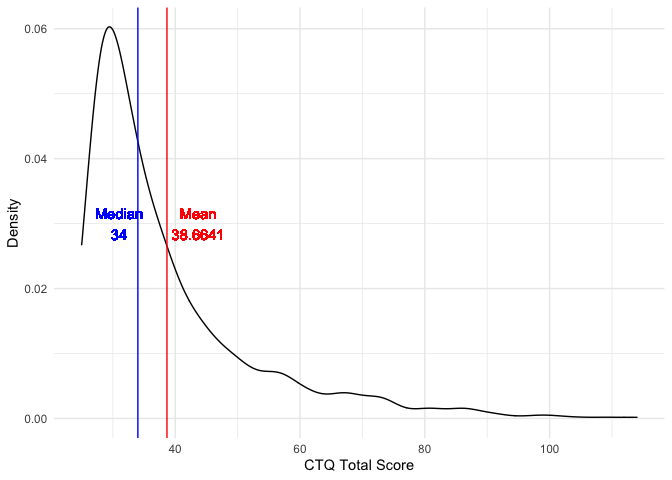

investigations
================
Paula Wu
5/11/2022

``` r
m2_df = 
  read_csv("./data/m2_df.csv") %>% 
  select(-1)
```

### Invalid investigation

``` r
# Dependent variable
invalid_dep = 
  m2_df %>% 
  filter(B3TCOMPZ3 == 8 | B3TEMZ3 == 8 | B3TEFZ3 == 8) %>% 
  pull(M2ID)

tibble(
  B3TCOMPZ3 = as.numeric(count(m2_df[m2_df$B3TCOMPZ3 == 8,])),
  B3TEMZ3 = as.numeric(count(m2_df[m2_df$B3TEMZ3 == 8,])),
  B3TEFZ3 = as.numeric(count(m2_df[m2_df$B3TEFZ3 == 8,]))
) %>% 
  knitr::kable(caption = "Invalid counts - Dependent Variable")
```

| B3TCOMPZ3 | B3TEMZ3 | B3TEFZ3 |
|----------:|--------:|--------:|
|        40 |       4 |       0 |

Invalid counts - Dependent Variable

``` r
# CTQ scores
invalid_ctq = 
  m2_df %>% 
  filter(B4QCT_SA == 98 | B4QCT_EN == 98 | B4QCT_MD == 8 | B4QCT_PN == 98 | B4QCT_EA == 98 | B4QCT_PA == 98) %>% 
  pull(M2ID)

tibble(
  B4QCT_SA = as.numeric(count(m2_df[m2_df$B4QCT_SA == 98,])),
  B4QCT_EN = as.numeric(count(m2_df[m2_df$B4QCT_EN == 98,])),
  B4QCT_MD = as.numeric(count(m2_df[m2_df$B4QCT_MD == 8,])),
  B4QCT_PN = as.numeric(count(m2_df[m2_df$B4QCT_PN == 98,])),
  B4QCT_EA = as.numeric(count(m2_df[m2_df$B4QCT_EA == 98,])),
  B4QCT_PA = as.numeric(count(m2_df[m2_df$B4QCT_PA == 98,]))
)%>% 
  knitr::kable(caption = "Invalid counts - CTQ scores")
```

| B4QCT_SA | B4QCT_EN | B4QCT_MD | B4QCT_PN | B4QCT_EA | B4QCT_PA |
|---------:|---------:|---------:|---------:|---------:|---------:|
|        7 |        3 |        2 |        2 |        3 |        2 |

Invalid counts - CTQ scores

``` r
# Covariates
# B1SA11W no invalid, 
invalid_cov = 
  m2_df %>% 
  filter(B1PTSEI == 999 | B4HMETMW == 99998 | B1PB1 == 97 | B1PF7A >= 7 | B1SA62A == 8 | B1SA62B == 8 | B1SA62C == 8 | B1SA62D == 8 | B1SA62E == 8 | B1SA62F == 8 | B1SA62G == 8 | B1SA62H == 8 | B1SA62I == 8 | B1SA62J == 8) %>%
  pull(M2ID)

tibble(
  B1PTSEI = as.numeric(count(m2_df[m2_df$B1PTSEI == 999,])),
  B4HMETMW = as.numeric(count(m2_df[m2_df$B4HMETMW == 99998,])),
  B1PB1 = as.numeric(count(m2_df[m2_df$B1PB1 == 97,])),
  B1PF7A = as.numeric(count(m2_df[m2_df$B1PF7A >= 7,])),
  B1SA62A = as.numeric(count(m2_df[m2_df$B1SA62A == 8,])),
  B1SA62B = as.numeric(count(m2_df[m2_df$B1SA62B == 8,])),
  B1SA62C = as.numeric(count(m2_df[m2_df$B1SA62C == 8,])),
  B1SA62D = as.numeric(count(m2_df[m2_df$B1SA62D == 8,])),
  B1SA62E = as.numeric(count(m2_df[m2_df$B1SA62E == 8,])),
  B1SA62F = as.numeric(count(m2_df[m2_df$B1SA62F == 8,])),
  B1SA62G = as.numeric(count(m2_df[m2_df$B1SA62G == 8,])),
  B1SA62H = as.numeric(count(m2_df[m2_df$B1SA62H == 8,])),
  B1SA62I = as.numeric(count(m2_df[m2_df$B1SA62I == 8,])),
  B1SA62J = as.numeric(count(m2_df[m2_df$B1SA62J == 8,]))
)%>% 
  knitr::kable(caption = "Invalid counts - Covariates")
```

| B1PTSEI | B4HMETMW | B1PB1 | B1PF7A | B1SA62A | B1SA62B | B1SA62C | B1SA62D | B1SA62E | B1SA62F | B1SA62G | B1SA62H | B1SA62I | B1SA62J |
|--------:|---------:|------:|-------:|--------:|--------:|--------:|--------:|--------:|--------:|--------:|--------:|--------:|--------:|
|     352 |        5 |     3 |      2 |       3 |       3 |       4 |       3 |       4 |       6 |       4 |       3 |       3 |       4 |

Invalid counts - Covariates

``` r
# Resilience factor part 1
invalid_res_1 = 
  m2_df %>% 
  filter(B1SPWBA2 == 98 | B1SPWBE2 == 98 | B1SPWBG2 == 98 | B1SPWBR2 == 98 | B1SPWBU2 == 98 | B1SPWBS2 == 98) %>% 
  pull(M2ID)


tibble(
  B1SPWBA2 = as.numeric(count(m2_df[m2_df$B1SPWBA2 == 98,])),
  B1SPWBE2 = as.numeric(count(m2_df[m2_df$B1SPWBE2 == 98,])),
  B1SPWBG2 = as.numeric(count(m2_df[m2_df$B1SPWBG2 == 98,])),
  B1SPWBR2 = as.numeric(count(m2_df[m2_df$B1SPWBR2 == 98,])),
  B1SPWBU2 = as.numeric(count(m2_df[m2_df$B1SPWBU2 == 98,])),
  B1SPWBS2 = as.numeric(count(m2_df[m2_df$B1SPWBS2 == 98,])),
) %>% 
  knitr::kable(caption = "Invalid counts - Resilience Factor Part 1")
```

| B1SPWBA2 | B1SPWBE2 | B1SPWBG2 | B1SPWBR2 | B1SPWBU2 | B1SPWBS2 |
|---------:|---------:|---------:|---------:|---------:|---------:|
|        3 |        3 |        3 |        3 |        3 |        3 |

Invalid counts - Resilience Factor Part 1

``` r
# Resilience factor part 2
# B1SINTER, B1SINDEP both have two missing values (national and milwaukee samples has different criteria??)
invalid_res_2 = 
  m2_df %>% 
  filter(B1SMASTE == 8 | B1SCONST == 8 | B1SCTRL == 8 | B1SESTEE == 98 | B1SINTER == 8 
         | B1SINTER == 98 |B1SINDEP == 8 | B1SINDEP == 98 | B1SAGENC == 8 | B1SAGREE == 8 | 
           B1SEXTRA == 8 | B1SNEURO == 8 | B1SCONS1 == 8 ) %>% 
  pull(M2ID)

tibble(
  B1SMASTE = as.numeric(count(m2_df[m2_df$B1SMASTE == 8,])),
  B1SCONST = as.numeric(count(m2_df[m2_df$B1SCONST == 8,])),
  B1SCTRL = as.numeric(count(m2_df[m2_df$B1SCTRL == 8,])),
  B1SESTEE = as.numeric(count(m2_df[m2_df$B1SESTEE == 98,])),
  B1SINTER = as.numeric(count(m2_df[m2_df$B1SINTER == 8,])),
  BASINTER = as.numeric(count(m2_df[m2_df$B1SINTER == 98,])),
  B1SINDEP = as.numeric(count(m2_df[m2_df$B1SINDEP == 8,])),
  BASINDEP = as.numeric(count(m2_df[m2_df$B1SINDEP == 98,])),
  B1SAGENC = as.numeric(count(m2_df[m2_df$B1SAGENC == 8,])),
  B1SAGREE = as.numeric(count(m2_df[m2_df$B1SAGREE == 8,])),
  B1SEXTRA = as.numeric(count(m2_df[m2_df$B1SEXTRA == 8,])),
  B1SNEURO = as.numeric(count(m2_df[m2_df$B1SNEURO == 8,])),
  B1SCONS1 = as.numeric(count(m2_df[m2_df$B1SCONS1 == 8,]))
) %>% 
  knitr::kable(caption = "Invalid counts - Resilience Factor Part 2")
```

| B1SMASTE | B1SCONST | B1SCTRL | B1SESTEE | B1SINTER | BASINTER | B1SINDEP | BASINDEP | B1SAGENC | B1SAGREE | B1SEXTRA | B1SNEURO | B1SCONS1 |
|---------:|---------:|--------:|---------:|---------:|---------:|---------:|---------:|---------:|---------:|---------:|---------:|---------:|
|        5 |        5 |       5 |        7 |       15 |        2 |        6 |        2 |        6 |        5 |        5 |        5 |        5 |

Invalid counts - Resilience Factor Part 2

``` r
# total number of subjects who have at least one invalid entry
invalid_all = c(invalid_dep, invalid_ctq, invalid_cov, invalid_res_1, invalid_res_2)
```

``` r
# further investigation
table(invalid_all) %>% 
  as.tibble() %>% 
  arrange(desc(n))
```

    ## # A tibble: 406 × 2
    ##    invalid_all     n
    ##    <chr>       <int>
    ##  1 11763           3
    ##  2 12106           3
    ##  3 16500           3
    ##  4 10231           2
    ##  5 10476           2
    ##  6 10511           2
    ##  7 10524           2
    ##  8 10644           2
    ##  9 12738           2
    ## 10 13396           2
    ## # … with 396 more rows

``` r
m2_df_copy = m2_df
m2_df_invalid = 
  m2_df_copy %>% 
  mutate(B3TCOMPZ3_ = ifelse(B3TCOMPZ3 == 8, 1, 0),
         B3TEMZ3_ = ifelse(B3TEMZ3 == 8, 1, 0),
         B3TEFZ3_ = ifelse(B3TEFZ3 == 8, 1, 0),
         B4QCT_SA_ = ifelse(B4QCT_SA == 98, 1, 0),
         B4QCT_EN_ = ifelse(B4QCT_EN == 98, 1, 0),
         B4QCT_MD_ = ifelse(B4QCT_MD == 8, 1, 0),
         B4QCT_PN_ = ifelse(B4QCT_PN == 98, 1, 0),
         B4QCT_EA_ = ifelse(B4QCT_EA == 98, 1, 0),
         B4QCT_PA_ = ifelse(B4QCT_PA == 98, 1, 0),
         B1PTSEI_ = ifelse(B1PTSEI == 999, 1, 0),
         B4HMETMW_ = ifelse(B4HMETMW == 99998, 1, 0),
         B1PB1_ = ifelse(B1PB1 == 97, 1, 0),
         B1PF7A_ = ifelse(B1PF7A >= 7, 1, 0),
         B1SA62A_ = ifelse(B1SA62A == 8, 1, 0),
         B1SA62B_ = ifelse(B1SA62B == 8, 1, 0),
         B1SA62C_ = ifelse(B1SA62C == 8, 1, 0),
         B1SA62D_ = ifelse(B1SA62D == 8, 1, 0),
         B1SA62E_ = ifelse(B1SA62E == 8, 1, 0),
         B1SA62F_ = ifelse(B1SA62F == 8, 1, 0),
         B1SA62G_ = ifelse(B1SA62G == 8, 1, 0),
         B1SA62H_ = ifelse(B1SA62H == 8, 1, 0),
         B1SA62I_ = ifelse(B1SA62I == 8, 1, 0),
         B1SA62J_ = ifelse(B1SA62J == 8, 1, 0),
         B1SPWBA2_ = ifelse(B1SPWBA2 == 98, 1, 0),
         B1SPWBE2_ = ifelse(B1SPWBE2 == 98, 1, 0),
         B1SPWBG2_ = ifelse(B1SPWBG2 == 98, 1, 0),
         B1SPWBR2_ = ifelse(B1SPWBR2 == 98, 1, 0),
         B1SPWBU2_ = ifelse(B1SPWBU2 == 98, 1, 0),
         B1SPWBS2_ = ifelse(B1SPWBS2 == 98, 1, 0),
         B1SMASTE_ = ifelse(B1SMASTE == 8, 1, 0),
         B1SCONST_ = ifelse(B1SCONST == 8, 1, 0),
         B1SCTRL_ = ifelse(B1SCTRL == 8, 1, 0),
         B1SESTEE_ = ifelse(B1SESTEE == 98, 1, 0),
         B1SINTER_ = ifelse(B1SINTER == 8, 1, 0),
         BASINTER_ = ifelse(B1SINTER == 98, 1, 0),
         B1SINDEP_ = ifelse(B1SINDEP == 8, 1, 0),
         BASINDEP_ = ifelse(B1SINDEP == 98, 1, 0),
         B1SAGENC_ = ifelse(B1SAGENC == 8, 1, 0),
         B1SAGREE_ = ifelse(B1SAGREE == 8, 1, 0),
         B1SEXTRA_ = ifelse(B1SEXTRA == 8, 1, 0),
         B1SNEURO_ = ifelse(B1SNEURO == 8, 1, 0),
         B1SCONS1_ = ifelse(B1SCONS1 == 8, 1, 0),
         invalid_ind = NA) %>% 
  select(-c(2:60)) %>% 
  select(M2ID, invalid_ind, everything()) %>% 
  rename_at(.vars = vars(ends_with("_")),
            .funs = funs(sub("_$", "", .)))

invalid_var = function(obs){
  invalid_str = ""
  for (i in 3:44){
    cell = as.numeric(obs[i])
    if(cell == 1){
      invalid_str = paste0(invalid_str, colnames(obs)[i], sep = ", ")
    }
  }
  return(invalid_str)
}

for (i in 1:1145){
  obs = m2_df_invalid[i,]
  invalid_str = invalid_var(obs)
  m2_df_invalid[i,2] = invalid_str
}
invalid_full = 
  m2_df_invalid %>% 
  select(M2ID, invalid_ind) %>% 
  filter(!invalid_ind == "") %>% 
  mutate(invalid_count = str_count(invalid_ind, pattern = ","))

invalid_full %>% 
  group_by(invalid_count) %>% 
  summarize(n = n()) %>% 
  knitr::kable()
```

| invalid_count |   n |
|--------------:|----:|
|             1 | 358 |
|             2 |  27 |
|             3 |   5 |
|             4 |   3 |
|             5 |   3 |
|             6 |   3 |
|             7 |   1 |
|             8 |   1 |
|            10 |   3 |
|            18 |   2 |

``` r
invalid_full %>% 
  ggplot(aes(x = invalid_count))+
  geom_histogram() +
  stat_bin(aes(y=..count.., label=ifelse(..count..== 0,"",..count..)), geom="text", vjust= -0.5)
```

<!-- -->

## SES and Spouse SES Investigation

For now, I’m thinking about impute those missing numbers with their
spouse’s SES, if any. First, investigate: how many people have their
spouse’s SES filled (out of 352)

``` r
m2_df %>% 
  filter(B1PTSEI == 999) %>% 
  select(M2ID, M2FAMNUM, B1PTSEI, B1PTSEIS) %>% 
  mutate(nul = ifelse(B1PTSEIS == 999, 1, 0)) %>% 
  group_by(nul) %>% 
  summarize(n = n())
```

    ## # A tibble: 2 × 2
    ##     nul     n
    ##   <dbl> <int>
    ## 1     0   223
    ## 2     1   129

### imputation - May 19th version:

Out of 352 missing, 129 of them still don’t have the spouse SES while
223 of them did. Maybe we can impute them using the median/mean of their
subgroups.

``` r
# if use the above-mentioned imputation
m2_df_tend = m2_df # new dataset to prevent data contamination

with_sps = 
  m2_df %>% 
  filter(B1PTSEI == 999) %>% 
  select(M2ID, M2FAMNUM, B1PTSEI, B1PTSEIS) %>% 
  filter(B1PTSEIS != 999) %>% 
  pull(M2ID)
m2_df_tend[m2_df_tend$M2ID %in% with_sps, which(colnames(m2_df_tend) == "B1PTSEI")] = m2_df_tend[m2_df_tend$M2ID %in% with_sps, which(colnames(m2_df_tend) == "B1PTSEIS")]

# without spouse people, impute with subgroups - sex, education, race
wo_sps = 
  m2_df %>% 
  filter(B1PTSEI == 999) %>% 
  select(M2ID, M2FAMNUM, B1PTSEI, B1PTSEIS) %>% 
  filter(B1PTSEIS == 999) %>% 
  pull(M2ID)
  
# function for imputation
impute = function(obs){
  sex = as.numeric(obs[9])
  edu = as.numeric(obs[11])
  race = as.numeric(obs[10])
  sub_mean = m2_df_tend %>% 
    filter(B1PRSEX == sex & B1PB1 == edu & B1PF7A == race & B1PTSEI != 999) %>% 
    pull(B1PTSEI) %>% 
    mean()
  return(sub_mean)
}

# begin row-by-row imputation
for (id in wo_sps){
  obs = m2_df_tend[m2_df_tend$M2ID == id, ]
  sub_mean = impute(obs)
  m2_df_tend[m2_df_tend$M2ID == id, which(colnames(m2_df_tend) == "B1PTSEI")] = sub_mean
}
```

``` r
m2_df
```

    ## # A tibble: 1,145 × 60
    ##     M2ID M2FAMNUM B3TCOMPZ3 B3TEMZ3 B3TEFZ3 B3PIDATE_MO B3PIDATE_YR B1PAGE_M2
    ##    <dbl>    <dbl>     <dbl>   <dbl>   <dbl>       <dbl>       <dbl>     <dbl>
    ##  1 10002   100001    -0.258  -1.24    0.221           9        2004        69
    ##  2 10005   120803    -1.72   -0.415  -1.45            1        2005        80
    ##  3 10019   100009     1.56    0.839   1.54            3        2004        51
    ##  4 10040   100018     0.006   0.013  -0.25            2        2005        49
    ##  5 10047   100022     0.577   0.411   0.596           7        2004        45
    ##  6 10060   100028    -1.08   -1.07   -0.554           7        2004        58
    ##  7 10061   100029     0.694  -0.872   0.569           7        2004        81
    ##  8 10063   120288    -0.339  -0.415  -0.112           6        2004        48
    ##  9 10079    10079    -0.418   1.50   -1.08            9        2005        49
    ## 10 10080    10080    -1.09    1.52   -1.53            7        2005        40
    ## # … with 1,135 more rows, and 52 more variables: B1PRSEX <dbl>, B1PF7A <dbl>,
    ## #   B1PB1 <dbl>, B1PTSEI <dbl>, B1PTSEIS <dbl>, B1PB19 <dbl>, B1PA6A <dbl>,
    ## #   B1PA37 <dbl>, B1PA38A <dbl>, B1PA39 <dbl>, B1SA11W <dbl>, B1SA11Z <dbl>,
    ## #   B1SA62A <dbl>, B1SA62B <dbl>, B1SA62C <dbl>, B1SA62D <dbl>, B1SA62E <dbl>,
    ## #   B1SA62F <dbl>, B1SA62G <dbl>, B1SA62H <dbl>, B1SA62I <dbl>, B1SA62J <dbl>,
    ## #   B1SPWBA2 <dbl>, B1SPWBE2 <dbl>, B1SPWBG2 <dbl>, B1SPWBR2 <dbl>,
    ## #   B1SPWBU2 <dbl>, B1SPWBS2 <dbl>, B1SMASTE <dbl>, B1SCONST <dbl>, …

### imputation - May 26th version:

Instead of imputing from each one’s subgroup, researchers usually use
education-level to approximate individuals’ SES. Therefore, I fit a
linear regression model with SES as the dep-var and education level as
the indep-var.

``` r
# use the above mentioned method, first fit a linear model
m2_df_lm = m2_df %>% 
  select(B1PTSEI, B1PAGE_M2, B1PB1) %>% 
  filter(B1PTSEI != 999 & B1PB1 != 97)
lm_ses = lm(B1PTSEI ~ B1PB1, data = m2_df_lm)
```

There is one entry who has neither education level nor SES value. What
should we do about this person?

``` r
m2_df %>% 
  filter(B1PTSEI == 999 & B1PB1 == 97)
```

    ## # A tibble: 1 × 60
    ##    M2ID M2FAMNUM B3TCOMPZ3 B3TEMZ3 B3TEFZ3 B3PIDATE_MO B3PIDATE_YR B1PAGE_M2
    ##   <dbl>    <dbl>     <dbl>   <dbl>   <dbl>       <dbl>       <dbl>     <dbl>
    ## 1 13166   101306     0.058   0.868  -0.166          12        2004        67
    ## # … with 52 more variables: B1PRSEX <dbl>, B1PF7A <dbl>, B1PB1 <dbl>,
    ## #   B1PTSEI <dbl>, B1PTSEIS <dbl>, B1PB19 <dbl>, B1PA6A <dbl>, B1PA37 <dbl>,
    ## #   B1PA38A <dbl>, B1PA39 <dbl>, B1SA11W <dbl>, B1SA11Z <dbl>, B1SA62A <dbl>,
    ## #   B1SA62B <dbl>, B1SA62C <dbl>, B1SA62D <dbl>, B1SA62E <dbl>, B1SA62F <dbl>,
    ## #   B1SA62G <dbl>, B1SA62H <dbl>, B1SA62I <dbl>, B1SA62J <dbl>, B1SPWBA2 <dbl>,
    ## #   B1SPWBE2 <dbl>, B1SPWBG2 <dbl>, B1SPWBR2 <dbl>, B1SPWBU2 <dbl>,
    ## #   B1SPWBS2 <dbl>, B1SMASTE <dbl>, B1SCONST <dbl>, B1SCTRL <dbl>, …

``` r
# if use the above-mentioned imputation
m2_df_tend = m2_df # new dataset to prevent data contamination, will merge to m2_df if method approved

m2_pred_id = m2_df_tend %>% 
  filter(B1PTSEI == 999) %>% 
  filter(!M2ID == 13166) %>% 
  pull(M2ID)

for (i in m2_pred_id){
  edu = m2_df_tend[m2_df_tend$M2ID == i, which(colnames(m2_df_tend) == "B1PB1")]
  pred_ses = predict(lm_ses, newdata = edu)
  m2_df_tend[m2_df_tend$M2ID == i, which(colnames(m2_df_tend) == "B1PTSEI")] = pred_ses
}
```

I also considered other models, but it turns out that the original,
single predictor model is good enough.

``` r
lm_ses_age = lm(B1PTSEI ~ B1PB1 + B1PAGE_M2, data = m2_df_lm)
lm_ses_age_int = lm(B1PTSEI ~ B1PB1 + B1PAGE_M2 + B1PB1 * B1PAGE_M2, data = m2_df_lm)
anova(lm_ses, lm_ses_age) # model 1 is better 
```

    ## Analysis of Variance Table
    ## 
    ## Model 1: B1PTSEI ~ B1PB1
    ## Model 2: B1PTSEI ~ B1PB1 + B1PAGE_M2
    ##   Res.Df    RSS Df Sum of Sq      F Pr(>F)
    ## 1    789 113139                           
    ## 2    788 113128  1    11.614 0.0809 0.7762

``` r
anova(lm_ses, lm_ses_age_int) # model 1 is better 
```

    ## Analysis of Variance Table
    ## 
    ## Model 1: B1PTSEI ~ B1PB1
    ## Model 2: B1PTSEI ~ B1PB1 + B1PAGE_M2 + B1PB1 * B1PAGE_M2
    ##   Res.Df    RSS Df Sum of Sq      F Pr(>F)
    ## 1    789 113139                           
    ## 2    787 112755  2    384.07 1.3404 0.2623

# Modeling

right now I just completely filter out all the observations with at
least one invalid feature

``` r
m2_df_no_inval = 
  m2_df %>% 
  filter(!(M2ID %in% unique(invalid_all)))

# random intercept for each family
ctqs = c("B4QCT_EA", "B4QCT_EN", "B4QCT_MD", "B4QCT_PA", "B4QCT_PN", "B4QCT_SA")
for (ctq in ctqs){
  lme(B3TCOMPZ3 ~ parse(text = ctq)[[1]], random = ~1 | M2FAMNUM,  data = m2_df_no_inval, method='REML')
}


lmm1 = lme(B3TCOMPZ3 ~ B4QCT_MD, random = ~1 | M2FAMNUM,  data = m2_df_no_inval, method='REML') 
summary(lmm1)
```
