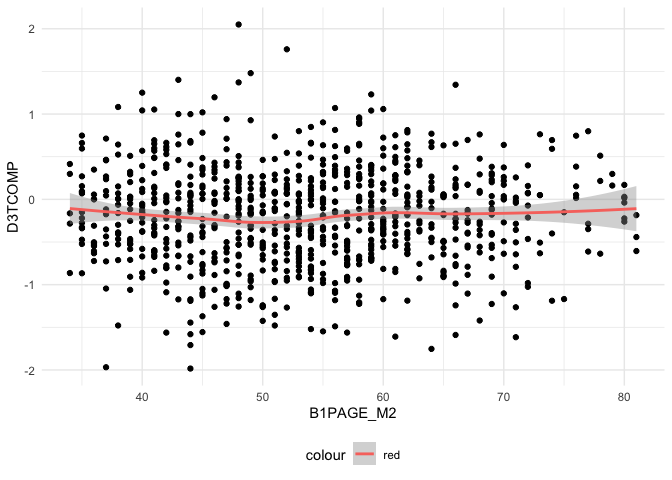
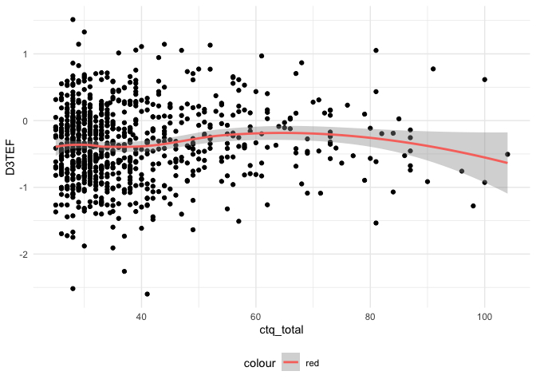

investigations
================
Paula Wu
5/11/2022

**7.7/7.14 Updates** (all updates are located at the bottom of this
document):

1.  Moderator effects of self-administered drugs are investigated and
    reported.

2.  I also explored another method called “multivariate multilevel
    regression”, which takes all three independent variables as the
    outcome variables while fitting other dependent variables as either
    predictors or covariates (details see below).

``` r
m2_df = 
  read_csv("./data/m2_df.csv") %>% 
  select(-1) %>% 
  filter(B3TCOMPZ3 != 8 & B3TEMZ3 != 8 & B3TEFZ3 != 8) %>% 
  filter(B4QCT_SA != 98 & B4QCT_EN != 98 & B4QCT_MD != 8 & B4QCT_PN != 98 & B4QCT_EA != 98 & B4QCT_PA != 98) %>% 
  select(-c(37:47))
```

## SES and Spouse SES Investigation

For now, I’m thinking about impute those missing numbers with their
spouse’s SES, if any. First, investigate: how many people have their
spouse’s SES filled (out of 334)

``` r
m2_df %>% 
  filter(B1PTSEI == 999) %>% 
  select(M2ID, M2FAMNUM, B1PTSEI, B1PTSEIS) %>% 
  mutate(nul = ifelse(B1PTSEIS == 999, 1, 0)) %>% 
  group_by(nul) %>% 
  summarize(n = n())
```

    ## # A tibble: 2 × 2
    ##     nul     n
    ##   <dbl> <int>
    ## 1     0   209
    ## 2     1   125

Out of 334 missing, 125 of them still don’t have the spouse SES while
209 of them did.

### imputation - Jun 2nd (final) version:

Impute spouses’ SES for those who doesn’t have SES; for the rest use LM
(education as predictor) for imputation

``` r
# for those whose spouse has a valid SES
with_sps = 
  m2_df %>% 
  filter(B1PTSEI == 999) %>% 
  select(M2ID, M2FAMNUM, B1PTSEI, B1PTSEIS) %>% 
  filter(B1PTSEIS != 999) %>% 
  pull(M2ID)
m2_df[m2_df$M2ID %in% with_sps, which(colnames(m2_df) == "B1PTSEI")] = m2_df[m2_df$M2ID %in% with_sps, which(colnames(m2_df) == "B1PTSEIS")]

# for those whose spouse doesn't have a valid SES, fit an LM 
m2_df_lm = m2_df %>% 
  select(B1PTSEI, B1PAGE_M2, B1PB1) %>% 
  filter(B1PTSEI != 999 & B1PB1 != 97)
lm_ses = lm(B1PTSEI ~ B1PB1, data = m2_df_lm)


# prediction
m2_pred_id = m2_df %>% 
  filter(B1PTSEI == 999) %>% 
  pull(M2ID)

for (i in m2_pred_id){
  edu = m2_df[m2_df$M2ID == i, which(colnames(m2_df) == "B1PB1")]
  pred_ses = predict(lm_ses, newdata = edu)
  m2_df[m2_df$M2ID == i, which(colnames(m2_df) == "B1PTSEI")] = pred_ses
}
```

``` r
m2_df_copy = m2_df
m2_df_invalid = 
  m2_df_copy %>% 
  mutate(B3TCOMPZ3_ = ifelse(B3TCOMPZ3 == 8, 1, 0),
         B3TEMZ3_ = ifelse(B3TEMZ3 == 8, 1, 0),
         B3TEFZ3_ = ifelse(B3TEFZ3 == 8, 1, 0),
         B4QCT_SA_ = ifelse(B4QCT_SA == 98, 1, 0),
         B4QCT_EN_ = ifelse(B4QCT_EN == 98, 1, 0),
         B4QCT_MD_ = ifelse(B4QCT_MD == 8, 1, 0),
         B4QCT_PN_ = ifelse(B4QCT_PN == 98, 1, 0),
         B4QCT_EA_ = ifelse(B4QCT_EA == 98, 1, 0),
         B4QCT_PA_ = ifelse(B4QCT_PA == 98, 1, 0),
         B1PTSEI_ = ifelse(B1PTSEI == 999, 1, 0),
         B4HMETMW_ = ifelse(B4HMETMW == 99998, 1, 0),
         B1PB1_ = ifelse(B1PB1 == 97, 1, 0),
         B1PF7A_ = ifelse(B1PF7A >= 7, 1, 0),
         B1SA62A_ = ifelse(B1SA62A == 8, 1, 0),
         B1SA62B_ = ifelse(B1SA62B == 8, 1, 0),
         B1SA62C_ = ifelse(B1SA62C == 8, 1, 0),
         B1SA62D_ = ifelse(B1SA62D == 8, 1, 0),
         B1SA62E_ = ifelse(B1SA62E == 8, 1, 0),
         B1SA62F_ = ifelse(B1SA62F == 8, 1, 0),
         B1SA62G_ = ifelse(B1SA62G == 8, 1, 0),
         B1SA62H_ = ifelse(B1SA62H == 8, 1, 0),
         B1SA62I_ = ifelse(B1SA62I == 8, 1, 0),
         B1SA62J_ = ifelse(B1SA62J == 8, 1, 0),
         B1SPWBA2_ = ifelse(B1SPWBA2 == 98, 1, 0),
         B1SPWBE2_ = ifelse(B1SPWBE2 == 98, 1, 0),
         B1SPWBG2_ = ifelse(B1SPWBG2 == 98, 1, 0),
         B1SPWBR2_ = ifelse(B1SPWBR2 == 98, 1, 0),
         B1SPWBU2_ = ifelse(B1SPWBU2 == 98, 1, 0),
         B1SPWBS2_ = ifelse(B1SPWBS2 == 98, 1, 0),
         B1SMASTE_ = ifelse(B1SMASTE == 8, 1, 0),
         B1SCONST_ = ifelse(B1SCONST == 8, 1, 0),
         B1SCTRL_ = ifelse(B1SCTRL == 8, 1, 0),
         B1SESTEE_ = ifelse(B1SESTEE == 98, 1, 0),
         B1SINTER_ = ifelse(B1SINTER == 8, 1, 0),
         BASINTER_ = ifelse(B1SINTER == 98, 1, 0),
         B1SINDEP_ = ifelse(B1SINDEP == 8, 1, 0),
         BASINDEP_ = ifelse(B1SINDEP == 98, 1, 0),
         B1SAGENC_ = ifelse(B1SAGENC == 8, 1, 0),
         B1SAGREE_ = ifelse(B1SAGREE == 8, 1, 0),
         B1SEXTRA_ = ifelse(B1SEXTRA == 8, 1, 0),
         B1SNEURO_ = ifelse(B1SNEURO == 8, 1, 0),
         B1SCONS1_ = ifelse(B1SCONS1 == 8, 1, 0),
         invalid_ind = NA) %>% 
  select(-c(2:60)) %>% 
  select(M2ID, invalid_ind, everything()) %>% 
  rename_at(.vars = vars(ends_with("_")),
            .funs = funs(sub("_$", "", .)))


for (i in 1:1099){
  obs = m2_df_invalid[i,]
  invalid_str = invalid_var(obs)
  m2_df_invalid[i,2] = invalid_str
}
invalid_full = 
  m2_df_invalid %>% 
  select(M2ID, invalid_ind) %>% 
  filter(!invalid_ind == "") %>% 
  mutate(invalid_count = str_count(invalid_ind, pattern = ","))

invalid_full %>% 
  group_by(invalid_count) %>% 
  summarize(n = n()) %>% 
  knitr::kable()

invalid_full %>% 
  ggplot(aes(x = invalid_count))+
  geom_histogram() +
  stat_bin(aes(y=..count.., label=ifelse(..count..== 0,"",..count..)), geom="text", vjust= -0.5)
```

``` r
a = m2_df %>% 
  filter(!(B4QCT_EA == 98 | B4QCT_EN == 98 | B4QCT_SA == 98 | B4QCT_PA == 98 | B4QCT_PN == 98 | B4QCT_MD == 8 )) %>% 
  mutate(ctq_total = B4QCT_EA + B4QCT_EN + B4QCT_SA + B4QCT_PA + B4QCT_PN + B4QCT_MD)

mean_ctq = a %>% 
  pull(ctq_total) %>% 
  mean() %>% 
  signif(6)

median_ctq = a %>% 
  pull(ctq_total) %>% 
  median() %>% 
  signif(6)

a %>% 
  ggplot(aes(x = ctq_total)) +
  geom_density()+
  geom_vline(xintercept=mean_ctq, size=0.5, color="red")+
  geom_text(aes(x=mean_ctq + 5, label=paste0("Mean\n",mean_ctq), y=0.03), color = "red")+
  geom_vline(xintercept=median_ctq, size=0.5, color="blue")+
  geom_text(aes(x=median_ctq - 3, label=paste0("Median\n",median_ctq), y=0.03), color = "blue")+
  theme(legend.position = "none")+
  xlab("CTQ Total Score")+
  ylab("Density")

a %>% 
  mutate(below_49 = ifelse(ctq_total <= 39, 1, 0)) %>% 
  group_by(below_49) %>% 
  summarize(n = n())
#ggsave("ctq_density.jpeg", width = 10, height = 7)
```

## Invalid investigation, after imputation

``` r
m2_df_cc = m2_df %>% 
  mutate(B1PTSEI_ = ifelse(B1PTSEI == 999, 1, 0),
         B4HMETMW_ = ifelse(B4HMETMW == 99998, 1, 0),
         B1PB1_ = ifelse(B1PB1 == 97, 1, 0),
         B1PF7A_ = ifelse(B1PF7A >= 7, 1, 0),
         B1SA62A_ = ifelse(B1SA62A == 8, 1, 0),
         B1SA62B_ = ifelse(B1SA62B == 8, 1, 0),
         B1SA62C_ = ifelse(B1SA62C == 8, 1, 0),
         B1SA62D_ = ifelse(B1SA62D == 8, 1, 0),
         B1SA62E_ = ifelse(B1SA62E == 8, 1, 0),
         B1SA62F_ = ifelse(B1SA62F == 8, 1, 0),
         B1SA62G_ = ifelse(B1SA62G == 8, 1, 0),
         B1SA62H_ = ifelse(B1SA62H == 8, 1, 0),
         B1SA62I_ = ifelse(B1SA62I == 8, 1, 0),
         B1SA62J_ = ifelse(B1SA62J == 8, 1, 0),
         B1SPWBA2_ = ifelse(B1SPWBA2 == 98, 1, 0),
         B1SPWBE2_ = ifelse(B1SPWBE2 == 98, 1, 0),
         B1SPWBG2_ = ifelse(B1SPWBG2 == 98, 1, 0),
         B1SPWBR2_ = ifelse(B1SPWBR2 == 98, 1, 0),
         B1SPWBU2_ = ifelse(B1SPWBU2 == 98, 1, 0),
         B1SPWBS2_ = ifelse(B1SPWBS2 == 98, 1, 0),
         invalid_ind = NA) %>% 
  select(-c(2:49)) %>% 
  select(M2ID, invalid_ind, everything()) %>% 
  rename_at(.vars = vars(ends_with("_")),
            .funs = funs(sub("_$", "", .)))

invalid_var = function(obs){
  invalid_str = ""
  for (i in 3:22){
    cell = as.numeric(obs[i])
    if(cell == 1){
      invalid_str = paste0(invalid_str, colnames(obs)[i], sep = ", ")
    }
  }
  return(invalid_str)
}
for (i in 1:1099){
  obs = m2_df_cc[i,]
  invalid_str = invalid_var(obs)
  m2_df_cc[i,2] = invalid_str
}
invalid_cc = 
  m2_df_cc %>% 
  select(M2ID, invalid_ind) %>% 
  filter(!invalid_ind == "") %>% 
  mutate(invalid_count = str_count(invalid_ind, pattern = ","))

# quick summary: invalid entries of each variable
colSums(m2_df_cc[3:22])
```

    ##  B1PTSEI B4HMETMW    B1PB1   B1PF7A  B1SA62A  B1SA62B  B1SA62C  B1SA62D 
    ##        0        5        3        2        3        3        4        3 
    ##  B1SA62E  B1SA62F  B1SA62G  B1SA62H  B1SA62I  B1SA62J B1SPWBA2 B1SPWBE2 
    ##        4        6        4        3        3        4        3        3 
    ## B1SPWBG2 B1SPWBR2 B1SPWBU2 B1SPWBS2 
    ##        3        3        3        3

``` r
# quick summary: count of people for different numbers of invalid entries. Total: 40 subjects
invalid_cc %>%
  group_by(invalid_count) %>% 
  summarize(n = n()) %>% 
  bind_rows(summarise_all(., ~if(is.numeric(.)) sum(.) else "Total")) %>% 
  mutate(invalid_count = ifelse(row_number() == 6, "Total", invalid_count)) %>% 
  knitr::kable()
```

| invalid_count |   n |
|:--------------|----:|
| 1             |  16 |
| 2             |   1 |
| 6             |   3 |
| 9             |   1 |
| 10            |   2 |
| Total         |  23 |

``` r
# deselect unnecessary variables, deselect invalid entries
invalid_cc_id = invalid_cc %>% 
  pull(M2ID) %>% 
  unique()

m2_df = m2_df %>% 
  select(-c(B3PIDATE_MO, B3PIDATE_YR, B1PTSEIS, B1PA37, B1PA38A, B1SA11Z, B4H33, B4H34, B4H36, B4H38, B4H40)) %>% 
  filter(!(M2ID %in% invalid_cc_id))
```

# M3 dataframe

``` r
m2_id = m2_df %>% pull(M2ID)
length(m2_id)
```

    ## [1] 1076

``` r
m3_df = 
  read_csv("./data/m3_df.csv") %>% 
  select(-1)


# only 911 left after joining, the rest 165 don't have M3 record
# 867 left after filtering out invalid entries
full_df = 
  inner_join(m2_df, m3_df, by = "M2ID") %>% 
  select(-M2FAMNUM.y) %>% 
  rename(M2FAMNUM = M2FAMNUM.x) %>%
  filter(C3TCOMP != 8 & C3TEM != 8 & C1PA6A != 7) %>% 
  mutate(D3TCOMP = C3TCOMP - B3TCOMPZ3,
         D3TEM = C3TEM - B3TEMZ3,
         D3TEF = C3TEF - B3TEFZ3,
         D1PB19 = C1PB19 - B1PB19,
         B1PF7A = as.factor(B1PF7A),
         B1PA39 = as.factor(B1PA39))
```

# Univariate Analysis

### Univariate Analysis of Cognition, CTQ total

``` r
full_df_no_invalid = full_df %>% 
  mutate(ctq_total = B4QCT_EA + B4QCT_EN + B4QCT_SA + B4QCT_PA + B4QCT_PN + B4QCT_MD,
         B1PRSEX = as.factor(B1PRSEX),
         B4ALCOH = factor(B4ALCOH, levels = c("former_light/abs", "former_moderate", "former_heavy", "current_light", "current_moderate", "current_heavy")),
         D1PB19 = factor(D1PB19, levels = c(0,-1, 1)),
         B1PF7A = ifelse(as.numeric(B1PF7A) != 1, 2, as.numeric(B1PF7A)),
         B1PF7A = as.factor(B1PF7A),
         B1PA39 = recode_factor(B1PA39, `9` = "non_smoker", `2` = "former_smoker", `1` = "current_smoker"),
         D1PA6A = factor(ifelse((C1PA6A - B1PA6A) == -1, 1, 0), levels = c(0,1)),
         B1SA11W = ifelse(B1SA11W == 2, 0, 1),
         B1SA62A = ifelse(B1SA62A == 2, 0, 1),
         B1SA62B = ifelse(B1SA62B == 2, 0, 1),
         B1SA62C = ifelse(B1SA62C == 2, 0, 1),
         B1SA62D = ifelse(B1SA62D == 2, 0, 1),
         B1SA62E = ifelse(B1SA62E == 2, 0, 1),
         B1SA62F = ifelse(B1SA62F == 2, 0, 1),
         B1SA62G = ifelse(B1SA62G == 2, 0, 1),
         B1SA62H = ifelse(B1SA62H == 2, 0, 1),
         B1SA62I = ifelse(B1SA62I == 2, 0, 1),
         B1SA62J = ifelse(B1SA62J == 2, 0, 1)
  )
#write.csv(full_df_no_invalid, "./data/full_df.csv")


full_df_no_invalid =  full_df_no_invalid %>% 
  mutate(B1SA11W = as.factor(B1SA11W),
         B1SA62A = as.factor(B1SA62A),
         B1SA62B = as.factor(B1SA62B),
         B1SA62C = as.factor(B1SA62C),
         B1SA62D = as.factor(B1SA62D),
         B1SA62E = as.factor(B1SA62E),
         B1SA62F = as.factor(B1SA62F),
         B1SA62G = as.factor(B1SA62G),
         B1SA62H = as.factor(B1SA62H),
         B1SA62I = as.factor(B1SA62I),
         B1SA62J = as.factor(B1SA62J)) %>% 
   mutate_each_(funs(scale(.)), c(6,10,25:30, 37))
```

``` r
#write.csv(full_df_no_invalid, "./data/full_df_inval.csv")
```

``` r
table(full_df_no_invalid$D1PA6A)
```

    ## 
    ##   0   1 
    ## 845  22

# Modeling

I completely filter out all the observations with at least one invalid
feature, in total there are 23 of them, which is an arbitrarily small
number.

first, fit the model with a list of covariates

-   ctq total score
-   age
-   sex
-   race
-   education
-   (imputed) SES
-   changes in marital status
-   changes in stroke
-   smoking, drug use, alcohol consumption

## Base Model

``` r
lmm_base_1 = lme(D3TCOMP~ ctq_total + B3TCOMPZ3, random = ~1 | M2FAMNUM, data = full_df_no_invalid)
summary(lmm_base_1)$tTable %>% 
  knitr::kable(caption = "Base Model - Composite Score ($\\Delta$)")
```

|             |      Value | Std.Error |  DF |    t-value |   p-value |
|:------------|-----------:|----------:|----:|-----------:|----------:|
| (Intercept) | -0.0485871 | 0.0432958 | 765 |  -1.122212 | 0.2621243 |
| ctq_total   | -0.0014657 | 0.0010514 |  99 |  -1.394006 | 0.1664367 |
| B3TCOMPZ3   | -0.4323184 | 0.0159102 |  99 | -27.172437 | 0.0000000 |

Base Model - Composite Score (*Δ*)

``` r
lmm_base_2 = lme(D3TEM~ ctq_total + B3TEMZ3, random = ~1 | M2FAMNUM, data = full_df_no_invalid)
summary(lmm_base_2)$tTable %>% 
  knitr::kable(caption = "Base Model - Episodic Memory ($\\Delta$)")
```

|             |      Value | Std.Error |  DF |    t-value |   p-value |
|:------------|-----------:|----------:|----:|-----------:|----------:|
| (Intercept) |  0.0550330 | 0.0849678 | 765 |   0.647692 | 0.5173785 |
| ctq_total   | -0.0028144 | 0.0020769 |  99 |  -1.355064 | 0.1784811 |
| B3TEMZ3     | -0.4385340 | 0.0317557 |  99 | -13.809617 | 0.0000000 |

Base Model - Episodic Memory (*Δ*)

``` r
lmm_base_3 = lme(D3TEF~ ctq_total + B3TEFZ3, random = ~1 | M2FAMNUM, data = full_df_no_invalid)
summary(lmm_base_3)$tTable %>% 
  knitr::kable(caption = "Base Model - Executive Function ($\\Delta$)")
```

|             |      Value | Std.Error |  DF |     t-value |   p-value |
|:------------|-----------:|----------:|----:|------------:|----------:|
| (Intercept) | -0.2694083 | 0.0462593 | 765 |  -5.8238776 | 0.0000000 |
| ctq_total   |  0.0005408 | 0.0011192 |  99 |   0.4832297 | 0.6299996 |
| B3TEFZ3     | -0.3756244 | 0.0176892 |  99 | -21.2347179 | 0.0000000 |

Base Model - Executive Function (*Δ*)

``` r
full_df_test = read_csv("./data/full_df.csv") %>% 
  select(-1)
# D3TCOMP
full_df_test %>% 
  select(D3TCOMP, B1PAGE_M2) %>% 
  ggplot(aes(x = B1PAGE_M2, y = D3TCOMP)) + 
  geom_point() +
  geom_smooth(aes(color = 'red'))
```

<!-- -->

``` r
# D3TEF
full_df_no_invalid %>% 
  select(D3TEF, ctq_total) %>% 
  ggplot(aes(x = ctq_total, y = D3TEF)) + 
  geom_point() +
  geom_smooth(aes(color = 'red'))
```

<!-- -->

``` r
# D3TEM
full_df_no_invalid %>% 
  select(D3TEM, ctq_total) %>% 
  ggplot(aes(x = ctq_total, y = D3TEM)) + 
  geom_point() +
  geom_smooth(aes(color = 'red'))
```

<!-- -->

## Adding more covariates (LMM)

``` r
# add sex, age, and race as covariates
lmm1_pt1 = lme(D3TCOMP ~ ctq_total + B3TCOMPZ3 + B1PRSEX + B1PAGE_M2 + B1PF7A, random = ~1|M2FAMNUM,  data = full_df_no_invalid, method = "REML")
summary(lmm1_pt1)$tTable %>% 
  knitr::kable(caption = "Model 1 - Composite Scores ($\\Delta$)")
```

|             |      Value | Std.Error |  DF |     t-value |   p-value |
|:------------|-----------:|----------:|----:|------------:|----------:|
| (Intercept) |  0.0323839 | 0.0435963 | 765 |   0.7428126 | 0.4578232 |
| ctq_total   | -0.0025559 | 0.0010286 |  96 |  -2.4848918 | 0.0146897 |
| B3TCOMPZ3   | -0.4903434 | 0.0169799 |  96 | -28.8778094 | 0.0000000 |
| B1PRSEX2    | -0.0021125 | 0.0282484 |  96 |  -0.0747839 | 0.9405423 |
| B1PAGE_M2   | -0.1343204 | 0.0151749 |  96 |  -8.8514738 | 0.0000000 |
| B1PF7A2     | -0.1388579 | 0.0407281 |  96 |  -3.4093884 | 0.0009534 |

Model 1 - Composite Scores (*Δ*)

``` r
lmm2_pt1 = lme(D3TEM ~ ctq_total + B3TEMZ3 + B1PRSEX + B1PAGE_M2 + B1PF7A, random = ~1|M2FAMNUM,  data = full_df_no_invalid, method = "REML")
summary(lmm2_pt1)$tTable %>% 
  knitr::kable(caption = "Model 1 - Episodic Memory ($\\Delta$)")
```

|             |      Value | Std.Error |  DF |     t-value |   p-value |
|:------------|-----------:|----------:|----:|------------:|----------:|
| (Intercept) | -0.0096880 | 0.0843723 | 765 |  -0.1148244 | 0.9086144 |
| ctq_total   | -0.0062601 | 0.0020251 |  96 |  -3.0912936 | 0.0026085 |
| B3TEMZ3     | -0.5436013 | 0.0327778 |  96 | -16.5844152 | 0.0000000 |
| B1PRSEX2    |  0.4029617 | 0.0585654 |  96 |   6.8805371 | 0.0000000 |
| B1PAGE_M2   | -0.1965642 | 0.0286379 |  96 |  -6.8637770 | 0.0000000 |
| B1PF7A2     | -0.0831738 | 0.0768121 |  96 |  -1.0828216 | 0.2815999 |

Model 1 - Episodic Memory (*Δ*)

``` r
lmm3_pt1 = lme(D3TEF ~ ctq_total + B3TEFZ3 + B1PRSEX + B1PAGE_M2 + B1PF7A, random = ~1|M2FAMNUM,  data = full_df_no_invalid, method = "REML")
summary(lmm3_pt1)$tTable %>% 
  knitr::kable(caption = "Model 1 - Executive Function ($\\Delta$)")
```

|             |      Value | Std.Error |  DF |     t-value |   p-value |
|:------------|-----------:|----------:|----:|------------:|----------:|
| (Intercept) | -0.1543837 | 0.0471497 | 765 |  -3.2743329 | 0.0011068 |
| ctq_total   | -0.0002328 | 0.0010974 |  96 |  -0.2121143 | 0.8324676 |
| B3TEFZ3     | -0.4395234 | 0.0189900 |  96 | -23.1449443 | 0.0000000 |
| B1PRSEX2    | -0.0772976 | 0.0301372 |  96 |  -2.5648581 | 0.0118711 |
| B1PAGE_M2   | -0.1320880 | 0.0162211 |  96 |  -8.1429537 | 0.0000000 |
| B1PF7A2     | -0.1368604 | 0.0434582 |  96 |  -3.1492382 | 0.0021823 |

Model 1 - Executive Function (*Δ*)

``` r
# add (on top of previous ones), SES, alcohol, smoking, change in stroke, exercise (MET), sleeping disorder etc. 
lmm1 = lme(D3TCOMP ~ ctq_total + B3TCOMPZ3 + B1PRSEX + B1PAGE_M2 + B1PF7A + B1PTSEI + B1PA39 + B4ALCOH + D1PB19 + B4HMETMW + B1SA11W, random = ~1|M2FAMNUM,  data = full_df_no_invalid, method = "REML")
summary(lmm1)$tTable %>% 
  knitr::kable(caption = "Model 2 - Composite Scores ($\\Delta$)")
```

|                         |      Value | Std.Error |  DF |     t-value |   p-value |
|:------------------------|-----------:|----------:|----:|------------:|----------:|
| (Intercept)             | -0.0434274 | 0.0560991 | 765 |  -0.7741192 | 0.4390995 |
| ctq_total               | -0.0019798 | 0.0010563 |  84 |  -1.8742613 | 0.0643707 |
| B3TCOMPZ3               | -0.5106305 | 0.0174791 |  84 | -29.2137402 | 0.0000000 |
| B1PRSEX2                |  0.0146839 | 0.0292471 |  84 |   0.5020631 | 0.6169367 |
| B1PAGE_M2               | -0.1385387 | 0.0154536 |  84 |  -8.9648384 | 0.0000000 |
| B1PF7A2                 | -0.1186062 | 0.0409183 |  84 |  -2.8986087 | 0.0047805 |
| B1PTSEI                 |  0.0452071 | 0.0145436 |  84 |   3.1083752 | 0.0025676 |
| B1PA39former_smoker     |  0.0059370 | 0.0332531 |  84 |   0.1785411 | 0.8587280 |
| B1PA39current_smoker    | -0.0237652 | 0.0500212 |  84 |  -0.4751029 | 0.6359466 |
| B4ALCOHformer_moderate  |  0.0954826 | 0.0543270 |  84 |   1.7575539 | 0.0824667 |
| B4ALCOHformer_heavy     |  0.0276367 | 0.0605290 |  84 |   0.4565859 | 0.6491472 |
| B4ALCOHcurrent_light    |  0.0455146 | 0.0699924 |  84 |   0.6502794 | 0.5172864 |
| B4ALCOHcurrent_moderate |  0.1158741 | 0.0453691 |  84 |   2.5540329 | 0.0124534 |
| B4ALCOHcurrent_heavy    |  0.0163838 | 0.0471467 |  84 |   0.3475063 | 0.7290802 |
| D1PB19-1                | -0.0219701 | 0.0458150 |  84 |  -0.4795409 | 0.6328001 |
| D1PB191                 |  0.0158295 | 0.0675998 |  84 |   0.2341647 | 0.8154269 |
| B4HMETMW                |  0.0208640 | 0.0137041 |  84 |   1.5224628 | 0.1316490 |
| B1SA11W1                | -0.0996088 | 0.0450166 |  84 |  -2.2127102 | 0.0296305 |

Model 2 - Composite Scores (*Δ*)

``` r
lmm2 = lme(D3TEM ~ ctq_total + B3TEMZ3 + B1PRSEX + B1PAGE_M2 + B1PF7A + B1PTSEI + B1PA39 + B4ALCOH + D1PB19 + B4HMETMW + B1SA11W, random = ~1|M2FAMNUM,  data = full_df_no_invalid, method = "REML")
summary(lmm2)$tTable %>% 
  knitr::kable(caption = "Model 2 - Episodic Memory ($\\Delta$)")
```

|                         |      Value | Std.Error |  DF |     t-value |   p-value |
|:------------------------|-----------:|----------:|----:|------------:|----------:|
| (Intercept)             | -0.1319578 | 0.1101605 | 765 |  -1.1978691 | 0.2313390 |
| ctq_total               | -0.0056372 | 0.0020892 |  84 |  -2.6983307 | 0.0084223 |
| B3TEMZ3                 | -0.5514595 | 0.0329993 |  84 | -16.7112389 | 0.0000000 |
| B1PRSEX2                |  0.4150267 | 0.0606390 |  84 |   6.8442189 | 0.0000000 |
| B1PAGE_M2               | -0.2063046 | 0.0293060 |  84 |  -7.0396753 | 0.0000000 |
| B1PF7A2                 | -0.0401149 | 0.0780299 |  84 |  -0.5140965 | 0.6085344 |
| B1PTSEI                 |  0.0436374 | 0.0282501 |  84 |   1.5446816 | 0.1261825 |
| B1PA39former_smoker     |  0.0537312 | 0.0659893 |  84 |   0.8142416 | 0.4178089 |
| B1PA39current_smoker    | -0.1349153 | 0.0991325 |  84 |  -1.3609594 | 0.1771667 |
| B4ALCOHformer_moderate  |  0.1251868 | 0.1076824 |  84 |   1.1625556 | 0.2483021 |
| B4ALCOHformer_heavy     |  0.0498072 | 0.1199557 |  84 |   0.4152131 | 0.6790445 |
| B4ALCOHcurrent_light    |  0.1987230 | 0.1388289 |  84 |   1.4314246 | 0.1560188 |
| B4ALCOHcurrent_moderate |  0.1844225 | 0.0898981 |  84 |   2.0514614 | 0.0433374 |
| B4ALCOHcurrent_heavy    | -0.0191641 | 0.0934183 |  84 |  -0.2051433 | 0.8379565 |
| D1PB19-1                | -0.1111912 | 0.0907739 |  84 |  -1.2249247 | 0.2240275 |
| D1PB191                 |  0.0052129 | 0.1341217 |  84 |   0.0388670 | 0.9690886 |
| B4HMETMW                |  0.0538464 | 0.0271771 |  84 |   1.9813151 | 0.0508271 |
| B1SA11W1                | -0.0094406 | 0.0892153 |  84 |  -0.1058178 | 0.9159792 |

Model 2 - Episodic Memory (*Δ*)

``` r
lmm3 = lme(D3TEF ~ ctq_total + B3TEFZ3 + B1PRSEX + B1PAGE_M2 + B1PF7A + B1PTSEI + B1PA39 + B4ALCOH + D1PB19 + B4HMETMW + B1SA11W, random = ~1|M2FAMNUM,  data = full_df_no_invalid, method = "REML")
summary(lmm3)$tTable %>% 
  knitr::kable(caption = "Model 2 - Executive Function ($\\Delta$)")
```

|                         |      Value | Std.Error |  DF |     t-value |   p-value |
|:------------------------|-----------:|----------:|----:|------------:|----------:|
| (Intercept)             | -0.1931443 | 0.0603294 | 765 |  -3.2014944 | 0.0014237 |
| ctq_total               |  0.0003353 | 0.0011310 |  84 |   0.2964795 | 0.7675957 |
| B3TEFZ3                 | -0.4569546 | 0.0196109 |  84 | -23.3010906 | 0.0000000 |
| B1PRSEX2                | -0.0649380 | 0.0312466 |  84 |  -2.0782437 | 0.0407391 |
| B1PAGE_M2               | -0.1322069 | 0.0165487 |  84 |  -7.9889513 | 0.0000000 |
| B1PF7A2                 | -0.1209603 | 0.0438272 |  84 |  -2.7599353 | 0.0070962 |
| B1PTSEI                 |  0.0441080 | 0.0156033 |  84 |   2.8268314 | 0.0058744 |
| B1PA39former_smoker     | -0.0200912 | 0.0357427 |  84 |  -0.5621059 | 0.5755408 |
| B1PA39current_smoker    | -0.0425444 | 0.0537286 |  84 |  -0.7918401 | 0.4306844 |
| B4ALCOHformer_moderate  |  0.0663582 | 0.0583057 |  84 |   1.1381086 | 0.2583108 |
| B4ALCOHformer_heavy     |  0.0239244 | 0.0650330 |  84 |   0.3678806 | 0.7138877 |
| B4ALCOHcurrent_light    | -0.0496072 | 0.0752125 |  84 |  -0.6595603 | 0.5113403 |
| B4ALCOHcurrent_moderate |  0.0579850 | 0.0487246 |  84 |   1.1900572 | 0.2373765 |
| B4ALCOHcurrent_heavy    |  0.0177271 | 0.0505900 |  84 |   0.3504073 | 0.7269102 |
| D1PB19-1                |  0.0575710 | 0.0492036 |  84 |   1.1700568 | 0.2452872 |
| D1PB191                 |  0.0779124 | 0.0728383 |  84 |   1.0696618 | 0.2878357 |
| B4HMETMW                |  0.0172242 | 0.0147475 |  84 |   1.1679392 | 0.2461356 |
| B1SA11W1                | -0.0946382 | 0.0483349 |  84 |  -1.9579688 | 0.0535532 |

Model 2 - Executive Function (*Δ*)

``` r
# adding education (one example)
lmm1_edu = lme(D3TCOMP ~ ctq_total + B3TCOMPZ3 + B1PRSEX + B1PAGE_M2 + B1PF7A + B1PB1 + B1PTSEI + B1PA39 + B4ALCOH + D1PB19 + B4HMETMW + B1SA11W, random = ~1|M2FAMNUM,  data = full_df_no_invalid, method = "REML")
summary(lmm1_edu)$tTable %>% 
  knitr::kable()
```

|                         |      Value | Std.Error |  DF |     t-value |   p-value |
|:------------------------|-----------:|----------:|----:|------------:|----------:|
| (Intercept)             | -0.2126135 | 0.0787301 | 765 |  -2.7005369 | 0.0070758 |
| ctq_total               | -0.0018094 | 0.0010533 |  83 |  -1.7178568 | 0.0895515 |
| B3TCOMPZ3               | -0.5245217 | 0.0179494 |  83 | -29.2222636 | 0.0000000 |
| B1PRSEX2                |  0.0217872 | 0.0292099 |  83 |   0.7458836 | 0.4578450 |
| B1PAGE_M2               | -0.1386999 | 0.0153966 |  83 |  -9.0084520 | 0.0000000 |
| B1PF7A2                 | -0.1195814 | 0.0407456 |  83 |  -2.9348334 | 0.0043151 |
| B1PB1                   |  0.0209659 | 0.0068918 |  83 |   3.0421561 | 0.0031441 |
| B1PTSEI                 |  0.0237812 | 0.0161161 |  83 |   1.4756209 | 0.1438293 |
| B1PA39former_smoker     |  0.0094635 | 0.0330979 |  83 |   0.2859260 | 0.7756472 |
| B1PA39current_smoker    | -0.0071665 | 0.0500568 |  83 |  -0.1431684 | 0.8865042 |
| B4ALCOHformer_moderate  |  0.0850278 | 0.0541733 |  83 |   1.5695532 | 0.1203238 |
| B4ALCOHformer_heavy     |  0.0329815 | 0.0602503 |  83 |   0.5474090 | 0.5855668 |
| B4ALCOHcurrent_light    |  0.0342367 | 0.0697395 |  83 |   0.4909230 | 0.6247764 |
| B4ALCOHcurrent_moderate |  0.1094722 | 0.0452052 |  83 |   2.4216716 | 0.0176280 |
| B4ALCOHcurrent_heavy    |  0.0145074 | 0.0469302 |  83 |   0.3091264 | 0.7580001 |
| D1PB19-1                | -0.0195256 | 0.0455927 |  83 |  -0.4282605 | 0.6695708 |
| D1PB191                 |  0.0065851 | 0.0672952 |  83 |   0.0978532 | 0.9222848 |
| B4HMETMW                |  0.0217360 | 0.0136316 |  83 |   1.5945322 | 0.1146180 |
| B1SA11W1                | -0.1003691 | 0.0447963 |  83 |  -2.2405668 | 0.0277256 |

Check model assumptions

``` r
plot(lmm1, main = "Change in Composite Scores: resid vs. fitted")
```

<!-- -->

``` r
plot(lmm2, main = "Change in Episodic Memory: resid vs. fitted")
```

<!-- -->

``` r
plot(lmm3, main = "Change in Executive Function: resid vs. fitted")
```

<!-- -->

# Modifiers

-   Stratified analysis can be one way to analyze the effect
    modification; however, as this analysis is usually done in a 2-by-2
    table, we either need dichotomous variables (e.g. sex) or an
    arbitrary cutoff point for continuous variables.

The following part is to investigate whether adding an interaction term
will improve the model fit. Use **likelihood-ratio test** for model
comparison. Need to refit the model using maximum likelihood (ML).

Autonomy (B1SPWBA2)

``` r
# Composite
lmm1_1 = lme(D3TCOMP ~ ctq_total + B3TCOMPZ3 + B1PAGE_M2 + B1PTSEI + B1PB1 + B1PF7A + D1PB19 + B1PRSEX + B1PA39 + B4HMETMW + B1SA11W + B4ALCOH + B1SPWBA2, random = ~1 | M2FAMNUM, data = full_df_no_invalid, method = "ML") 
lmm1_autonomy = lme(D3TCOMP ~ ctq_total + B3TCOMPZ3 + B1PAGE_M2 + B1PTSEI + B1PB1 + B1PF7A + D1PB19 + B1PRSEX + B1PA39 + B4HMETMW + B1SA11W + B4ALCOH + B1SPWBA2 + ctq_total*B1SPWBA2, random = ~1 | M2FAMNUM, data = full_df_no_invalid, method = "ML")
anova(lmm1_1, lmm1_autonomy)
```

    ##               Model df      AIC      BIC    logLik   Test  L.Ratio p-value
    ## lmm1_1            1 22 872.6073 977.4381 -414.3036                        
    ## lmm1_autonomy     2 23 873.9829 983.5788 -413.9914 1 vs 2 0.624363  0.4294

``` r
# EM
lmm2_1 = lme(D3TEM ~ ctq_total + B3TEMZ3 + B1PAGE_M2 + B1PTSEI + B1PB1 + B1PF7A + D1PB19 + B1PRSEX + B1PA39 + B4HMETMW + B1SA11W + B4ALCOH + B1SPWBA2, random = ~1 | M2FAMNUM, data = full_df_no_invalid, method = "ML")
lmm2_autonomy = lme(D3TEM ~ ctq_total + B3TEMZ3 + B1PAGE_M2 + B1PTSEI + B1PB1 + B1PF7A + D1PB19 + B1PRSEX + B1PA39 + B4HMETMW + B1SA11W + B4ALCOH + B1SPWBA2 + ctq_total*B1SPWBA2, random = ~1 | M2FAMNUM, data = full_df_no_invalid, method = "ML") 
anova(lmm2_1, lmm2_autonomy)
```

    ##               Model df      AIC      BIC    logLik   Test   L.Ratio p-value
    ## lmm2_1            1 22 2063.141 2167.972 -1009.570                         
    ## lmm2_autonomy     2 23 2064.965 2174.561 -1009.482 1 vs 2 0.1756932  0.6751

``` r
# EF
lmm3_1 = lme(D3TEF ~ ctq_total + B3TEFZ3 + B1PAGE_M2 + B1PTSEI + B1PB1 + B1PF7A + D1PB19 + B1PRSEX + B1PA39 + B4HMETMW + B1SA11W + B4ALCOH + B1SPWBA2, random = ~1 | M2FAMNUM, data = full_df_no_invalid, method = "ML")
lmm3_autonomy = lme(D3TEF ~ ctq_total + B3TEFZ3 + B1PAGE_M2 + B1PTSEI + B1PB1 + B1PF7A + D1PB19 + B1PRSEX + B1PA39 + B4HMETMW + B1SA11W + B4ALCOH + B1SPWBA2 + ctq_total*B1SPWBA2, random = ~1 | M2FAMNUM, data = full_df_no_invalid, method = "ML") 
anova(lmm3_1, lmm3_autonomy)
```

    ##               Model df       AIC      BIC    logLik   Test   L.Ratio p-value
    ## lmm3_1            1 22  999.3977 1104.228 -477.6988                         
    ## lmm3_autonomy     2 23 1000.7712 1110.367 -477.3856 1 vs 2 0.6264816  0.4286

``` r
#plot(lmm3_autonomy)
```

Environmental Mastery (B1SPWBE2)

``` r
# Composite
lmm1_2 = lme(D3TCOMP ~ ctq_total + B3TCOMPZ3 + B1PAGE_M2 + B1PTSEI + B1PB1 + B1PF7A + D1PB19 + B1PRSEX + B1PA39 + B4HMETMW + B1SA11W + B4ALCOH + B1SPWBE2, random = ~1 | M2FAMNUM, data = full_df_no_invalid, method = "ML") 
lmm1_em = lme(D3TCOMP ~ ctq_total + B3TCOMPZ3 + B1PAGE_M2 + B1PTSEI + B1PB1 + B1PF7A + D1PB19 + B1PRSEX + B1PA39 + B4HMETMW + B1SA11W + B4ALCOH + B1SPWBE2 + ctq_total*B1SPWBE2, random = ~1 | M2FAMNUM, data = full_df_no_invalid, method = "ML") 
anova(lmm1_2, lmm1_em)
```

    ##         Model df      AIC      BIC    logLik   Test  L.Ratio p-value
    ## lmm1_2      1 22 872.4598 977.2906 -414.2299                        
    ## lmm1_em     2 23 872.3235 981.9193 -413.1617 1 vs 2 2.136317  0.1438

``` r
# EM
lmm2_2 = lme(D3TEM ~ ctq_total + B3TEMZ3 + B1PAGE_M2 + B1PTSEI + B1PB1 + B1PF7A + D1PB19 + B1PRSEX + B1PA39 + B4HMETMW + B1SA11W + B4ALCOH + B1SPWBE2, random = ~1 | M2FAMNUM, data = full_df_no_invalid, method = "ML")
lmm2_em = lme(D3TEM ~ ctq_total + B3TEMZ3 + B1PAGE_M2 + B1PTSEI + B1PB1 + B1PF7A + D1PB19 + B1PRSEX + B1PA39 + B4HMETMW + B1SA11W + B4ALCOH + B1SPWBE2 + ctq_total*B1SPWBE2, random = ~1 | M2FAMNUM, data = full_df_no_invalid, method = "ML") 
anova(lmm2_2, lmm2_em)
```

    ##         Model df      AIC      BIC    logLik   Test   L.Ratio p-value
    ## lmm2_2      1 22 2063.774 2168.604 -1009.887                         
    ## lmm2_em     2 23 2065.456 2175.052 -1009.728 1 vs 2 0.3173035  0.5732

``` r
#plot(lmm2_autonomy)

# EF
lmm3_2 = lme(D3TEF ~ ctq_total + B3TEFZ3 + B1PAGE_M2 + B1PTSEI + B1PB1 + B1PF7A + D1PB19 + B1PRSEX + B1PA39 + B4HMETMW + B1SA11W + B4ALCOH + B1SPWBE2, random = ~1 | M2FAMNUM, data = full_df_no_invalid, method = "ML")
lmm3_em = lme(D3TEF ~ ctq_total + B3TEFZ3 + B1PAGE_M2 + B1PTSEI + B1PB1 + B1PF7A + D1PB19 + B1PRSEX + B1PA39 + B4HMETMW + B1SA11W + B4ALCOH + B1SPWBE2 + ctq_total*B1SPWBA2, random = ~1 | M2FAMNUM, data = full_df_no_invalid, method = "ML") 
anova(lmm3_2, lmm3_em)
```

    ##         Model df      AIC      BIC    logLik   Test  L.Ratio p-value
    ## lmm3_2      1 22 1000.597 1105.428 -478.2986                        
    ## lmm3_em     2 24 1002.675 1117.036 -477.3374 1 vs 2 1.922329  0.3824

Personal Growth (B1SPWBG2)

``` r
# Composite
lmm1_3 = lme(D3TCOMP ~ ctq_total + B3TCOMPZ3 + B1PAGE_M2 + B1PTSEI + B1PB1 + B1PF7A + D1PB19 + B1PRSEX + B1PA39 + B4HMETMW + B1SA11W + B4ALCOH + B1SPWBG2, random = ~1 | M2FAMNUM, data = full_df_no_invalid, method = "ML") 
lmm1_pg = lme(D3TCOMP ~ ctq_total + B3TCOMPZ3 + B1PAGE_M2 + B1PTSEI + B1PB1 + B1PF7A + D1PB19 + B1PRSEX + B1PA39 + B4HMETMW + B1SA11W + B4ALCOH + B1SPWBG2 + ctq_total*B1SPWBG2, random = ~1 | M2FAMNUM, data = full_df_no_invalid, method = "ML") 
anova(lmm1_3, lmm1_pg)
```

    ##         Model df      AIC      BIC    logLik   Test   L.Ratio p-value
    ## lmm1_3      1 22 872.7432 977.5740 -414.3716                         
    ## lmm1_pg     2 23 874.5398 984.1357 -414.2699 1 vs 2 0.2033483   0.652

``` r
# EM
lmm2_3 = lme(D3TEM ~ ctq_total + B3TEMZ3 + B1PAGE_M2 + B1PTSEI + B1PB1 + B1PF7A + D1PB19 + B1PRSEX + B1PA39 + B4HMETMW + B1SA11W + B4ALCOH + B1SPWBG2, random = ~1 | M2FAMNUM, data = full_df_no_invalid, method = "ML")
lmm2_pg = lme(D3TEM ~ ctq_total + B3TEMZ3 + B1PAGE_M2 + B1PTSEI + B1PB1 + B1PF7A + D1PB19 + B1PRSEX + B1PA39 + B4HMETMW + B1SA11W + B4ALCOH + B1SPWBG2 + ctq_total*B1SPWBG2, random = ~1 | M2FAMNUM, data = full_df_no_invalid, method = "ML") 
anova(lmm2_3, lmm2_pg)
```

    ##         Model df      AIC      BIC    logLik   Test   L.Ratio p-value
    ## lmm2_3      1 22 2064.237 2169.068 -1010.118                         
    ## lmm2_pg     2 23 2066.093 2175.689 -1010.046 1 vs 2 0.1441885  0.7042

``` r
# EF
lmm3_3 = lme(D3TEF ~ ctq_total + B3TEFZ3 + B1PAGE_M2 + B1PTSEI + B1PB1 + B1PF7A + D1PB19 + B1PRSEX + B1PA39 + B4HMETMW + B1SA11W + B4ALCOH + B1SPWBG2, random = ~1 | M2FAMNUM, data = full_df_no_invalid, method = "ML")
lmm3_pg = lme(D3TEF ~ ctq_total + B3TEFZ3 + B1PAGE_M2 + B1PTSEI + B1PB1 + B1PF7A + D1PB19 + B1PRSEX + B1PA39 + B4HMETMW + B1SA11W + B4ALCOH + B1SPWBG2 + ctq_total*B1SPWBG2, random = ~1 | M2FAMNUM, data = full_df_no_invalid, method = "ML") 
anova(lmm3_3, lmm3_pg)
```

    ##         Model df       AIC      BIC    logLik   Test  L.Ratio p-value
    ## lmm3_3      1 22  999.9347 1104.766 -477.9674                        
    ## lmm3_pg     2 23 1000.6254 1110.221 -477.3127 1 vs 2 1.309304  0.2525

Positive Relations with Others (B1SPWBR2)

``` r
# Composite
lmm1_4 = lme(D3TCOMP ~ ctq_total + B3TCOMPZ3 + B1PAGE_M2 + B1PTSEI + B1PB1 + B1PF7A + D1PB19 + B1PRSEX + B1PA39 + B4HMETMW + B1SA11W + B4ALCOH + B1SPWBR2, random = ~1 | M2FAMNUM, data = full_df_no_invalid, method = "ML") 
lmm1_pr = lme(D3TCOMP ~ ctq_total + B3TCOMPZ3 + B1PAGE_M2 + B1PTSEI + B1PB1 + B1PF7A + D1PB19 + B1PRSEX + B1PA39 + B4HMETMW + B1SA11W + B4ALCOH + B1SPWBR2 + ctq_total*B1SPWBR2, random = ~1 | M2FAMNUM, data = full_df_no_invalid, method = "ML") 
anova(lmm1_4, lmm1_pr)
```

    ##         Model df      AIC      BIC    logLik   Test   L.Ratio p-value
    ## lmm1_4      1 22 871.4490 976.2799 -413.7245                         
    ## lmm1_pr     2 23 873.4214 983.0173 -413.7107 1 vs 2 0.0275933  0.8681

``` r
# EM
lmm2_4 = lme(D3TEM ~ ctq_total + B3TEMZ3 + B1PAGE_M2 + B1PTSEI + B1PB1 + B1PF7A + D1PB19 + B1PRSEX + B1PA39 + B4HMETMW + B1SA11W + B4ALCOH + B1SPWBR2, random = ~1 | M2FAMNUM, data = full_df_no_invalid, method = "ML")
lmm2_pr = lme(D3TEM ~ ctq_total + B3TEMZ3 + B1PAGE_M2 + B1PTSEI + B1PB1 + B1PF7A + D1PB19 + B1PRSEX + B1PA39 + B4HMETMW + B1SA11W + B4ALCOH + B1SPWBR2 + ctq_total*B1SPWBR2, random = ~1 | M2FAMNUM, data = full_df_no_invalid, method = "ML") 
anova(lmm2_4, lmm2_pr)
```

    ##         Model df      AIC      BIC    logLik   Test   L.Ratio p-value
    ## lmm2_4      1 22 2064.356 2169.187 -1010.178                         
    ## lmm2_pr     2 23 2066.188 2175.784 -1010.094 1 vs 2 0.1679829  0.6819

``` r
# EF
lmm3_4 = lme(D3TEF ~ ctq_total + B3TEFZ3 + B1PAGE_M2 + B1PTSEI + B1PB1 + B1PF7A + D1PB19 + B1PRSEX + B1PA39 + B4HMETMW + B1SA11W + B4ALCOH + B1SPWBR2, random = ~1 | M2FAMNUM, data = full_df_no_invalid, method = "ML")
lmm3_pr = lme(D3TEF ~ ctq_total + B3TEFZ3 + B1PAGE_M2 + B1PTSEI + B1PB1 + B1PF7A + D1PB19 + B1PRSEX + B1PA39 + B4HMETMW + B1SA11W + B4ALCOH + B1SPWBR2 + ctq_total*B1SPWBA2, random = ~1 | M2FAMNUM, data = full_df_no_invalid, method = "ML") 
anova(lmm3_4, lmm3_pr)
```

    ##         Model df      AIC      BIC    logLik   Test  L.Ratio p-value
    ## lmm3_4      1 22 1000.557 1105.388 -478.2787                        
    ## lmm3_pr     2 24 1002.013 1116.374 -477.0065 1 vs 2 2.544459  0.2802

Purpose in Life (B1SPWBU2)

``` r
# Composite
lmm1_5 = lme(D3TCOMP ~ ctq_total + B3TCOMPZ3 + B1PAGE_M2 + B1PTSEI + B1PB1 + B1PF7A + D1PB19 + B1PRSEX + B1PA39 + B4HMETMW + B1SA11W + B4ALCOH + B1SPWBU2, random = ~1 | M2FAMNUM, data = full_df_no_invalid, method = "ML") 
lmm1_pl = lme(D3TCOMP ~ ctq_total + B3TCOMPZ3 + B1PAGE_M2 + B1PTSEI + B1PB1 + B1PF7A + D1PB19 + B1PRSEX + B1PA39 + B4HMETMW + B1SA11W + B4ALCOH + B1SPWBU2 + ctq_total*B1SPWBU2, random = ~1 | M2FAMNUM, data = full_df_no_invalid, method = "ML") 
anova(lmm1_5, lmm1_pl)
```

    ##         Model df      AIC      BIC    logLik   Test   L.Ratio p-value
    ## lmm1_5      1 22 872.6220 977.4528 -414.3110                         
    ## lmm1_pl     2 23 874.5048 984.1007 -414.2524 1 vs 2 0.1172279  0.7321

``` r
# EM
lmm2_5 = lme(D3TEM ~ ctq_total + B3TEMZ3 + B1PAGE_M2 + B1PTSEI + B1PB1 + B1PF7A + D1PB19 + B1PRSEX + B1PA39 + B4HMETMW + B1SA11W + B4ALCOH + B1SPWBU2, random = ~1 | M2FAMNUM, data = full_df_no_invalid, method = "ML")
lmm2_pl = lme(D3TEM ~ ctq_total + B3TEMZ3 + B1PAGE_M2 + B1PTSEI + B1PB1 + B1PF7A + D1PB19 + B1PRSEX + B1PA39 + B4HMETMW + B1SA11W + B4ALCOH + B1SPWBU2 + ctq_total*B1SPWBU2, random = ~1 | M2FAMNUM, data = full_df_no_invalid, method = "ML") 
anova(lmm2_5, lmm2_pl)
```

    ##         Model df      AIC      BIC    logLik   Test  L.Ratio p-value
    ## lmm2_5      1 22 2063.867 2168.698 -1009.934                        
    ## lmm2_pl     2 23 2064.430 2174.026 -1009.215 1 vs 2 1.437588  0.2305

``` r
# EF
lmm3_5 = lme(D3TEF ~ ctq_total + B3TEFZ3 + B1PAGE_M2 + B1PTSEI + B1PB1 + B1PF7A + D1PB19 + B1PRSEX + B1PA39 + B4HMETMW + B1SA11W + B4ALCOH + B1SPWBU2, random = ~1 | M2FAMNUM, data = full_df_no_invalid, method = "ML")
lmm3_pl = lme(D3TEF ~ ctq_total + B3TEFZ3 + B1PAGE_M2 + B1PTSEI + B1PB1 + B1PF7A + D1PB19 + B1PRSEX + B1PA39 + B4HMETMW + B1SA11W + B4ALCOH + B1SPWBU2 + ctq_total*B1SPWBU2, random = ~1 | M2FAMNUM, data = full_df_no_invalid, method = "ML") 
anova(lmm3_5, lmm3_pl)
```

    ##         Model df      AIC      BIC    logLik   Test    L.Ratio p-value
    ## lmm3_5      1 22 1000.623 1105.454 -478.3117                          
    ## lmm3_pl     2 23 1002.603 1112.199 -478.3014 1 vs 2 0.02060604  0.8859

Self-Acceptance (B1SPWBS2)

``` r
# Composite
lmm1_6 = lme(D3TCOMP ~ ctq_total + B3TCOMPZ3 + B1PAGE_M2 + B1PTSEI + B1PB1 + B1PF7A + D1PB19 + B1PRSEX + B1PA39 + B4HMETMW + B1SA11W + B4ALCOH + B1SPWBS2, random = ~1 | M2FAMNUM, data = full_df_no_invalid, method = "ML") 
lmm1_sa = lme(D3TCOMP ~ ctq_total + B3TCOMPZ3 + B1PAGE_M2 + B1PTSEI + B1PB1 + B1PF7A + D1PB19 + B1PRSEX + B1PA39 + B4HMETMW + B1SA11W + B4ALCOH + B1SPWBS2 + ctq_total*B1SPWBS2, random = ~1 | M2FAMNUM, data = full_df_no_invalid, method = "ML") 
anova(lmm1_6, lmm1_sa)
```

    ##         Model df      AIC      BIC    logLik   Test    L.Ratio p-value
    ## lmm1_6      1 22 870.7782 975.6091 -413.3891                          
    ## lmm1_sa     2 23 872.7447 982.3406 -413.3724 1 vs 2 0.03347297  0.8548

``` r
# EM
lmm2_6 = lme(D3TEM ~ ctq_total + B3TEMZ3 + B1PAGE_M2 + B1PTSEI + B1PB1 + B1PF7A + D1PB19 + B1PRSEX + B1PA39 + B4HMETMW + B1SA11W + B4ALCOH + B1SPWBS2, random = ~1 | M2FAMNUM, data = full_df_no_invalid, method = "ML")
lmm2_sa = lme(D3TEM ~ ctq_total + B3TEMZ3 + B1PAGE_M2 + B1PTSEI + B1PB1 + B1PF7A + D1PB19 + B1PRSEX + B1PA39 + B4HMETMW + B1SA11W + B4ALCOH + B1SPWBS2 + ctq_total*B1SPWBS2, random = ~1 | M2FAMNUM, data = full_df_no_invalid, method = "ML") 
anova(lmm2_6, lmm2_sa)
```

    ##         Model df      AIC      BIC    logLik   Test     L.Ratio p-value
    ## lmm2_6      1 22 2064.359 2169.189 -1010.179                           
    ## lmm2_sa     2 23 2066.356 2175.952 -1010.178 1 vs 2 0.002690267  0.9586

``` r
# EF
lmm3_6 = lme(D3TEF ~ ctq_total + B3TEFZ3 + B1PAGE_M2 + B1PTSEI + B1PB1 + B1PF7A + D1PB19 + B1PRSEX + B1PA39 + B4HMETMW + B1SA11W + B4ALCOH + B1SPWBS2, random = ~1 | M2FAMNUM, data = full_df_no_invalid, method = "ML")
lmm3_sa = lme(D3TEF ~ ctq_total + B3TEFZ3 + B1PAGE_M2 + B1PTSEI + B1PB1 + B1PF7A + D1PB19 + B1PRSEX + B1PA39 + B4HMETMW + B1SA11W + B4ALCOH + B1SPWBS2 + ctq_total*B1SPWBS2, random = ~1 | M2FAMNUM, data = full_df_no_invalid, method = "ML") 
anova(lmm3_6, lmm3_sa)
```

    ##         Model df      AIC      BIC    logLik   Test  L.Ratio p-value
    ## lmm3_6      1 22 1000.113 1104.944 -478.0567                        
    ## lmm3_sa     2 23 1002.101 1111.697 -478.0507 1 vs 2 0.012018  0.9127

-   the results are the same using `lmer` package.

### part 2: Self-administered Drugs

Results being significant: Using Sedative has a moderating effect on the
change in episodic memory (0.0198) Results being near the threshold:
Using Painkillers upon change in episodic memory (0.0996); Using LDS
upon change in Executive Functioning (0.06)

“Sedative”(A)

``` r
# COMP
lmm1_1_base = lme(D3TCOMP ~ ctq_total + B3TCOMPZ3 + B1PAGE_M2 + B1PTSEI + B1PB1 + B1PF7A + D1PB19 + B1PRSEX + B1PA39 + B4HMETMW + B1SA11W + B4ALCOH + B1SA62A, random = ~1 | M2FAMNUM, data = full_df_no_invalid, method = "ML")
lmm1_1_a = lme(D3TCOMP ~ ctq_total + B3TCOMPZ3 + B1PAGE_M2 + B1PTSEI + B1PB1 + B1PF7A + D1PB19 + B1PRSEX + B1PA39 + B4HMETMW + B1SA11W + B4ALCOH + B1SA62A*ctq_total, random = ~1 | M2FAMNUM, data = full_df_no_invalid, method = "ML")
anova(lmm1_1_base, lmm1_1_a)
```

    ##             Model df      AIC      BIC    logLik   Test    L.Ratio p-value
    ## lmm1_1_base     1 22 869.1618 973.9926 -412.5809                          
    ## lmm1_1_a        2 23 871.0984 980.6943 -412.5492 1 vs 2 0.06335034  0.8013

``` r
# EM
lmm2_1_base = lme(D3TEM ~ ctq_total + B3TEMZ3 + B1PAGE_M2 + B1PTSEI + B1PB1 + B1PF7A + D1PB19 + B1PRSEX + B1PA39 + B4HMETMW + B1SA11W + B4ALCOH + B1SA62A, random = ~1 | M2FAMNUM, data = full_df_no_invalid, method = "ML")
lmm2_1_a = lme(D3TEM ~ ctq_total + B3TEMZ3 + B1PAGE_M2 + B1PTSEI + B1PB1 + B1PF7A + D1PB19 + B1PRSEX + B1PA39 + B4HMETMW + B1SA11W + B4ALCOH + B1SA62A*ctq_total, random = ~1 | M2FAMNUM, data = full_df_no_invalid, method = "ML")
anova(lmm2_1_base, lmm2_1_a)
```

    ##             Model df      AIC      BIC    logLik   Test  L.Ratio p-value
    ## lmm2_1_base     1 22 2063.325 2168.156 -1009.663                        
    ## lmm2_1_a        2 23 2059.895 2169.491 -1006.947 1 vs 2 5.430399  0.0198

``` r
# EF
lmm3_1_base = lme(D3TEF ~ ctq_total + B3TEFZ3 + B1PAGE_M2 + B1PTSEI + B1PB1 + B1PF7A + D1PB19 + B1PRSEX + B1PA39 + B4HMETMW + B1SA11W + B4ALCOH + B1SA62A, random = ~1 | M2FAMNUM, data = full_df_no_invalid, method = "ML")
lmm3_1_a = lme(D3TEF ~ ctq_total + B3TEFZ3 + B1PAGE_M2 + B1PTSEI + B1PB1 + B1PF7A + D1PB19 + B1PRSEX + B1PA39 + B4HMETMW + B1SA11W + B4ALCOH + B1SA62A*ctq_total, random = ~1 | M2FAMNUM, data = full_df_no_invalid, method = "ML")
anova(lmm3_1_base, lmm3_1_a)
```

    ##             Model df      AIC      BIC    logLik   Test  L.Ratio p-value
    ## lmm3_1_base     1 22 996.0513 1100.882 -476.0257                        
    ## lmm3_1_a        2 23 997.0369 1106.633 -475.5185 1 vs 2 1.014426  0.3138

“Tranquilizer”(B)

``` r
# COMP
lmm1_2_base = lme(D3TCOMP ~ ctq_total + B3TCOMPZ3 + B1PAGE_M2 + B1PTSEI + B1PB1 + B1PF7A + D1PB19 + B1PRSEX + B1PA39 + B4HMETMW + B1SA11W + B4ALCOH + B1SA62B, random = ~1 | M2FAMNUM, data = full_df_no_invalid, method = "ML")
lmm1_2_a = lme(D3TCOMP ~ ctq_total + B3TCOMPZ3 + B1PAGE_M2 + B1PTSEI + B1PB1 + B1PF7A + D1PB19 + B1PRSEX + B1PA39 + B4HMETMW + B1SA11W + B4ALCOH + B1SA62B*ctq_total, random = ~1 | M2FAMNUM, data = full_df_no_invalid, method = "ML")
anova(lmm1_2_base, lmm1_2_a)
```

    ##             Model df      AIC      BIC    logLik   Test  L.Ratio p-value
    ## lmm1_2_base     1 22 872.4624 977.2932 -414.2312                        
    ## lmm1_2_a        2 23 873.2376 982.8335 -413.6188 1 vs 2 1.224822  0.2684

``` r
# EM
lmm2_2_base = lme(D3TEM ~ ctq_total + B3TEMZ3 + B1PAGE_M2 + B1PTSEI + B1PB1 + B1PF7A + D1PB19 + B1PRSEX + B1PA39 + B4HMETMW + B1SA11W + B4ALCOH + B1SA62B, random = ~1 | M2FAMNUM, data = full_df_no_invalid, method = "ML")
lmm2_2_a = lme(D3TEM ~ ctq_total + B3TEMZ3 + B1PAGE_M2 + B1PTSEI + B1PB1 + B1PF7A + D1PB19 + B1PRSEX + B1PA39 + B4HMETMW + B1SA11W + B4ALCOH + B1SA62B*ctq_total, random = ~1 | M2FAMNUM, data = full_df_no_invalid, method = "ML")
anova(lmm2_2_base, lmm2_2_a)
```

    ##             Model df      AIC      BIC    logLik   Test   L.Ratio p-value
    ## lmm2_2_base     1 22 2060.695 2165.526 -1008.347                         
    ## lmm2_2_a        2 23 2061.796 2171.391 -1007.898 1 vs 2 0.8992667   0.343

``` r
# EF
lmm3_2_base = lme(D3TEF ~ ctq_total + B3TEFZ3 + B1PAGE_M2 + B1PTSEI + B1PB1 + B1PF7A + D1PB19 + B1PRSEX + B1PA39 + B4HMETMW + B1SA11W + B4ALCOH + B1SA62B, random = ~1 | M2FAMNUM, data = full_df_no_invalid, method = "ML")
lmm3_2_a = lme(D3TEF ~ ctq_total + B3TEFZ3 + B1PAGE_M2 + B1PTSEI + B1PB1 + B1PF7A + D1PB19 + B1PRSEX + B1PA39 + B4HMETMW + B1SA11W + B4ALCOH + B1SA62B*ctq_total, random = ~1 | M2FAMNUM, data = full_df_no_invalid, method = "ML")
anova(lmm3_2_base, lmm3_2_a)
```

    ##             Model df      AIC      BIC    logLik   Test   L.Ratio p-value
    ## lmm3_2_base     1 22 1000.677 1105.507 -478.3382                         
    ## lmm3_2_a        2 23 1002.049 1111.645 -478.0247 1 vs 2 0.6270175  0.4285

“Stimulant”(C)

``` r
# COMP
lmm1_3_base = lme(D3TCOMP ~ ctq_total + B3TCOMPZ3 + B1PAGE_M2 + B1PTSEI + B1PB1 + B1PF7A + D1PB19 + B1PRSEX + B1PA39 + B4HMETMW + B1SA11W + B4ALCOH + B1SA62C, random = ~1 | M2FAMNUM, data = full_df_no_invalid, method = "ML")
lmm1_3_a = lme(D3TCOMP ~ ctq_total + B3TCOMPZ3 + B1PAGE_M2 + B1PTSEI + B1PB1 + B1PF7A + D1PB19 + B1PRSEX + B1PA39 + B4HMETMW + B1SA11W + B4ALCOH + B1SA62C*ctq_total, random = ~1 | M2FAMNUM, data = full_df_no_invalid, method = "ML")
anova(lmm1_3_base, lmm1_3_a)
```

    ##             Model df      AIC      BIC    logLik   Test   L.Ratio p-value
    ## lmm1_3_base     1 22 872.2382 977.0690 -414.1191                         
    ## lmm1_3_a        2 23 873.7579 983.3538 -413.8789 1 vs 2 0.4802682  0.4883

``` r
# EM
lmm2_3_base = lme(D3TEM ~ ctq_total + B3TEMZ3 + B1PAGE_M2 + B1PTSEI + B1PB1 + B1PF7A + D1PB19 + B1PRSEX + B1PA39 + B4HMETMW + B1SA11W + B4ALCOH + B1SA62C, random = ~1 | M2FAMNUM, data = full_df_no_invalid, method = "ML")
lmm2_3_a = lme(D3TEM ~ ctq_total + B3TEMZ3 + B1PAGE_M2 + B1PTSEI + B1PB1 + B1PF7A + D1PB19 + B1PRSEX + B1PA39 + B4HMETMW + B1SA11W + B4ALCOH + B1SA62C*ctq_total, random = ~1 | M2FAMNUM, data = full_df_no_invalid, method = "ML")
anova(lmm2_3_base, lmm2_3_a)
```

    ##             Model df      AIC      BIC    logLik   Test  L.Ratio p-value
    ## lmm2_3_base     1 22 2063.820 2168.650 -1009.910                        
    ## lmm2_3_a        2 23 2065.703 2175.299 -1009.851 1 vs 2 0.116765  0.7326

``` r
# EF
lmm3_3_base = lme(D3TEF ~ ctq_total + B3TEFZ3 + B1PAGE_M2 + B1PTSEI + B1PB1 + B1PF7A + D1PB19 + B1PRSEX + B1PA39 + B4HMETMW + B1SA11W + B4ALCOH + B1SA62C, random = ~1 | M2FAMNUM, data = full_df_no_invalid, method = "ML")
lmm3_3_a = lme(D3TEF ~ ctq_total + B3TEFZ3 + B1PAGE_M2 + B1PTSEI + B1PB1 + B1PF7A + D1PB19 + B1PRSEX + B1PA39 + B4HMETMW + B1SA11W + B4ALCOH + B1SA62C*ctq_total, random = ~1 | M2FAMNUM, data = full_df_no_invalid, method = "ML")
anova(lmm3_3_base, lmm3_3_a)
```

    ##             Model df      AIC      BIC    logLik   Test  L.Ratio p-value
    ## lmm3_3_base     1 22 999.9159 1104.747 -477.9579                        
    ## lmm3_3_a        2 23 999.7895 1109.385 -476.8947 1 vs 2 2.126399  0.1448

“Painkiller” (D)

``` r
# COMP
lmm1_4_base = lme(D3TCOMP ~ ctq_total + B3TCOMPZ3 + B1PAGE_M2 + B1PTSEI + B1PB1 + B1PF7A + D1PB19 + B1PRSEX + B1PA39 + B4HMETMW + B1SA11W + B4ALCOH + B1SA62D, random = ~1 | M2FAMNUM, data = full_df_no_invalid, method = "ML")
lmm1_4_a = lme(D3TCOMP ~ ctq_total + B3TCOMPZ3 + B1PAGE_M2 + B1PTSEI + B1PB1 + B1PF7A + D1PB19 + B1PRSEX + B1PA39 + B4HMETMW + B1SA11W + B4ALCOH + B1SA62D*ctq_total, random = ~1 | M2FAMNUM, data = full_df_no_invalid, method = "ML")
anova(lmm1_4_base, lmm1_4_a)
```

    ##             Model df      AIC      BIC    logLik   Test   L.Ratio p-value
    ## lmm1_4_base     1 22 871.1367 975.9676 -413.5684                         
    ## lmm1_4_a        2 23 872.4871 982.0830 -413.2435 1 vs 2 0.6496331  0.4202

``` r
# EM
lmm2_4_base = lme(D3TEM ~ ctq_total + B3TEMZ3 + B1PAGE_M2 + B1PTSEI + B1PB1 + B1PF7A + D1PB19 + B1PRSEX + B1PA39 + B4HMETMW + B1SA11W + B4ALCOH + B1SA62D, random = ~1 | M2FAMNUM, data = full_df_no_invalid, method = "ML")
lmm2_4_a = lme(D3TEM ~ ctq_total + B3TEMZ3 + B1PAGE_M2 + B1PTSEI + B1PB1 + B1PF7A + D1PB19 + B1PRSEX + B1PA39 + B4HMETMW + B1SA11W + B4ALCOH + B1SA62D*ctq_total, random = ~1 | M2FAMNUM, data = full_df_no_invalid, method = "ML")
anova(lmm2_4_base, lmm2_4_a)
```

    ##             Model df      AIC      BIC    logLik   Test  L.Ratio p-value
    ## lmm2_4_base     1 22 2063.525 2168.356 -1009.763                        
    ## lmm2_4_a        2 23 2062.812 2172.408 -1008.406 1 vs 2 2.712431  0.0996

``` r
# EF
lmm3_4_base = lme(D3TEF ~ ctq_total + B3TEFZ3 + B1PAGE_M2 + B1PTSEI + B1PB1 + B1PF7A + D1PB19 + B1PRSEX + B1PA39 + B4HMETMW + B1SA11W + B4ALCOH + B1SA62D, random = ~1 | M2FAMNUM, data = full_df_no_invalid, method = "ML")
lmm3_4_a = lme(D3TEF ~ ctq_total + B3TEFZ3 + B1PAGE_M2 + B1PTSEI + B1PB1 + B1PF7A + D1PB19 + B1PRSEX + B1PA39 + B4HMETMW + B1SA11W + B4ALCOH + B1SA62D*ctq_total, random = ~1 | M2FAMNUM, data = full_df_no_invalid, method = "ML")
anova(lmm3_4_base, lmm3_4_a)
```

    ##             Model df      AIC      BIC    logLik   Test     L.Ratio p-value
    ## lmm3_4_base     1 22 1000.656 1105.487 -478.3281                           
    ## lmm3_4_a        2 23 1002.648 1112.244 -478.3242 1 vs 2 0.007872413  0.9293

“Depress Medication” (E)

``` r
# COMP
lmm1_5_base = lme(D3TCOMP ~ ctq_total + B3TCOMPZ3 + B1PAGE_M2 + B1PTSEI + B1PB1 + B1PF7A + D1PB19 + B1PRSEX + B1PA39 + B4HMETMW + B1SA11W + B4ALCOH + B1SA62E, random = ~1 | M2FAMNUM, data = full_df_no_invalid, method = "ML")
lmm1_5_a = lme(D3TCOMP ~ ctq_total + B3TCOMPZ3 + B1PAGE_M2 + B1PTSEI + B1PB1 + B1PF7A + D1PB19 + B1PRSEX + B1PA39 + B4HMETMW + B1SA11W + B4ALCOH + B1SA62E*ctq_total, random = ~1 | M2FAMNUM, data = full_df_no_invalid, method = "ML")
anova(lmm1_5_base, lmm1_5_a)
```

    ##             Model df      AIC      BIC    logLik   Test     L.Ratio p-value
    ## lmm1_5_base     1 22 865.7931 970.6239 -410.8965                           
    ## lmm1_5_a        2 23 867.7884 977.3843 -410.8942 1 vs 2 0.004708808  0.9453

``` r
# EM
lmm2_5_base = lme(D3TEM ~ ctq_total + B3TEMZ3 + B1PAGE_M2 + B1PTSEI + B1PB1 + B1PF7A + D1PB19 + B1PRSEX + B1PA39 + B4HMETMW + B1SA11W + B4ALCOH + B1SA62E, random = ~1 | M2FAMNUM, data = full_df_no_invalid, method = "ML")
lmm2_5_a = lme(D3TEM ~ ctq_total + B3TEMZ3 + B1PAGE_M2 + B1PTSEI + B1PB1 + B1PF7A + D1PB19 + B1PRSEX + B1PA39 + B4HMETMW + B1SA11W + B4ALCOH + B1SA62E*ctq_total, random = ~1 | M2FAMNUM, data = full_df_no_invalid, method = "ML")
anova(lmm2_5_base, lmm2_5_a)
```

    ##             Model df      AIC      BIC    logLik   Test   L.Ratio p-value
    ## lmm2_5_base     1 22 2061.595 2166.425 -1008.797                         
    ## lmm2_5_a        2 23 2063.337 2172.933 -1008.668 1 vs 2 0.2576297  0.6118

``` r
# EF
lmm3_5_base = lme(D3TEF ~ ctq_total + B3TEFZ3 + B1PAGE_M2 + B1PTSEI + B1PB1 + B1PF7A + D1PB19 + B1PRSEX + B1PA39 + B4HMETMW + B1SA11W + B4ALCOH + B1SA62E, random = ~1 | M2FAMNUM, data = full_df_no_invalid, method = "ML")
lmm3_5_a = lme(D3TEF ~ ctq_total + B3TEFZ3 + B1PAGE_M2 + B1PTSEI + B1PB1 + B1PF7A + D1PB19 + B1PRSEX + B1PA39 + B4HMETMW + B1SA11W + B4ALCOH + B1SA62E*ctq_total, random = ~1 | M2FAMNUM, data = full_df_no_invalid, method = "ML")
anova(lmm3_5_base, lmm3_5_a)
```

    ##             Model df      AIC      BIC    logLik   Test   L.Ratio p-value
    ## lmm3_5_base     1 22 993.9699 1098.801 -474.9850                         
    ## lmm3_5_a        2 23 995.4829 1105.079 -474.7414 1 vs 2 0.4870597  0.4852

“Inhalant” & “Heroin” (F/J)

``` r
# COMP
lmm1_6_base = lme(D3TCOMP ~ ctq_total + B3TCOMPZ3 + B1PAGE_M2 + B1PTSEI + B1PB1 + B1PF7A + D1PB19 + B1PRSEX + B1PA39 + B4HMETMW + B1SA11W + B4ALCOH + B1SA62F, random = ~1 | M2FAMNUM, data = full_df_no_invalid, method = "ML")
lmm1_6_a = lme(D3TCOMP ~ ctq_total + B3TCOMPZ3 + B1PAGE_M2 + B1PTSEI + B1PB1 + B1PF7A + D1PB19 + B1PRSEX + B1PA39 + B4HMETMW + B1SA11W + B4ALCOH + B1SA62F*ctq_total, random = ~1 | M2FAMNUM, data = full_df_no_invalid, method = "ML")
anova(lmm1_6_base, lmm1_6_a)

# EM
lmm2_6_base = lme(D3TEM ~ ctq_total + B3TEMZ3 + B1PAGE_M2 + B1PTSEI + B1PB1 + B1PF7A + D1PB19 + B1PRSEX + B1PA39 + B4HMETMW + B1SA11W + B4ALCOH + B1SA62F, random = ~1 | M2FAMNUM, data = full_df_no_invalid, method = "ML")
lmm2_6_a = lme(D3TEM ~ ctq_total + B3TEMZ3 + B1PAGE_M2 + B1PTSEI + B1PB1 + B1PF7A + D1PB19 + B1PRSEX + B1PA39 + B4HMETMW + B1SA11W + B4ALCOH + B1SA62F*ctq_total, random = ~1 | M2FAMNUM, data = full_df_no_invalid, method = "ML")
anova(lmm2_6_base, lmm2_6_a)

# EF
lmm3_6_base = lme(D3TEF ~ ctq_total + B3TEFZ3 + B1PAGE_M2 + B1PTSEI + B1PB1 + B1PF7A + D1PB19 + B1PRSEX + B1PA39 + B4HMETMW + B1SA11W + B4ALCOH + B1SA62F, random = ~1 | M2FAMNUM, data = full_df_no_invalid, method = "ML")
lmm3_6_a = lme(D3TEF ~ ctq_total + B3TEFZ3 + B1PAGE_M2 + B1PTSEI + B1PB1 + B1PF7A + D1PB19 + B1PRSEX + B1PA39 + B4HMETMW + B1SA11W + B4ALCOH + B1SA62F*ctq_total, random = ~1 | M2FAMNUM, data = full_df_no_invalid, method = "ML")
anova(lmm3_6_base, lmm3_6_a)
```

“Marijuana” (G)

``` r
# COMP
lmm1_7_base = lme(D3TCOMP ~ ctq_total + B3TCOMPZ3 + B1PAGE_M2 + B1PTSEI + B1PB1 + B1PF7A + D1PB19 + B1PRSEX + B1PA39 + B4HMETMW + B1SA11W + B4ALCOH + B1SA62G, random = ~1 | M2FAMNUM, data = full_df_no_invalid, method = "ML")
lmm1_7_a = lme(D3TCOMP ~ ctq_total + B3TCOMPZ3 + B1PAGE_M2 + B1PTSEI + B1PB1 + B1PF7A + D1PB19 + B1PRSEX + B1PA39 + B4HMETMW + B1SA11W + B4ALCOH + B1SA62G*ctq_total, random = ~1 | M2FAMNUM, data = full_df_no_invalid, method = "ML")
anova(lmm1_7_base, lmm1_7_a)
```

    ##             Model df      AIC      BIC    logLik   Test   L.Ratio p-value
    ## lmm1_7_base     1 22 872.7299 977.5608 -414.3650                         
    ## lmm1_7_a        2 23 874.4190 984.0149 -414.2095 1 vs 2 0.3109475  0.5771

``` r
# EM
lmm2_7_base = lme(D3TEM ~ ctq_total + B3TEMZ3 + B1PAGE_M2 + B1PTSEI + B1PB1 + B1PF7A + D1PB19 + B1PRSEX + B1PA39 + B4HMETMW + B1SA11W + B4ALCOH + B1SA62G, random = ~1 | M2FAMNUM, data = full_df_no_invalid, method = "ML")
lmm2_7_a = lme(D3TEM ~ ctq_total + B3TEMZ3 + B1PAGE_M2 + B1PTSEI + B1PB1 + B1PF7A + D1PB19 + B1PRSEX + B1PA39 + B4HMETMW + B1SA11W + B4ALCOH + B1SA62G*ctq_total, random = ~1 | M2FAMNUM, data = full_df_no_invalid, method = "ML")
anova(lmm2_7_base, lmm2_7_a)
```

    ##             Model df      AIC      BIC    logLik   Test   L.Ratio p-value
    ## lmm2_7_base     1 22 2060.930 2165.761 -1008.465                         
    ## lmm2_7_a        2 23 2062.504 2172.100 -1008.252 1 vs 2 0.4266585  0.5136

``` r
# EF
lmm3_7_base = lme(D3TEF ~ ctq_total + B3TEFZ3 + B1PAGE_M2 + B1PTSEI + B1PB1 + B1PF7A + D1PB19 + B1PRSEX + B1PA39 + B4HMETMW + B1SA11W + B4ALCOH + B1SA62G, random = ~1 | M2FAMNUM, data = full_df_no_invalid, method = "ML")
lmm3_7_a = lme(D3TEF ~ ctq_total + B3TEFZ3 + B1PAGE_M2 + B1PTSEI + B1PB1 + B1PF7A + D1PB19 + B1PRSEX + B1PA39 + B4HMETMW + B1SA11W + B4ALCOH + B1SA62G*ctq_total, random = ~1 | M2FAMNUM, data = full_df_no_invalid, method = "ML")
anova(lmm3_7_base, lmm3_7_a)
```

    ##             Model df      AIC      BIC    logLik   Test   L.Ratio p-value
    ## lmm3_7_base     1 22 1000.589 1105.420 -478.2944                         
    ## lmm3_7_a        2 23 1002.021 1111.617 -478.0107 1 vs 2 0.5675265  0.4512

“Cocaine” (H)

``` r
# COMP
lmm1_8_base = lme(D3TCOMP ~ ctq_total + B3TCOMPZ3 + B1PAGE_M2 + B1PTSEI + B1PB1 + B1PF7A + D1PB19 + B1PRSEX + B1PA39 + B4HMETMW + B1SA11W + B4ALCOH + B1SA62H, random = ~1 | M2FAMNUM, data = full_df_no_invalid, method = "ML")
lmm1_8_a = lme(D3TCOMP ~ ctq_total + B3TCOMPZ3 + B1PAGE_M2 + B1PTSEI + B1PB1 + B1PF7A + D1PB19 + B1PRSEX + B1PA39 + B4HMETMW + B1SA11W + B4ALCOH + B1SA62H*ctq_total, random = ~1 | M2FAMNUM, data = full_df_no_invalid, method = "ML")
anova(lmm1_8_base, lmm1_8_a)
```

    ##             Model df      AIC      BIC    logLik   Test  L.Ratio p-value
    ## lmm1_8_base     1 22 872.4662 977.2970 -414.2331                        
    ## lmm1_8_a        2 23 874.1934 983.7893 -414.0967 1 vs 2 0.272739  0.6015

``` r
# EM
lmm2_8_base = lme(D3TEM ~ ctq_total + B3TEMZ3 + B1PAGE_M2 + B1PTSEI + B1PB1 + B1PF7A + D1PB19 + B1PRSEX + B1PA39 + B4HMETMW + B1SA11W + B4ALCOH + B1SA62H, random = ~1 | M2FAMNUM, data = full_df_no_invalid, method = "ML")
lmm2_8_a = lme(D3TEM ~ ctq_total + B3TEMZ3 + B1PAGE_M2 + B1PTSEI + B1PB1 + B1PF7A + D1PB19 + B1PRSEX + B1PA39 + B4HMETMW + B1SA11W + B4ALCOH + B1SA62H*ctq_total, random = ~1 | M2FAMNUM, data = full_df_no_invalid, method = "ML")
anova(lmm2_8_base, lmm2_8_a)
```

    ##             Model df      AIC      BIC    logLik   Test   L.Ratio p-value
    ## lmm2_8_base     1 22 2064.055 2168.886 -1010.028                         
    ## lmm2_8_a        2 23 2065.724 2175.320 -1009.862 1 vs 2 0.3312035   0.565

``` r
# EF
lmm3_8_base = lme(D3TEF ~ ctq_total + B3TEFZ3 + B1PAGE_M2 + B1PTSEI + B1PB1 + B1PF7A + D1PB19 + B1PRSEX + B1PA39 + B4HMETMW + B1SA11W + B4ALCOH + B1SA62H, random = ~1 | M2FAMNUM, data = full_df_no_invalid, method = "ML")
lmm3_8_a = lme(D3TEF ~ ctq_total + B3TEFZ3 + B1PAGE_M2 + B1PTSEI + B1PB1 + B1PF7A + D1PB19 + B1PRSEX + B1PA39 + B4HMETMW + B1SA11W + B4ALCOH + B1SA62H*ctq_total, random = ~1 | M2FAMNUM, data = full_df_no_invalid, method = "ML")
anova(lmm3_8_base, lmm3_8_a)
```

    ##             Model df      AIC      BIC    logLik   Test  L.Ratio p-value
    ## lmm3_8_base     1 22 1000.167 1104.998 -478.0834                        
    ## lmm3_8_a        2 23 1000.892 1110.488 -477.4462 1 vs 2 1.274444  0.2589

“LDS” (I)

``` r
# COMP
lmm1_9_base = lme(D3TCOMP ~ ctq_total + B3TCOMPZ3 + B1PAGE_M2 + B1PTSEI + B1PB1 + B1PF7A + D1PB19 + B1PRSEX + B1PA39 + B4HMETMW + B1SA11W + B4ALCOH + B1SA62I, random = ~1 | M2FAMNUM, data = full_df_no_invalid, method = "ML")
lmm1_9_a = lme(D3TCOMP ~ ctq_total + B3TCOMPZ3 + B1PAGE_M2 + B1PTSEI + B1PB1 + B1PF7A + D1PB19 + B1PRSEX + B1PA39 + B4HMETMW + B1SA11W + B4ALCOH + B1SA62I*ctq_total, random = ~1 | M2FAMNUM, data = full_df_no_invalid, method = "ML")
anova(lmm1_9_base, lmm1_9_a)
```

    ##             Model df      AIC      BIC    logLik   Test  L.Ratio p-value
    ## lmm1_9_base     1 22 868.8418 973.6727 -412.4209                        
    ## lmm1_9_a        2 23 869.3964 978.9923 -411.6982 1 vs 2 1.445407  0.2293

``` r
# EM
lmm2_9_base = lme(D3TEM ~ ctq_total + B3TEMZ3 + B1PAGE_M2 + B1PTSEI + B1PB1 + B1PF7A + D1PB19 + B1PRSEX + B1PA39 + B4HMETMW + B1SA11W + B4ALCOH + B1SA62I, random = ~1 | M2FAMNUM, data = full_df_no_invalid, method = "ML")
lmm2_9_a = lme(D3TEM ~ ctq_total + B3TEMZ3 + B1PAGE_M2 + B1PTSEI + B1PB1 + B1PF7A + D1PB19 + B1PRSEX + B1PA39 + B4HMETMW + B1SA11W + B4ALCOH + B1SA62I*ctq_total, random = ~1 | M2FAMNUM, data = full_df_no_invalid, method = "ML")
anova(lmm2_9_base, lmm2_9_a)
```

    ##             Model df      AIC      BIC    logLik   Test    L.Ratio p-value
    ## lmm2_9_base     1 22 2061.986 2166.817 -1008.993                          
    ## lmm2_9_a        2 23 2063.954 2173.550 -1008.977 1 vs 2 0.03235308  0.8573

``` r
# EF
lmm3_9_base = lme(D3TEF ~ ctq_total + B3TEFZ3 + B1PAGE_M2 + B1PTSEI + B1PB1 + B1PF7A + D1PB19 + B1PRSEX + B1PA39 + B4HMETMW + B1SA11W + B4ALCOH + B1SA62I, random = ~1 | M2FAMNUM, data = full_df_no_invalid, method = "ML")
lmm3_9_a = lme(D3TEF ~ ctq_total + B3TEFZ3 + B1PAGE_M2 + B1PTSEI + B1PB1 + B1PF7A + D1PB19 + B1PRSEX + B1PA39 + B4HMETMW + B1SA11W + B4ALCOH + B1SA62I*ctq_total, random = ~1 | M2FAMNUM, data = full_df_no_invalid, method = "ML")
anova(lmm3_9_base, lmm3_9_a)
```

    ##             Model df      AIC      BIC    logLik   Test  L.Ratio p-value
    ## lmm3_9_base     1 22 994.4434 1099.274 -475.2217                        
    ## lmm3_9_a        2 23 992.9290 1102.525 -473.4645 1 vs 2 3.514465  0.0608

## Multilevel Models

This method is similar to what was implemented in the paper by Lynch &
Lachman, 2020, that is, a multilevel model with level 1 slope (non
time-varying) and level 2 random intercept (different for each family).
The residual *ϵ* is also assumed to be not random (estimated based on
the overall sample). Compared to the methods conceived/used earlier, I
agree that this one would makes more sense conceptually, in the way that
both the baseline and change in time will be taken into account.

### random intercept model (the very basic)

Change in Composite Scores

``` r
lmm_model1_cs <- lmer(D3TCOMP ~ ctq_total+(1|M2FAMNUM), REML = FALSE, data = full_df_no_invalid)  # random intercept vary across families about 0.053
summary(lmm_model1_cs)
```

    ## Linear mixed model fit by maximum likelihood . t-tests use Satterthwaite's
    ##   method [lmerModLmerTest]
    ## Formula: D3TCOMP ~ ctq_total + (1 | M2FAMNUM)
    ##    Data: full_df_no_invalid
    ## 
    ##      AIC      BIC   logLik deviance df.resid 
    ##   1488.5   1507.6   -740.3   1480.5      863 
    ## 
    ## Scaled residuals: 
    ##     Min      1Q  Median      3Q     Max 
    ## -2.8787 -0.6256  0.0343  0.5901  3.6018 
    ## 
    ## Random effects:
    ##  Groups   Name        Variance Std.Dev.
    ##  M2FAMNUM (Intercept) 0.0533   0.2309  
    ##  Residual             0.2707   0.5203  
    ## Number of obs: 867, groups:  M2FAMNUM, 766
    ## 
    ## Fixed effects:
    ##               Estimate Std. Error         df t value Pr(>|t|)    
    ## (Intercept)  -0.217921   0.057566 797.283589  -3.786 0.000165 ***
    ## ctq_total     0.000527   0.001411 813.817554   0.373 0.708961    
    ## ---
    ## Signif. codes:  0 '***' 0.001 '**' 0.01 '*' 0.05 '.' 0.1 ' ' 1
    ## 
    ## Correlation of Fixed Effects:
    ##           (Intr)
    ## ctq_total -0.940

Change in Episodic Memory

``` r
lmm_model1_em <- lmer(D3TEM ~ ctq_total+(1|M2FAMNUM), REML = FALSE, data = full_df_no_invalid)
summary(lmm_model1_em)
```

    ## Linear mixed model fit by maximum likelihood . t-tests use Satterthwaite's
    ##   method [lmerModLmerTest]
    ## Formula: D3TEM ~ ctq_total + (1 | M2FAMNUM)
    ##    Data: full_df_no_invalid
    ## 
    ##      AIC      BIC   logLik deviance df.resid 
    ##   2309.6   2328.7  -1150.8   2301.6      863 
    ## 
    ## Scaled residuals: 
    ##     Min      1Q  Median      3Q     Max 
    ## -3.3256 -0.5824 -0.0084  0.5443  3.5253 
    ## 
    ## Random effects:
    ##  Groups   Name        Variance Std.Dev.
    ##  M2FAMNUM (Intercept) 0.04785  0.2187  
    ##  Residual             0.78511  0.8861  
    ## Number of obs: 867, groups:  M2FAMNUM, 766
    ## 
    ## Fixed effects:
    ##               Estimate Std. Error         df t value Pr(>|t|)
    ## (Intercept)  -0.004887   0.091655 773.560037  -0.053    0.957
    ## ctq_total    -0.002830   0.002250 791.962700  -1.258    0.209
    ## 
    ## Correlation of Fixed Effects:
    ##           (Intr)
    ## ctq_total -0.940

Change in Executive Functioning

``` r
lmm_model1_ef <- lmer(D3TEF ~ ctq_total+(1|M2FAMNUM), REML = FALSE, data = full_df_no_invalid)
summary(lmm_model1_ef)
```

    ## Linear mixed model fit by maximum likelihood . t-tests use Satterthwaite's
    ##   method [lmerModLmerTest]
    ## Formula: D3TEF ~ ctq_total + (1 | M2FAMNUM)
    ##    Data: full_df_no_invalid
    ## 
    ##      AIC      BIC   logLik deviance df.resid 
    ##   1425.8   1444.9   -708.9   1417.8      863 
    ## 
    ## Scaled residuals: 
    ##     Min      1Q  Median      3Q     Max 
    ## -3.6579 -0.5578 -0.0172  0.5470  2.9257 
    ## 
    ## Random effects:
    ##  Groups   Name        Variance Std.Dev.
    ##  M2FAMNUM (Intercept) 0.08135  0.2852  
    ##  Residual             0.22176  0.4709  
    ## Number of obs: 867, groups:  M2FAMNUM, 766
    ## 
    ## Fixed effects:
    ##               Estimate Std. Error         df t value Pr(>|t|)    
    ## (Intercept)  -0.439540   0.055936 815.718068  -7.858 1.23e-14 ***
    ## ctq_total     0.002512   0.001370 829.690421   1.834   0.0671 .  
    ## ---
    ## Signif. codes:  0 '***' 0.001 '**' 0.01 '*' 0.05 '.' 0.1 ' ' 1
    ## 
    ## Correlation of Fixed Effects:
    ##           (Intr)
    ## ctq_total -0.939

### Add level 1 predictors (ctq_total and the covariates)

Change in Composite Scores

``` r
lmm_model2_cs <- lmer(D3TCOMP ~ 1 + ctq_total + B1PRSEX + B1PAGE_M2 + B1PF7A + B1PTSEI + B1PA39 + B4ALCOH + D1PB19 + B4HMETMW + B1SA11W + (1|M2FAMNUM), REML = FALSE, data = full_df_no_invalid)
anova(lmm_model1_cs, lmm_model2_cs)
```

    ## Data: full_df_no_invalid
    ## Models:
    ## lmm_model1_cs: D3TCOMP ~ ctq_total + (1 | M2FAMNUM)
    ## lmm_model2_cs: D3TCOMP ~ 1 + ctq_total + B1PRSEX + B1PAGE_M2 + B1PF7A + B1PTSEI + B1PA39 + B4ALCOH + D1PB19 + B4HMETMW + B1SA11W + (1 | M2FAMNUM)
    ##               npar    AIC    BIC  logLik deviance  Chisq Df Pr(>Chisq)    
    ## lmm_model1_cs    4 1488.5 1507.6 -740.27   1480.5                         
    ## lmm_model2_cs   19 1475.3 1565.9 -718.67   1437.3 43.197 15  0.0001467 ***
    ## ---
    ## Signif. codes:  0 '***' 0.001 '**' 0.01 '*' 0.05 '.' 0.1 ' ' 1

Change in Episodic Memory

``` r
lmm_model2_em <- lmer(D3TEM ~ 1 + ctq_total + B1PRSEX + B1PAGE_M2 + B1PF7A + B1PTSEI + B1PA39 + B4ALCOH + D1PB19 + B4HMETMW + B1SA11W + (1|M2FAMNUM), REML = FALSE, data = full_df_no_invalid)
anova(lmm_model1_em, lmm_model2_em)
```

    ## Data: full_df_no_invalid
    ## Models:
    ## lmm_model1_em: D3TEM ~ ctq_total + (1 | M2FAMNUM)
    ## lmm_model2_em: D3TEM ~ 1 + ctq_total + B1PRSEX + B1PAGE_M2 + B1PF7A + B1PTSEI + B1PA39 + B4ALCOH + D1PB19 + B4HMETMW + B1SA11W + (1 | M2FAMNUM)
    ##               npar    AIC    BIC  logLik deviance  Chisq Df Pr(>Chisq)   
    ## lmm_model1_em    4 2309.6 2328.7 -1150.8   2301.6                        
    ## lmm_model2_em   19 2302.2 2392.7 -1132.1   2264.2 37.433 15   0.001094 **
    ## ---
    ## Signif. codes:  0 '***' 0.001 '**' 0.01 '*' 0.05 '.' 0.1 ' ' 1

Change in Executive Functioning

``` r
lmm_model2_ef <- lmer(D3TEF ~ 1 + ctq_total + B1PRSEX + B1PAGE_M2 + B1PF7A + B1PTSEI + B1PA39 + B4ALCOH + D1PB19 + B4HMETMW + B1SA11W + (1|M2FAMNUM), REML = FALSE, data = full_df_no_invalid)
anova(lmm_model1_ef, lmm_model2_ef)
```

    ## Data: full_df_no_invalid
    ## Models:
    ## lmm_model1_ef: D3TEF ~ ctq_total + (1 | M2FAMNUM)
    ## lmm_model2_ef: D3TEF ~ 1 + ctq_total + B1PRSEX + B1PAGE_M2 + B1PF7A + B1PTSEI + B1PA39 + B4ALCOH + D1PB19 + B4HMETMW + B1SA11W + (1 | M2FAMNUM)
    ##               npar    AIC    BIC  logLik deviance  Chisq Df Pr(>Chisq)  
    ## lmm_model1_ef    4 1425.8 1444.8 -708.90   1417.8                       
    ## lmm_model2_ef   19 1427.7 1518.2 -694.84   1389.7 28.108 15    0.02091 *
    ## ---
    ## Signif. codes:  0 '***' 0.001 '**' 0.01 '*' 0.05 '.' 0.1 ' ' 1

### Add level 2 predictors - the baseline

Change in Composite Scores

``` r
lmm_model3_cs <- lmer(D3TCOMP ~ 1 + ctq_total + B1PRSEX + B1PAGE_M2 + B1PF7A + B1PTSEI + B1PA39 + B4ALCOH + D1PB19 + B4HMETMW + B1SA11W + (1|M2FAMNUM) + B3TCOMPZ3, REML = FALSE, data = full_df_no_invalid)
anova(lmm_model2_cs, lmm_model3_cs)
```

    ## Data: full_df_no_invalid
    ## Models:
    ## lmm_model2_cs: D3TCOMP ~ 1 + ctq_total + B1PRSEX + B1PAGE_M2 + B1PF7A + B1PTSEI + B1PA39 + B4ALCOH + D1PB19 + B4HMETMW + B1SA11W + (1 | M2FAMNUM)
    ## lmm_model3_cs: D3TCOMP ~ 1 + ctq_total + B1PRSEX + B1PAGE_M2 + B1PF7A + B1PTSEI + B1PA39 + B4ALCOH + D1PB19 + B4HMETMW + B1SA11W + (1 | M2FAMNUM) + B3TCOMPZ3
    ##               npar     AIC     BIC  logLik deviance  Chisq Df Pr(>Chisq)    
    ## lmm_model2_cs   19 1475.35 1565.88 -718.67  1437.35                         
    ## lmm_model3_cs   20  878.13  973.43 -419.07   838.13 599.22  1  < 2.2e-16 ***
    ## ---
    ## Signif. codes:  0 '***' 0.001 '**' 0.01 '*' 0.05 '.' 0.1 ' ' 1

``` r
summary(lmm_model3_cs)
```

    ## Linear mixed model fit by maximum likelihood . t-tests use Satterthwaite's
    ##   method [lmerModLmerTest]
    ## Formula: D3TCOMP ~ 1 + ctq_total + B1PRSEX + B1PAGE_M2 + B1PF7A + B1PTSEI +  
    ##     B1PA39 + B4ALCOH + D1PB19 + B4HMETMW + B1SA11W + (1 | M2FAMNUM) +  
    ##     B3TCOMPZ3
    ##    Data: full_df_no_invalid
    ## 
    ##      AIC      BIC   logLik deviance df.resid 
    ##    878.1    973.4   -419.1    838.1      847 
    ## 
    ## Scaled residuals: 
    ##     Min      1Q  Median      3Q     Max 
    ## -2.9562 -0.5595  0.0018  0.5388  3.6881 
    ## 
    ## Random effects:
    ##  Groups   Name        Variance Std.Dev.
    ##  M2FAMNUM (Intercept) 0.04898  0.2213  
    ##  Residual             0.10689  0.3269  
    ## Number of obs: 867, groups:  M2FAMNUM, 766
    ## 
    ## Fixed effects:
    ##                           Estimate Std. Error         df t value Pr(>|t|)    
    ## (Intercept)              -0.043399   0.055511 817.729430  -0.782  0.43455    
    ## ctq_total                -0.001980   0.001045 838.127269  -1.894  0.05853 .  
    ## B1PRSEX2                  0.014670   0.028941 843.082827   0.507  0.61236    
    ## B1PAGE_M2                -0.138540   0.015291 776.047203  -9.060  < 2e-16 ***
    ## B1PF7A2                  -0.118582   0.040490 840.862430  -2.929  0.00350 ** 
    ## B1PTSEI                   0.045196   0.014392 849.183342   3.140  0.00175 ** 
    ## B1PA39former_smoker       0.005931   0.032907 853.508701   0.180  0.85701    
    ## B1PA39current_smoker     -0.023790   0.049500 865.337597  -0.481  0.63092    
    ## B4ALCOHformer_moderate    0.095485   0.053760 866.995656   1.776  0.07606 .  
    ## B4ALCOHformer_heavy       0.027585   0.059898 866.473179   0.461  0.64525    
    ## B4ALCOHcurrent_light      0.045482   0.069263 859.060369   0.657  0.51158    
    ## B4ALCOHcurrent_moderate   0.115846   0.044896 866.975956   2.580  0.01003 *  
    ## B4ALCOHcurrent_heavy      0.016377   0.046654 865.452917   0.351  0.72565    
    ## D1PB19-1                 -0.021932   0.045338 861.218366  -0.484  0.62869    
    ## D1PB191                   0.015749   0.066899 795.968507   0.235  0.81394    
    ## B4HMETMW                  0.020858   0.013562 835.558578   1.538  0.12442    
    ## B1SA11W1                 -0.099586   0.044547 866.574916  -2.236  0.02564 *  
    ## B3TCOMPZ3                -0.510601   0.017296 863.675532 -29.520  < 2e-16 ***
    ## ---
    ## Signif. codes:  0 '***' 0.001 '**' 0.01 '*' 0.05 '.' 0.1 ' ' 1

Change in Episodic Memory

``` r
lmm_model3_em <- lmer(D3TEM ~ 1 + ctq_total + B1PRSEX + B1PAGE_M2 + B1PF7A + B1PTSEI + B1PA39 + B4ALCOH + D1PB19 + B4HMETMW + B1SA11W + (1|M2FAMNUM) + B3TEMZ3, REML = FALSE, data = full_df_no_invalid)
anova(lmm_model2_cs, lmm_model3_cs)
```

    ## Data: full_df_no_invalid
    ## Models:
    ## lmm_model2_cs: D3TCOMP ~ 1 + ctq_total + B1PRSEX + B1PAGE_M2 + B1PF7A + B1PTSEI + B1PA39 + B4ALCOH + D1PB19 + B4HMETMW + B1SA11W + (1 | M2FAMNUM)
    ## lmm_model3_cs: D3TCOMP ~ 1 + ctq_total + B1PRSEX + B1PAGE_M2 + B1PF7A + B1PTSEI + B1PA39 + B4ALCOH + D1PB19 + B4HMETMW + B1SA11W + (1 | M2FAMNUM) + B3TCOMPZ3
    ##               npar     AIC     BIC  logLik deviance  Chisq Df Pr(>Chisq)    
    ## lmm_model2_cs   19 1475.35 1565.88 -718.67  1437.35                         
    ## lmm_model3_cs   20  878.13  973.43 -419.07   838.13 599.22  1  < 2.2e-16 ***
    ## ---
    ## Signif. codes:  0 '***' 0.001 '**' 0.01 '*' 0.05 '.' 0.1 ' ' 1

``` r
summary(lmm_model3_em)
```

    ## Linear mixed model fit by maximum likelihood . t-tests use Satterthwaite's
    ##   method [lmerModLmerTest]
    ## Formula: D3TEM ~ 1 + ctq_total + B1PRSEX + B1PAGE_M2 + B1PF7A + B1PTSEI +  
    ##     B1PA39 + B4ALCOH + D1PB19 + B4HMETMW + B1SA11W + (1 | M2FAMNUM) +  
    ##     B3TEMZ3
    ##    Data: full_df_no_invalid
    ## 
    ##      AIC      BIC   logLik deviance df.resid 
    ##   2064.4   2159.7  -1012.2   2024.4      847 
    ## 
    ## Scaled residuals: 
    ##      Min       1Q   Median       3Q      Max 
    ## -2.56500 -0.58283 -0.07122  0.48971  2.70526 
    ## 
    ## Random effects:
    ##  Groups   Name        Variance Std.Dev.
    ##  M2FAMNUM (Intercept) 0.1829   0.4277  
    ##  Residual             0.4287   0.6547  
    ## Number of obs: 867, groups:  M2FAMNUM, 766
    ## 
    ## Fixed effects:
    ##                           Estimate Std. Error         df t value Pr(>|t|)    
    ## (Intercept)              -0.131918   0.109007 821.305686  -1.210  0.22656    
    ## ctq_total                -0.005638   0.002067 840.291781  -2.727  0.00652 ** 
    ## B1PRSEX2                  0.415017   0.060005 851.651561   6.916 9.10e-12 ***
    ## B1PAGE_M2                -0.206307   0.028999 774.266827  -7.114 2.56e-12 ***
    ## B1PF7A2                  -0.040104   0.077214 843.419426  -0.519  0.60362    
    ## B1PTSEI                   0.043627   0.027956 851.227548   1.561  0.11900    
    ## B1PA39former_smoker       0.053746   0.065302 856.057552   0.823  0.41072    
    ## B1PA39current_smoker     -0.134904   0.098099 866.136979  -1.375  0.16943    
    ## B4ALCOHformer_moderate    0.125141   0.106559 866.876423   1.174  0.24056    
    ## B4ALCOHformer_heavy       0.049753   0.118704 866.948709   0.419  0.67522    
    ## B4ALCOHcurrent_light      0.198692   0.137382 862.033972   1.446  0.14846    
    ## B4ALCOHcurrent_moderate   0.184360   0.088960 866.873968   2.072  0.03852 *  
    ## B4ALCOHcurrent_heavy     -0.019190   0.092443 864.674947  -0.208  0.83560    
    ## D1PB19-1                 -0.111165   0.089828 862.455162  -1.238  0.21623    
    ## D1PB191                   0.005213   0.132728 808.829953   0.039  0.96868    
    ## B4HMETMW                  0.053842   0.026894 841.649758   2.002  0.04561 *  
    ## B1SA11W1                 -0.009451   0.088285 866.854524  -0.107  0.91477    
    ## B3TEMZ3                  -0.551430   0.032656 848.576769 -16.886  < 2e-16 ***
    ## ---
    ## Signif. codes:  0 '***' 0.001 '**' 0.01 '*' 0.05 '.' 0.1 ' ' 1

Change in Executive Functioning

``` r
lmm_model3_ef <- lmer(D3TEF ~ 1 + ctq_total + B1PRSEX + B1PAGE_M2 + B1PF7A + B1PTSEI + B1PA39 + B4ALCOH + D1PB19 + B4HMETMW + B1SA11W + (1|M2FAMNUM) + B3TEFZ3, REML = FALSE, data = full_df_no_invalid)
anova(lmm_model2_ef, lmm_model3_ef)
```

    ## Data: full_df_no_invalid
    ## Models:
    ## lmm_model2_ef: D3TEF ~ 1 + ctq_total + B1PRSEX + B1PAGE_M2 + B1PF7A + B1PTSEI + B1PA39 + B4ALCOH + D1PB19 + B4HMETMW + B1SA11W + (1 | M2FAMNUM)
    ## lmm_model3_ef: D3TEF ~ 1 + ctq_total + B1PRSEX + B1PAGE_M2 + B1PF7A + B1PTSEI + B1PA39 + B4ALCOH + D1PB19 + B4HMETMW + B1SA11W + (1 | M2FAMNUM) + B3TEFZ3
    ##               npar    AIC    BIC  logLik deviance  Chisq Df Pr(>Chisq)    
    ## lmm_model2_ef   19 1427.7 1518.2 -694.84  1389.68                         
    ## lmm_model3_ef   20 1001.1 1096.4 -480.56   961.12 428.56  1  < 2.2e-16 ***
    ## ---
    ## Signif. codes:  0 '***' 0.001 '**' 0.01 '*' 0.05 '.' 0.1 ' ' 1

``` r
summary(lmm_model3_ef)
```

    ## Linear mixed model fit by maximum likelihood . t-tests use Satterthwaite's
    ##   method [lmerModLmerTest]
    ## Formula: D3TEF ~ 1 + ctq_total + B1PRSEX + B1PAGE_M2 + B1PF7A + B1PTSEI +  
    ##     B1PA39 + B4ALCOH + D1PB19 + B4HMETMW + B1SA11W + (1 | M2FAMNUM) +  
    ##     B3TEFZ3
    ##    Data: full_df_no_invalid
    ## 
    ##      AIC      BIC   logLik deviance df.resid 
    ##   1001.1   1096.4   -480.6    961.1      847 
    ## 
    ## Scaled residuals: 
    ##     Min      1Q  Median      3Q     Max 
    ## -4.7053 -0.5046  0.0246  0.5808  3.1750 
    ## 
    ## Random effects:
    ##  Groups   Name        Variance Std.Dev.
    ##  M2FAMNUM (Intercept) 0.04655  0.2157  
    ##  Residual             0.13236  0.3638  
    ## Number of obs: 867, groups:  M2FAMNUM, 766
    ## 
    ## Fixed effects:
    ##                           Estimate Std. Error         df t value Pr(>|t|)    
    ## (Intercept)             -1.932e-01  5.969e-02  8.128e+02  -3.236  0.00126 ** 
    ## ctq_total                3.355e-04  1.119e-03  8.344e+02   0.300  0.76439    
    ## B1PRSEX2                -6.495e-02  3.092e-02  8.414e+02  -2.101  0.03597 *  
    ## B1PAGE_M2               -1.322e-01  1.637e-02  7.796e+02  -8.075 2.55e-15 ***
    ## B1PF7A2                 -1.209e-01  4.337e-02  8.409e+02  -2.789  0.00541 ** 
    ## B1PTSEI                  4.409e-02  1.544e-02  8.578e+02   2.855  0.00440 ** 
    ## B1PA39former_smoker     -2.010e-02  3.537e-02  8.617e+02  -0.568  0.57001    
    ## B1PA39current_smoker    -4.261e-02  5.317e-02  8.670e+02  -0.801  0.42315    
    ## B4ALCOHformer_moderate   6.649e-02  5.770e-02  8.662e+02   1.152  0.24947    
    ## B4ALCOHformer_heavy      2.388e-02  6.435e-02  8.670e+02   0.371  0.71066    
    ## B4ALCOHcurrent_light    -4.960e-02  7.443e-02  8.650e+02  -0.666  0.50536    
    ## B4ALCOHcurrent_moderate  5.799e-02  4.822e-02  8.663e+02   1.203  0.22938    
    ## B4ALCOHcurrent_heavy     1.775e-02  5.006e-02  8.628e+02   0.355  0.72295    
    ## D1PB19-1                 5.763e-02  4.869e-02  8.639e+02   1.184  0.23692    
    ## D1PB191                  7.774e-02  7.209e-02  8.207e+02   1.078  0.28115    
    ## B4HMETMW                 1.722e-02  1.459e-02  8.463e+02   1.180  0.23837    
    ## B1SA11W1                -9.461e-02  4.783e-02  8.670e+02  -1.978  0.04824 *  
    ## B3TEFZ3                 -4.569e-01  1.940e-02  8.534e+02 -23.546  < 2e-16 ***
    ## ---
    ## Signif. codes:  0 '***' 0.001 '**' 0.01 '*' 0.05 '.' 0.1 ' ' 1

**Interpretation:**

Take the last table for example (dependent variable: change in EF):

                         Estimate   Std. Error       df   t value Pr(>|t|)  
                         

B1PAGE_M2 -1.322e-01 1.637e-02 7.796e+02 -8.075 2.55e-15 \*** B1PTSEI
4.409e-02 1.544e-02 8.578e+02 2.855 0.00440 **

My interpretation is: age significantly predicts the change in executive
functioning, i.e. on average, 1 year increase of age will result in
0.132 more decline in Executive Functioning scores. Similarly, SES
significantly predicts the change in executive functioning, i.e. on
average, 1 unit increase in SES will result in 0.0441 more increase in
the Executive Functioning scores.

For those insignificant results, the interpretation will thus be: the
<independent variable> did not significantly predict the
<dependent variable>. For example, the ctq_total did not significantly
predict the change in executive functioning.

**For Discussion:**

*1. What does the “time” variable mean in the Lynch & Lachmen’s paper?
Would it be useful to include?*

I think it means the time between M2 and M3. Thus, can we include this
to our analysis? I lean to the answer “yes” since it intuitively makes
sense that people may have change in cognitive function over the period
of \~10 years.

*2. Would adding interaction terms to “ctq_total” make sense?*

e.g. age and ctq_total. Maybe age groups, since my intuition is that
cognitive functioning not necessarily decrease with increase of age:
people may perform better in the tests in their 30’s in M3 than 10 years
ago in their 20’s. These kinds of relationship may be masked in previous
steps and could be observed through stratification. However, the problem
is that the age group cutoff can be fairly arbitrary.

*3. Modification effect, still need more research.*

## Multivariate Multiple/Multilevel Regression Models

This method is also new to me, but I would like to want to explore the
possibilities of combining the three independent variables (Composite
scores, Episodic Memory, Executive Functioning) and see what are the
outcomes. Thus, here I introduce the concept of “multivariate multilevel
regression”, where multiple variables can be found on the LHS of the
equation (i.e. multiple independent variables).

-   When do we use multivariate regression model
    [(ref)](https://www.analyticsvidhya.com/blog/2022/01/a-brief-introduction-to-multilevel-modelling/#:~:text=Advantages%20of%20Multilevel%20Modelling&text=Better%20inferences%3A%20A%20multilevel%20regression,and%20overstatement%20of%20coefficient%20significance.):
    When individual data is collected from a random sample of clusters
    (schools, areas, hospitals) at one point in time then observations
    within these clusters are more likely to be similar. Here,
    participants from different families might perform differently in
    tests, thus having different scores.

**What’s the difference: **

-   Multiple regression model: we have only *one* dependent variable *Y*
    and multiple independent variables *X*′*s*. We are modeling the
    linear relationship between the outcome and the predictor, while
    adjusting for other covariates.

-   Multivariate regression model: we have *multiple* dependent
    variables *Y*′*s* and multiple *X*′*s*. The joint mean of the
    multiple dependent variables is being predicted by the independent
    variables. We are modeling the *variance-covariance matrix* in the
    set of *Y*′*s*, that is, we are able to know the covariance between
    our three dependent variables (*Δ*Composite Score, *Δ*Episodic
    Memory, *Δ*Executive Function). But, does that improve the results
    or does that help us with the modeling? By now I only found the
    ability to model a joint distribution may be the biggest advantage
    of using this method.

For implementation, I used the library `brms`. Here is my
[reference](https://cran.r-project.org/web/packages/brms/vignettes/brms_multivariate.html)

``` r
# multivariate normal model
bform1 = bf(mvbind(D3TCOMP, D3TEM, D3TEF) ~ ctq_total + B3TCOMPZ3 + B3TEMZ3 + B3TEFZ3 + B1PAGE_M2 + B1PTSEI + B1PB1 + B1PF7A + D1PB19 + B1PRSEX + B1PA39 + B4HMETMW + B1SA11W + B4ALCOH + (1|p|M2FAMNUM)) + 
  set_rescor(TRUE) # we don't have missing values in predictors

fit1 = brm(bform1, data = full_df_no_invalid, chains = 3, cores = 4)
fit = add_criterion(fit1, "loo")
```

``` r
#saveRDS(fit, "./results/fit.rds")
fit = readRDS("./results/fit.rds")
sum_fit = summary(fit)
```

``` r
# some statistics to ponder about
corr_results = VarCorr(fit)
corr_results$M2FAMNUM$cor # correlation
corr_results$M2FAMNUM$cov # covariance matrix
```

“p-value” in multivariate models’ results? Here is some very primitive
way of calculating the p-value.

``` r
sum_fit$fixed %>% 
  rownames_to_column() %>% 
  janitor::clean_names() %>% 
  mutate(p_val = 2*pnorm(-abs(estimate/est_error), mean = 0, sd = 1)) %>%
  mutate(sig = case_when(p_val < 0.001 ~ "***",
                         p_val < 0.01 ~ "**",
                         p_val < 0.05 ~ "*",
                         p_val < 0.1 ~ ".",
                         p_val >= 0.1 ~ "")) %>% 
  select(rowname, p_val, sig, everything())
```

May try
[MCMCglmm](http://cran.nexr.com/web/packages/MCMCglmm/vignettes/CourseNotes.pdf)
packages since `brms` takes a long time. Need to tune the prior
distribution for the function to work properly.

``` r
# settings
full_df_no_invalid_mcmc = as.data.frame(full_df_no_invalid) # need dataframe instead of tibble
family_set = c("gaussian", "gaussian", "gaussian")  # response variable categories

# fitting the model
fit_mcmc = MCMCglmm(cbind(D3TCOMP, D3TEM, D3TEF) ~ ctq_total + B3TCOMPZ3 + B3TEMZ3 + B3TEFZ3 + B1PAGE_M2 + B1PTSEI + B1PB1 + B1PF7A + D1PB19 + B1PRSEX + B1PA39 + B4HMETMW + B1SA11W + B4ALCOH, random = ~us(trait):M2FAMNUM, rcov = ~us(trait):units, data = full_df_no_invalid_mcmc, family = family_set, verbose = FALSE)
```
