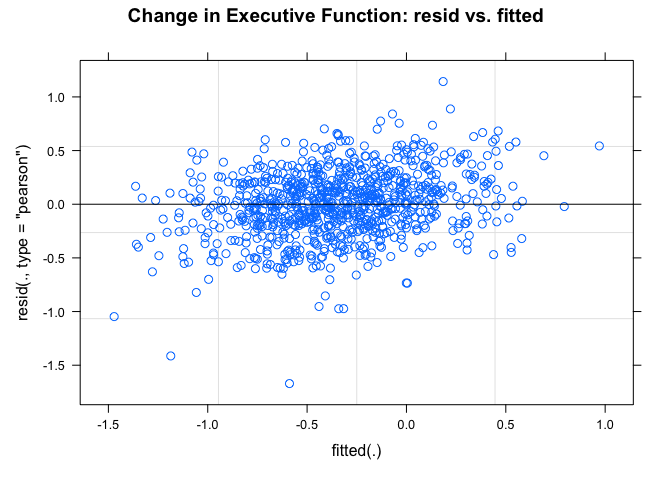

investigations
================
Paula Wu
5/11/2022

**7.7/7.14 Updates** (all updates are located at the bottom of this
document):

1.  Moderator effects of self-administered drugs are investigated and
    reported.

2.  I also explored another method called “multivariate multilevel
    regression”, which takes all three independent variables as the
    outcome variables while fitting other dependent variables as either
    predictors or covariates (details see below).

``` r
m2_df = 
  read_csv("./data/m2_df.csv") %>% 
  select(-1) %>% 
  filter(B3TCOMPZ3 != 8 & B3TEMZ3 != 8 & B3TEFZ3 != 8) %>% 
  filter(B4QCT_SA != 98 & B4QCT_EN != 98 & B4QCT_MD != 8 & B4QCT_PN != 98 & B4QCT_EA != 98 & B4QCT_PA != 98) %>% 
  select(-c(37:47))
```

## SES and Spouse SES Investigation

For now, I’m thinking about impute those missing numbers with their
spouse’s SES, if any. First, investigate: how many people have their
spouse’s SES filled (out of 334)

``` r
m2_df %>% 
  filter(B1PTSEI == 999) %>% 
  select(M2ID, M2FAMNUM, B1PTSEI, B1PTSEIS) %>% 
  mutate(nul = ifelse(B1PTSEIS == 999, 1, 0)) %>% 
  group_by(nul) %>% 
  summarize(n = n())
```

    ## # A tibble: 2 × 2
    ##     nul     n
    ##   <dbl> <int>
    ## 1     0   209
    ## 2     1   125

Out of 334 missing, 125 of them still don’t have the spouse SES while
209 of them did.

### imputation - Jun 2nd (final) version:

Impute spouses’ SES for those who doesn’t have SES; for the rest use LM
(education as predictor) for imputation

``` r
# for those whose spouse has a valid SES
with_sps = 
  m2_df %>% 
  filter(B1PTSEI == 999) %>% 
  select(M2ID, M2FAMNUM, B1PTSEI, B1PTSEIS) %>% 
  filter(B1PTSEIS != 999) %>% 
  pull(M2ID)
m2_df[m2_df$M2ID %in% with_sps, which(colnames(m2_df) == "B1PTSEI")] = m2_df[m2_df$M2ID %in% with_sps, which(colnames(m2_df) == "B1PTSEIS")]

# for those whose spouse doesn't have a valid SES, fit an LM 
m2_df_lm = m2_df %>% 
  select(B1PTSEI, B1PAGE_M2, B1PB1) %>% 
  filter(B1PTSEI != 999 & B1PB1 != 97)
lm_ses = lm(B1PTSEI ~ B1PB1, data = m2_df_lm)


# prediction
m2_pred_id = m2_df %>% 
  filter(B1PTSEI == 999) %>% 
  pull(M2ID)

for (i in m2_pred_id){
  edu = m2_df[m2_df$M2ID == i, which(colnames(m2_df) == "B1PB1")]
  pred_ses = predict(lm_ses, newdata = edu)
  m2_df[m2_df$M2ID == i, which(colnames(m2_df) == "B1PTSEI")] = pred_ses
}
```

``` r
m2_df_copy = m2_df
m2_df_invalid = 
  m2_df_copy %>% 
  mutate(B3TCOMPZ3_ = ifelse(B3TCOMPZ3 == 8, 1, 0),
         B3TEMZ3_ = ifelse(B3TEMZ3 == 8, 1, 0),
         B3TEFZ3_ = ifelse(B3TEFZ3 == 8, 1, 0),
         B4QCT_SA_ = ifelse(B4QCT_SA == 98, 1, 0),
         B4QCT_EN_ = ifelse(B4QCT_EN == 98, 1, 0),
         B4QCT_MD_ = ifelse(B4QCT_MD == 8, 1, 0),
         B4QCT_PN_ = ifelse(B4QCT_PN == 98, 1, 0),
         B4QCT_EA_ = ifelse(B4QCT_EA == 98, 1, 0),
         B4QCT_PA_ = ifelse(B4QCT_PA == 98, 1, 0),
         B1PTSEI_ = ifelse(B1PTSEI == 999, 1, 0),
         B4HMETMW_ = ifelse(B4HMETMW == 99998, 1, 0),
         B1PB1_ = ifelse(B1PB1 == 97, 1, 0),
         B1PF7A_ = ifelse(B1PF7A >= 7, 1, 0),
         B1SA62A_ = ifelse(B1SA62A == 8, 1, 0),
         B1SA62B_ = ifelse(B1SA62B == 8, 1, 0),
         B1SA62C_ = ifelse(B1SA62C == 8, 1, 0),
         B1SA62D_ = ifelse(B1SA62D == 8, 1, 0),
         B1SA62E_ = ifelse(B1SA62E == 8, 1, 0),
         B1SA62F_ = ifelse(B1SA62F == 8, 1, 0),
         B1SA62G_ = ifelse(B1SA62G == 8, 1, 0),
         B1SA62H_ = ifelse(B1SA62H == 8, 1, 0),
         B1SA62I_ = ifelse(B1SA62I == 8, 1, 0),
         B1SA62J_ = ifelse(B1SA62J == 8, 1, 0),
         B1SPWBA2_ = ifelse(B1SPWBA2 == 98, 1, 0),
         B1SPWBE2_ = ifelse(B1SPWBE2 == 98, 1, 0),
         B1SPWBG2_ = ifelse(B1SPWBG2 == 98, 1, 0),
         B1SPWBR2_ = ifelse(B1SPWBR2 == 98, 1, 0),
         B1SPWBU2_ = ifelse(B1SPWBU2 == 98, 1, 0),
         B1SPWBS2_ = ifelse(B1SPWBS2 == 98, 1, 0),
         B1SMASTE_ = ifelse(B1SMASTE == 8, 1, 0),
         B1SCONST_ = ifelse(B1SCONST == 8, 1, 0),
         B1SCTRL_ = ifelse(B1SCTRL == 8, 1, 0),
         B1SESTEE_ = ifelse(B1SESTEE == 98, 1, 0),
         B1SINTER_ = ifelse(B1SINTER == 8, 1, 0),
         BASINTER_ = ifelse(B1SINTER == 98, 1, 0),
         B1SINDEP_ = ifelse(B1SINDEP == 8, 1, 0),
         BASINDEP_ = ifelse(B1SINDEP == 98, 1, 0),
         B1SAGENC_ = ifelse(B1SAGENC == 8, 1, 0),
         B1SAGREE_ = ifelse(B1SAGREE == 8, 1, 0),
         B1SEXTRA_ = ifelse(B1SEXTRA == 8, 1, 0),
         B1SNEURO_ = ifelse(B1SNEURO == 8, 1, 0),
         B1SCONS1_ = ifelse(B1SCONS1 == 8, 1, 0),
         invalid_ind = NA) %>% 
  select(-c(2:60)) %>% 
  select(M2ID, invalid_ind, everything()) %>% 
  rename_at(.vars = vars(ends_with("_")),
            .funs = funs(sub("_$", "", .)))


for (i in 1:1099){
  obs = m2_df_invalid[i,]
  invalid_str = invalid_var(obs)
  m2_df_invalid[i,2] = invalid_str
}
invalid_full = 
  m2_df_invalid %>% 
  select(M2ID, invalid_ind) %>% 
  filter(!invalid_ind == "") %>% 
  mutate(invalid_count = str_count(invalid_ind, pattern = ","))

invalid_full %>% 
  group_by(invalid_count) %>% 
  summarize(n = n()) %>% 
  knitr::kable()

invalid_full %>% 
  ggplot(aes(x = invalid_count))+
  geom_histogram() +
  stat_bin(aes(y=..count.., label=ifelse(..count..== 0,"",..count..)), geom="text", vjust= -0.5)
```

``` r
a = m2_df %>% 
  filter(!(B4QCT_EA == 98 | B4QCT_EN == 98 | B4QCT_SA == 98 | B4QCT_PA == 98 | B4QCT_PN == 98 | B4QCT_MD == 8 )) %>% 
  mutate(ctq_total = B4QCT_EA + B4QCT_EN + B4QCT_SA + B4QCT_PA + B4QCT_PN + B4QCT_MD)

mean_ctq = a %>% 
  pull(ctq_total) %>% 
  mean() %>% 
  signif(6)

median_ctq = a %>% 
  pull(ctq_total) %>% 
  median() %>% 
  signif(6)

a %>% 
  ggplot(aes(x = ctq_total)) +
  geom_density()+
  geom_vline(xintercept=mean_ctq, size=0.5, color="red")+
  geom_text(aes(x=mean_ctq + 5, label=paste0("Mean\n",mean_ctq), y=0.03), color = "red")+
  geom_vline(xintercept=median_ctq, size=0.5, color="blue")+
  geom_text(aes(x=median_ctq - 3, label=paste0("Median\n",median_ctq), y=0.03), color = "blue")+
  theme(legend.position = "none")+
  xlab("CTQ Total Score")+
  ylab("Density")

a %>% 
  mutate(below_49 = ifelse(ctq_total <= 39, 1, 0)) %>% 
  group_by(below_49) %>% 
  summarize(n = n())
#ggsave("ctq_density.jpeg", width = 10, height = 7)
```

## Invalid investigation, after imputation

``` r
m2_df_cc = m2_df %>% 
  mutate(B1PTSEI_ = ifelse(B1PTSEI == 999, 1, 0),
         B4HMETMW_ = ifelse(B4HMETMW == 99998, 1, 0),
         B1PB1_ = ifelse(B1PB1 == 97, 1, 0),
         B1PF7A_ = ifelse(B1PF7A >= 7, 1, 0),
         B1SA62A_ = ifelse(B1SA62A == 8, 1, 0),
         B1SA62B_ = ifelse(B1SA62B == 8, 1, 0),
         B1SA62C_ = ifelse(B1SA62C == 8, 1, 0),
         B1SA62D_ = ifelse(B1SA62D == 8, 1, 0),
         B1SA62E_ = ifelse(B1SA62E == 8, 1, 0),
         B1SA62F_ = ifelse(B1SA62F == 8, 1, 0),
         B1SA62G_ = ifelse(B1SA62G == 8, 1, 0),
         B1SA62H_ = ifelse(B1SA62H == 8, 1, 0),
         B1SA62I_ = ifelse(B1SA62I == 8, 1, 0),
         B1SA62J_ = ifelse(B1SA62J == 8, 1, 0),
         B1SPWBA2_ = ifelse(B1SPWBA2 == 98, 1, 0),
         B1SPWBE2_ = ifelse(B1SPWBE2 == 98, 1, 0),
         B1SPWBG2_ = ifelse(B1SPWBG2 == 98, 1, 0),
         B1SPWBR2_ = ifelse(B1SPWBR2 == 98, 1, 0),
         B1SPWBU2_ = ifelse(B1SPWBU2 == 98, 1, 0),
         B1SPWBS2_ = ifelse(B1SPWBS2 == 98, 1, 0),
         invalid_ind = NA) %>% 
  select(-c(2:49)) %>% 
  select(M2ID, invalid_ind, everything()) %>% 
  rename_at(.vars = vars(ends_with("_")),
            .funs = funs(sub("_$", "", .)))

invalid_var = function(obs){
  invalid_str = ""
  for (i in 3:22){
    cell = as.numeric(obs[i])
    if(cell == 1){
      invalid_str = paste0(invalid_str, colnames(obs)[i], sep = ", ")
    }
  }
  return(invalid_str)
}
for (i in 1:1099){
  obs = m2_df_cc[i,]
  invalid_str = invalid_var(obs)
  m2_df_cc[i,2] = invalid_str
}
invalid_cc = 
  m2_df_cc %>% 
  select(M2ID, invalid_ind) %>% 
  filter(!invalid_ind == "") %>% 
  mutate(invalid_count = str_count(invalid_ind, pattern = ","))

# quick summary: invalid entries of each variable
colSums(m2_df_cc[3:22])
```

    ##  B1PTSEI B4HMETMW    B1PB1   B1PF7A  B1SA62A  B1SA62B  B1SA62C  B1SA62D 
    ##        0        5        3        2        3        3        4        3 
    ##  B1SA62E  B1SA62F  B1SA62G  B1SA62H  B1SA62I  B1SA62J B1SPWBA2 B1SPWBE2 
    ##        4        6        4        3        3        4        3        3 
    ## B1SPWBG2 B1SPWBR2 B1SPWBU2 B1SPWBS2 
    ##        3        3        3        3

``` r
# quick summary: count of people for different numbers of invalid entries. Total: 40 subjects
invalid_cc %>%
  group_by(invalid_count) %>% 
  summarize(n = n()) %>% 
  bind_rows(summarise_all(., ~if(is.numeric(.)) sum(.) else "Total")) %>% 
  mutate(invalid_count = ifelse(row_number() == 6, "Total", invalid_count)) %>% 
  knitr::kable()
```

| invalid_count |   n |
|:--------------|----:|
| 1             |  16 |
| 2             |   1 |
| 6             |   3 |
| 9             |   1 |
| 10            |   2 |
| Total         |  23 |

``` r
# deselect unnecessary variables, deselect invalid entries
invalid_cc_id = invalid_cc %>% 
  pull(M2ID) %>% 
  unique()

m2_df = m2_df %>% 
  select(-c(B3PIDATE_MO, B3PIDATE_YR, B1PTSEIS, B1PA37, B1PA38A, B1SA11Z, B4H33, B4H34, B4H36, B4H38, B4H40)) %>% 
  filter(!(M2ID %in% invalid_cc_id))
```

# M3 dataframe

``` r
m2_id = m2_df %>% pull(M2ID)
length(m2_id)
```

    ## [1] 1076

``` r
m3_df = 
  read_csv("./data/m3_df.csv") %>% 
  select(-1)


# only 911 left after joining, the rest 165 don't have M3 record
# 867 left after filtering out invalid entries
full_df = 
  inner_join(m2_df, m3_df, by = "M2ID") %>% 
  select(-M2FAMNUM.y) %>% 
  rename(M2FAMNUM = M2FAMNUM.x) %>%
  filter(C3TCOMP != 8 & C3TEM != 8 & C1PA6A != 7) %>% 
  mutate(D3TCOMP = C3TCOMP - B3TCOMPZ3,
         D3TEM = C3TEM - B3TEMZ3,
         D3TEF = C3TEF - B3TEFZ3,
         D1PB19 = C1PB19 - B1PB19,
         B1PF7A = as.factor(B1PF7A),
         B1PA39 = as.factor(B1PA39))
```

# Univariate Analysis

### Univariate Analysis of Cognition, CTQ total

``` r
joined_date = read_csv("./data/time_lasped.csv") %>% 
  mutate(yr_lapsed = lapsed/12) %>% 
  select(M2ID, yr_lapsed)  # year lapsed
```

``` r
full_df_no_invalid = full_df %>% 
  mutate(ctq_total = B4QCT_EA + B4QCT_EN + B4QCT_SA + B4QCT_PA + B4QCT_PN + B4QCT_MD,
         B1PRSEX = as.factor(B1PRSEX),
         B4ALCOH = factor(B4ALCOH, levels = c("former_light/abs", "former_moderate", "former_heavy", "current_light", "current_moderate", "current_heavy")),
         D1PB19 = factor(D1PB19, levels = c(0,-1, 1)),
         B1PF7A = ifelse(as.numeric(B1PF7A) != 1, 2, as.numeric(B1PF7A)),
         B1PF7A = as.factor(B1PF7A),
         B1PA39 = recode_factor(B1PA39, `9` = "non_smoker", `2` = "former_smoker", `1` = "current_smoker"),
         D1PA6A = factor(ifelse((C1PA6A - B1PA6A) == -1, 1, 0), levels = c(0,1)),
         B1SA11W = ifelse(B1SA11W == 2, 0, 1),
         B1SA62A = ifelse(B1SA62A == 2, 0, 1),
         B1SA62B = ifelse(B1SA62B == 2, 0, 1),
         B1SA62C = ifelse(B1SA62C == 2, 0, 1),
         B1SA62D = ifelse(B1SA62D == 2, 0, 1),
         B1SA62E = ifelse(B1SA62E == 2, 0, 1),
         B1SA62F = ifelse(B1SA62F == 2, 0, 1),
         B1SA62G = ifelse(B1SA62G == 2, 0, 1),
         B1SA62H = ifelse(B1SA62H == 2, 0, 1),
         B1SA62I = ifelse(B1SA62I == 2, 0, 1),
         B1SA62J = ifelse(B1SA62J == 2, 0, 1),
         thr_total = B4QCT_EA + B4QCT_SA + B4QCT_PA,
         dep_total = B4QCT_EN + B4QCT_PN + B4QCT_MD,
  )
#write.csv(full_df_no_invalid, "./data/full_df.csv")

# scaling age, SES, modifiers (?), exercise
full_df_no_invalid =  full_df_no_invalid %>% 
  mutate(B1SA11W = as.factor(B1SA11W),
         B1SA62A = as.factor(B1SA62A),
         B1SA62B = as.factor(B1SA62B),
         B1SA62C = as.factor(B1SA62C),
         B1SA62D = as.factor(B1SA62D),
         B1SA62E = as.factor(B1SA62E),
         B1SA62F = as.factor(B1SA62F),
         B1SA62G = as.factor(B1SA62G),
         B1SA62H = as.factor(B1SA62H),
         B1SA62I = as.factor(B1SA62I),
         B1SA62J = as.factor(B1SA62J)) %>% 
   mutate_each_(funs(scale(.)), c(6,10,25:30, 37)) %>% 
  select(-D1PA6A) 

full_df_no_invalid = left_join(full_df_no_invalid, joined_date, by = "M2ID")
# sum(is.na(joined_date$yr_lapsed)==TRUE) # no invalid
full_df_no_invalid = full_df_no_invalid %>% 
  mutate(D3TCOMPR = D3TCOMP/yr_lapsed,
         D3TEMR = D3TEM/yr_lapsed,
         D3TEFR = D3TEF/yr_lapsed)
```

``` r
#write.csv(full_df_no_invalid, "./data/full_df_inval.csv")
```

## Normality check and what it meant

visual inspection

``` r
a = full_df_no_invalid %>% 
  ggplot(aes(x = D3TCOMP))+
  geom_density()
b = full_df_no_invalid %>% 
  ggplot(aes(x = D3TEM))+
  geom_density()
c = full_df_no_invalid %>% 
  ggplot(aes(x = D3TEF))+
  geom_density()
a/b/c
```

<!-- -->

statistical tests

``` r
nortest::lillie.test(full_df_no_invalid$B3TEMZ3)
```

    ## 
    ##  Lilliefors (Kolmogorov-Smirnov) normality test
    ## 
    ## data:  full_df_no_invalid$B3TEMZ3
    ## D = 0.070117, p-value = 7.642e-11

``` r
nortest::lillie.test(full_df_no_invalid$C3TEM)
```

    ## 
    ##  Lilliefors (Kolmogorov-Smirnov) normality test
    ## 
    ## data:  full_df_no_invalid$C3TEM
    ## D = 0.075349, p-value = 1.271e-12

For large sample dataset, the normality tests can detect very slight
deviations from normality, making the statistical test results not that
reliable. Also, according to central limit theorem, we can actually
ignore the fact that the dataset is not normally distributed.

Moreover, the B3TEMZ3 and C3TEM in the original/raw dataset (read
directly from MIDUS website, see “updates.rmd” for more information) has
failed the normality test, indicating that the original dataset doesn’t
follow normal distribution (this would be a question to MIDUS then). I
haven’t got any insights on how to calculate the unstandardized scores.

# Modeling

I completely filter out all the observations with at least one invalid
feature, in total there are 23 of them, which is an arbitrarily small
number.

first, fit the model with a list of covariates

-   ctq total score
-   age
-   sex
-   race
-   education (or SES)
-   (imputed) SES
-   changes in marital status
-   changes in stroke (deleted 9.28)
-   smoking, drug use, alcohol consumption
-   exercise and chronic sleep problem

## Multilevel Models

*What is the multilevel?*

First, the reason we would like to use multilevel modeling is because we
have measured the same participants multiple times, and there are
correlation within subjects that we cannot ignore.

The **assumption** we were making when constructing the model is:
participants from different families would have different intercepts of
cognitive functioning at the baseline (i.e. having different intercept).
We may expect each family has some differences that affects the
intercept but not the slope (all families will have the same rate of
change throughout time), and that members of the same family would share
the same baseline cognitive functioning.

*What would the model be like?* In Dr. Lachman’s paper, we have seen
that they used multilevel models to evaluate different predictors of
both level of and change in cognitive functioning. They have defined a
model with level 1 slope (non time-varying) and level 2 random intercept
(different baseline for each family). However, one thing I have
understood wrong is the equation: It’s not necessarily true that we put
two predictor on the LHS of the equation as independent variables and
called it multilevel modeling. We are, indeed, predicting both level and
intercept, but the model itself will yield fitted results of intercept
and slope. We are still predicting one independent variable: change in
composite score, episodic memory, or executive functioning. The slopes
and intercepts are by-products of the modeling. More specifically, the
models are fitted using maximum-likelihood.

*Thinking about the change per month/years*

Last time, we’ve seen that there’s a huge variance associated with the
elapsed time between M2 and M3 for the population. Thus, maybe we would
like to move from the “change in magnitude” to “rate of change per year
or per month”. In this case, I don’t think we still need to index the
baseline. Or, I could include the time between M2 and M3 as a covariate.
(10.10 updates: go for the second option)

*What are the variables included in the model?*

Dependent variable:

-   D3TCOMP: change in composite scores
-   D3TEM: change in episodic memory
-   D3TEF: change in executive functioning

Independent variable:

-   B3TCOMPZ3, B3TEFZ3, B3TEMZ3: three baseline variables (of cognitive
    functioning) measured at M2
-   M2FAMNUM: family number
-   yr_lapsed: years between M2 and M3 for each participants
-   B1PRSEX: sex, male = 1 (reference), female = 2
-   B1PAGE_M2: age measured at M2
-   B1PF7A: racial origin, white = 1 (reference), non-white = 2
-   B1PTSEI: SES
-   B1PA39: cigarette smoking, reference: non_smoker
-   B4ALCOH: alcohol drinking, reference: former_light/abs
-   D1PB19: marital status change. 0 = no change (reference), -1 =
    divorce or equivalent, 1 = married
-   B4HMETMW: exercise minutes per week
-   B1SA11W: chronic sleep problem in the past 12 months

### random intercept model - CTQ Total Scores (the very basic)

Change in Composite Scores

``` r
lmm_model1_cs <- lmer(D3TCOMP ~ B3TCOMPZ3 + ctq_total + (1|M2FAMNUM) + yr_lapsed, REML = FALSE, data = full_df_no_invalid)  # random intercept vary across families about 0.053
summary(lmm_model1_cs)
```

    ## Linear mixed model fit by maximum likelihood . t-tests use Satterthwaite's
    ##   method [lmerModLmerTest]
    ## Formula: D3TCOMP ~ B3TCOMPZ3 + ctq_total + (1 | M2FAMNUM) + yr_lapsed
    ##    Data: full_df_no_invalid
    ## 
    ##      AIC      BIC   logLik deviance df.resid 
    ##    950.9    979.5   -469.5    938.9      861 
    ## 
    ## Scaled residuals: 
    ##     Min      1Q  Median      3Q     Max 
    ## -2.4589 -0.5491 -0.0154  0.5117  3.5406 
    ## 
    ## Random effects:
    ##  Groups   Name        Variance Std.Dev.
    ##  M2FAMNUM (Intercept) 0.05342  0.2311  
    ##  Residual             0.12154  0.3486  
    ## Number of obs: 867, groups:  M2FAMNUM, 766
    ## 
    ## Fixed effects:
    ##               Estimate Std. Error         df t value Pr(>|t|)    
    ## (Intercept)   0.406129   0.160510 865.709382   2.530  0.01157 *  
    ## B3TCOMPZ3    -0.437992   0.015923 853.527788 -27.507  < 2e-16 ***
    ## ctq_total    -0.001217   0.001048 833.763861  -1.162  0.24568    
    ## yr_lapsed    -0.048800   0.016597 866.904260  -2.940  0.00337 ** 
    ## ---
    ## Signif. codes:  0 '***' 0.001 '**' 0.01 '*' 0.05 '.' 0.1 ' ' 1
    ## 
    ## Correlation of Fixed Effects:
    ##           (Intr) B3TCOM ctq_tt
    ## B3TCOMPZ3 -0.157              
    ## ctq_total -0.172  0.062       
    ## yr_lapsed -0.963  0.122 -0.081

Change in Episodic Memory

``` r
lmm_model1_em <- lmer(D3TEM ~ B3TEMZ3 + ctq_total + yr_lapsed + (1|M2FAMNUM), REML = FALSE, data = full_df_no_invalid)
summary(lmm_model1_em)
```

    ## Linear mixed model fit by maximum likelihood . t-tests use Satterthwaite's
    ##   method [lmerModLmerTest]
    ## Formula: D3TEM ~ B3TEMZ3 + ctq_total + yr_lapsed + (1 | M2FAMNUM)
    ##    Data: full_df_no_invalid
    ## 
    ##      AIC      BIC   logLik deviance df.resid 
    ##   2146.2   2174.8  -1067.1   2134.2      861 
    ## 
    ## Scaled residuals: 
    ##      Min       1Q   Median       3Q      Max 
    ## -2.24336 -0.59205 -0.07577  0.50272  2.94263 
    ## 
    ## Random effects:
    ##  Groups   Name        Variance Std.Dev.
    ##  M2FAMNUM (Intercept) 0.1968   0.4436  
    ##  Residual             0.4965   0.7047  
    ## Number of obs: 867, groups:  M2FAMNUM, 766
    ## 
    ## Fixed effects:
    ##               Estimate Std. Error         df t value Pr(>|t|)    
    ## (Intercept)   0.225691   0.316465 864.584477   0.713    0.476    
    ## B3TEMZ3      -0.439296   0.031742 863.604734 -13.840   <2e-16 ***
    ## ctq_total    -0.002712   0.002081 830.521259  -1.303    0.193    
    ## yr_lapsed    -0.018384   0.032862 866.667286  -0.559    0.576    
    ## ---
    ## Signif. codes:  0 '***' 0.001 '**' 0.01 '*' 0.05 '.' 0.1 ' ' 1
    ## 
    ## Correlation of Fixed Effects:
    ##           (Intr) B3TEMZ ctq_tt
    ## B3TEMZ3   -0.067              
    ## ctq_total -0.164  0.001       
    ## yr_lapsed -0.963  0.053 -0.089

Change in Executive Functioning

``` r
lmm_model1_ef <- lmer(D3TEF ~ B3TEFZ3 + ctq_total + yr_lapsed + (1|M2FAMNUM), REML = FALSE, data = full_df_no_invalid)
summary(lmm_model1_ef)
```

    ## Linear mixed model fit by maximum likelihood . t-tests use Satterthwaite's
    ##   method [lmerModLmerTest]
    ## Formula: D3TEF ~ B3TEFZ3 + ctq_total + yr_lapsed + (1 | M2FAMNUM)
    ##    Data: full_df_no_invalid
    ## 
    ##      AIC      BIC   logLik deviance df.resid 
    ##   1045.0   1073.6   -516.5   1033.0      861 
    ## 
    ## Scaled residuals: 
    ##     Min      1Q  Median      3Q     Max 
    ## -4.3619 -0.5033  0.0451  0.5164  2.9217 
    ## 
    ## Random effects:
    ##  Groups   Name        Variance Std.Dev.
    ##  M2FAMNUM (Intercept) 0.0629   0.2508  
    ##  Residual             0.1324   0.3638  
    ## Number of obs: 867, groups:  M2FAMNUM, 766
    ## 
    ## Fixed effects:
    ##               Estimate Std. Error         df t value Pr(>|t|)    
    ## (Intercept)  4.823e-01  1.693e-01  8.660e+02   2.848   0.0045 ** 
    ## B3TEFZ3     -3.846e-01  1.756e-02  8.475e+02 -21.906  < 2e-16 ***
    ## ctq_total    9.527e-04  1.108e-03  8.360e+02   0.860   0.3901    
    ## yr_lapsed   -8.065e-02  1.749e-02  8.669e+02  -4.610 4.62e-06 ***
    ## ---
    ## Signif. codes:  0 '***' 0.001 '**' 0.01 '*' 0.05 '.' 0.1 ' ' 1
    ## 
    ## Correlation of Fixed Effects:
    ##           (Intr) B3TEFZ ctq_tt
    ## B3TEFZ3   -0.150              
    ## ctq_total -0.174  0.073       
    ## yr_lapsed -0.963  0.108 -0.081

### Add covariates

Change in Composite Scores

``` r
lmm_model2_cs <- lmer(D3TCOMP ~ B3TCOMPZ3 + ctq_total + B1PRSEX + B1PAGE_M2 + B1PF7A + B1PTSEI + B1PA39 + B4ALCOH + D1PB19 + B4HMETMW + B1SA11W + yr_lapsed + (1|M2FAMNUM), REML = FALSE, data = full_df_no_invalid)
anova(lmm_model1_cs, lmm_model2_cs)
```

    ## Data: full_df_no_invalid
    ## Models:
    ## lmm_model1_cs: D3TCOMP ~ B3TCOMPZ3 + ctq_total + (1 | M2FAMNUM) + yr_lapsed
    ## lmm_model2_cs: D3TCOMP ~ B3TCOMPZ3 + ctq_total + B1PRSEX + B1PAGE_M2 + B1PF7A + B1PTSEI + B1PA39 + B4ALCOH + D1PB19 + B4HMETMW + B1SA11W + yr_lapsed + (1 | M2FAMNUM)
    ##               npar    AIC    BIC  logLik deviance  Chisq Df Pr(>Chisq)    
    ## lmm_model1_cs    6 950.93 979.52 -469.47   938.93                         
    ## lmm_model2_cs   21 871.59 971.66 -414.80   829.59 109.34 15  < 2.2e-16 ***
    ## ---
    ## Signif. codes:  0 '***' 0.001 '**' 0.01 '*' 0.05 '.' 0.1 ' ' 1

``` r
summary(lmm_model2_cs)
```

    ## Linear mixed model fit by maximum likelihood . t-tests use Satterthwaite's
    ##   method [lmerModLmerTest]
    ## Formula: D3TCOMP ~ B3TCOMPZ3 + ctq_total + B1PRSEX + B1PAGE_M2 + B1PF7A +  
    ##     B1PTSEI + B1PA39 + B4ALCOH + D1PB19 + B4HMETMW + B1SA11W +  
    ##     yr_lapsed + (1 | M2FAMNUM)
    ##    Data: full_df_no_invalid
    ## 
    ##      AIC      BIC   logLik deviance df.resid 
    ##    871.6    971.7   -414.8    829.6      846 
    ## 
    ## Scaled residuals: 
    ##     Min      1Q  Median      3Q     Max 
    ## -2.6218 -0.5719  0.0007  0.5528  3.7287 
    ## 
    ## Random effects:
    ##  Groups   Name        Variance Std.Dev.
    ##  M2FAMNUM (Intercept) 0.04669  0.2161  
    ##  Residual             0.10751  0.3279  
    ## Number of obs: 867, groups:  M2FAMNUM, 766
    ## 
    ## Fixed effects:
    ##                           Estimate Std. Error         df t value Pr(>|t|)    
    ## (Intercept)               0.421411   0.167707 866.950341   2.513  0.01216 *  
    ## B3TCOMPZ3                -0.510887   0.017210 862.844380 -29.686  < 2e-16 ***
    ## ctq_total                -0.001959   0.001040 835.946963  -1.884  0.05990 .  
    ## B1PRSEX2                  0.018925   0.028824 841.337669   0.657  0.51164    
    ## B1PAGE_M2                -0.141431   0.015232 771.836500  -9.285  < 2e-16 ***
    ## B1PF7A2                  -0.070094   0.043488 853.407666  -1.612  0.10738    
    ## B1PTSEI                   0.043687   0.014335 850.764323   3.048  0.00238 ** 
    ## B1PA39former_smoker       0.008674   0.032771 854.839237   0.265  0.79132    
    ## B1PA39current_smoker     -0.020742   0.049276 865.822332  -0.421  0.67390    
    ## B4ALCOHformer_moderate    0.095599   0.053495 866.933676   1.787  0.07428 .  
    ## B4ALCOHformer_heavy       0.035668   0.059683 866.759075   0.598  0.55024    
    ## B4ALCOHcurrent_light      0.046059   0.068942 860.610110   0.668  0.50426    
    ## B4ALCOHcurrent_moderate   0.114338   0.044677 866.993040   2.559  0.01066 *  
    ## B4ALCOHcurrent_heavy      0.020767   0.046444 864.646779   0.447  0.65489    
    ## D1PB19-1                 -0.017130   0.045149 861.627771  -0.379  0.70447    
    ## D1PB191                   0.007266   0.066674 796.659339   0.109  0.91325    
    ## B4HMETMW                  0.020950   0.013503 836.995117   1.552  0.12115    
    ## B1SA11W1                 -0.094809   0.044357 866.705100  -2.137  0.03284 *  
    ## yr_lapsed                -0.050605   0.017256 866.297173  -2.933  0.00345 ** 
    ## ---
    ## Signif. codes:  0 '***' 0.001 '**' 0.01 '*' 0.05 '.' 0.1 ' ' 1

Change in Episodic Memory

``` r
lmm_model2_em <- lmer(D3TEM ~ B3TEMZ3 + ctq_total + B1PRSEX + B1PAGE_M2 + B1PF7A + B1PTSEI + B1PA39 + B4ALCOH + D1PB19 + B4HMETMW + B1SA11W + yr_lapsed + (1|M2FAMNUM), REML = FALSE, data = full_df_no_invalid)
anova(lmm_model1_em, lmm_model2_em)
```

    ## Data: full_df_no_invalid
    ## Models:
    ## lmm_model1_em: D3TEM ~ B3TEMZ3 + ctq_total + yr_lapsed + (1 | M2FAMNUM)
    ## lmm_model2_em: D3TEM ~ B3TEMZ3 + ctq_total + B1PRSEX + B1PAGE_M2 + B1PF7A + B1PTSEI + B1PA39 + B4ALCOH + D1PB19 + B4HMETMW + B1SA11W + yr_lapsed + (1 | M2FAMNUM)
    ##               npar    AIC    BIC  logLik deviance  Chisq Df Pr(>Chisq)    
    ## lmm_model1_em    6 2146.2 2174.8 -1067.1   2134.2                         
    ## lmm_model2_em   21 2064.5 2164.5 -1011.2   2022.5 111.73 15  < 2.2e-16 ***
    ## ---
    ## Signif. codes:  0 '***' 0.001 '**' 0.01 '*' 0.05 '.' 0.1 ' ' 1

``` r
summary(lmm_model2_em)
```

    ## Linear mixed model fit by maximum likelihood . t-tests use Satterthwaite's
    ##   method [lmerModLmerTest]
    ## Formula: D3TEM ~ B3TEMZ3 + ctq_total + B1PRSEX + B1PAGE_M2 + B1PF7A +  
    ##     B1PTSEI + B1PA39 + B4ALCOH + D1PB19 + B4HMETMW + B1SA11W +  
    ##     yr_lapsed + (1 | M2FAMNUM)
    ##    Data: full_df_no_invalid
    ## 
    ##      AIC      BIC   logLik deviance df.resid 
    ##   2064.5   2164.5  -1011.2   2022.5      846 
    ## 
    ## Scaled residuals: 
    ##      Min       1Q   Median       3Q      Max 
    ## -2.59358 -0.58463 -0.06758  0.49442  2.73694 
    ## 
    ## Random effects:
    ##  Groups   Name        Variance Std.Dev.
    ##  M2FAMNUM (Intercept) 0.1773   0.4211  
    ##  Residual             0.4325   0.6576  
    ## Number of obs: 867, groups:  M2FAMNUM, 766
    ## 
    ## Fixed effects:
    ##                           Estimate Std. Error         df t value Pr(>|t|)    
    ## (Intercept)               0.304434   0.333249 866.912773   0.914  0.36122    
    ## B3TEMZ3                  -0.551837   0.032636 849.992882 -16.909  < 2e-16 ***
    ## ctq_total                -0.005618   0.002064 838.954544  -2.722  0.00663 ** 
    ## B1PRSEX2                  0.419433   0.060012 850.491432   6.989 5.59e-12 ***
    ## B1PAGE_M2                -0.208977   0.029007 771.104095  -7.204 1.39e-12 ***
    ## B1PF7A2                   0.005453   0.083792 855.710924   0.065  0.94812    
    ## B1PTSEI                   0.042185   0.027949 852.370428   1.509  0.13158    
    ## B1PA39former_smoker       0.056577   0.065274 856.849506   0.867  0.38632    
    ## B1PA39current_smoker     -0.131542   0.098024 866.368926  -1.342  0.17997    
    ## B4ALCOHformer_moderate    0.124529   0.106438 866.771236   1.170  0.24234    
    ## B4ALCOHformer_heavy       0.057098   0.118721 866.996112   0.481  0.63068    
    ## B4ALCOHcurrent_light      0.199109   0.137254 862.902079   1.451  0.14724    
    ## B4ALCOHcurrent_moderate   0.182314   0.088863 866.728064   2.052  0.04051 *  
    ## B4ALCOHcurrent_heavy     -0.015430   0.092378 864.002604  -0.167  0.86738    
    ## D1PB19-1                 -0.106769   0.089790 862.710701  -1.189  0.23473    
    ## D1PB191                  -0.001815   0.132757 808.835156  -0.014  0.98910    
    ## B4HMETMW                  0.053923   0.026875 842.614559   2.006  0.04513 *  
    ## B1SA11W1                 -0.005398   0.088242 866.896896  -0.061  0.95123    
    ## yr_lapsed                -0.047508   0.034338 866.548093  -1.384  0.16685    
    ## ---
    ## Signif. codes:  0 '***' 0.001 '**' 0.01 '*' 0.05 '.' 0.1 ' ' 1

Change in Executive Functioning

``` r
lmm_model2_ef <- lmer(D3TEF ~ B3TEFZ3 + ctq_total + B1PRSEX + B1PAGE_M2 + B1PF7A + B1PTSEI + B1PA39 + B4ALCOH + D1PB19 + B4HMETMW + B1SA11W + yr_lapsed + (1|M2FAMNUM), REML = FALSE, data = full_df_no_invalid)
anova(lmm_model1_ef, lmm_model2_ef)
```

    ## Data: full_df_no_invalid
    ## Models:
    ## lmm_model1_ef: D3TEF ~ B3TEFZ3 + ctq_total + yr_lapsed + (1 | M2FAMNUM)
    ## lmm_model2_ef: D3TEF ~ B3TEFZ3 + ctq_total + B1PRSEX + B1PAGE_M2 + B1PF7A + B1PTSEI + B1PA39 + B4ALCOH + D1PB19 + B4HMETMW + B1SA11W + yr_lapsed + (1 | M2FAMNUM)
    ##               npar     AIC    BIC  logLik deviance  Chisq Df Pr(>Chisq)    
    ## lmm_model1_ef    6 1044.98 1073.6 -516.49  1032.98                         
    ## lmm_model2_ef   21  980.72 1080.8 -469.36   938.72 94.256 15  1.584e-13 ***
    ## ---
    ## Signif. codes:  0 '***' 0.001 '**' 0.01 '*' 0.05 '.' 0.1 ' ' 1

``` r
summary(lmm_model2_ef)
```

    ## Linear mixed model fit by maximum likelihood . t-tests use Satterthwaite's
    ##   method [lmerModLmerTest]
    ## Formula: D3TEF ~ B3TEFZ3 + ctq_total + B1PRSEX + B1PAGE_M2 + B1PF7A +  
    ##     B1PTSEI + B1PA39 + B4ALCOH + D1PB19 + B4HMETMW + B1SA11W +  
    ##     yr_lapsed + (1 | M2FAMNUM)
    ##    Data: full_df_no_invalid
    ## 
    ##      AIC      BIC   logLik deviance df.resid 
    ##    980.7   1080.8   -469.4    938.7      846 
    ## 
    ## Scaled residuals: 
    ##     Min      1Q  Median      3Q     Max 
    ## -4.6674 -0.5141  0.0333  0.5596  3.1926 
    ## 
    ## Random effects:
    ##  Groups   Name        Variance Std.Dev.
    ##  M2FAMNUM (Intercept) 0.04621  0.215   
    ##  Residual             0.12819  0.358   
    ## Number of obs: 867, groups:  M2FAMNUM, 766
    ## 
    ## Fixed effects:
    ##                           Estimate Std. Error         df t value Pr(>|t|)    
    ## (Intercept)              6.094e-01  1.785e-01  8.668e+02   3.414 0.000669 ***
    ## B3TEFZ3                 -4.560e-01  1.916e-02  8.530e+02 -23.801  < 2e-16 ***
    ## ctq_total                3.822e-04  1.105e-03  8.330e+02   0.346 0.729500    
    ## B1PRSEX2                -5.734e-02  3.057e-02  8.405e+02  -1.876 0.061056 .  
    ## B1PAGE_M2               -1.365e-01  1.619e-02  7.742e+02  -8.427  < 2e-16 ***
    ## B1PF7A2                 -3.607e-02  4.638e-02  8.517e+02  -0.778 0.436959    
    ## B1PTSEI                  4.136e-02  1.525e-02  8.568e+02   2.712 0.006821 ** 
    ## B1PA39former_smoker     -1.501e-02  3.493e-02  8.607e+02  -0.430 0.667521    
    ## B1PA39current_smoker    -3.637e-02  5.250e-02  8.669e+02  -0.693 0.488667    
    ## B4ALCOHformer_moderate   6.636e-02  5.696e-02  8.663e+02   1.165 0.244309    
    ## B4ALCOHformer_heavy      3.885e-02  6.361e-02  8.670e+02   0.611 0.541536    
    ## B4ALCOHcurrent_light    -4.798e-02  7.347e-02  8.645e+02  -0.653 0.513869    
    ## B4ALCOHcurrent_moderate  5.594e-02  4.760e-02  8.664e+02   1.175 0.240213    
    ## B4ALCOHcurrent_heavy     2.513e-02  4.945e-02  8.625e+02   0.508 0.611379    
    ## D1PB19-1                 6.514e-02  4.809e-02  8.636e+02   1.354 0.175947    
    ## D1PB191                  6.469e-02  7.120e-02  8.138e+02   0.909 0.363819    
    ## B4HMETMW                 1.752e-02  1.440e-02  8.442e+02   1.217 0.224116    
    ## B1SA11W1                -8.668e-02  4.725e-02  8.670e+02  -1.835 0.066904 .  
    ## yr_lapsed               -8.756e-02  1.838e-02  8.666e+02  -4.764 2.23e-06 ***
    ## ---
    ## Signif. codes:  0 '***' 0.001 '**' 0.01 '*' 0.05 '.' 0.1 ' ' 1

**Interpretation:**

Take the last table for example (dependent variable: change in EF):

|           |   Estimate | Std. Error |        df | t value |    Pr(>\|*t*\|) |
|----------:|-----------:|-----------:|----------:|--------:|----------------:|
| B1PAGE_M2 | -1.365e-01 |  1.619e-02 | 7.742e+02 |  -8.427 | \< 2e-16 \*\*\* |
|   B1PTSEI |  4.136e-02 |  1.525e-02 | 8.568e+02 |   2.712 |   0.006821 \*\* |

My interpretation is: age significantly predicts the change in executive
functioning, i.e. on average (and control all other covariates), 1 year
increase of age will result in 0.137 more decline in Executive
Functioning scores. Similarly, SES significantly predicts the change in
executive functioning, i.e. on average, 1 unit change in SES will result
in 0.0414 change in the positive direction in the Executive Functioning
scores.

For those insignificant results, the interpretation will thus be: the
<independent variable> did not significantly predict the
<dependent variable>. For example, the ctq_total did not significantly
predict the change in executive functioning.

**dependent variable is change in EM**:

                        \|Estimate\| Std. Error\| df\| t value\|
Pr(>\|*t*\|)\|

\|ctq_total \| -0.005618 \| 0.002064\| 838.954544 \| -2.722 \| 0.00663
\*\* \|

For example, subject A has ctq_total of 20 whereas subject B has
ctq_total of 21. In this case,
*Δ*<sub>*E**M*<sub>*B*</sub></sub> = *Δ*<sub>*E**M*<sub>*A*</sub></sub> − 0.005618.
Both *Δ*<sub>*E**M*<sub>*A*</sub></sub> and
*Δ*<sub>*E**M*<sub>*B*</sub></sub> are calculated as
*M*<sub>3</sub> − *M*<sub>2</sub>, i.e. we can rewrite the previous
equation as
*E**M*<sub>*B*, *M*3</sub> − *E**M*<sub>*B*, *M*2</sub> = *E**M*<sub>*A*, *M*3</sub> − *E**M*<sub>*A*, *M*2</sub> − 0.005618.
Followed from the equations, subject B thus has a more drastic decrease,
comparing to themselves, in Episodic memory from M2 to M3 than subject
A. To generalize what we just said, on average, 1 unit increase in the
ctq_total score (more childhood trauma) will result in 0.005618 more
decline in Episodic Memory scores.

### Threat and deprivation

**threat**

Change in Composite Scores & threat

``` r
lmm_model2_cs_thr <- lmer(D3TCOMP ~ B3TCOMPZ3 + thr_total + B1PRSEX + B1PAGE_M2 + B1PF7A + B1PTSEI + B1PA39 + B4ALCOH + D1PB19 + B4HMETMW + B1SA11W + yr_lapsed + (1|M2FAMNUM), REML = FALSE, data = full_df_no_invalid)
```

``` r
summary(lmm_model2_cs_thr)
```

    ## Linear mixed model fit by maximum likelihood . t-tests use Satterthwaite's
    ##   method [lmerModLmerTest]
    ## Formula: D3TCOMP ~ B3TCOMPZ3 + thr_total + B1PRSEX + B1PAGE_M2 + B1PF7A +  
    ##     B1PTSEI + B1PA39 + B4ALCOH + D1PB19 + B4HMETMW + B1SA11W +  
    ##     yr_lapsed + (1 | M2FAMNUM)
    ##    Data: full_df_no_invalid
    ## 
    ##      AIC      BIC   logLik deviance df.resid 
    ##    872.7    972.8   -415.4    830.7      846 
    ## 
    ## Scaled residuals: 
    ##     Min      1Q  Median      3Q     Max 
    ## -2.6233 -0.5633  0.0069  0.5563  3.7358 
    ## 
    ## Random effects:
    ##  Groups   Name        Variance Std.Dev.
    ##  M2FAMNUM (Intercept) 0.04662  0.2159  
    ##  Residual             0.10776  0.3283  
    ## Number of obs: 867, groups:  M2FAMNUM, 766
    ## 
    ## Fixed effects:
    ##                           Estimate Std. Error         df t value Pr(>|t|)    
    ## (Intercept)               0.404486   0.167052 866.980030   2.421  0.01567 *  
    ## B3TCOMPZ3                -0.510455   0.017218 862.702736 -29.647  < 2e-16 ***
    ## thr_total                -0.002532   0.001623 833.178095  -1.560  0.11912    
    ## B1PRSEX2                  0.018816   0.028920 839.932695   0.651  0.51546    
    ## B1PAGE_M2                -0.141374   0.015284 772.376302  -9.250  < 2e-16 ***
    ## B1PF7A2                  -0.071266   0.043501 853.394443  -1.638  0.10174    
    ## B1PTSEI                   0.044045   0.014340 851.118223   3.071  0.00220 ** 
    ## B1PA39former_smoker       0.008691   0.032806 854.649694   0.265  0.79114    
    ## B1PA39current_smoker     -0.024180   0.049201 865.756913  -0.491  0.62324    
    ## B4ALCOHformer_moderate    0.094823   0.053553 866.881296   1.771  0.07697 .  
    ## B4ALCOHformer_heavy       0.033474   0.059687 866.800884   0.561  0.57506    
    ## B4ALCOHcurrent_light      0.043528   0.068976 860.592588   0.631  0.52818    
    ## B4ALCOHcurrent_moderate   0.112406   0.044670 866.979247   2.516  0.01204 *  
    ## B4ALCOHcurrent_heavy      0.019321   0.046456 864.463343   0.416  0.67759    
    ## D1PB19-1                 -0.016770   0.045178 861.753215  -0.371  0.71059    
    ## D1PB191                   0.007896   0.066759 797.867724   0.118  0.90587    
    ## B4HMETMW                  0.020980   0.013512 837.053029   1.553  0.12086    
    ## B1SA11W1                 -0.096869   0.044456 866.840926  -2.179  0.02960 *  
    ## yr_lapsed                -0.050773   0.017267 866.298500  -2.941  0.00336 ** 
    ## ---
    ## Signif. codes:  0 '***' 0.001 '**' 0.01 '*' 0.05 '.' 0.1 ' ' 1

Change in Episodic Memory

``` r
lmm_model2_em_thr <- lmer(D3TEM ~ B3TEMZ3 + thr_total + B1PRSEX + B1PAGE_M2 + B1PF7A + B1PTSEI + B1PA39 + B4ALCOH + D1PB19 + B4HMETMW + B1SA11W + yr_lapsed + (1|M2FAMNUM), REML = FALSE, data = full_df_no_invalid)
```

``` r
summary(lmm_model2_em_thr)
```

    ## Linear mixed model fit by maximum likelihood . t-tests use Satterthwaite's
    ##   method [lmerModLmerTest]
    ## Formula: D3TEM ~ B3TEMZ3 + thr_total + B1PRSEX + B1PAGE_M2 + B1PF7A +  
    ##     B1PTSEI + B1PA39 + B4ALCOH + D1PB19 + B4HMETMW + B1SA11W +  
    ##     yr_lapsed + (1 | M2FAMNUM)
    ##    Data: full_df_no_invalid
    ## 
    ##      AIC      BIC   logLik deviance df.resid 
    ##   2066.2   2166.2  -1012.1   2024.2      846 
    ## 
    ## Scaled residuals: 
    ##      Min       1Q   Median       3Q      Max 
    ## -2.56475 -0.58225 -0.06345  0.50102  2.74169 
    ## 
    ## Random effects:
    ##  Groups   Name        Variance Std.Dev.
    ##  M2FAMNUM (Intercept) 0.1798   0.4240  
    ##  Residual             0.4314   0.6568  
    ## Number of obs: 867, groups:  M2FAMNUM, 766
    ## 
    ## Fixed effects:
    ##                           Estimate Std. Error         df t value Pr(>|t|)    
    ## (Intercept)               0.262337   0.332099 866.958721   0.790   0.4298    
    ## B3TEMZ3                  -0.552038   0.032669 849.796766 -16.898  < 2e-16 ***
    ## thr_total                -0.007686   0.003225 836.205924  -2.383   0.0174 *  
    ## B1PRSEX2                  0.420349   0.060245 849.035072   6.977 6.06e-12 ***
    ## B1PAGE_M2                -0.209627   0.029131 770.681304  -7.196 1.47e-12 ***
    ## B1PF7A2                   0.001498   0.083839 855.656929   0.018   0.9857    
    ## B1PTSEI                   0.043384   0.027961 851.816433   1.552   0.1211    
    ## B1PA39former_smoker       0.056923   0.065357 855.950398   0.871   0.3840    
    ## B1PA39current_smoker     -0.140244   0.097903 866.191083  -1.432   0.1524    
    ## B4ALCOHformer_moderate    0.123614   0.106590 866.755640   1.160   0.2465    
    ## B4ALCOHformer_heavy       0.052245   0.118772 866.992620   0.440   0.6601    
    ## B4ALCOHcurrent_light      0.192083   0.137360 862.377159   1.398   0.1624    
    ## B4ALCOHcurrent_moderate   0.177825   0.088885 866.745416   2.001   0.0457 *  
    ## B4ALCOHcurrent_heavy     -0.019083   0.092441 864.006471  -0.206   0.8365    
    ## D1PB19-1                 -0.106298   0.089872 862.599477  -1.183   0.2372    
    ## D1PB191                   0.001169   0.132930 807.635797   0.009   0.9930    
    ## B4HMETMW                  0.054044   0.026897 841.675991   2.009   0.0448 *  
    ## B1SA11W1                 -0.009162   0.088466 866.941523  -0.104   0.9175    
    ## yr_lapsed                -0.047880   0.034370 866.507250  -1.393   0.1640    
    ## ---
    ## Signif. codes:  0 '***' 0.001 '**' 0.01 '*' 0.05 '.' 0.1 ' ' 1

Change in Executive Functioning

``` r
lmm_model2_ef_thr <- lmer(D3TEF ~ B3TEFZ3 + thr_total + B1PRSEX + B1PAGE_M2 + B1PF7A + B1PTSEI + B1PA39 + B4ALCOH + D1PB19 + B4HMETMW + B1SA11W + yr_lapsed + (1|M2FAMNUM), REML = FALSE, data = full_df_no_invalid)
```

``` r
summary(lmm_model2_ef_thr)
```

    ## Linear mixed model fit by maximum likelihood . t-tests use Satterthwaite's
    ##   method [lmerModLmerTest]
    ## Formula: D3TEF ~ B3TEFZ3 + thr_total + B1PRSEX + B1PAGE_M2 + B1PF7A +  
    ##     B1PTSEI + B1PA39 + B4ALCOH + D1PB19 + B4HMETMW + B1SA11W +  
    ##     yr_lapsed + (1 | M2FAMNUM)
    ##    Data: full_df_no_invalid
    ## 
    ##      AIC      BIC   logLik deviance df.resid 
    ##    980.7   1080.7   -469.3    938.7      846 
    ## 
    ## Scaled residuals: 
    ##     Min      1Q  Median      3Q     Max 
    ## -4.6681 -0.5127  0.0314  0.5595  3.1957 
    ## 
    ## Random effects:
    ##  Groups   Name        Variance Std.Dev.
    ##  M2FAMNUM (Intercept) 0.04622  0.215   
    ##  Residual             0.12816  0.358   
    ## Number of obs: 867, groups:  M2FAMNUM, 766
    ## 
    ## Fixed effects:
    ##                           Estimate Std. Error         df t value Pr(>|t|)    
    ## (Intercept)              6.088e-01  1.777e-01  8.669e+02   3.426  0.00064 ***
    ## B3TEFZ3                 -4.560e-01  1.915e-02  8.530e+02 -23.810  < 2e-16 ***
    ## thr_total                7.259e-04  1.723e-03  8.313e+02   0.421  0.67370    
    ## B1PRSEX2                -5.787e-02  3.065e-02  8.395e+02  -1.888  0.05936 .  
    ## B1PAGE_M2               -1.362e-01  1.624e-02  7.754e+02  -8.388 2.33e-16 ***
    ## B1PF7A2                 -3.603e-02  4.637e-02  8.517e+02  -0.777  0.43736    
    ## B1PTSEI                  4.137e-02  1.525e-02  8.569e+02   2.713  0.00680 ** 
    ## B1PA39former_smoker     -1.525e-02  3.494e-02  8.604e+02  -0.437  0.66258    
    ## B1PA39current_smoker    -3.638e-02  5.239e-02  8.669e+02  -0.695  0.48755    
    ## B4ALCOHformer_moderate   6.591e-02  5.698e-02  8.662e+02   1.157  0.24771    
    ## B4ALCOHformer_heavy      3.877e-02  6.356e-02  8.670e+02   0.610  0.54207    
    ## B4ALCOHcurrent_light    -4.749e-02  7.346e-02  8.644e+02  -0.647  0.51813    
    ## B4ALCOHcurrent_moderate  5.602e-02  4.756e-02  8.663e+02   1.178  0.23919    
    ## B4ALCOHcurrent_heavy     2.525e-02  4.943e-02  8.624e+02   0.511  0.60952    
    ## D1PB19-1                 6.516e-02  4.809e-02  8.637e+02   1.355  0.17578    
    ## D1PB191                  6.411e-02  7.123e-02  8.146e+02   0.900  0.36837    
    ## B4HMETMW                 1.753e-02  1.440e-02  8.442e+02   1.217  0.22397    
    ## B1SA11W1                -8.751e-02  4.732e-02  8.670e+02  -1.849  0.06475 .  
    ## yr_lapsed               -8.753e-02  1.838e-02  8.666e+02  -4.763 2.24e-06 ***
    ## ---
    ## Signif. codes:  0 '***' 0.001 '**' 0.01 '*' 0.05 '.' 0.1 ' ' 1

**deprivation**

Change in Composite Scores

``` r
lmm_model2_cs_dep <- lmer(D3TCOMP ~ B3TCOMPZ3 + dep_total + B1PRSEX + B1PAGE_M2 + B1PF7A + B1PTSEI + B1PA39 + B4ALCOH + D1PB19 + B4HMETMW + B1SA11W + yr_lapsed + (1|M2FAMNUM), REML = FALSE, data = full_df_no_invalid)
```

``` r
summary(lmm_model2_cs_dep)
```

    ## Linear mixed model fit by maximum likelihood . t-tests use Satterthwaite's
    ##   method [lmerModLmerTest]
    ## Formula: D3TCOMP ~ B3TCOMPZ3 + dep_total + B1PRSEX + B1PAGE_M2 + B1PF7A +  
    ##     B1PTSEI + B1PA39 + B4ALCOH + D1PB19 + B4HMETMW + B1SA11W +  
    ##     yr_lapsed + (1 | M2FAMNUM)
    ##    Data: full_df_no_invalid
    ## 
    ##      AIC      BIC   logLik deviance df.resid 
    ##    871.3    971.4   -414.7    829.3      846 
    ## 
    ## Scaled residuals: 
    ##     Min      1Q  Median      3Q     Max 
    ## -2.6175 -0.5633  0.0008  0.5451  3.7347 
    ## 
    ## Random effects:
    ##  Groups   Name        Variance Std.Dev.
    ##  M2FAMNUM (Intercept) 0.04726  0.2174  
    ##  Residual             0.10693  0.3270  
    ## Number of obs: 867, groups:  M2FAMNUM, 766
    ## 
    ## Fixed effects:
    ##                           Estimate Std. Error         df t value Pr(>|t|)    
    ## (Intercept)               0.422163   0.167576 866.958018   2.519  0.01194 *  
    ## B3TCOMPZ3                -0.510797   0.017200 863.455333 -29.698  < 2e-16 ***
    ## dep_total                -0.004489   0.002298 852.097987  -1.953  0.05110 .  
    ## B1PRSEX2                  0.016155   0.028687 841.282427   0.563  0.57349    
    ## B1PAGE_M2                -0.139902   0.015159 772.985996  -9.229  < 2e-16 ***
    ## B1PF7A2                  -0.069491   0.043500 852.892588  -1.598  0.11052    
    ## B1PTSEI                   0.043598   0.014333 850.477372   3.042  0.00242 ** 
    ## B1PA39former_smoker       0.007449   0.032741 854.304577   0.228  0.82009    
    ## B1PA39current_smoker     -0.019791   0.049293 865.660007  -0.401  0.68815    
    ## B4ALCOHformer_moderate    0.093428   0.053411 866.991164   1.749  0.08061 .  
    ## B4ALCOHformer_heavy       0.036017   0.059666 866.589311   0.604  0.54624    
    ## B4ALCOHcurrent_light      0.049515   0.068975 860.336584   0.718  0.47304    
    ## B4ALCOHcurrent_moderate   0.115339   0.044693 866.999064   2.581  0.01002 *  
    ## B4ALCOHcurrent_heavy      0.021810   0.046458 864.976932   0.469  0.63886    
    ## D1PB19-1                 -0.017176   0.045137 861.254396  -0.381  0.70365    
    ## D1PB191                   0.004329   0.066608 793.887695   0.065  0.94820    
    ## B4HMETMW                  0.020971   0.013498 836.264867   1.554  0.12066    
    ## B1SA11W1                 -0.098681   0.043991 866.633213  -2.243  0.02514 *  
    ## yr_lapsed                -0.050413   0.017254 866.247325  -2.922  0.00357 ** 
    ## ---
    ## Signif. codes:  0 '***' 0.001 '**' 0.01 '*' 0.05 '.' 0.1 ' ' 1

Change in Episodic Memory

``` r
lmm_model2_em_dep <- lmer(D3TEM ~ B3TEMZ3 + dep_total + B1PRSEX + B1PAGE_M2 + B1PF7A + B1PTSEI + B1PA39 + B4ALCOH + D1PB19 + B4HMETMW + B1SA11W + yr_lapsed + (1|M2FAMNUM), REML = FALSE, data = full_df_no_invalid)
```

``` r
summary(lmm_model2_em_dep)
```

    ## Linear mixed model fit by maximum likelihood . t-tests use Satterthwaite's
    ##   method [lmerModLmerTest]
    ## Formula: D3TEM ~ B3TEMZ3 + dep_total + B1PRSEX + B1PAGE_M2 + B1PF7A +  
    ##     B1PTSEI + B1PA39 + B4ALCOH + D1PB19 + B4HMETMW + B1SA11W +  
    ##     yr_lapsed + (1 | M2FAMNUM)
    ##    Data: full_df_no_invalid
    ## 
    ##      AIC      BIC   logLik deviance df.resid 
    ##   2064.9   2165.0  -1011.5   2022.9      846 
    ## 
    ## Scaled residuals: 
    ##      Min       1Q   Median       3Q      Max 
    ## -2.59478 -0.58037 -0.07277  0.50228  2.72441 
    ## 
    ## Random effects:
    ##  Groups   Name        Variance Std.Dev.
    ##  M2FAMNUM (Intercept) 0.1758   0.4193  
    ##  Residual             0.4342   0.6589  
    ## Number of obs: 867, groups:  M2FAMNUM, 766
    ## 
    ## Fixed effects:
    ##                           Estimate Std. Error         df t value Pr(>|t|)    
    ## (Intercept)               0.297101   0.333134 866.902817   0.892   0.3727    
    ## B3TEMZ3                  -0.550560   0.032638 849.564497 -16.869  < 2e-16 ***
    ## dep_total                -0.012043   0.004566 852.815932  -2.638   0.0085 ** 
    ## B1PRSEX2                  0.410141   0.059734 850.664939   6.866 1.27e-11 ***
    ## B1PAGE_M2                -0.204350   0.028877 771.753352  -7.077 3.32e-12 ***
    ## B1PF7A2                   0.006670   0.083836 855.063825   0.080   0.9366    
    ## B1PTSEI                   0.042028   0.027964 853.297156   1.503   0.1332    
    ## B1PA39former_smoker       0.052855   0.065254 857.304043   0.810   0.4182    
    ## B1PA39current_smoker     -0.131285   0.098105 866.431686  -1.338   0.1812    
    ## B4ALCOHformer_moderate    0.117247   0.106315 866.812647   1.103   0.2704    
    ## B4ALCOHformer_heavy       0.055935   0.118746 866.990607   0.471   0.6377    
    ## B4ALCOHcurrent_light      0.207462   0.137394 863.378918   1.510   0.1314    
    ## B4ALCOHcurrent_moderate   0.183597   0.088933 866.709995   2.064   0.0393 *  
    ## B4ALCOHcurrent_heavy     -0.013358   0.092437 864.003798  -0.145   0.8851    
    ## D1PB19-1                 -0.106120   0.089816 862.665245  -1.182   0.2377    
    ## D1PB191                  -0.011522   0.132745 808.938594  -0.087   0.9309    
    ## B4HMETMW                  0.053970   0.026885 843.075632   2.007   0.0450 *  
    ## B1SA11W1                 -0.018451   0.087549 866.917054  -0.211   0.8331    
    ## yr_lapsed                -0.047171   0.034349 866.567399  -1.373   0.1700    
    ## ---
    ## Signif. codes:  0 '***' 0.001 '**' 0.01 '*' 0.05 '.' 0.1 ' ' 1

Change in Executive Functioning

``` r
lmm_model2_ef_dep <- lmer(D3TEF ~ B3TEFZ3 + dep_total + B1PRSEX + B1PAGE_M2 + B1PF7A + B1PTSEI + B1PA39 + B4ALCOH + D1PB19 + B4HMETMW + B1SA11W + yr_lapsed + (1|M2FAMNUM), REML = FALSE, data = full_df_no_invalid)
```

``` r
summary(lmm_model2_ef_dep)
```

    ## Linear mixed model fit by maximum likelihood . t-tests use Satterthwaite's
    ##   method [lmerModLmerTest]
    ## Formula: D3TEF ~ B3TEFZ3 + dep_total + B1PRSEX + B1PAGE_M2 + B1PF7A +  
    ##     B1PTSEI + B1PA39 + B4ALCOH + D1PB19 + B4HMETMW + B1SA11W +  
    ##     yr_lapsed + (1 | M2FAMNUM)
    ##    Data: full_df_no_invalid
    ## 
    ##      AIC      BIC   logLik deviance df.resid 
    ##    980.8   1080.9   -469.4    938.8      846 
    ## 
    ## Scaled residuals: 
    ##     Min      1Q  Median      3Q     Max 
    ## -4.6666 -0.5156  0.0320  0.5591  3.1851 
    ## 
    ## Random effects:
    ##  Groups   Name        Variance Std.Dev.
    ##  M2FAMNUM (Intercept) 0.04622  0.215   
    ##  Residual             0.12819  0.358   
    ## Number of obs: 867, groups:  M2FAMNUM, 766
    ## 
    ## Fixed effects:
    ##                           Estimate Std. Error         df t value Pr(>|t|)    
    ## (Intercept)              6.155e-01  1.784e-01  8.668e+02   3.450 0.000587 ***
    ## B3TEFZ3                 -4.562e-01  1.916e-02  8.531e+02 -23.812  < 2e-16 ***
    ## dep_total                4.102e-04  2.445e-03  8.486e+02   0.168 0.866797    
    ## B1PRSEX2                -5.647e-02  3.044e-02  8.399e+02  -1.855 0.063906 .  
    ## B1PAGE_M2               -1.370e-01  1.612e-02  7.744e+02  -8.498  < 2e-16 ***
    ## B1PF7A2                 -3.582e-02  4.639e-02  8.512e+02  -0.772 0.440303    
    ## B1PTSEI                  4.125e-02  1.525e-02  8.571e+02   2.705 0.006975 ** 
    ## B1PA39former_smoker     -1.463e-02  3.491e-02  8.607e+02  -0.419 0.675292    
    ## B1PA39current_smoker    -3.532e-02  5.253e-02  8.669e+02  -0.672 0.501503    
    ## B4ALCOHformer_moderate   6.732e-02  5.688e-02  8.665e+02   1.184 0.236906    
    ## B4ALCOHformer_heavy      3.964e-02  6.360e-02  8.670e+02   0.623 0.533345    
    ## B4ALCOHcurrent_light    -4.803e-02  7.353e-02  8.647e+02  -0.653 0.513809    
    ## B4ALCOHcurrent_moderate  5.641e-02  4.763e-02  8.664e+02   1.184 0.236583    
    ## B4ALCOHcurrent_heavy     2.538e-02  4.947e-02  8.627e+02   0.513 0.607996    
    ## D1PB19-1                 6.499e-02  4.809e-02  8.635e+02   1.351 0.176926    
    ## D1PB191                  6.544e-02  7.116e-02  8.129e+02   0.920 0.358082    
    ## B4HMETMW                 1.751e-02  1.441e-02  8.443e+02   1.215 0.224552    
    ## B1SA11W1                -8.472e-02  4.687e-02  8.670e+02  -1.808 0.071009 .  
    ## yr_lapsed               -8.754e-02  1.838e-02  8.666e+02  -4.762 2.24e-06 ***
    ## ---
    ## Signif. codes:  0 '***' 0.001 '**' 0.01 '*' 0.05 '.' 0.1 ' ' 1

Check model assumptions

``` r
plot(lmm_model2_cs, main = "Change in Composite Scores: resid vs. fitted")
```

<!-- -->

``` r
plot(lmm_model2_em, main = "Change in Episodic Memory: resid vs. fitted")
```

<!-- -->

``` r
plot(lmm_model2_ef, main = "Change in Executive Function: resid vs. fitted")
```

<!-- -->

# Modifiers: eudaimonia effect

-   Stratified analysis can be one way to analyze the effect
    modification; however, as this analysis is usually done in a 2-by-2
    table, we either need dichotomous variables (e.g. sex) or an
    arbitrary cutoff point for continuous variables. In later analysis,
    we included the modifiers as the interaction term.

The following part is to investigate whether adding an interaction term
will improve the model fit. Use **likelihood-ratio test** for model
comparison. Also, since we are comparing nested models (meaning one
model is nested in another), and we are generally interested in the mean
coefficients *β*, we should use maximum likelihood (ML)

**What are the interaction terms?**

We are interested in investigating how these eudaimonia factors have
interacted with the childhood trauma. Thus, the interaction term
included in the larger model should be **trauma total score × eudaimonia
terms**. I also refit the nested/smaller model by adding the eudaimonia
terms as the covariate. Similarly, the same term was also added to the
larger model. Thus, when we comparing models, we are truly comparing the
effect modification of eudaimonia factors on childhood trauma
(i.e. their interaction) rather than introducing a new term that has
never seen by the model beforehand.

## Results

Unfortunately, none of the interaction term between
ctq_total/thr_total/dep_total and eudaimonia terms has been found to
statistically significantly increase the power of the model.

## CTQ total

Autonomy (B1SPWBA2)

``` r
# Composite
lmm1_1 = lmer(D3TCOMP ~ B3TCOMPZ3 + ctq_total + B1PRSEX + B1PAGE_M2 + B1PF7A + B1PTSEI + B1PA39 + B4ALCOH + D1PB19 + B4HMETMW + B1SA11W + yr_lapsed +  B1SPWBA2 + (1|M2FAMNUM), REML = FALSE, data = full_df_no_invalid)
lmm1_autonomy = lmer(D3TCOMP ~ B3TCOMPZ3 + ctq_total + B1PRSEX + B1PAGE_M2 + B1PF7A + B1PTSEI + B1PA39 + B4ALCOH + D1PB19 + B4HMETMW + B1SA11W + yr_lapsed + B1SPWBA2 + ctq_total*B1SPWBA2 + (1|M2FAMNUM), REML = FALSE, data = full_df_no_invalid)
anova(lmm1_1, lmm1_autonomy)
```

    ## Data: full_df_no_invalid
    ## Models:
    ## lmm1_1: D3TCOMP ~ B3TCOMPZ3 + ctq_total + B1PRSEX + B1PAGE_M2 + B1PF7A + B1PTSEI + B1PA39 + B4ALCOH + D1PB19 + B4HMETMW + B1SA11W + yr_lapsed + B1SPWBA2 + (1 | M2FAMNUM)
    ## lmm1_autonomy: D3TCOMP ~ B3TCOMPZ3 + ctq_total + B1PRSEX + B1PAGE_M2 + B1PF7A + B1PTSEI + B1PA39 + B4ALCOH + D1PB19 + B4HMETMW + B1SA11W + yr_lapsed + B1SPWBA2 + ctq_total * B1SPWBA2 + (1 | M2FAMNUM)
    ##               npar    AIC    BIC  logLik deviance  Chisq Df Pr(>Chisq)
    ## lmm1_1          22 873.42 978.25 -414.71   829.42                     
    ## lmm1_autonomy   23 874.94 984.54 -414.47   828.94 0.4761  1     0.4902

``` r
# EM
lmm2_1 = lmer(D3TEM ~ B3TEMZ3 + ctq_total + B1PRSEX + B1PAGE_M2 + B1PF7A + B1PTSEI + B1PA39 + B4ALCOH + D1PB19 + B4HMETMW + B1SA11W + yr_lapsed + B1SPWBA2 + (1|M2FAMNUM), REML = FALSE, data = full_df_no_invalid)
lmm2_autonomy = lmer(D3TEM ~ B3TEMZ3 + ctq_total + B1PRSEX + B1PAGE_M2 + B1PF7A + B1PTSEI + B1PA39 + B4ALCOH + D1PB19 + B4HMETMW + B1SA11W + yr_lapsed + B1SPWBA2 + ctq_total*B1SPWBA2 + (1|M2FAMNUM), REML = FALSE, data = full_df_no_invalid)
anova(lmm2_1, lmm2_autonomy)
```

    ## Data: full_df_no_invalid
    ## Models:
    ## lmm2_1: D3TEM ~ B3TEMZ3 + ctq_total + B1PRSEX + B1PAGE_M2 + B1PF7A + B1PTSEI + B1PA39 + B4ALCOH + D1PB19 + B4HMETMW + B1SA11W + yr_lapsed + B1SPWBA2 + (1 | M2FAMNUM)
    ## lmm2_autonomy: D3TEM ~ B3TEMZ3 + ctq_total + B1PRSEX + B1PAGE_M2 + B1PF7A + B1PTSEI + B1PA39 + B4ALCOH + D1PB19 + B4HMETMW + B1SA11W + yr_lapsed + B1SPWBA2 + ctq_total * B1SPWBA2 + (1 | M2FAMNUM)
    ##               npar    AIC    BIC  logLik deviance  Chisq Df Pr(>Chisq)
    ## lmm2_1          22 2065.1 2169.9 -1010.5   2021.1                     
    ## lmm2_autonomy   23 2067.0 2176.6 -1010.5   2021.0 0.1295  1      0.719

``` r
# EF
lmm3_1 = lmer(D3TEF ~ B3TEFZ3 + ctq_total + B1PRSEX + B1PAGE_M2 + B1PF7A + B1PTSEI + B1PA39 + B4ALCOH + D1PB19 + B4HMETMW + B1SA11W + yr_lapsed+ B1SPWBA2 + (1|M2FAMNUM), REML = FALSE, data = full_df_no_invalid)
lmm3_autonomy = lmer(D3TEF ~ B3TEFZ3 + ctq_total + B1PRSEX + B1PAGE_M2 + B1PF7A + B1PTSEI + B1PA39 + B4ALCOH + D1PB19 + B4HMETMW + B1SA11W + yr_lapsed + B1SPWBA2 + ctq_total*B1SPWBA2 + (1|M2FAMNUM), REML = FALSE, data = full_df_no_invalid)
anova(lmm3_1, lmm3_autonomy)
```

    ## Data: full_df_no_invalid
    ## Models:
    ## lmm3_1: D3TEF ~ B3TEFZ3 + ctq_total + B1PRSEX + B1PAGE_M2 + B1PF7A + B1PTSEI + B1PA39 + B4ALCOH + D1PB19 + B4HMETMW + B1SA11W + yr_lapsed + B1SPWBA2 + (1 | M2FAMNUM)
    ## lmm3_autonomy: D3TEF ~ B3TEFZ3 + ctq_total + B1PRSEX + B1PAGE_M2 + B1PF7A + B1PTSEI + B1PA39 + B4ALCOH + D1PB19 + B4HMETMW + B1SA11W + yr_lapsed + B1SPWBA2 + ctq_total * B1SPWBA2 + (1 | M2FAMNUM)
    ##               npar    AIC    BIC  logLik deviance Chisq Df Pr(>Chisq)
    ## lmm3_1          22 981.44 1086.3 -468.72   937.44                    
    ## lmm3_autonomy   23 982.88 1092.5 -468.44   936.88 0.562  1     0.4535

**Interpretation**

Suppose we have the following model comparison:

|               | npar |    AIC |    BIC |  logLik | deviance |  Chisq |  Df | Pr(>Chisq) |
|--------------:|-----:|-------:|-------:|--------:|---------:|-------:|----:|-----------:|
|        lmm1_1 |   22 | 873.42 | 978.25 | -414.71 |   829.42 |        |     |            |
| lmm1_autonomy |   23 | 874.94 | 984.54 | -414.47 |   828.94 | 0.4761 |   1 |     0.4902 |

The first 5 columns are statistics regarding each model while the last 3
columns are related to model comparisons. “Chisq” computes the
*χ*<sup>2</sup> statistics for model comparisons. “Df” means the
different in degrees of freedom between the model we would like to
compare. Since we only added one interaction term, the *Δ**D**f* is 1.
Lastly, “Pr(>Chisq)” gave us the p-value of whether the interaction term
added to the model has improved the model prediction significantly. In
the example shown above, 0.4902 \>  \> 0.05, we failed to reject the
null and have to conclude that the interaction term isn’t significant.

Environmental Mastery (B1SPWBE2)

``` r
# Composite
lmm1_2 = lmer(D3TCOMP ~ B3TCOMPZ3 + ctq_total + B1PRSEX + B1PAGE_M2 + B1PF7A + B1PTSEI + B1PA39 + B4ALCOH + D1PB19 + B4HMETMW + B1SA11W + yr_lapsed +  B1SPWBE2 + (1|M2FAMNUM), REML = FALSE, data = full_df_no_invalid)
lmm1_mastery = lmer(D3TCOMP ~ B3TCOMPZ3 + ctq_total + B1PRSEX + B1PAGE_M2 + B1PF7A + B1PTSEI + B1PA39 + B4ALCOH + D1PB19 + B4HMETMW + B1SA11W + yr_lapsed + B1SPWBE2 + ctq_total*B1SPWBE2 + (1|M2FAMNUM), REML = FALSE, data = full_df_no_invalid)
anova(lmm1_2, lmm1_mastery)
```

    ## Data: full_df_no_invalid
    ## Models:
    ## lmm1_2: D3TCOMP ~ B3TCOMPZ3 + ctq_total + B1PRSEX + B1PAGE_M2 + B1PF7A + B1PTSEI + B1PA39 + B4ALCOH + D1PB19 + B4HMETMW + B1SA11W + yr_lapsed + B1SPWBE2 + (1 | M2FAMNUM)
    ## lmm1_mastery: D3TCOMP ~ B3TCOMPZ3 + ctq_total + B1PRSEX + B1PAGE_M2 + B1PF7A + B1PTSEI + B1PA39 + B4ALCOH + D1PB19 + B4HMETMW + B1SA11W + yr_lapsed + B1SPWBE2 + ctq_total * B1SPWBE2 + (1 | M2FAMNUM)
    ##              npar    AIC    BIC  logLik deviance  Chisq Df Pr(>Chisq)
    ## lmm1_2         22 873.19 978.02 -414.60   829.19                     
    ## lmm1_mastery   23 873.70 983.29 -413.85   827.70 1.4962  1     0.2213

``` r
# EM
lmm2_2 = lmer(D3TEM ~ B3TEMZ3 + ctq_total + B1PRSEX + B1PAGE_M2 + B1PF7A + B1PTSEI + B1PA39 + B4ALCOH + D1PB19 + B4HMETMW + B1SA11W + yr_lapsed +  B1SPWBE2 + (1|M2FAMNUM), REML = FALSE, data = full_df_no_invalid)
lmm2_mastery = lmer(D3TEM ~ B3TEMZ3 + ctq_total + B1PRSEX + B1PAGE_M2 + B1PF7A + B1PTSEI + B1PA39 + B4ALCOH + D1PB19 + B4HMETMW + B1SA11W + yr_lapsed + B1SPWBE2 + ctq_total*B1SPWBE2 + (1|M2FAMNUM), REML = FALSE, data = full_df_no_invalid)
anova(lmm2_2, lmm2_mastery)
```

    ## Data: full_df_no_invalid
    ## Models:
    ## lmm2_2: D3TEM ~ B3TEMZ3 + ctq_total + B1PRSEX + B1PAGE_M2 + B1PF7A + B1PTSEI + B1PA39 + B4ALCOH + D1PB19 + B4HMETMW + B1SA11W + yr_lapsed + B1SPWBE2 + (1 | M2FAMNUM)
    ## lmm2_mastery: D3TEM ~ B3TEMZ3 + ctq_total + B1PRSEX + B1PAGE_M2 + B1PF7A + B1PTSEI + B1PA39 + B4ALCOH + D1PB19 + B4HMETMW + B1SA11W + yr_lapsed + B1SPWBE2 + ctq_total * B1SPWBE2 + (1 | M2FAMNUM)
    ##              npar    AIC    BIC  logLik deviance  Chisq Df Pr(>Chisq)
    ## lmm2_2         22 2065.7 2170.6 -1010.9   2021.7                     
    ## lmm2_mastery   23 2067.5 2177.1 -1010.8   2021.5 0.2057  1     0.6501

``` r
# EF
lmm3_2 = lmer(D3TEF ~ B3TEFZ3 + ctq_total + B1PRSEX + B1PAGE_M2 + B1PF7A + B1PTSEI + B1PA39 + B4ALCOH + D1PB19 + B4HMETMW + B1SA11W + yr_lapsed +  B1SPWBE2 + (1|M2FAMNUM), REML = FALSE, data = full_df_no_invalid)
lmm3_mastery = lmer(D3TEF ~ B3TEFZ3 + ctq_total + B1PRSEX + B1PAGE_M2 + B1PF7A + B1PTSEI + B1PA39 + B4ALCOH + D1PB19 + B4HMETMW + B1SA11W + yr_lapsed + B1SPWBE2 + ctq_total*B1SPWBE2 + (1|M2FAMNUM), REML = FALSE, data = full_df_no_invalid)
anova(lmm3_2, lmm3_mastery)
```

    ## Data: full_df_no_invalid
    ## Models:
    ## lmm3_2: D3TEF ~ B3TEFZ3 + ctq_total + B1PRSEX + B1PAGE_M2 + B1PF7A + B1PTSEI + B1PA39 + B4ALCOH + D1PB19 + B4HMETMW + B1SA11W + yr_lapsed + B1SPWBE2 + (1 | M2FAMNUM)
    ## lmm3_mastery: D3TEF ~ B3TEFZ3 + ctq_total + B1PRSEX + B1PAGE_M2 + B1PF7A + B1PTSEI + B1PA39 + B4ALCOH + D1PB19 + B4HMETMW + B1SA11W + yr_lapsed + B1SPWBE2 + ctq_total * B1SPWBE2 + (1 | M2FAMNUM)
    ##              npar    AIC    BIC  logLik deviance Chisq Df Pr(>Chisq)
    ## lmm3_2         22 982.54 1087.4 -469.27   938.54                    
    ## lmm3_mastery   23 983.43 1093.0 -468.72   937.43 1.108  1     0.2925

Personal Growth (B1SPWBG2)

``` r
# Composite
lmm1_3 = lmer(D3TCOMP ~ B3TCOMPZ3 + ctq_total + B1PRSEX + B1PAGE_M2 + B1PF7A + B1PTSEI + B1PA39 + B4ALCOH + D1PB19 + B4HMETMW + B1SA11W + yr_lapsed +  B1SPWBG2 + (1|M2FAMNUM), REML = FALSE, data = full_df_no_invalid)
lmm1_pg= lmer(D3TCOMP ~ B3TCOMPZ3 + ctq_total + B1PRSEX + B1PAGE_M2 + B1PF7A + B1PTSEI + B1PA39 + B4ALCOH + D1PB19 + B4HMETMW + B1SA11W + yr_lapsed + B1SPWBG2 + ctq_total*B1SPWBG2 + (1|M2FAMNUM), REML = FALSE, data = full_df_no_invalid)
anova(lmm1_3, lmm1_pg)
```

    ## Data: full_df_no_invalid
    ## Models:
    ## lmm1_3: D3TCOMP ~ B3TCOMPZ3 + ctq_total + B1PRSEX + B1PAGE_M2 + B1PF7A + B1PTSEI + B1PA39 + B4ALCOH + D1PB19 + B4HMETMW + B1SA11W + yr_lapsed + B1SPWBG2 + (1 | M2FAMNUM)
    ## lmm1_pg: D3TCOMP ~ B3TCOMPZ3 + ctq_total + B1PRSEX + B1PAGE_M2 + B1PF7A + B1PTSEI + B1PA39 + B4ALCOH + D1PB19 + B4HMETMW + B1SA11W + yr_lapsed + B1SPWBG2 + ctq_total * B1SPWBG2 + (1 | M2FAMNUM)
    ##         npar    AIC    BIC  logLik deviance  Chisq Df Pr(>Chisq)
    ## lmm1_3    22 873.55 978.39 -414.78   829.55                     
    ## lmm1_pg   23 875.25 984.85 -414.63   829.25 0.2995  1     0.5842

``` r
# EM
lmm2_3 = lmer(D3TEM ~ B3TEMZ3 + ctq_total + B1PRSEX + B1PAGE_M2 + B1PF7A + B1PTSEI + B1PA39 + B4ALCOH + D1PB19 + B4HMETMW + B1SA11W + yr_lapsed +  B1SPWBG2 + (1|M2FAMNUM), REML = FALSE, data = full_df_no_invalid)
lmm2_pg = lmer(D3TEM ~ B3TEMZ3 + ctq_total + B1PRSEX + B1PAGE_M2 + B1PF7A + B1PTSEI + B1PA39 + B4ALCOH + D1PB19 + B4HMETMW + B1SA11W + yr_lapsed + B1SPWBG2 + ctq_total*B1SPWBG2 + (1|M2FAMNUM), REML = FALSE, data = full_df_no_invalid)
anova(lmm2_3, lmm2_pg)
```

    ## Data: full_df_no_invalid
    ## Models:
    ## lmm2_3: D3TEM ~ B3TEMZ3 + ctq_total + B1PRSEX + B1PAGE_M2 + B1PF7A + B1PTSEI + B1PA39 + B4ALCOH + D1PB19 + B4HMETMW + B1SA11W + yr_lapsed + B1SPWBG2 + (1 | M2FAMNUM)
    ## lmm2_pg: D3TEM ~ B3TEMZ3 + ctq_total + B1PRSEX + B1PAGE_M2 + B1PF7A + B1PTSEI + B1PA39 + B4ALCOH + D1PB19 + B4HMETMW + B1SA11W + yr_lapsed + B1SPWBG2 + ctq_total * B1SPWBG2 + (1 | M2FAMNUM)
    ##         npar    AIC    BIC  logLik deviance  Chisq Df Pr(>Chisq)
    ## lmm2_3    22 2066.2 2171.0 -1011.1   2022.2                     
    ## lmm2_pg   23 2068.0 2177.6 -1011.0   2022.0 0.1629  1     0.6865

``` r
# EF
lmm3_3 = lmer(D3TEF ~ B3TEFZ3 + ctq_total + B1PRSEX + B1PAGE_M2 + B1PF7A + B1PTSEI + B1PA39 + B4ALCOH + D1PB19 + B4HMETMW + B1SA11W + yr_lapsed +  B1SPWBG2 + (1|M2FAMNUM), REML = FALSE, data = full_df_no_invalid)
lmm3_pg = lmer(D3TEF ~ B3TEFZ3 + ctq_total + B1PRSEX + B1PAGE_M2 + B1PF7A + B1PTSEI + B1PA39 + B4ALCOH + D1PB19 + B4HMETMW + B1SA11W + yr_lapsed + B1SPWBG2 + ctq_total*B1SPWBG2 + (1|M2FAMNUM), REML = FALSE, data = full_df_no_invalid)
anova(lmm3_3, lmm3_pg)
```

    ## Data: full_df_no_invalid
    ## Models:
    ## lmm3_3: D3TEF ~ B3TEFZ3 + ctq_total + B1PRSEX + B1PAGE_M2 + B1PF7A + B1PTSEI + B1PA39 + B4ALCOH + D1PB19 + B4HMETMW + B1SA11W + yr_lapsed + B1SPWBG2 + (1 | M2FAMNUM)
    ## lmm3_pg: D3TEF ~ B3TEFZ3 + ctq_total + B1PRSEX + B1PAGE_M2 + B1PF7A + B1PTSEI + B1PA39 + B4ALCOH + D1PB19 + B4HMETMW + B1SA11W + yr_lapsed + B1SPWBG2 + ctq_total * B1SPWBG2 + (1 | M2FAMNUM)
    ##         npar    AIC    BIC  logLik deviance  Chisq Df Pr(>Chisq)
    ## lmm3_3    22 981.85 1086.7 -468.93   937.85                     
    ## lmm3_pg   23 982.29 1091.9 -468.14   936.29 1.5659  1     0.2108

Positive Relations with Others (B1SPWBR2)

``` r
# Composite
lmm1_4 = lmer(D3TCOMP ~ B3TCOMPZ3 + ctq_total + B1PRSEX + B1PAGE_M2 + B1PF7A + B1PTSEI + B1PA39 + B4ALCOH + D1PB19 + B4HMETMW + B1SA11W + yr_lapsed +  B1SPWBR2 + (1|M2FAMNUM), REML = FALSE, data = full_df_no_invalid)
lmm1_pr = lmer(D3TCOMP ~ B3TCOMPZ3 + ctq_total + B1PRSEX + B1PAGE_M2 + B1PF7A + B1PTSEI + B1PA39 + B4ALCOH + D1PB19 + B4HMETMW + B1SA11W + yr_lapsed + B1SPWBR2 + ctq_total*B1SPWBR2 + (1|M2FAMNUM), REML = FALSE, data = full_df_no_invalid)

anova(lmm1_4, lmm1_pr)
```

    ## Data: full_df_no_invalid
    ## Models:
    ## lmm1_4: D3TCOMP ~ B3TCOMPZ3 + ctq_total + B1PRSEX + B1PAGE_M2 + B1PF7A + B1PTSEI + B1PA39 + B4ALCOH + D1PB19 + B4HMETMW + B1SA11W + yr_lapsed + B1SPWBR2 + (1 | M2FAMNUM)
    ## lmm1_pr: D3TCOMP ~ B3TCOMPZ3 + ctq_total + B1PRSEX + B1PAGE_M2 + B1PF7A + B1PTSEI + B1PA39 + B4ALCOH + D1PB19 + B4HMETMW + B1SA11W + yr_lapsed + B1SPWBR2 + ctq_total * B1SPWBR2 + (1 | M2FAMNUM)
    ##         npar    AIC    BIC logLik deviance  Chisq Df Pr(>Chisq)
    ## lmm1_4    22 872.40 977.23 -414.2   828.40                     
    ## lmm1_pr   23 874.39 983.99 -414.2   828.39 0.0051  1     0.9432

``` r
# EM
lmm2_4 = lmer(D3TEM ~ B3TEMZ3 + ctq_total + B1PRSEX + B1PAGE_M2 + B1PF7A + B1PTSEI + B1PA39 + B4ALCOH + D1PB19 + B4HMETMW + B1SA11W + yr_lapsed +  B1SPWBR2 + (1|M2FAMNUM), REML = FALSE, data = full_df_no_invalid)
lmm2_pr = lmer(D3TEM ~ B3TEMZ3 + ctq_total + B1PRSEX + B1PAGE_M2 + B1PF7A + B1PTSEI + B1PA39 + B4ALCOH + D1PB19 + B4HMETMW + B1SA11W + yr_lapsed + B1SPWBR2 + ctq_total*B1SPWBR2 + (1|M2FAMNUM), REML = FALSE, data = full_df_no_invalid)

anova(lmm2_4, lmm2_pr)
```

    ## Data: full_df_no_invalid
    ## Models:
    ## lmm2_4: D3TEM ~ B3TEMZ3 + ctq_total + B1PRSEX + B1PAGE_M2 + B1PF7A + B1PTSEI + B1PA39 + B4ALCOH + D1PB19 + B4HMETMW + B1SA11W + yr_lapsed + B1SPWBR2 + (1 | M2FAMNUM)
    ## lmm2_pr: D3TEM ~ B3TEMZ3 + ctq_total + B1PRSEX + B1PAGE_M2 + B1PF7A + B1PTSEI + B1PA39 + B4ALCOH + D1PB19 + B4HMETMW + B1SA11W + yr_lapsed + B1SPWBR2 + ctq_total * B1SPWBR2 + (1 | M2FAMNUM)
    ##         npar    AIC    BIC  logLik deviance  Chisq Df Pr(>Chisq)
    ## lmm2_4    22 2066.5 2171.3 -1011.2   2022.5                     
    ## lmm2_pr   23 2068.3 2177.9 -1011.2   2022.3 0.1353  1      0.713

``` r
# EF
lmm3_4 = lmer(D3TEF ~ B3TEFZ3 + ctq_total + B1PRSEX + B1PAGE_M2 + B1PF7A + B1PTSEI + B1PA39 + B4ALCOH + D1PB19 + B4HMETMW + B1SA11W + yr_lapsed +  B1SPWBR2 + (1|M2FAMNUM), REML = FALSE, data = full_df_no_invalid)
lmm3_pr = lmer(D3TEF ~ B3TEFZ3 + ctq_total + B1PRSEX + B1PAGE_M2 + B1PF7A + B1PTSEI + B1PA39 + B4ALCOH + D1PB19 + B4HMETMW + B1SA11W + yr_lapsed + B1SPWBR2 + ctq_total*B1SPWBR2 + (1|M2FAMNUM), REML = FALSE, data = full_df_no_invalid)

anova(lmm3_4, lmm3_pr)
```

    ## Data: full_df_no_invalid
    ## Models:
    ## lmm3_4: D3TEF ~ B3TEFZ3 + ctq_total + B1PRSEX + B1PAGE_M2 + B1PF7A + B1PTSEI + B1PA39 + B4ALCOH + D1PB19 + B4HMETMW + B1SA11W + yr_lapsed + B1SPWBR2 + (1 | M2FAMNUM)
    ## lmm3_pr: D3TEF ~ B3TEFZ3 + ctq_total + B1PRSEX + B1PAGE_M2 + B1PF7A + B1PTSEI + B1PA39 + B4ALCOH + D1PB19 + B4HMETMW + B1SA11W + yr_lapsed + B1SPWBR2 + ctq_total * B1SPWBR2 + (1 | M2FAMNUM)
    ##         npar    AIC    BIC  logLik deviance  Chisq Df Pr(>Chisq)
    ## lmm3_4    22 982.64 1087.5 -469.32   938.64                     
    ## lmm3_pr   23 984.11 1093.7 -469.05   938.11 0.5296  1     0.4668

Purpose in Life (B1SPWBU2)

``` r
# Composite
lmm1_5 = lmer(D3TCOMP ~ B3TCOMPZ3 + ctq_total + B1PRSEX + B1PAGE_M2 + B1PF7A + B1PTSEI + B1PA39 + B4ALCOH + D1PB19 + B4HMETMW + B1SA11W + yr_lapsed +  B1SPWBU2 + (1|M2FAMNUM), REML = FALSE, data = full_df_no_invalid)
lmm1_pl = lmer(D3TCOMP ~ B3TCOMPZ3 + ctq_total + B1PRSEX + B1PAGE_M2 + B1PF7A + B1PTSEI + B1PA39 + B4ALCOH + D1PB19 + B4HMETMW + B1SA11W + yr_lapsed + B1SPWBU2 + ctq_total*B1SPWBU2 + (1|M2FAMNUM), REML = FALSE, data = full_df_no_invalid)

anova(lmm1_5, lmm1_pl)
```

    ## Data: full_df_no_invalid
    ## Models:
    ## lmm1_5: D3TCOMP ~ B3TCOMPZ3 + ctq_total + B1PRSEX + B1PAGE_M2 + B1PF7A + B1PTSEI + B1PA39 + B4ALCOH + D1PB19 + B4HMETMW + B1SA11W + yr_lapsed + B1SPWBU2 + (1 | M2FAMNUM)
    ## lmm1_pl: D3TCOMP ~ B3TCOMPZ3 + ctq_total + B1PRSEX + B1PAGE_M2 + B1PF7A + B1PTSEI + B1PA39 + B4ALCOH + D1PB19 + B4HMETMW + B1SA11W + yr_lapsed + B1SPWBU2 + ctq_total * B1SPWBU2 + (1 | M2FAMNUM)
    ##         npar    AIC    BIC  logLik deviance  Chisq Df Pr(>Chisq)
    ## lmm1_5    22 873.41 978.24 -414.70   829.41                     
    ## lmm1_pl   23 875.24 984.84 -414.62   829.24 0.1643  1     0.6852

``` r
# EM
lmm2_5 = lmer(D3TEM ~ B3TEMZ3 + ctq_total + B1PRSEX + B1PAGE_M2 + B1PF7A + B1PTSEI + B1PA39 + B4ALCOH + D1PB19 + B4HMETMW + B1SA11W + yr_lapsed +  B1SPWBU2 + (1|M2FAMNUM), REML = FALSE, data = full_df_no_invalid)
lmm2_pl = lmer(D3TEM ~ B3TEMZ3 + ctq_total + B1PRSEX + B1PAGE_M2 + B1PF7A + B1PTSEI + B1PA39 + B4ALCOH + D1PB19 + B4HMETMW + B1SA11W + yr_lapsed + B1SPWBU2 + ctq_total*B1SPWBU2 + (1|M2FAMNUM), REML = FALSE, data = full_df_no_invalid)

anova(lmm2_5, lmm2_pl)
```

    ## Data: full_df_no_invalid
    ## Models:
    ## lmm2_5: D3TEM ~ B3TEMZ3 + ctq_total + B1PRSEX + B1PAGE_M2 + B1PF7A + B1PTSEI + B1PA39 + B4ALCOH + D1PB19 + B4HMETMW + B1SA11W + yr_lapsed + B1SPWBU2 + (1 | M2FAMNUM)
    ## lmm2_pl: D3TEM ~ B3TEMZ3 + ctq_total + B1PRSEX + B1PAGE_M2 + B1PF7A + B1PTSEI + B1PA39 + B4ALCOH + D1PB19 + B4HMETMW + B1SA11W + yr_lapsed + B1SPWBU2 + ctq_total * B1SPWBU2 + (1 | M2FAMNUM)
    ##         npar    AIC    BIC  logLik deviance  Chisq Df Pr(>Chisq)
    ## lmm2_5    22 2066.0 2170.8 -1011.0   2022.0                     
    ## lmm2_pl   23 2066.5 2176.1 -1010.2   2020.5 1.5099  1     0.2192

``` r
# EF
lmm3_5 = lmer(D3TEF ~ B3TEFZ3 + ctq_total + B1PRSEX + B1PAGE_M2 + B1PF7A + B1PTSEI + B1PA39 + B4ALCOH + D1PB19 + B4HMETMW + B1SA11W + yr_lapsed +  B1SPWBU2 + (1|M2FAMNUM), REML = FALSE, data = full_df_no_invalid)
lmm3_pl = lmer(D3TEF ~ B3TEFZ3 + ctq_total + B1PRSEX + B1PAGE_M2 + B1PF7A + B1PTSEI + B1PA39 + B4ALCOH + D1PB19 + B4HMETMW + B1SA11W + yr_lapsed + B1SPWBU2 + ctq_total*B1SPWBU2 + (1|M2FAMNUM), REML = FALSE, data = full_df_no_invalid)

anova(lmm3_5, lmm3_pl)
```

    ## Data: full_df_no_invalid
    ## Models:
    ## lmm3_5: D3TEF ~ B3TEFZ3 + ctq_total + B1PRSEX + B1PAGE_M2 + B1PF7A + B1PTSEI + B1PA39 + B4ALCOH + D1PB19 + B4HMETMW + B1SA11W + yr_lapsed + B1SPWBU2 + (1 | M2FAMNUM)
    ## lmm3_pl: D3TEF ~ B3TEFZ3 + ctq_total + B1PRSEX + B1PAGE_M2 + B1PF7A + B1PTSEI + B1PA39 + B4ALCOH + D1PB19 + B4HMETMW + B1SA11W + yr_lapsed + B1SPWBU2 + ctq_total * B1SPWBU2 + (1 | M2FAMNUM)
    ##         npar   AIC    BIC logLik deviance  Chisq Df Pr(>Chisq)
    ## lmm3_5    22 982.6 1087.4 -469.3    938.6                     
    ## lmm3_pl   23 984.6 1094.2 -469.3    938.6 0.0048  1     0.9447

Self-Acceptance (B1SPWBS2)

``` r
# Composite
lmm1_6 = lmer(D3TCOMP ~ B3TCOMPZ3 + ctq_total + B1PRSEX + B1PAGE_M2 + B1PF7A + B1PTSEI + B1PA39 + B4ALCOH + D1PB19 + B4HMETMW + B1SA11W + yr_lapsed +  B1SPWBS2 + (1|M2FAMNUM), REML = FALSE, data = full_df_no_invalid)
lmm1_sa = lmer(D3TCOMP ~ B3TCOMPZ3 + ctq_total + B1PRSEX + B1PAGE_M2 + B1PF7A + B1PTSEI + B1PA39 + B4ALCOH + D1PB19 + B4HMETMW + B1SA11W + yr_lapsed + B1SPWBS2 + ctq_total*B1SPWBS2 + (1|M2FAMNUM), REML = FALSE, data = full_df_no_invalid)

anova(lmm1_6, lmm1_sa)
```

    ## Data: full_df_no_invalid
    ## Models:
    ## lmm1_6: D3TCOMP ~ B3TCOMPZ3 + ctq_total + B1PRSEX + B1PAGE_M2 + B1PF7A + B1PTSEI + B1PA39 + B4ALCOH + D1PB19 + B4HMETMW + B1SA11W + yr_lapsed + B1SPWBS2 + (1 | M2FAMNUM)
    ## lmm1_sa: D3TCOMP ~ B3TCOMPZ3 + ctq_total + B1PRSEX + B1PAGE_M2 + B1PF7A + B1PTSEI + B1PA39 + B4ALCOH + D1PB19 + B4HMETMW + B1SA11W + yr_lapsed + B1SPWBS2 + ctq_total * B1SPWBS2 + (1 | M2FAMNUM)
    ##         npar    AIC    BIC  logLik deviance  Chisq Df Pr(>Chisq)
    ## lmm1_6    22 872.11 976.94 -414.05   828.11                     
    ## lmm1_sa   23 873.90 983.50 -413.95   827.90 0.2082  1     0.6482

``` r
# EM
lmm2_6 = lmer(D3TEM ~ B3TEMZ3 + ctq_total + B1PRSEX + B1PAGE_M2 + B1PF7A + B1PTSEI + B1PA39 + B4ALCOH + D1PB19 + B4HMETMW + B1SA11W + yr_lapsed +  B1SPWBS2 + (1|M2FAMNUM), REML = FALSE, data = full_df_no_invalid)
lmm2_sa = lmer(D3TEM ~ B3TEMZ3 + ctq_total + B1PRSEX + B1PAGE_M2 + B1PF7A + B1PTSEI + B1PA39 + B4ALCOH + D1PB19 + B4HMETMW + B1SA11W + yr_lapsed + B1SPWBS2 + ctq_total*B1SPWBS2 + (1|M2FAMNUM), REML = FALSE, data = full_df_no_invalid)

anova(lmm2_6, lmm2_sa)
```

    ## Data: full_df_no_invalid
    ## Models:
    ## lmm2_6: D3TEM ~ B3TEMZ3 + ctq_total + B1PRSEX + B1PAGE_M2 + B1PF7A + B1PTSEI + B1PA39 + B4ALCOH + D1PB19 + B4HMETMW + B1SA11W + yr_lapsed + B1SPWBS2 + (1 | M2FAMNUM)
    ## lmm2_sa: D3TEM ~ B3TEMZ3 + ctq_total + B1PRSEX + B1PAGE_M2 + B1PF7A + B1PTSEI + B1PA39 + B4ALCOH + D1PB19 + B4HMETMW + B1SA11W + yr_lapsed + B1SPWBS2 + ctq_total * B1SPWBS2 + (1 | M2FAMNUM)
    ##         npar    AIC    BIC  logLik deviance  Chisq Df Pr(>Chisq)
    ## lmm2_6    22 2066.4 2171.3 -1011.2   2022.5                     
    ## lmm2_sa   23 2068.4 2178.0 -1011.2   2022.4 0.0378  1     0.8457

``` r
# EF
lmm3_6 = lmer(D3TEF ~ B3TEFZ3 + ctq_total + B1PRSEX + B1PAGE_M2 + B1PF7A + B1PTSEI + B1PA39 + B4ALCOH + D1PB19 + B4HMETMW + B1SA11W + yr_lapsed +  B1SPWBS2 + (1|M2FAMNUM), REML = FALSE, data = full_df_no_invalid)
lmm3_sa = lmer(D3TEF ~ B3TEFZ3 + ctq_total + B1PRSEX + B1PAGE_M2 + B1PF7A + B1PTSEI + B1PA39 + B4ALCOH + D1PB19 + B4HMETMW + B1SA11W + yr_lapsed + B1SPWBS2 + ctq_total*B1SPWBS2 + (1|M2FAMNUM), REML = FALSE, data = full_df_no_invalid)

anova(lmm3_6, lmm3_sa)
```

    ## Data: full_df_no_invalid
    ## Models:
    ## lmm3_6: D3TEF ~ B3TEFZ3 + ctq_total + B1PRSEX + B1PAGE_M2 + B1PF7A + B1PTSEI + B1PA39 + B4ALCOH + D1PB19 + B4HMETMW + B1SA11W + yr_lapsed + B1SPWBS2 + (1 | M2FAMNUM)
    ## lmm3_sa: D3TEF ~ B3TEFZ3 + ctq_total + B1PRSEX + B1PAGE_M2 + B1PF7A + B1PTSEI + B1PA39 + B4ALCOH + D1PB19 + B4HMETMW + B1SA11W + yr_lapsed + B1SPWBS2 + ctq_total * B1SPWBS2 + (1 | M2FAMNUM)
    ##         npar    AIC    BIC  logLik deviance  Chisq Df Pr(>Chisq)
    ## lmm3_6    22 982.38 1087.2 -469.19   938.38                     
    ## lmm3_sa   23 984.36 1094.0 -469.18   938.36 0.0221  1     0.8819

## Threat

Autonomy (B1SPWBA2)

``` r
# Composite
lmm1_1_tr = lmer(D3TCOMP ~ B3TCOMPZ3 + thr_total + B1PRSEX + B1PAGE_M2 + B1PF7A + B1PTSEI + B1PA39 + B4ALCOH + D1PB19 + B4HMETMW + B1SA11W + yr_lapsed +  B1SPWBA2 + (1|M2FAMNUM), REML = FALSE, data = full_df_no_invalid)
lmm1_autonomy_tr = lmer(D3TCOMP ~ B3TCOMPZ3 + thr_total + B1PRSEX + B1PAGE_M2 + B1PF7A + B1PTSEI + B1PA39 + B4ALCOH + D1PB19 + B4HMETMW + B1SA11W + yr_lapsed + B1SPWBA2 + thr_total*B1SPWBA2 + (1|M2FAMNUM), REML = FALSE, data = full_df_no_invalid)
anova(lmm1_1_tr, lmm1_autonomy_tr)
```

    ## Data: full_df_no_invalid
    ## Models:
    ## lmm1_1_tr: D3TCOMP ~ B3TCOMPZ3 + thr_total + B1PRSEX + B1PAGE_M2 + B1PF7A + B1PTSEI + B1PA39 + B4ALCOH + D1PB19 + B4HMETMW + B1SA11W + yr_lapsed + B1SPWBA2 + (1 | M2FAMNUM)
    ## lmm1_autonomy_tr: D3TCOMP ~ B3TCOMPZ3 + thr_total + B1PRSEX + B1PAGE_M2 + B1PF7A + B1PTSEI + B1PA39 + B4ALCOH + D1PB19 + B4HMETMW + B1SA11W + yr_lapsed + B1SPWBA2 + thr_total * B1SPWBA2 + (1 | M2FAMNUM)
    ##                  npar    AIC    BIC  logLik deviance Chisq Df Pr(>Chisq)
    ## lmm1_1_tr          22 874.46 979.29 -415.23   830.46                    
    ## lmm1_autonomy_tr   23 876.40 986.00 -415.20   830.40 0.053  1      0.818

``` r
# EM
lmm2_1_tr = lmer(D3TEM ~ B3TEMZ3 + thr_total + B1PRSEX + B1PAGE_M2 + B1PF7A + B1PTSEI + B1PA39 + B4ALCOH + D1PB19 + B4HMETMW + B1SA11W + yr_lapsed + B1SPWBA2 + (1|M2FAMNUM), REML = FALSE, data = full_df_no_invalid)
lmm2_autonomy_tr = lmer(D3TEM ~ B3TEMZ3 + thr_total + B1PRSEX + B1PAGE_M2 + B1PF7A + B1PTSEI + B1PA39 + B4ALCOH + D1PB19 + B4HMETMW + B1SA11W + yr_lapsed + B1SPWBA2+  thr_total*B1SPWBA2 + (1|M2FAMNUM), REML = FALSE, data = full_df_no_invalid)
anova(lmm2_1_tr, lmm2_autonomy_tr)
```

    ## Data: full_df_no_invalid
    ## Models:
    ## lmm2_1_tr: D3TEM ~ B3TEMZ3 + thr_total + B1PRSEX + B1PAGE_M2 + B1PF7A + B1PTSEI + B1PA39 + B4ALCOH + D1PB19 + B4HMETMW + B1SA11W + yr_lapsed + B1SPWBA2 + (1 | M2FAMNUM)
    ## lmm2_autonomy_tr: D3TEM ~ B3TEMZ3 + thr_total + B1PRSEX + B1PAGE_M2 + B1PF7A + B1PTSEI + B1PA39 + B4ALCOH + D1PB19 + B4HMETMW + B1SA11W + yr_lapsed + B1SPWBA2 + thr_total * B1SPWBA2 + (1 | M2FAMNUM)
    ##                  npar    AIC    BIC  logLik deviance  Chisq Df Pr(>Chisq)
    ## lmm2_1_tr          22 2066.6 2171.4 -1011.3   2022.5                     
    ## lmm2_autonomy_tr   23 2068.4 2178.0 -1011.2   2022.5 0.1016  1     0.7499

``` r
# EF
lmm3_1_tr = lmer(D3TEF ~ B3TEFZ3 + thr_total + B1PRSEX + B1PAGE_M2 + B1PF7A + B1PTSEI + B1PA39 + B4ALCOH + D1PB19 + B4HMETMW + B1SA11W + yr_lapsed+ B1SPWBA2+ (1|M2FAMNUM), REML = FALSE, data = full_df_no_invalid)
lmm3_autonomy_tr = lmer(D3TEF ~ B3TEFZ3 + thr_total + B1PRSEX + B1PAGE_M2 + B1PF7A + B1PTSEI + B1PA39 + B4ALCOH + D1PB19 + B4HMETMW + B1SA11W + yr_lapsed + B1SPWBA2 + thr_total*B1SPWBA2 + (1|M2FAMNUM), REML = FALSE, data = full_df_no_invalid)
anova(lmm3_1_tr, lmm3_autonomy_tr)
```

    ## Data: full_df_no_invalid
    ## Models:
    ## lmm3_1_tr: D3TEF ~ B3TEFZ3 + thr_total + B1PRSEX + B1PAGE_M2 + B1PF7A + B1PTSEI + B1PA39 + B4ALCOH + D1PB19 + B4HMETMW + B1SA11W + yr_lapsed + B1SPWBA2 + (1 | M2FAMNUM)
    ## lmm3_autonomy_tr: D3TEF ~ B3TEFZ3 + thr_total + B1PRSEX + B1PAGE_M2 + B1PF7A + B1PTSEI + B1PA39 + B4ALCOH + D1PB19 + B4HMETMW + B1SA11W + yr_lapsed + B1SPWBA2 + thr_total * B1SPWBA2 + (1 | M2FAMNUM)
    ##                  npar    AIC    BIC  logLik deviance  Chisq Df Pr(>Chisq)
    ## lmm3_1_tr          22 981.41 1086.2 -468.70   937.41                     
    ## lmm3_autonomy_tr   23 983.22 1092.8 -468.61   937.22 0.1923  1      0.661

Environmental Mastery (B1SPWBE2)

``` r
# Composite
lmm1_2_tr = lmer(D3TCOMP ~ B3TCOMPZ3 + thr_total + B1PRSEX + B1PAGE_M2 + B1PF7A + B1PTSEI + B1PA39 + B4ALCOH + D1PB19 + B4HMETMW + B1SA11W + yr_lapsed +  B1SPWBE2 + (1|M2FAMNUM), REML = FALSE, data = full_df_no_invalid)
lmm1_mastery_tr = lmer(D3TCOMP ~ B3TCOMPZ3 + thr_total + B1PRSEX + B1PAGE_M2 + B1PF7A + B1PTSEI + B1PA39 + B4ALCOH + D1PB19 + B4HMETMW + B1SA11W + yr_lapsed + B1SPWBE2 + thr_total*B1SPWBE2 + (1|M2FAMNUM), REML = FALSE, data = full_df_no_invalid)
anova(lmm1_2_tr, lmm1_mastery_tr)
```

    ## Data: full_df_no_invalid
    ## Models:
    ## lmm1_2_tr: D3TCOMP ~ B3TCOMPZ3 + thr_total + B1PRSEX + B1PAGE_M2 + B1PF7A + B1PTSEI + B1PA39 + B4ALCOH + D1PB19 + B4HMETMW + B1SA11W + yr_lapsed + B1SPWBE2 + (1 | M2FAMNUM)
    ## lmm1_mastery_tr: D3TCOMP ~ B3TCOMPZ3 + thr_total + B1PRSEX + B1PAGE_M2 + B1PF7A + B1PTSEI + B1PA39 + B4ALCOH + D1PB19 + B4HMETMW + B1SA11W + yr_lapsed + B1SPWBE2 + thr_total * B1SPWBE2 + (1 | M2FAMNUM)
    ##                 npar    AIC    BIC  logLik deviance  Chisq Df Pr(>Chisq)
    ## lmm1_2_tr         22 874.10 978.93 -415.05   830.10                     
    ## lmm1_mastery_tr   23 874.97 984.56 -414.48   828.97 1.1335  1      0.287

``` r
# EM
lmm2_2_tr = lmer(D3TEM ~ B3TEMZ3 + thr_total + B1PRSEX + B1PAGE_M2 + B1PF7A + B1PTSEI + B1PA39 + B4ALCOH + D1PB19 + B4HMETMW + B1SA11W + yr_lapsed +  B1SPWBE2 + (1|M2FAMNUM), REML = FALSE, data = full_df_no_invalid)
lmm2_mastery_tr = lmer(D3TEM ~ B3TEMZ3 + thr_total + B1PRSEX + B1PAGE_M2 + B1PF7A + B1PTSEI + B1PA39 + B4ALCOH + D1PB19 + B4HMETMW + B1SA11W + yr_lapsed + B1SPWBE2 + thr_total*B1SPWBE2 + (1|M2FAMNUM), REML = FALSE, data = full_df_no_invalid)
anova(lmm2_2_tr, lmm2_mastery_tr)
```

    ## Data: full_df_no_invalid
    ## Models:
    ## lmm2_2_tr: D3TEM ~ B3TEMZ3 + thr_total + B1PRSEX + B1PAGE_M2 + B1PF7A + B1PTSEI + B1PA39 + B4ALCOH + D1PB19 + B4HMETMW + B1SA11W + yr_lapsed + B1SPWBE2 + (1 | M2FAMNUM)
    ## lmm2_mastery_tr: D3TEM ~ B3TEMZ3 + thr_total + B1PRSEX + B1PAGE_M2 + B1PF7A + B1PTSEI + B1PA39 + B4ALCOH + D1PB19 + B4HMETMW + B1SA11W + yr_lapsed + B1SPWBE2 + thr_total * B1SPWBE2 + (1 | M2FAMNUM)
    ##                 npar    AIC    BIC  logLik deviance  Chisq Df Pr(>Chisq)
    ## lmm2_2_tr         22 2067.1 2171.9 -1011.5   2023.1                     
    ## lmm2_mastery_tr   23 2068.9 2178.5 -1011.4   2022.9 0.2248  1     0.6354

``` r
# EF
lmm3_2_tr = lmer(D3TEF ~ B3TEFZ3 + thr_total + B1PRSEX + B1PAGE_M2 + B1PF7A + B1PTSEI + B1PA39 + B4ALCOH + D1PB19 + B4HMETMW + B1SA11W + yr_lapsed +  B1SPWBE2 + (1|M2FAMNUM), REML = FALSE, data = full_df_no_invalid)
lmm3_mastery_tr = lmer(D3TEF ~ B3TEFZ3 + thr_total + B1PRSEX + B1PAGE_M2 + B1PF7A + B1PTSEI + B1PA39 + B4ALCOH + D1PB19 + B4HMETMW + B1SA11W + yr_lapsed + B1SPWBE2 + thr_total*B1SPWBE2 + (1|M2FAMNUM), REML = FALSE, data = full_df_no_invalid)
anova(lmm3_2_tr, lmm3_mastery_tr)
```

    ## Data: full_df_no_invalid
    ## Models:
    ## lmm3_2_tr: D3TEF ~ B3TEFZ3 + thr_total + B1PRSEX + B1PAGE_M2 + B1PF7A + B1PTSEI + B1PA39 + B4ALCOH + D1PB19 + B4HMETMW + B1SA11W + yr_lapsed + B1SPWBE2 + (1 | M2FAMNUM)
    ## lmm3_mastery_tr: D3TEF ~ B3TEFZ3 + thr_total + B1PRSEX + B1PAGE_M2 + B1PF7A + B1PTSEI + B1PA39 + B4ALCOH + D1PB19 + B4HMETMW + B1SA11W + yr_lapsed + B1SPWBE2 + thr_total * B1SPWBE2 + (1 | M2FAMNUM)
    ##                 npar    AIC    BIC  logLik deviance  Chisq Df Pr(>Chisq)
    ## lmm3_2_tr         22 982.49 1087.3 -469.24   938.49                     
    ## lmm3_mastery_tr   23 983.67 1093.3 -468.84   937.67 0.8103  1      0.368

Personal Growth (B1SPWBG2)

``` r
# Composite
lmm1_3_tr = lmer(D3TCOMP ~ B3TCOMPZ3 + thr_total + B1PRSEX + B1PAGE_M2 + B1PF7A + B1PTSEI + B1PA39 + B4ALCOH + D1PB19 + B4HMETMW + B1SA11W + yr_lapsed +  B1SPWBG2 + (1|M2FAMNUM), REML = FALSE, data = full_df_no_invalid)
lmm1_pg_tr= lmer(D3TCOMP ~ B3TCOMPZ3 + thr_total + B1PRSEX + B1PAGE_M2 + B1PF7A + B1PTSEI + B1PA39 + B4ALCOH + D1PB19 + B4HMETMW + B1SA11W + yr_lapsed + B1SPWBG2 + thr_total*B1SPWBG2 + (1|M2FAMNUM), REML = FALSE, data = full_df_no_invalid)
anova(lmm1_3_tr, lmm1_pg_tr)
```

    ## Data: full_df_no_invalid
    ## Models:
    ## lmm1_3_tr: D3TCOMP ~ B3TCOMPZ3 + thr_total + B1PRSEX + B1PAGE_M2 + B1PF7A + B1PTSEI + B1PA39 + B4ALCOH + D1PB19 + B4HMETMW + B1SA11W + yr_lapsed + B1SPWBG2 + (1 | M2FAMNUM)
    ## lmm1_pg_tr: D3TCOMP ~ B3TCOMPZ3 + thr_total + B1PRSEX + B1PAGE_M2 + B1PF7A + B1PTSEI + B1PA39 + B4ALCOH + D1PB19 + B4HMETMW + B1SA11W + yr_lapsed + B1SPWBG2 + thr_total * B1SPWBG2 + (1 | M2FAMNUM)
    ##            npar    AIC    BIC  logLik deviance  Chisq Df Pr(>Chisq)
    ## lmm1_3_tr    22 874.61 979.44 -415.30   830.61                     
    ## lmm1_pg_tr   23 876.26 985.85 -415.13   830.26 0.3542  1     0.5518

``` r
# EM
lmm2_3_tr = lmer(D3TEM ~ B3TEMZ3 + thr_total + B1PRSEX + B1PAGE_M2 + B1PF7A + B1PTSEI + B1PA39 + B4ALCOH + D1PB19 + B4HMETMW + B1SA11W + yr_lapsed +  B1SPWBG2 + (1|M2FAMNUM), REML = FALSE, data = full_df_no_invalid)
lmm2_pg_tr = lmer(D3TEM ~ B3TEMZ3 + thr_total + B1PRSEX + B1PAGE_M2 + B1PF7A + B1PTSEI + B1PA39 + B4ALCOH + D1PB19 + B4HMETMW + B1SA11W + yr_lapsed + B1SPWBG2 + thr_total*B1SPWBG2 + (1|M2FAMNUM), REML = FALSE, data = full_df_no_invalid)
anova(lmm2_3_tr, lmm2_pg_tr)
```

    ## Data: full_df_no_invalid
    ## Models:
    ## lmm2_3_tr: D3TEM ~ B3TEMZ3 + thr_total + B1PRSEX + B1PAGE_M2 + B1PF7A + B1PTSEI + B1PA39 + B4ALCOH + D1PB19 + B4HMETMW + B1SA11W + yr_lapsed + B1SPWBG2 + (1 | M2FAMNUM)
    ## lmm2_pg_tr: D3TEM ~ B3TEMZ3 + thr_total + B1PRSEX + B1PAGE_M2 + B1PF7A + B1PTSEI + B1PA39 + B4ALCOH + D1PB19 + B4HMETMW + B1SA11W + yr_lapsed + B1SPWBG2 + thr_total * B1SPWBG2 + (1 | M2FAMNUM)
    ##            npar    AIC    BIC  logLik deviance  Chisq Df Pr(>Chisq)
    ## lmm2_3_tr    22 2067.7 2172.6 -1011.9   2023.7                     
    ## lmm2_pg_tr   23 2069.6 2179.2 -1011.8   2023.6 0.1681  1     0.6818

``` r
# EF
lmm3_3_tr = lmer(D3TEF ~ B3TEFZ3 + thr_total + B1PRSEX + B1PAGE_M2 + B1PF7A + B1PTSEI + B1PA39 + B4ALCOH + D1PB19 + B4HMETMW + B1SA11W + yr_lapsed +  B1SPWBG2 + (1|M2FAMNUM), REML = FALSE, data = full_df_no_invalid)
lmm3_pg_tr = lmer(D3TEF ~ B3TEFZ3 + thr_total + B1PRSEX + B1PAGE_M2 + B1PF7A + B1PTSEI + B1PA39 + B4ALCOH + D1PB19 + B4HMETMW + B1SA11W + yr_lapsed + B1SPWBG2 + thr_total*B1SPWBG2 + (1|M2FAMNUM), REML = FALSE, data = full_df_no_invalid)
anova(lmm3_3_tr, lmm3_pg_tr)
```

    ## Data: full_df_no_invalid
    ## Models:
    ## lmm3_3_tr: D3TEF ~ B3TEFZ3 + thr_total + B1PRSEX + B1PAGE_M2 + B1PF7A + B1PTSEI + B1PA39 + B4ALCOH + D1PB19 + B4HMETMW + B1SA11W + yr_lapsed + B1SPWBG2 + (1 | M2FAMNUM)
    ## lmm3_pg_tr: D3TEF ~ B3TEFZ3 + thr_total + B1PRSEX + B1PAGE_M2 + B1PF7A + B1PTSEI + B1PA39 + B4ALCOH + D1PB19 + B4HMETMW + B1SA11W + yr_lapsed + B1SPWBG2 + thr_total * B1SPWBG2 + (1 | M2FAMNUM)
    ##            npar    AIC    BIC  logLik deviance Chisq Df Pr(>Chisq)
    ## lmm3_3_tr    22 981.82 1086.7 -468.91   937.82                    
    ## lmm3_pg_tr   23 982.29 1091.9 -468.15   936.29 1.525  1     0.2169

Positive Relations with Others (B1SPWBR2)

``` r
# Composite
lmm1_4_tr = lmer(D3TCOMP ~ B3TCOMPZ3 + thr_total + B1PRSEX + B1PAGE_M2 + B1PF7A + B1PTSEI + B1PA39 + B4ALCOH + D1PB19 + B4HMETMW + B1SA11W + yr_lapsed +  B1SPWBR2 + (1|M2FAMNUM), REML = FALSE, data = full_df_no_invalid)
lmm1_pr_tr = lmer(D3TCOMP ~ B3TCOMPZ3 + thr_total + B1PRSEX + B1PAGE_M2 + B1PF7A + B1PTSEI + B1PA39 + B4ALCOH + D1PB19 + B4HMETMW + B1SA11W + yr_lapsed + B1SPWBR2 + thr_total*B1SPWBR2 + (1|M2FAMNUM), REML = FALSE, data = full_df_no_invalid)

anova(lmm1_4_tr, lmm1_pr_tr)
```

    ## Data: full_df_no_invalid
    ## Models:
    ## lmm1_4_tr: D3TCOMP ~ B3TCOMPZ3 + thr_total + B1PRSEX + B1PAGE_M2 + B1PF7A + B1PTSEI + B1PA39 + B4ALCOH + D1PB19 + B4HMETMW + B1SA11W + yr_lapsed + B1SPWBR2 + (1 | M2FAMNUM)
    ## lmm1_pr_tr: D3TCOMP ~ B3TCOMPZ3 + thr_total + B1PRSEX + B1PAGE_M2 + B1PF7A + B1PTSEI + B1PA39 + B4ALCOH + D1PB19 + B4HMETMW + B1SA11W + yr_lapsed + B1SPWBR2 + thr_total * B1SPWBR2 + (1 | M2FAMNUM)
    ##            npar    AIC    BIC  logLik deviance  Chisq Df Pr(>Chisq)
    ## lmm1_4_tr    22 873.90 978.73 -414.95   829.90                     
    ## lmm1_pr_tr   23 875.83 985.43 -414.91   829.83 0.0696  1     0.7919

``` r
# EM
lmm2_4_tr = lmer(D3TEM ~ B3TEMZ3 + thr_total + B1PRSEX + B1PAGE_M2 + B1PF7A + B1PTSEI + B1PA39 + B4ALCOH + D1PB19 + B4HMETMW + B1SA11W + yr_lapsed +  B1SPWBR2 + (1|M2FAMNUM), REML = FALSE, data = full_df_no_invalid)
lmm2_pr_tr = lmer(D3TEM ~ B3TEMZ3 + thr_total + B1PRSEX + B1PAGE_M2 + B1PF7A + B1PTSEI + B1PA39 + B4ALCOH + D1PB19 + B4HMETMW + B1SA11W + yr_lapsed + B1SPWBR2 + thr_total*B1SPWBR2 + (1|M2FAMNUM), REML = FALSE, data = full_df_no_invalid)

anova(lmm2_4_tr, lmm2_pr_tr)
```

    ## Data: full_df_no_invalid
    ## Models:
    ## lmm2_4_tr: D3TEM ~ B3TEMZ3 + thr_total + B1PRSEX + B1PAGE_M2 + B1PF7A + B1PTSEI + B1PA39 + B4ALCOH + D1PB19 + B4HMETMW + B1SA11W + yr_lapsed + B1SPWBR2 + (1 | M2FAMNUM)
    ## lmm2_pr_tr: D3TEM ~ B3TEMZ3 + thr_total + B1PRSEX + B1PAGE_M2 + B1PF7A + B1PTSEI + B1PA39 + B4ALCOH + D1PB19 + B4HMETMW + B1SA11W + yr_lapsed + B1SPWBR2 + thr_total * B1SPWBR2 + (1 | M2FAMNUM)
    ##            npar    AIC    BIC  logLik deviance Chisq Df Pr(>Chisq)
    ## lmm2_4_tr    22 2068.1 2172.9 -1012.1   2024.1                    
    ## lmm2_pr_tr   23 2070.1 2179.7 -1012.0   2024.1 0.005  1     0.9435

``` r
# EF
lmm3_4_tr = lmer(D3TEF ~ B3TEFZ3 + thr_total + B1PRSEX + B1PAGE_M2 + B1PF7A + B1PTSEI + B1PA39 + B4ALCOH + D1PB19 + B4HMETMW + B1SA11W + yr_lapsed +  B1SPWBR2 + (1|M2FAMNUM), REML = FALSE, data = full_df_no_invalid)
lmm3_pr_tr = lmer(D3TEF ~ B3TEFZ3 + thr_total + B1PRSEX + B1PAGE_M2 + B1PF7A + B1PTSEI + B1PA39 + B4ALCOH + D1PB19 + B4HMETMW + B1SA11W + yr_lapsed + B1SPWBR2 + thr_total*B1SPWBR2 + (1|M2FAMNUM), REML = FALSE, data = full_df_no_invalid)

anova(lmm3_4_tr, lmm3_pr_tr)
```

    ## Data: full_df_no_invalid
    ## Models:
    ## lmm3_4_tr: D3TEF ~ B3TEFZ3 + thr_total + B1PRSEX + B1PAGE_M2 + B1PF7A + B1PTSEI + B1PA39 + B4ALCOH + D1PB19 + B4HMETMW + B1SA11W + yr_lapsed + B1SPWBR2 + (1 | M2FAMNUM)
    ## lmm3_pr_tr: D3TEF ~ B3TEFZ3 + thr_total + B1PRSEX + B1PAGE_M2 + B1PF7A + B1PTSEI + B1PA39 + B4ALCOH + D1PB19 + B4HMETMW + B1SA11W + yr_lapsed + B1SPWBR2 + thr_total * B1SPWBR2 + (1 | M2FAMNUM)
    ##            npar    AIC    BIC  logLik deviance  Chisq Df Pr(>Chisq)
    ## lmm3_4_tr    22 982.58 1087.4 -469.29   938.58                     
    ## lmm3_pr_tr   23 983.84 1093.4 -468.92   937.84 0.7373  1     0.3905

Purpose in Life (B1SPWBU2)

``` r
# Composite
lmm1_5_tr = lmer(D3TCOMP ~ B3TCOMPZ3 + thr_total + B1PRSEX + B1PAGE_M2 + B1PF7A + B1PTSEI + B1PA39 + B4ALCOH + D1PB19 + B4HMETMW + B1SA11W + yr_lapsed +  B1SPWBU2 + (1|M2FAMNUM), REML = FALSE, data = full_df_no_invalid)
lmm1_pl_tr = lmer(D3TCOMP ~ B3TCOMPZ3 + thr_total + B1PRSEX + B1PAGE_M2 + B1PF7A + B1PTSEI + B1PA39 + B4ALCOH + D1PB19 + B4HMETMW + B1SA11W + yr_lapsed + B1SPWBU2 + thr_total*B1SPWBU2 + (1|M2FAMNUM), REML = FALSE, data = full_df_no_invalid)

anova(lmm1_5_tr, lmm1_pl_tr)
```

    ## Data: full_df_no_invalid
    ## Models:
    ## lmm1_5_tr: D3TCOMP ~ B3TCOMPZ3 + thr_total + B1PRSEX + B1PAGE_M2 + B1PF7A + B1PTSEI + B1PA39 + B4ALCOH + D1PB19 + B4HMETMW + B1SA11W + yr_lapsed + B1SPWBU2 + (1 | M2FAMNUM)
    ## lmm1_pl_tr: D3TCOMP ~ B3TCOMPZ3 + thr_total + B1PRSEX + B1PAGE_M2 + B1PF7A + B1PTSEI + B1PA39 + B4ALCOH + D1PB19 + B4HMETMW + B1SA11W + yr_lapsed + B1SPWBU2 + thr_total * B1SPWBU2 + (1 | M2FAMNUM)
    ##            npar    AIC    BIC  logLik deviance  Chisq Df Pr(>Chisq)
    ## lmm1_5_tr    22 874.62 979.45 -415.31   830.62                     
    ## lmm1_pl_tr   23 876.49 986.09 -415.25   830.49 0.1283  1     0.7202

``` r
# EM
lmm2_5_tr = lmer(D3TEM ~ B3TEMZ3 + thr_total + B1PRSEX + B1PAGE_M2 + B1PF7A + B1PTSEI + B1PA39 + B4ALCOH + D1PB19 + B4HMETMW + B1SA11W + yr_lapsed +  B1SPWBU2 + (1|M2FAMNUM), REML = FALSE, data = full_df_no_invalid)
lmm2_pl_tr = lmer(D3TEM ~ B3TEMZ3 + thr_total + B1PRSEX + B1PAGE_M2 + B1PF7A + B1PTSEI + B1PA39 + B4ALCOH + D1PB19 + B4HMETMW + B1SA11W + yr_lapsed + B1SPWBU2 + thr_total*B1SPWBU2 + (1|M2FAMNUM), REML = FALSE, data = full_df_no_invalid)

anova(lmm2_5_tr, lmm2_pl_tr)
```

    ## Data: full_df_no_invalid
    ## Models:
    ## lmm2_5_tr: D3TEM ~ B3TEMZ3 + thr_total + B1PRSEX + B1PAGE_M2 + B1PF7A + B1PTSEI + B1PA39 + B4ALCOH + D1PB19 + B4HMETMW + B1SA11W + yr_lapsed + B1SPWBU2 + (1 | M2FAMNUM)
    ## lmm2_pl_tr: D3TEM ~ B3TEMZ3 + thr_total + B1PRSEX + B1PAGE_M2 + B1PF7A + B1PTSEI + B1PA39 + B4ALCOH + D1PB19 + B4HMETMW + B1SA11W + yr_lapsed + B1SPWBU2 + thr_total * B1SPWBU2 + (1 | M2FAMNUM)
    ##            npar    AIC    BIC  logLik deviance  Chisq Df Pr(>Chisq)
    ## lmm2_5_tr    22 2067.5 2172.3 -1011.7   2023.5                     
    ## lmm2_pl_tr   23 2068.2 2177.8 -1011.1   2022.2 1.2348  1     0.2665

``` r
# EF
lmm3_5_tr = lmer(D3TEF ~ B3TEFZ3 + thr_total + B1PRSEX + B1PAGE_M2 + B1PF7A + B1PTSEI + B1PA39 + B4ALCOH + D1PB19 + B4HMETMW + B1SA11W + yr_lapsed +  B1SPWBU2 + (1|M2FAMNUM), REML = FALSE, data = full_df_no_invalid)
lmm3_pl_tr = lmer(D3TEF ~ B3TEFZ3 + thr_total + B1PRSEX + B1PAGE_M2 + B1PF7A + B1PTSEI + B1PA39 + B4ALCOH + D1PB19 + B4HMETMW + B1SA11W + yr_lapsed + B1SPWBU2 + thr_total*B1SPWBU2 + (1|M2FAMNUM), REML = FALSE, data = full_df_no_invalid)

anova(lmm3_5_tr, lmm3_pl_tr)
```

    ## Data: full_df_no_invalid
    ## Models:
    ## lmm3_5_tr: D3TEF ~ B3TEFZ3 + thr_total + B1PRSEX + B1PAGE_M2 + B1PF7A + B1PTSEI + B1PA39 + B4ALCOH + D1PB19 + B4HMETMW + B1SA11W + yr_lapsed + B1SPWBU2 + (1 | M2FAMNUM)
    ## lmm3_pl_tr: D3TEF ~ B3TEFZ3 + thr_total + B1PRSEX + B1PAGE_M2 + B1PF7A + B1PTSEI + B1PA39 + B4ALCOH + D1PB19 + B4HMETMW + B1SA11W + yr_lapsed + B1SPWBU2 + thr_total * B1SPWBU2 + (1 | M2FAMNUM)
    ##            npar    AIC    BIC  logLik deviance  Chisq Df Pr(>Chisq)
    ## lmm3_5_tr    22 982.54 1087.4 -469.27   938.54                     
    ## lmm3_pl_tr   23 984.53 1094.1 -469.27   938.53 0.0103  1     0.9193

Self-Acceptance (B1SPWBS2)

``` r
# Composite
lmm1_6_tr = lmer(D3TCOMP ~ B3TCOMPZ3 + thr_total + B1PRSEX + B1PAGE_M2 + B1PF7A + B1PTSEI + B1PA39 + B4ALCOH + D1PB19 + B4HMETMW + B1SA11W + yr_lapsed +  B1SPWBS2 + (1|M2FAMNUM), REML = FALSE, data = full_df_no_invalid)
lmm1_sa_tr = lmer(D3TCOMP ~ B3TCOMPZ3 + thr_total + B1PRSEX + B1PAGE_M2 + B1PF7A + B1PTSEI + B1PA39 + B4ALCOH + D1PB19 + B4HMETMW + B1SA11W + yr_lapsed + B1SPWBS2 + thr_total*B1SPWBS2 + (1|M2FAMNUM), REML = FALSE, data = full_df_no_invalid)

anova(lmm1_6_tr, lmm1_sa_tr)
```

    ## Data: full_df_no_invalid
    ## Models:
    ## lmm1_6_tr: D3TCOMP ~ B3TCOMPZ3 + thr_total + B1PRSEX + B1PAGE_M2 + B1PF7A + B1PTSEI + B1PA39 + B4ALCOH + D1PB19 + B4HMETMW + B1SA11W + yr_lapsed + B1SPWBS2 + (1 | M2FAMNUM)
    ## lmm1_sa_tr: D3TCOMP ~ B3TCOMPZ3 + thr_total + B1PRSEX + B1PAGE_M2 + B1PF7A + B1PTSEI + B1PA39 + B4ALCOH + D1PB19 + B4HMETMW + B1SA11W + yr_lapsed + B1SPWBS2 + thr_total * B1SPWBS2 + (1 | M2FAMNUM)
    ##            npar    AIC    BIC  logLik deviance  Chisq Df Pr(>Chisq)
    ## lmm1_6_tr    22 873.59 978.42 -414.79   829.59                     
    ## lmm1_sa_tr   23 875.14 984.74 -414.57   829.14 0.4422  1     0.5061

``` r
# EM
lmm2_6_tr = lmer(D3TEM ~ B3TEMZ3 + thr_total + B1PRSEX + B1PAGE_M2 + B1PF7A + B1PTSEI + B1PA39 + B4ALCOH + D1PB19 + B4HMETMW + B1SA11W + yr_lapsed +  B1SPWBS2 + (1|M2FAMNUM), REML = FALSE, data = full_df_no_invalid)
lmm2_sa_tr = lmer(D3TEM ~ B3TEMZ3 + thr_total + B1PRSEX + B1PAGE_M2 + B1PF7A + B1PTSEI + B1PA39 + B4ALCOH + D1PB19 + B4HMETMW + B1SA11W + yr_lapsed + B1SPWBS2 + thr_total*B1SPWBS2 + (1|M2FAMNUM), REML = FALSE, data = full_df_no_invalid)

anova(lmm2_6_tr, lmm2_sa_tr)
```

    ## Data: full_df_no_invalid
    ## Models:
    ## lmm2_6_tr: D3TEM ~ B3TEMZ3 + thr_total + B1PRSEX + B1PAGE_M2 + B1PF7A + B1PTSEI + B1PA39 + B4ALCOH + D1PB19 + B4HMETMW + B1SA11W + yr_lapsed + B1SPWBS2 + (1 | M2FAMNUM)
    ## lmm2_sa_tr: D3TEM ~ B3TEMZ3 + thr_total + B1PRSEX + B1PAGE_M2 + B1PF7A + B1PTSEI + B1PA39 + B4ALCOH + D1PB19 + B4HMETMW + B1SA11W + yr_lapsed + B1SPWBS2 + thr_total * B1SPWBS2 + (1 | M2FAMNUM)
    ##            npar    AIC    BIC  logLik deviance  Chisq Df Pr(>Chisq)
    ## lmm2_6_tr    22 2068.1 2172.9 -1012.0   2024.1                     
    ## lmm2_sa_tr   23 2069.8 2179.4 -1011.9   2023.8 0.2382  1     0.6255

``` r
# EF
lmm3_6_tr = lmer(D3TEF ~ B3TEFZ3 + thr_total + B1PRSEX + B1PAGE_M2 + B1PF7A + B1PTSEI + B1PA39 + B4ALCOH + D1PB19 + B4HMETMW + B1SA11W + yr_lapsed +  B1SPWBS2 + (1|M2FAMNUM), REML = FALSE, data = full_df_no_invalid)
lmm3_sa_tr = lmer(D3TEF ~ B3TEFZ3 + thr_total + B1PRSEX + B1PAGE_M2 + B1PF7A + B1PTSEI + B1PA39 + B4ALCOH + D1PB19 + B4HMETMW + B1SA11W + yr_lapsed + B1SPWBS2 + thr_total*B1SPWBS2 + (1|M2FAMNUM), REML = FALSE, data = full_df_no_invalid)

anova(lmm3_6_tr, lmm3_sa_tr)
```

    ## Data: full_df_no_invalid
    ## Models:
    ## lmm3_6_tr: D3TEF ~ B3TEFZ3 + thr_total + B1PRSEX + B1PAGE_M2 + B1PF7A + B1PTSEI + B1PA39 + B4ALCOH + D1PB19 + B4HMETMW + B1SA11W + yr_lapsed + B1SPWBS2 + (1 | M2FAMNUM)
    ## lmm3_sa_tr: D3TEF ~ B3TEFZ3 + thr_total + B1PRSEX + B1PAGE_M2 + B1PF7A + B1PTSEI + B1PA39 + B4ALCOH + D1PB19 + B4HMETMW + B1SA11W + yr_lapsed + B1SPWBS2 + thr_total * B1SPWBS2 + (1 | M2FAMNUM)
    ##            npar    AIC    BIC  logLik deviance Chisq Df Pr(>Chisq)
    ## lmm3_6_tr    22 982.33 1087.2 -469.17   938.33                    
    ## lmm3_sa_tr   23 984.30 1093.9 -469.15   938.30 0.036  1     0.8495

## Deprivation

Autonomy (B1SPWBA2)

``` r
# Composite
lmm1_1_dep = lmer(D3TCOMP ~ B3TCOMPZ3 + dep_total + B1PRSEX + B1PAGE_M2 + B1PF7A + B1PTSEI + B1PA39 + B4ALCOH + D1PB19 + B4HMETMW + B1SA11W + yr_lapsed +  B1SPWBA2 + (1|M2FAMNUM), REML = FALSE, data = full_df_no_invalid)
lmm1_autonomy_dep = lmer(D3TCOMP ~ B3TCOMPZ3 + dep_total + B1PRSEX + B1PAGE_M2 + B1PF7A + B1PTSEI + B1PA39 + B4ALCOH + D1PB19 + B4HMETMW + B1SA11W + yr_lapsed + B1SPWBA2 + dep_total*B1SPWBA2 + (1|M2FAMNUM), REML = FALSE, data = full_df_no_invalid)
anova(lmm1_1_dep, lmm1_autonomy_dep)
```

    ## Data: full_df_no_invalid
    ## Models:
    ## lmm1_1_dep: D3TCOMP ~ B3TCOMPZ3 + dep_total + B1PRSEX + B1PAGE_M2 + B1PF7A + B1PTSEI + B1PA39 + B4ALCOH + D1PB19 + B4HMETMW + B1SA11W + yr_lapsed + B1SPWBA2 + (1 | M2FAMNUM)
    ## lmm1_autonomy_dep: D3TCOMP ~ B3TCOMPZ3 + dep_total + B1PRSEX + B1PAGE_M2 + B1PF7A + B1PTSEI + B1PA39 + B4ALCOH + D1PB19 + B4HMETMW + B1SA11W + yr_lapsed + B1SPWBA2 + dep_total * B1SPWBA2 + (1 | M2FAMNUM)
    ##                   npar    AIC    BIC  logLik deviance  Chisq Df Pr(>Chisq)
    ## lmm1_1_dep          22 873.20 978.03 -414.60   829.20                     
    ## lmm1_autonomy_dep   23 873.62 983.22 -413.81   827.62 1.5803  1     0.2087

``` r
# EM
lmm2_1_dep = lmer(D3TEM ~ B3TEMZ3 + dep_total + B1PRSEX + B1PAGE_M2 + B1PF7A + B1PTSEI + B1PA39 + B4ALCOH + D1PB19 + B4HMETMW + B1SA11W + yr_lapsed +  B1SPWBA2+ (1|M2FAMNUM), REML = FALSE, data = full_df_no_invalid)
lmm2_autonomy_dep = lmer(D3TEM ~ B3TEMZ3 + dep_total + B1PRSEX + B1PAGE_M2 + B1PF7A + B1PTSEI + B1PA39 + B4ALCOH + D1PB19 + B4HMETMW + B1SA11W + yr_lapsed + B1SPWBA2 + dep_total*B1SPWBA2 + (1|M2FAMNUM), REML = FALSE, data = full_df_no_invalid)
anova(lmm2_1_dep, lmm2_autonomy_dep)
```

    ## Data: full_df_no_invalid
    ## Models:
    ## lmm2_1_dep: D3TEM ~ B3TEMZ3 + dep_total + B1PRSEX + B1PAGE_M2 + B1PF7A + B1PTSEI + B1PA39 + B4ALCOH + D1PB19 + B4HMETMW + B1SA11W + yr_lapsed + B1SPWBA2 + (1 | M2FAMNUM)
    ## lmm2_autonomy_dep: D3TEM ~ B3TEMZ3 + dep_total + B1PRSEX + B1PAGE_M2 + B1PF7A + B1PTSEI + B1PA39 + B4ALCOH + D1PB19 + B4HMETMW + B1SA11W + yr_lapsed + B1SPWBA2 + dep_total * B1SPWBA2 + (1 | M2FAMNUM)
    ##                   npar    AIC    BIC  logLik deviance  Chisq Df Pr(>Chisq)
    ## lmm2_1_dep          22 2065.7 2170.6 -1010.9   2021.7                     
    ## lmm2_autonomy_dep   23 2067.6 2177.2 -1010.8   2021.6 0.1367  1     0.7116

``` r
# EF
lmm3_1_dep = lmer(D3TEF ~ B3TEFZ3 + dep_total + B1PRSEX + B1PAGE_M2 + B1PF7A + B1PTSEI + B1PA39 + B4ALCOH + D1PB19 + B4HMETMW + B1SA11W + yr_lapsed + B1SPWBA2 + (1|M2FAMNUM), REML = FALSE, data = full_df_no_invalid)
lmm3_autonomy_dep = lmer(D3TEF ~ B3TEFZ3 + dep_total + B1PRSEX + B1PAGE_M2 + B1PF7A + B1PTSEI + B1PA39 + B4ALCOH + D1PB19 + B4HMETMW + B1SA11W + yr_lapsed + B1SPWBA2 + dep_total*B1SPWBA2 + (1|M2FAMNUM), REML = FALSE, data = full_df_no_invalid)
anova(lmm3_1_dep, lmm3_autonomy_dep)
```

    ## Data: full_df_no_invalid
    ## Models:
    ## lmm3_1_dep: D3TEF ~ B3TEFZ3 + dep_total + B1PRSEX + B1PAGE_M2 + B1PF7A + B1PTSEI + B1PA39 + B4ALCOH + D1PB19 + B4HMETMW + B1SA11W + yr_lapsed + B1SPWBA2 + (1 | M2FAMNUM)
    ## lmm3_autonomy_dep: D3TEF ~ B3TEFZ3 + dep_total + B1PRSEX + B1PAGE_M2 + B1PF7A + B1PTSEI + B1PA39 + B4ALCOH + D1PB19 + B4HMETMW + B1SA11W + yr_lapsed + B1SPWBA2 + dep_total * B1SPWBA2 + (1 | M2FAMNUM)
    ##                   npar    AIC    BIC  logLik deviance  Chisq Df Pr(>Chisq)
    ## lmm3_1_dep          22 981.55 1086.4 -468.78   937.55                     
    ## lmm3_autonomy_dep   23 982.41 1092.0 -468.20   936.41 1.1436  1     0.2849

Environmental Mastery (B1SPWBE2)

``` r
# Composite
lmm1_2_dep = lmer(D3TCOMP ~ B3TCOMPZ3 + dep_total + B1PRSEX + B1PAGE_M2 + B1PF7A + B1PTSEI + B1PA39 + B4ALCOH + D1PB19 + B4HMETMW + B1SA11W + yr_lapsed +  B1SPWBE2 + (1|M2FAMNUM), REML = FALSE, data = full_df_no_invalid)
lmm1_mastery_dep = lmer(D3TCOMP ~ B3TCOMPZ3 + dep_total + B1PRSEX + B1PAGE_M2 + B1PF7A + B1PTSEI + B1PA39 + B4ALCOH + D1PB19 + B4HMETMW + B1SA11W + yr_lapsed + B1SPWBE2 + dep_total*B1SPWBE2 + (1|M2FAMNUM), REML = FALSE, data = full_df_no_invalid)
anova(lmm1_2_dep, lmm1_mastery_dep)
```

    ## Data: full_df_no_invalid
    ## Models:
    ## lmm1_2_dep: D3TCOMP ~ B3TCOMPZ3 + dep_total + B1PRSEX + B1PAGE_M2 + B1PF7A + B1PTSEI + B1PA39 + B4ALCOH + D1PB19 + B4HMETMW + B1SA11W + yr_lapsed + B1SPWBE2 + (1 | M2FAMNUM)
    ## lmm1_mastery_dep: D3TCOMP ~ B3TCOMPZ3 + dep_total + B1PRSEX + B1PAGE_M2 + B1PF7A + B1PTSEI + B1PA39 + B4ALCOH + D1PB19 + B4HMETMW + B1SA11W + yr_lapsed + B1SPWBE2 + dep_total * B1SPWBE2 + (1 | M2FAMNUM)
    ##                  npar    AIC    BIC  logLik deviance  Chisq Df Pr(>Chisq)
    ## lmm1_2_dep         22 872.98 977.81 -414.49   828.98                     
    ## lmm1_mastery_dep   23 873.29 982.89 -413.65   827.29 1.6832  1     0.1945

``` r
# EM
lmm2_2_dep = lmer(D3TEM ~ B3TEMZ3 + dep_total + B1PRSEX + B1PAGE_M2 + B1PF7A + B1PTSEI + B1PA39 + B4ALCOH + D1PB19 + B4HMETMW + B1SA11W + yr_lapsed +  B1SPWBE2 + (1|M2FAMNUM), REML = FALSE, data = full_df_no_invalid)
lmm2_mastery_dep = lmer(D3TEM ~ B3TEMZ3 + dep_total + B1PRSEX + B1PAGE_M2 + B1PF7A + B1PTSEI + B1PA39 + B4ALCOH + D1PB19 + B4HMETMW + B1SA11W + yr_lapsed + B1SPWBE2 + dep_total*B1SPWBE2 + (1|M2FAMNUM), REML = FALSE, data = full_df_no_invalid)
anova(lmm2_2_dep, lmm2_mastery_dep)
```

    ## Data: full_df_no_invalid
    ## Models:
    ## lmm2_2_dep: D3TEM ~ B3TEMZ3 + dep_total + B1PRSEX + B1PAGE_M2 + B1PF7A + B1PTSEI + B1PA39 + B4ALCOH + D1PB19 + B4HMETMW + B1SA11W + yr_lapsed + B1SPWBE2 + (1 | M2FAMNUM)
    ## lmm2_mastery_dep: D3TEM ~ B3TEMZ3 + dep_total + B1PRSEX + B1PAGE_M2 + B1PF7A + B1PTSEI + B1PA39 + B4ALCOH + D1PB19 + B4HMETMW + B1SA11W + yr_lapsed + B1SPWBE2 + dep_total * B1SPWBE2 + (1 | M2FAMNUM)
    ##                  npar    AIC    BIC  logLik deviance  Chisq Df Pr(>Chisq)
    ## lmm2_2_dep         22 2066.2 2171.1 -1011.1   2022.2                     
    ## lmm2_mastery_dep   23 2068.1 2177.7 -1011.0   2022.1 0.1453  1      0.703

``` r
# EF
lmm3_2_dep = lmer(D3TEF ~ B3TEFZ3 + dep_total + B1PRSEX + B1PAGE_M2 + B1PF7A + B1PTSEI + B1PA39 + B4ALCOH + D1PB19 + B4HMETMW + B1SA11W + yr_lapsed +  B1SPWBE2 + (1|M2FAMNUM), REML = FALSE, data = full_df_no_invalid)
lmm3_mastery_dep = lmer(D3TEF ~ B3TEFZ3 + dep_total + B1PRSEX + B1PAGE_M2 + B1PF7A + B1PTSEI + B1PA39 + B4ALCOH + D1PB19 + B4HMETMW + B1SA11W + yr_lapsed + B1SPWBE2 + dep_total*B1SPWBE2 + (1|M2FAMNUM), REML = FALSE, data = full_df_no_invalid)
anova(lmm3_2_dep, lmm3_mastery_dep)
```

    ## Data: full_df_no_invalid
    ## Models:
    ## lmm3_2_dep: D3TEF ~ B3TEFZ3 + dep_total + B1PRSEX + B1PAGE_M2 + B1PF7A + B1PTSEI + B1PA39 + B4ALCOH + D1PB19 + B4HMETMW + B1SA11W + yr_lapsed + B1SPWBE2 + (1 | M2FAMNUM)
    ## lmm3_mastery_dep: D3TEF ~ B3TEFZ3 + dep_total + B1PRSEX + B1PAGE_M2 + B1PF7A + B1PTSEI + B1PA39 + B4ALCOH + D1PB19 + B4HMETMW + B1SA11W + yr_lapsed + B1SPWBE2 + dep_total * B1SPWBE2 + (1 | M2FAMNUM)
    ##                  npar    AIC    BIC  logLik deviance  Chisq Df Pr(>Chisq)
    ## lmm3_2_dep         22 982.66 1087.5 -469.33   938.66                     
    ## lmm3_mastery_dep   23 983.42 1093.0 -468.71   937.42 1.2492  1     0.2637

Personal Growth (B1SPWBG2)

``` r
# Composite
lmm1_3_dep = lmer(D3TCOMP ~ B3TCOMPZ3 + dep_total + B1PRSEX + B1PAGE_M2 + B1PF7A + B1PTSEI + B1PA39 + B4ALCOH + D1PB19 + B4HMETMW + B1SA11W + yr_lapsed +  B1SPWBG2 + (1|M2FAMNUM), REML = FALSE, data = full_df_no_invalid)
lmm1_pg_dep= lmer(D3TCOMP ~ B3TCOMPZ3 + dep_total + B1PRSEX + B1PAGE_M2 + B1PF7A + B1PTSEI + B1PA39 + B4ALCOH + D1PB19 + B4HMETMW + B1SA11W + yr_lapsed + B1SPWBG2 + dep_total*B1SPWBG2 + (1|M2FAMNUM), REML = FALSE, data = full_df_no_invalid)
anova(lmm1_3_dep, lmm1_pg_dep)
```

    ## Data: full_df_no_invalid
    ## Models:
    ## lmm1_3_dep: D3TCOMP ~ B3TCOMPZ3 + dep_total + B1PRSEX + B1PAGE_M2 + B1PF7A + B1PTSEI + B1PA39 + B4ALCOH + D1PB19 + B4HMETMW + B1SA11W + yr_lapsed + B1SPWBG2 + (1 | M2FAMNUM)
    ## lmm1_pg_dep: D3TCOMP ~ B3TCOMPZ3 + dep_total + B1PRSEX + B1PAGE_M2 + B1PF7A + B1PTSEI + B1PA39 + B4ALCOH + D1PB19 + B4HMETMW + B1SA11W + yr_lapsed + B1SPWBG2 + dep_total * B1SPWBG2 + (1 | M2FAMNUM)
    ##             npar    AIC    BIC  logLik deviance  Chisq Df Pr(>Chisq)
    ## lmm1_3_dep    22 873.31 978.14 -414.65   829.31                     
    ## lmm1_pg_dep   23 875.20 984.80 -414.60   829.20 0.1063  1     0.7444

``` r
# EM
lmm2_3_dep = lmer(D3TEM ~ B3TEMZ3 + dep_total + B1PRSEX + B1PAGE_M2 + B1PF7A + B1PTSEI + B1PA39 + B4ALCOH + D1PB19 + B4HMETMW + B1SA11W + yr_lapsed +  B1SPWBG2 + (1|M2FAMNUM), REML = FALSE, data = full_df_no_invalid)
lmm2_pg_dep = lmer(D3TEM ~ B3TEMZ3 + dep_total + B1PRSEX + B1PAGE_M2 + B1PF7A + B1PTSEI + B1PA39 + B4ALCOH + D1PB19 + B4HMETMW + B1SA11W + yr_lapsed + B1SPWBG2 + dep_total*B1SPWBG2 + (1|M2FAMNUM), REML = FALSE, data = full_df_no_invalid)
anova(lmm2_3_dep, lmm2_pg_dep)
```

    ## Data: full_df_no_invalid
    ## Models:
    ## lmm2_3_dep: D3TEM ~ B3TEMZ3 + dep_total + B1PRSEX + B1PAGE_M2 + B1PF7A + B1PTSEI + B1PA39 + B4ALCOH + D1PB19 + B4HMETMW + B1SA11W + yr_lapsed + B1SPWBG2 + (1 | M2FAMNUM)
    ## lmm2_pg_dep: D3TEM ~ B3TEMZ3 + dep_total + B1PRSEX + B1PAGE_M2 + B1PF7A + B1PTSEI + B1PA39 + B4ALCOH + D1PB19 + B4HMETMW + B1SA11W + yr_lapsed + B1SPWBG2 + dep_total * B1SPWBG2 + (1 | M2FAMNUM)
    ##             npar    AIC    BIC  logLik deviance  Chisq Df Pr(>Chisq)
    ## lmm2_3_dep    22 2066.7 2171.5 -1011.4   2022.7                     
    ## lmm2_pg_dep   23 2068.6 2178.2 -1011.3   2022.6 0.0695  1     0.7921

``` r
# EF
lmm3_3_dep = lmer(D3TEF ~ B3TEFZ3 + dep_total + B1PRSEX + B1PAGE_M2 + B1PF7A + B1PTSEI + B1PA39 + B4ALCOH + D1PB19 + B4HMETMW + B1SA11W + yr_lapsed +  B1SPWBG2 + (1|M2FAMNUM), REML = FALSE, data = full_df_no_invalid)
lmm3_pg_dep = lmer(D3TEF ~ B3TEFZ3 + dep_total + B1PRSEX + B1PAGE_M2 + B1PF7A + B1PTSEI + B1PA39 + B4ALCOH + D1PB19 + B4HMETMW + B1SA11W + yr_lapsed + B1SPWBG2 + dep_total*B1SPWBG2 + (1|M2FAMNUM), REML = FALSE, data = full_df_no_invalid)
anova(lmm3_3_dep, lmm3_pg_dep)
```

    ## Data: full_df_no_invalid
    ## Models:
    ## lmm3_3_dep: D3TEF ~ B3TEFZ3 + dep_total + B1PRSEX + B1PAGE_M2 + B1PF7A + B1PTSEI + B1PA39 + B4ALCOH + D1PB19 + B4HMETMW + B1SA11W + yr_lapsed + B1SPWBG2 + (1 | M2FAMNUM)
    ## lmm3_pg_dep: D3TEF ~ B3TEFZ3 + dep_total + B1PRSEX + B1PAGE_M2 + B1PF7A + B1PTSEI + B1PA39 + B4ALCOH + D1PB19 + B4HMETMW + B1SA11W + yr_lapsed + B1SPWBG2 + dep_total * B1SPWBG2 + (1 | M2FAMNUM)
    ##             npar    AIC    BIC  logLik deviance  Chisq Df Pr(>Chisq)
    ## lmm3_3_dep    22 981.98 1086.8 -468.99   937.98                     
    ## lmm3_pg_dep   23 982.88 1092.5 -468.44   936.88 1.1033  1     0.2936

Positive Relations with Others (B1SPWBR2)

``` r
# Composite
lmm1_4_dep = lmer(D3TCOMP ~ B3TCOMPZ3 + dep_total + B1PRSEX + B1PAGE_M2 + B1PF7A + B1PTSEI + B1PA39 + B4ALCOH + D1PB19 + B4HMETMW + B1SA11W + yr_lapsed +  B1SPWBR2 + (1|M2FAMNUM), REML = FALSE, data = full_df_no_invalid)
lmm1_pr_dep = lmer(D3TCOMP ~ B3TCOMPZ3 + dep_total + B1PRSEX + B1PAGE_M2 + B1PF7A + B1PTSEI + B1PA39 + B4ALCOH + D1PB19 + B4HMETMW + B1SA11W + yr_lapsed + B1SPWBR2 + dep_total*B1SPWBR2 + (1|M2FAMNUM), REML = FALSE, data = full_df_no_invalid)

anova(lmm1_4_dep, lmm1_pr_dep)
```

    ## Data: full_df_no_invalid
    ## Models:
    ## lmm1_4_dep: D3TCOMP ~ B3TCOMPZ3 + dep_total + B1PRSEX + B1PAGE_M2 + B1PF7A + B1PTSEI + B1PA39 + B4ALCOH + D1PB19 + B4HMETMW + B1SA11W + yr_lapsed + B1SPWBR2 + (1 | M2FAMNUM)
    ## lmm1_pr_dep: D3TCOMP ~ B3TCOMPZ3 + dep_total + B1PRSEX + B1PAGE_M2 + B1PF7A + B1PTSEI + B1PA39 + B4ALCOH + D1PB19 + B4HMETMW + B1SA11W + yr_lapsed + B1SPWBR2 + dep_total * B1SPWBR2 + (1 | M2FAMNUM)
    ##             npar    AIC    BIC  logLik deviance  Chisq Df Pr(>Chisq)
    ## lmm1_4_dep    22 871.84 976.67 -413.92   827.84                     
    ## lmm1_pr_dep   23 873.47 983.07 -413.74   827.47 0.3681  1      0.544

``` r
# EM
lmm2_4_dep = lmer(D3TEM ~ B3TEMZ3 + dep_total + B1PRSEX + B1PAGE_M2 + B1PF7A + B1PTSEI + B1PA39 + B4ALCOH + D1PB19 + B4HMETMW + B1SA11W + yr_lapsed +  B1SPWBR2 + (1|M2FAMNUM), REML = FALSE, data = full_df_no_invalid)
lmm2_pr_dep = lmer(D3TEM ~ B3TEMZ3 + dep_total + B1PRSEX + B1PAGE_M2 + B1PF7A + B1PTSEI + B1PA39 + B4ALCOH + D1PB19 + B4HMETMW + B1SA11W + yr_lapsed + B1SPWBR2 + dep_total*B1SPWBR2 + (1|M2FAMNUM), REML = FALSE, data = full_df_no_invalid)

anova(lmm2_4_dep, lmm2_pr_dep)
```

    ## Data: full_df_no_invalid
    ## Models:
    ## lmm2_4_dep: D3TEM ~ B3TEMZ3 + dep_total + B1PRSEX + B1PAGE_M2 + B1PF7A + B1PTSEI + B1PA39 + B4ALCOH + D1PB19 + B4HMETMW + B1SA11W + yr_lapsed + B1SPWBR2 + (1 | M2FAMNUM)
    ## lmm2_pr_dep: D3TEM ~ B3TEMZ3 + dep_total + B1PRSEX + B1PAGE_M2 + B1PF7A + B1PTSEI + B1PA39 + B4ALCOH + D1PB19 + B4HMETMW + B1SA11W + yr_lapsed + B1SPWBR2 + dep_total * B1SPWBR2 + (1 | M2FAMNUM)
    ##             npar    AIC    BIC  logLik deviance  Chisq Df Pr(>Chisq)
    ## lmm2_4_dep    22 2066.9 2171.7 -1011.5   2022.9                     
    ## lmm2_pr_dep   23 2067.9 2177.5 -1011.0   2022.0 0.9588  1     0.3275

``` r
# EF
lmm3_4_dep = lmer(D3TEF ~ B3TEFZ3 + dep_total + B1PRSEX + B1PAGE_M2 + B1PF7A + B1PTSEI + B1PA39 + B4ALCOH + D1PB19 + B4HMETMW + B1SA11W + yr_lapsed +  B1SPWBR2 + (1|M2FAMNUM), REML = FALSE, data = full_df_no_invalid)
lmm3_pr_dep = lmer(D3TEF ~ B3TEFZ3 + dep_total + B1PRSEX + B1PAGE_M2 + B1PF7A + B1PTSEI + B1PA39 + B4ALCOH + D1PB19 + B4HMETMW + B1SA11W + yr_lapsed + B1SPWBR2 + dep_total*B1SPWBR2 + (1|M2FAMNUM), REML = FALSE, data = full_df_no_invalid)

anova(lmm3_4_dep, lmm3_pr_dep)
```

    ## Data: full_df_no_invalid
    ## Models:
    ## lmm3_4_dep: D3TEF ~ B3TEFZ3 + dep_total + B1PRSEX + B1PAGE_M2 + B1PF7A + B1PTSEI + B1PA39 + B4ALCOH + D1PB19 + B4HMETMW + B1SA11W + yr_lapsed + B1SPWBR2 + (1 | M2FAMNUM)
    ## lmm3_pr_dep: D3TEF ~ B3TEFZ3 + dep_total + B1PRSEX + B1PAGE_M2 + B1PF7A + B1PTSEI + B1PA39 + B4ALCOH + D1PB19 + B4HMETMW + B1SA11W + yr_lapsed + B1SPWBR2 + dep_total * B1SPWBR2 + (1 | M2FAMNUM)
    ##             npar    AIC    BIC  logLik deviance  Chisq Df Pr(>Chisq)
    ## lmm3_4_dep    22 982.71 1087.5 -469.35   938.71                     
    ## lmm3_pr_dep   23 984.58 1094.2 -469.29   938.58 0.1227  1     0.7262

Purpose in Life (B1SPWBU2)

``` r
# Composite
lmm1_5_dep = lmer(D3TCOMP ~ B3TCOMPZ3 + dep_total + B1PRSEX + B1PAGE_M2 + B1PF7A + B1PTSEI + B1PA39 + B4ALCOH + D1PB19 + B4HMETMW + B1SA11W + yr_lapsed +  B1SPWBU2 + (1|M2FAMNUM), REML = FALSE, data = full_df_no_invalid)
lmm1_pl_dep = lmer(D3TCOMP ~ B3TCOMPZ3 + dep_total + B1PRSEX + B1PAGE_M2 + B1PF7A + B1PTSEI + B1PA39 + B4ALCOH + D1PB19 + B4HMETMW + B1SA11W + yr_lapsed + B1SPWBU2 + dep_total*B1SPWBU2 + (1|M2FAMNUM), REML = FALSE, data = full_df_no_invalid)

anova(lmm1_5_dep, lmm1_pl_dep)
```

    ## Data: full_df_no_invalid
    ## Models:
    ## lmm1_5_dep: D3TCOMP ~ B3TCOMPZ3 + dep_total + B1PRSEX + B1PAGE_M2 + B1PF7A + B1PTSEI + B1PA39 + B4ALCOH + D1PB19 + B4HMETMW + B1SA11W + yr_lapsed + B1SPWBU2 + (1 | M2FAMNUM)
    ## lmm1_pl_dep: D3TCOMP ~ B3TCOMPZ3 + dep_total + B1PRSEX + B1PAGE_M2 + B1PF7A + B1PTSEI + B1PA39 + B4ALCOH + D1PB19 + B4HMETMW + B1SA11W + yr_lapsed + B1SPWBU2 + dep_total * B1SPWBU2 + (1 | M2FAMNUM)
    ##             npar    AIC    BIC  logLik deviance  Chisq Df Pr(>Chisq)
    ## lmm1_5_dep    22 873.10 977.93 -414.55   829.10                     
    ## lmm1_pl_dep   23 875.02 984.61 -414.51   829.02 0.0867  1     0.7684

``` r
# EM
lmm2_5_dep = lmer(D3TEM ~ B3TEMZ3 + dep_total + B1PRSEX + B1PAGE_M2 + B1PF7A + B1PTSEI + B1PA39 + B4ALCOH + D1PB19 + B4HMETMW + B1SA11W + yr_lapsed +  B1SPWBU2 + (1|M2FAMNUM), REML = FALSE, data = full_df_no_invalid)
lmm2_pl_dep = lmer(D3TEM ~ B3TEMZ3 + dep_total + B1PRSEX + B1PAGE_M2 + B1PF7A + B1PTSEI + B1PA39 + B4ALCOH + D1PB19 + B4HMETMW + B1SA11W + yr_lapsed + B1SPWBU2 + dep_total*B1SPWBU2 + (1|M2FAMNUM), REML = FALSE, data = full_df_no_invalid)

anova(lmm2_5_dep, lmm2_pl_dep)
```

    ## Data: full_df_no_invalid
    ## Models:
    ## lmm2_5_dep: D3TEM ~ B3TEMZ3 + dep_total + B1PRSEX + B1PAGE_M2 + B1PF7A + B1PTSEI + B1PA39 + B4ALCOH + D1PB19 + B4HMETMW + B1SA11W + yr_lapsed + B1SPWBU2 + (1 | M2FAMNUM)
    ## lmm2_pl_dep: D3TEM ~ B3TEMZ3 + dep_total + B1PRSEX + B1PAGE_M2 + B1PF7A + B1PTSEI + B1PA39 + B4ALCOH + D1PB19 + B4HMETMW + B1SA11W + yr_lapsed + B1SPWBU2 + dep_total * B1SPWBU2 + (1 | M2FAMNUM)
    ##             npar    AIC    BIC  logLik deviance  Chisq Df Pr(>Chisq)
    ## lmm2_5_dep    22 2066.5 2171.3 -1011.2   2022.5                     
    ## lmm2_pl_dep   23 2067.4 2177.0 -1010.7   2021.4 1.0945  1     0.2955

``` r
# EF
lmm3_5_dep = lmer(D3TEF ~ B3TEFZ3 + dep_total + B1PRSEX + B1PAGE_M2 + B1PF7A + B1PTSEI + B1PA39 + B4ALCOH + D1PB19 + B4HMETMW + B1SA11W + yr_lapsed +  B1SPWBU2 + (1|M2FAMNUM), REML = FALSE, data = full_df_no_invalid)
lmm3_pl_dep = lmer(D3TEF ~ B3TEFZ3 + dep_total + B1PRSEX + B1PAGE_M2 + B1PF7A + B1PTSEI + B1PA39 + B4ALCOH + D1PB19 + B4HMETMW + B1SA11W + yr_lapsed + B1SPWBU2 + dep_total*B1SPWBU2 + (1|M2FAMNUM), REML = FALSE, data = full_df_no_invalid)

anova(lmm3_5_dep, lmm3_pl_dep)
```

    ## Data: full_df_no_invalid
    ## Models:
    ## lmm3_5_dep: D3TEF ~ B3TEFZ3 + dep_total + B1PRSEX + B1PAGE_M2 + B1PF7A + B1PTSEI + B1PA39 + B4ALCOH + D1PB19 + B4HMETMW + B1SA11W + yr_lapsed + B1SPWBU2 + (1 | M2FAMNUM)
    ## lmm3_pl_dep: D3TEF ~ B3TEFZ3 + dep_total + B1PRSEX + B1PAGE_M2 + B1PF7A + B1PTSEI + B1PA39 + B4ALCOH + D1PB19 + B4HMETMW + B1SA11W + yr_lapsed + B1SPWBU2 + dep_total * B1SPWBU2 + (1 | M2FAMNUM)
    ##             npar    AIC    BIC  logLik deviance Chisq Df Pr(>Chisq)
    ## lmm3_5_dep    22 982.66 1087.5 -469.33   938.66                    
    ## lmm3_pl_dep   23 984.66 1094.3 -469.33   938.66 3e-04  1     0.9865

Self-Acceptance (B1SPWBS2)

``` r
# Composite
lmm1_6_dep = lmer(D3TCOMP ~ B3TCOMPZ3 + dep_total + B1PRSEX + B1PAGE_M2 + B1PF7A + B1PTSEI + B1PA39 + B4ALCOH + D1PB19 + B4HMETMW + B1SA11W + yr_lapsed +  B1SPWBS2 + (1|M2FAMNUM), REML = FALSE, data = full_df_no_invalid)
lmm1_sa_dep = lmer(D3TCOMP ~ B3TCOMPZ3 + dep_total + B1PRSEX + B1PAGE_M2 + B1PF7A + B1PTSEI + B1PA39 + B4ALCOH + D1PB19 + B4HMETMW + B1SA11W + yr_lapsed + B1SPWBS2 + dep_total*B1SPWBS2 + (1|M2FAMNUM), REML = FALSE, data = full_df_no_invalid)

anova(lmm1_6_dep, lmm1_sa_dep)
```

    ## Data: full_df_no_invalid
    ## Models:
    ## lmm1_6_dep: D3TCOMP ~ B3TCOMPZ3 + dep_total + B1PRSEX + B1PAGE_M2 + B1PF7A + B1PTSEI + B1PA39 + B4ALCOH + D1PB19 + B4HMETMW + B1SA11W + yr_lapsed + B1SPWBS2 + (1 | M2FAMNUM)
    ## lmm1_sa_dep: D3TCOMP ~ B3TCOMPZ3 + dep_total + B1PRSEX + B1PAGE_M2 + B1PF7A + B1PTSEI + B1PA39 + B4ALCOH + D1PB19 + B4HMETMW + B1SA11W + yr_lapsed + B1SPWBS2 + dep_total * B1SPWBS2 + (1 | M2FAMNUM)
    ##             npar    AIC    BIC  logLik deviance Chisq Df Pr(>Chisq)
    ## lmm1_6_dep    22 871.77 976.60 -413.89   827.77                    
    ## lmm1_sa_dep   23 873.77 983.37 -413.89   827.77     0  1     0.9958

``` r
# EM
lmm2_6_dep = lmer(D3TEM ~ B3TEMZ3 + dep_total + B1PRSEX + B1PAGE_M2 + B1PF7A + B1PTSEI + B1PA39 + B4ALCOH + D1PB19 + B4HMETMW + B1SA11W + yr_lapsed +  B1SPWBS2 + (1|M2FAMNUM), REML = FALSE, data = full_df_no_invalid)
lmm2_sa_dep = lmer(D3TEM ~ B3TEMZ3 + dep_total + B1PRSEX + B1PAGE_M2 + B1PF7A + B1PTSEI + B1PA39 + B4ALCOH + D1PB19 + B4HMETMW + B1SA11W + yr_lapsed + B1SPWBS2 + dep_total*B1SPWBS2 + (1|M2FAMNUM), REML = FALSE, data = full_df_no_invalid)

anova(lmm2_6_dep, lmm2_sa_dep)
```

    ## Data: full_df_no_invalid
    ## Models:
    ## lmm2_6_dep: D3TEM ~ B3TEMZ3 + dep_total + B1PRSEX + B1PAGE_M2 + B1PF7A + B1PTSEI + B1PA39 + B4ALCOH + D1PB19 + B4HMETMW + B1SA11W + yr_lapsed + B1SPWBS2 + (1 | M2FAMNUM)
    ## lmm2_sa_dep: D3TEM ~ B3TEMZ3 + dep_total + B1PRSEX + B1PAGE_M2 + B1PF7A + B1PTSEI + B1PA39 + B4ALCOH + D1PB19 + B4HMETMW + B1SA11W + yr_lapsed + B1SPWBS2 + dep_total * B1SPWBS2 + (1 | M2FAMNUM)
    ##             npar    AIC    BIC  logLik deviance  Chisq Df Pr(>Chisq)
    ## lmm2_6_dep    22 2066.9 2171.7 -1011.5   2022.9                     
    ## lmm2_sa_dep   23 2068.8 2178.4 -1011.4   2022.8 0.1016  1       0.75

``` r
# EF
lmm3_6_dep = lmer(D3TEF ~ B3TEFZ3 + dep_total + B1PRSEX + B1PAGE_M2 + B1PF7A + B1PTSEI + B1PA39 + B4ALCOH + D1PB19 + B4HMETMW + B1SA11W + yr_lapsed +  B1SPWBS2 + (1|M2FAMNUM), REML = FALSE, data = full_df_no_invalid)
lmm3_sa_dep = lmer(D3TEF ~ B3TEFZ3 + dep_total + B1PRSEX + B1PAGE_M2 + B1PF7A + B1PTSEI + B1PA39 + B4ALCOH + D1PB19 + B4HMETMW + B1SA11W + yr_lapsed + B1SPWBS2 + dep_total*B1SPWBS2 + (1|M2FAMNUM), REML = FALSE, data = full_df_no_invalid)

anova(lmm3_6_dep, lmm3_sa_dep)
```

    ## Data: full_df_no_invalid
    ## Models:
    ## lmm3_6_dep: D3TEF ~ B3TEFZ3 + dep_total + B1PRSEX + B1PAGE_M2 + B1PF7A + B1PTSEI + B1PA39 + B4ALCOH + D1PB19 + B4HMETMW + B1SA11W + yr_lapsed + B1SPWBS2 + (1 | M2FAMNUM)
    ## lmm3_sa_dep: D3TEF ~ B3TEFZ3 + dep_total + B1PRSEX + B1PAGE_M2 + B1PF7A + B1PTSEI + B1PA39 + B4ALCOH + D1PB19 + B4HMETMW + B1SA11W + yr_lapsed + B1SPWBS2 + dep_total * B1SPWBS2 + (1 | M2FAMNUM)
    ##             npar    AIC    BIC  logLik deviance Chisq Df Pr(>Chisq)
    ## lmm3_6_dep    22 982.42 1087.2 -469.21   938.42                    
    ## lmm3_sa_dep   23 984.42 1094.0 -469.21   938.42 8e-04  1     0.9777
