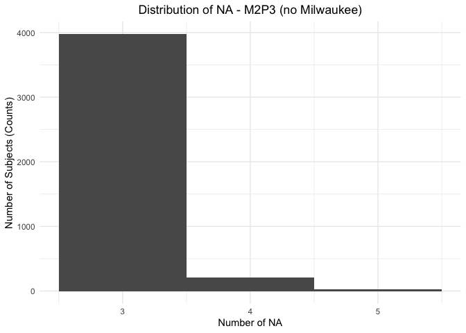
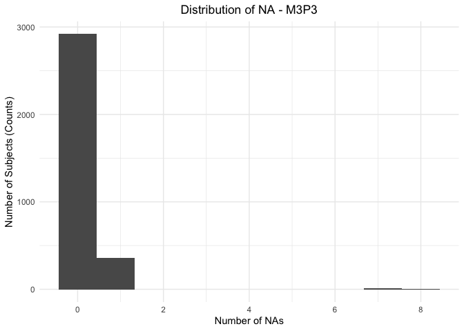
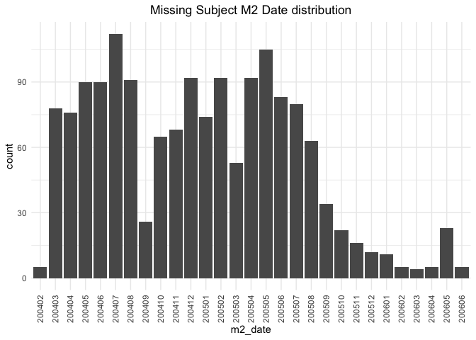
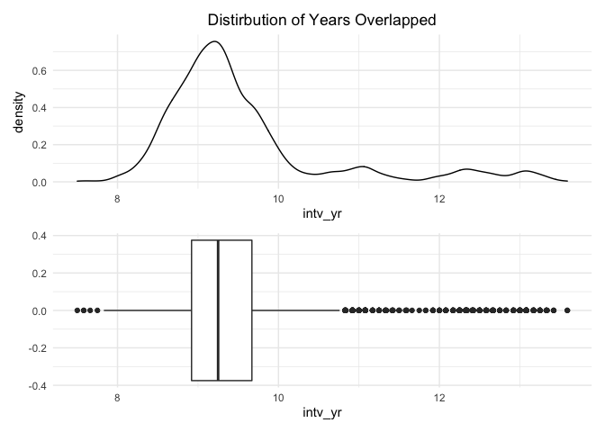
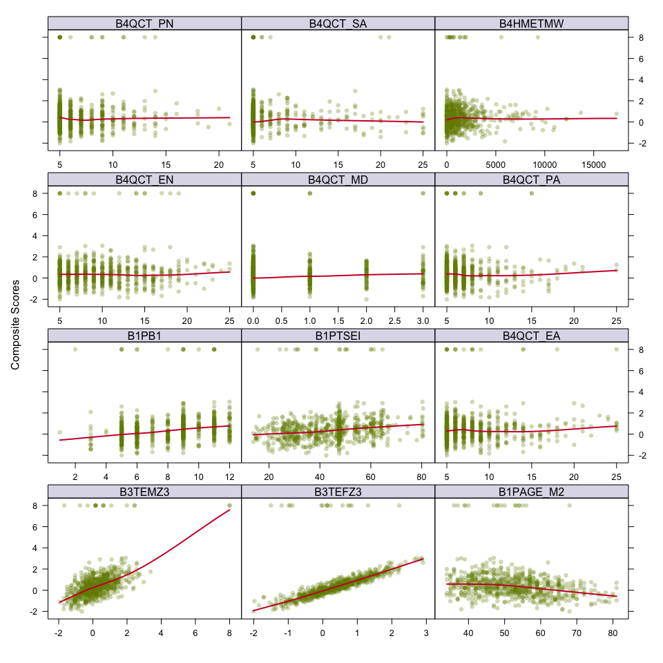
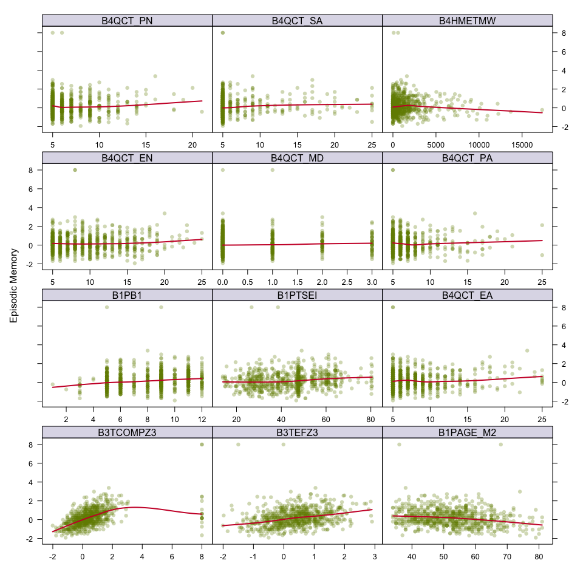
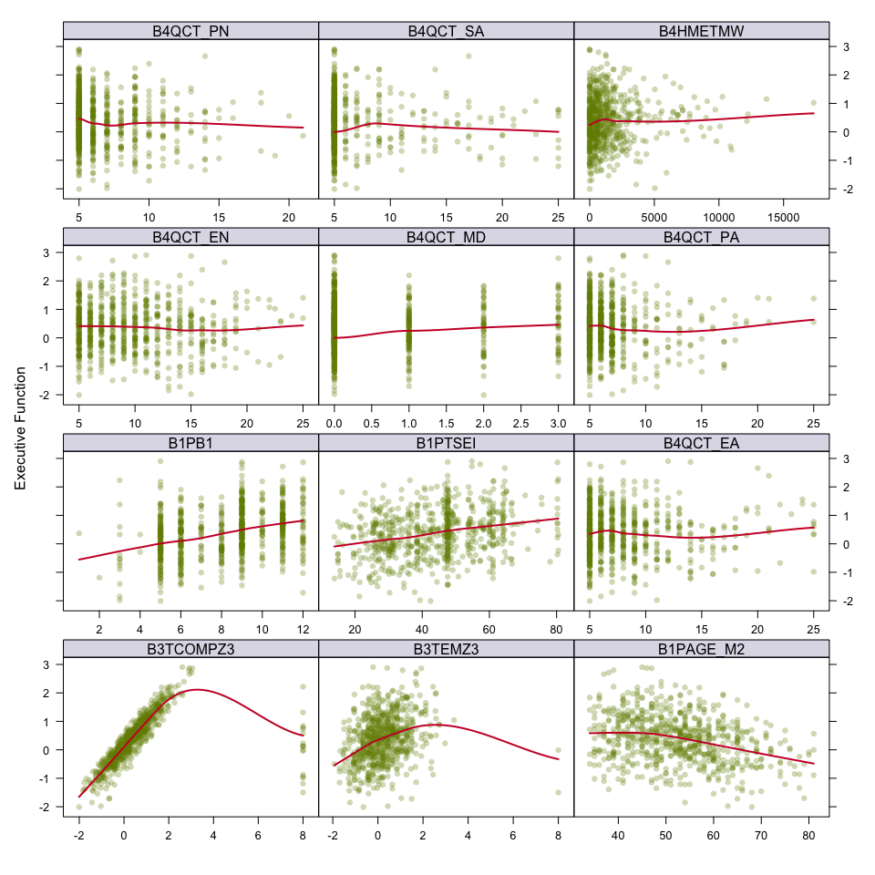

File I/O
================
Paula Wu
4/5/2022

This file is used to read in files and write files with selected

## Rough summary of missing Data

### M2P3

``` r
m2p3 = read_tsv("./data/ICPSR_25281/DS0001/25281-0001-Data.tsv")

missing = m2p3 %>% 
  select_if(function(x) any(is.na(x))) %>% 
  summarise_each(funs(sum(is.na(.))))

missing %>%
  pivot_longer(M2FAMNUM:B3TEFZ2,names_to = "variables", values_to = "missing_counts") %>% 
  mutate(labels = c("Family number", "BTACT Comp Z - National", "Episodic Memory Z - National", 
                    "Exe Func Z - National", "BTACT Comp Z - Milwaukee",
                    "Episodic Memory Z - Milwaukee", "Exe Func Z - Milwaukee"),
         missing_perc = paste0(round(missing_counts/4512, 4)*100, "%")) %>% 
  select(variables, labels, everything()) %>% 
  knitr::kable(col.names = c("Variable", "Labels", "Missing Counts", "Missing Percentage"), caption = "M2 Missing Data")
```

| Variable  | Labels                        | Missing Counts | Missing Percentage |
|:----------|:------------------------------|---------------:|:-------------------|
| M2FAMNUM  | Family number                 |            306 | 6.78%              |
| B3TCOMPZ1 | BTACT Comp Z - National       |            539 | 11.95%             |
| B3TEMZ1   | Episodic Memory Z - National  |            323 | 7.16%              |
| B3TEFZ1   | Exe Func Z - National         |            314 | 6.96%              |
| B3TCOMPZ2 | BTACT Comp Z - Milwaukee      |           4206 | 93.22%             |
| B3TEMZ2   | Episodic Memory Z - Milwaukee |           4206 | 93.22%             |
| B3TEFZ2   | Exe Func Z - Milwaukee        |           4206 | 93.22%             |

M2 Missing Data

### M3P3

``` r
m3p3 = read.table(file = "./data/ICPSR_37095/DS0001/37095-0001-Data.tsv", sep = '\t', header = TRUE)
missing_m3p3 = 
  m3p3 %>% 
  select_if(function(x) any(is.na(x))) %>% 
  summarise_each(funs(sum(is.na(.))))
missing_m3p3 %>% 
  pivot_longer(M2FAMNUM:C3TSPXBB, names_to = "var", values_to = "missing") %>% 
  mutate(labels = c("M2 Family Number", "Backward Counting: # Correct", "Mixed-task normal nonswitch trials %correct", "Mixed-task reverse nonswitch trials %correct", "Mixed-task nonswitch trials %correct", "Mixed-task normal switch trials %correct", "Mixed-task reverse switch trials %correct", "Mixed-task switch trials %correct", "All mixed-task %correct"),
         miss_perc = paste0(round(missing/3291, 4)*100,"%")) %>% 
  select(var, labels, everything()) %>% 
  knitr::kable(col.names = c("Variable", "Labels", "Missing Counts", "Missing Percentage"), caption = "M3 Missing Data")
```

| Variable | Labels                                       | Missing Counts | Missing Percentage |
|:---------|:---------------------------------------------|---------------:|:-------------------|
| M2FAMNUM | M2 Family Number                             |            330 | 10.03%             |
| C3TBKTOT | Backward Counting: # Correct                 |             32 | 0.97%              |
| C3TSPXNO | Mixed-task normal nonswitch trials %correct  |             15 | 0.46%              |
| C3TSPXRO | Mixed-task reverse nonswitch trials %correct |             15 | 0.46%              |
| C3TSPXBO | Mixed-task nonswitch trials %correct         |             15 | 0.46%              |
| C3TSPXNS | Mixed-task normal switch trials %correct     |             15 | 0.46%              |
| C3TSPXRS | Mixed-task reverse switch trials %correct    |             16 | 0.49%              |
| C3TSPXBS | Mixed-task switch trials %correct            |             15 | 0.46%              |
| C3TSPXBB | All mixed-task %correct                      |             15 | 0.46%              |

M3 Missing Data

## Detailed examination

### M2P3

Which subject? missing what. how many NA does each subject has?

``` r
# Milwaukee sample first
#milwaukee_only = c("B3TCOMPZ2", "B3TEMZ2", "B3TEFZ2")
milwaukee_only = 
  m2p3 %>% 
  select(M2ID, B3TCOMPZ2, B3TEMZ2, B3TEFZ2) %>% 
  filter(!(is.na(B3TCOMPZ2) | is.na(B3TEMZ2) | is.na(B3TEFZ2)))
```

Milwaukee sample is, surprisingly, complete. at least in the variables
for Milwaukees only. What about other variables?

``` r
m2p3 %>% 
  filter(M2ID %in% milwaukee_only$M2ID) %>% 
  select(-c(B3TCOMPZ1, B3TEMZ1, B3TEFZ1)) %>% 
  select_if(function(x) any(is.na(x))) %>% 
  summarise_each(funs(sum(is.na(.))))
```

    ## # A tibble: 1 × 1
    ##   M2FAMNUM
    ##      <int>
    ## 1      306

For Milwaukee sample only, the only missing variable is “M2FAMNUM”, i.e,
MIDUS 2 Family Numbers. And it seems that this variable is not collected
for the Milwaukee sample at all.

Milwaukee samples have their own ID

``` r
# national only
#national_only = c("B3TCOMPZ1", "B3TEMZ1", "B3TEFZ1")
national_only = m2p3 %>% 
  filter(!(M2ID %in% milwaukee_only$M2ID)) %>% 
  select(M2ID, B3TCOMPZ2, B3TEMZ2, B3TEFZ2) 

m2p3 %>% 
  select(M2ID, B3TCOMPZ1, B3TEMZ1, B3TEFZ1, B3TCOMPZ2, B3TEMZ2, B3TEFZ2) %>% 
  mutate(national = ifelse(is.na(B3TCOMPZ2) | is.na(B3TEMZ2) | is.na(B3TEFZ2), 1,0),
         milwaukee = ifelse(is.na(B3TCOMPZ1) | is.na(B3TEMZ1) | is.na(B3TEFZ1), 1,0)) %>% 
  filter(national==1 & milwaukee == 1)
```

``` r
m2p3$NASUM = rowSums(is.na(m2p3))
# national sample
m2p3 %>%
  filter(!(M2ID %in% milwaukee_only$M2ID)) %>% 
  mutate(NASUM = as.integer(NASUM)) %>% 
  select(M2ID, NASUM) %>% 
  ggplot(aes(x = NASUM))+
  geom_histogram(bins = 3)+
  labs(x = "Number of NA", y = "Number of Subjects (Counts)")+
  ggtitle("Distribution of NA - M2P3 (no Milwaukee)")
```

<!-- -->

# M3P3

``` r
m3p3$NASUM = rowSums(is.na(m3p3))
m3p3 %>% 
  select(M2ID, NASUM) %>% 
  ggplot(aes(x = as.integer(NASUM)))+
  geom_histogram(bins = 10)+
  labs(x = "Number of NAs", y = "Number of Subjects (Counts)")+
  ggtitle("Distribution of NA - M3P3")
```

<!-- -->

# Time gap between M2 and M3

``` r
m2_res_time =
  m2p3 %>% 
  select(M2ID, B1PAGE_M2, B3PIDATE_MO, B3PIDATE_YR)
```

``` r
m3_res_time = 
  m3p3 %>% 
  select(M2ID, C1PRAGE, C3IDATE_MO, C3IDATE_YR)
```

<details>
<summary>
Click to expand the data wrangling part
</summary>

``` r
m2_m3_time_lapse_raw = 
  left_join(m2_res_time, m3_res_time, by = "M2ID") 

m2_m3_time_lapse = 
  m2_m3_time_lapse_raw %>% 
  filter(!(is.na(C1PRAGE)|is.na(C3IDATE_MO)|is.na(C3IDATE_YR))) %>% 
  mutate(m2_date = ifelse(B3PIDATE_MO<10, paste0(B3PIDATE_YR, "0",B3PIDATE_MO), paste0(B3PIDATE_YR, B3PIDATE_MO)),
         m3_date = ifelse(C3IDATE_MO<10, paste0(C3IDATE_YR, "0",C3IDATE_MO), paste0(C3IDATE_YR, C3IDATE_MO)),
         intv_mo = interval(ym(m2_date), ym(m3_date))%/% months(1),
         intv_yr = round(interval(ym(m2_date), ym(m3_date))/ years(1),2),
         age_change = C1PRAGE - B1PAGE_M2) %>% 
  select(M2ID, m2_date, m3_date, intv_mo, intv_yr, age_change)

a = m2_m3_time_lapse_raw %>%  
  filter(is.na(C1PRAGE)|is.na(C3IDATE_MO)|is.na(C3IDATE_YR)) %>% 
  mutate(m2_date = ifelse(B3PIDATE_MO<10, paste0(B3PIDATE_YR, "0",B3PIDATE_MO), paste0(B3PIDATE_YR, B3PIDATE_MO)),
         m3_date = NA,
         intv_mo = NA,
         intv_yr = NA,
         age_change = NA) %>% 
  select(M2ID, m2_date, m3_date, intv_mo, intv_yr, age_change)
m2_m3_time_lapse = 
  rbind(m2_m3_time_lapse, a) %>% 
  arrange(M2ID)
```

</details>

Summary Statistics

``` r
skimr::skim(m2_m3_time_lapse[,c("M2ID", "intv_mo", "intv_yr", "age_change")])
```

|                                                  |                             |
|:-------------------------------------------------|:----------------------------|
| Name                                             | m2_m3_time_lapse\[, c(“M2I… |
| Number of rows                                   | 4512                        |
| Number of columns                                | 4                           |
| \_\_\_\_\_\_\_\_\_\_\_\_\_\_\_\_\_\_\_\_\_\_\_   |                             |
| Column type frequency:                           |                             |
| numeric                                          | 4                           |
| \_\_\_\_\_\_\_\_\_\_\_\_\_\_\_\_\_\_\_\_\_\_\_\_ |                             |
| Group variables                                  | None                        |

Data summary

**Variable type: numeric**

| skim_variable | n_missing | complete_rate |     mean |      sd |      p0 |      p25 |      p50 |      p75 |     p100 | hist  |
|:--------------|----------:|--------------:|---------:|--------:|--------:|---------:|---------:|---------:|---------:|:------|
| M2ID          |         0 |          1.00 | 14609.92 | 2655.35 | 10002.0 | 12321.75 | 14616.00 | 16885.75 | 19193.00 | ▇▇▇▇▇ |
| intv_mo       |      1572 |          0.65 |   114.47 |   12.88 |    90.0 |   107.00 |   111.00 |   116.00 |   163.00 | ▂▇▁▁▁ |
| intv_yr       |      1572 |          0.65 |     9.54 |    1.07 |     7.5 |     8.92 |     9.25 |     9.67 |    13.59 | ▂▇▁▁▁ |
| age_change    |      1572 |          0.65 |     9.56 |    1.30 |    -1.0 |     9.00 |     9.00 |    10.00 |    17.00 | ▁▁▇▃▁ |

Graphs

``` r
a %>% 
  ggplot(aes(x = m2_date))+
  geom_bar() + theme(axis.text.x = element_text(angle = 90, vjust = 0.5, hjust= 1))+
  ggtitle("Missing Subject M2 Date distribution")
```

<!-- -->

``` r
den_plot = 
  m2_m3_time_lapse %>% 
  ggplot(aes(x = intv_yr))+
  geom_density()+
  ggtitle("Distirbution of Years Overlapped")
```

``` r
box_plot = 
  m2_m3_time_lapse %>% 
  ggplot(aes(x = intv_yr))+
  geom_boxplot()
den_plot/box_plot
```

<!-- -->

Wide distribution with a large amount of outliers, person time may be a
better choice.

Question: invalid meaning, how to distinguish?

### Confirm milwaukee sample id

``` r
mke1 = read_tsv("./data/MKE Data.tsv")
milwaukee_only_test = 
  inner_join(m2p3, mke1, by = "M2ID") %>% 
  select(M2ID, M2FAMNUM)
identical(milwaukee_only$M2ID, milwaukee_only_test$M2ID)
```

    ## [1] TRUE

The filtered ID done prev to the complete dataset (M2P3) is indeed the
milwaukee sample M2ID.

### Current variables extract & data preprocessing

MIDUS 2

``` r
# prev study also in
#m2p4001:aggregated updated; m2p4002:medication stacked updated public n = 7174
m2p4 = read_tsv("./data/ICPSR_29282/DS0001/29282-0001-Data.tsv") 

m2p1 = read_tsv("./data/ICPSR_04652/DS0001/04652-0001-Data.tsv")

# no smoking yet, also included B1SA11Z (M2 - stroke history)
m2p1_selected = m2p1 %>% select(M2ID, B1PAGE_M2,  B1PRSEX, B1PF7A, B1PB1, B1PTSEI, B1PB19, B1PPARTN, B1PA6A, 
                                B1SA11W, B1SA11Z,B1SA62A, B1SA62B, B1SA62C, B1SA62D, B1SA62E, B1SA62F, 
                                B1SA62G, B1SA62H, B1SA62I, B1SA62J)
m2p4_selected = m2p4 %>% select(M2ID, B4QCT_EA, B4QCT_EN, B4QCT_MD, B4QCT_PA, B4QCT_PN, B4QCT_SA, B4HMETMW)
m2p3_selected = m2p3 %>% 
  select(M2ID, M2FAMNUM, B3TCOMPZ3, B3TEMZ3, B3TEFZ3, B3PIDATE_MO, B3PIDATE_YR)

sum(is.na(m2p3_selected$M2FAMNUM)==TRUE) # only m2p3_selected has 306 missing - family numbers
```

    ## [1] 306

``` r
# prev data integration
m2_df = list(m2p3_selected, m2p1_selected, m2p4_selected) %>% reduce(full_join, by = "M2ID") %>% 
  filter(M2ID %in% m2p3_selected$M2ID)

# Milwaukee sample family number filled in
m2_df = 
  m2_df %>% 
  mutate(M2FAMNUM = ifelse(is.na(M2FAMNUM), M2ID, M2FAMNUM))

# NA investigation
m2_df %>% 
  select_if(function(x) any(is.na(x))) %>% 
  summarise_each(funs(sum(is.na(.))))
```

    ## # A tibble: 1 × 27
    ##   B1PAGE_M2 B1PRSEX B1PF7A B1PB1 B1PTSEI B1PB19 B1PPARTN B1PA6A B1SA11W B1SA11Z
    ##       <int>   <int>  <int> <int>   <int>  <int>    <int>  <int>   <int>   <int>
    ## 1       306     306    306   306     306    306      306    306     306     306
    ## # … with 17 more variables: B1SA62A <int>, B1SA62B <int>, B1SA62C <int>,
    ## #   B1SA62D <int>, B1SA62E <int>, B1SA62F <int>, B1SA62G <int>, B1SA62H <int>,
    ## #   B1SA62I <int>, B1SA62J <int>, B4QCT_EA <int>, B4QCT_EN <int>,
    ## #   B4QCT_MD <int>, B4QCT_PA <int>, B4QCT_PN <int>, B4QCT_SA <int>,
    ## #   B4HMETMW <int>

``` r
# Most of the NA's are from M2P4. Only 1152 observations left
m2p3_selected %>% 
  filter(M2ID %in% m2p4_selected$M2ID)
```

    ## # A tibble: 1,152 × 7
    ##     M2ID M2FAMNUM B3TCOMPZ3 B3TEMZ3 B3TEFZ3 B3PIDATE_MO B3PIDATE_YR
    ##    <dbl>    <dbl>     <dbl>   <dbl>   <dbl>       <dbl>       <dbl>
    ##  1 10002   100001    -0.258  -1.24    0.221           9        2004
    ##  2 10005   120803    -1.72   -0.415  -1.45            1        2005
    ##  3 10019   100009     1.56    0.839   1.54            3        2004
    ##  4 10040   100018     0.006   0.013  -0.25            2        2005
    ##  5 10047   100022     0.577   0.411   0.596           7        2004
    ##  6 10060   100028    -1.08   -1.07   -0.554           7        2004
    ##  7 10061   100029     0.694  -0.872   0.569           7        2004
    ##  8 10063   120288    -0.339  -0.415  -0.112           6        2004
    ##  9 10079       NA    -0.418   1.50   -1.08            9        2005
    ## 10 10080       NA    -1.09    1.52   -1.53            7        2005
    ## # … with 1,142 more rows

``` r
m2p1_condition_nostrk = m2p1 %>% 
  select(M2ID, B1SPWBA2, B1SPWBE2, B1SPWBG2, B1SPWBR2, B1SPWBU2, B1SPWBS2, 
         B1SMASTE, B1SCONST, B1SCTRL, 
         B1SESTEE, B1SINTER, B1SINDEP,
         B1SAGENC, B1SAGREE, B1SNEURO, B1SCONS1)  # no b1sexta, find it in the code book
```

MIDUS 3

``` r
m3p1 = read_tsv("./data/ICPSR_36346/DS0001/36346-0001-Data.tsv")
m3p1_selected = m3p1 %>% 
  select(M2ID, C1PA6A, C1SA11Z, C1PB19)

m3p3_selected = m3p3 %>% 
  select(M2ID, M2FAMNUM, C3TCOMP, C3TEM, C3TEF, C3IDATE_MO, C3IDATE_YR, C1PRAGE)

sum(is.na(m3p3_selected$C1PRAGE)==TRUE) #family number missing
```

    ## [1] 0

``` r
m3_df = list(m3p3_selected, m3p1_selected) %>% reduce(left_join, by = "M2ID")

m3_df %>% 
  filter(is.na(M2FAMNUM)) %>%  # left join: 330 missing the family num, need the m3 mke
  filter(!(M2ID %in% milwaukee_only_test$M2ID))
```

    ##      M2ID M2FAMNUM      C3TCOMP       C3TEM       C3TEF C3IDATE_MO C3IDATE_YR
    ## 1   10029       NA -0.879278585 -0.04819033 -1.44588788          8       2016
    ## 2   10217       NA -0.558990364  0.19716878 -1.08737853          2       2017
    ## 3   10277       NA -0.453817138 -0.45756714 -0.32386989         12       2016
    ## 4   10535       NA -0.022922543 -1.46745225 -0.25782646          9       2016
    ## 5   10896       NA -0.530269928  0.38830028 -0.61732690         11       2016
    ## 6   11019       NA -0.997854229 -1.65858375 -1.01320598          7       2016
    ## 7   11292       NA -0.905462941  0.41541409 -1.23855859         10       2016
    ## 8   11299       NA -0.719064437 -0.40333952 -1.08243783         12       2016
    ## 9   11306       NA -0.110754456  0.82479090 -0.41878554          8       2016
    ## 10  11307       NA -0.590899170 -1.27632075 -0.49557554          1       2017
    ## 11  11378       NA  0.217747398  2.57208819 -1.04163775          7       2016
    ## 12  11461       NA -0.522485333 -0.64869864 -0.31308075          9       2016
    ## 13  11772       NA -0.175503896 -0.83983014  0.21748362          7       2016
    ## 14  11800       NA -0.888989320 -1.03096163 -1.13402879         10       2016
    ## 15  11811       NA  0.666313078  2.21693901 -0.02133258          9       2016
    ## 16  11907       NA  0.786196107  1.58931689  0.40551937          1       2017
    ## 17  11911       NA -0.669572209 -1.44033844 -1.25232186         12       2016
    ## 18  12345       NA -1.121075703 -0.40333952 -1.39166236         10       2016
    ## 19  12673       NA -1.512996224 -1.22209313 -2.28403310          9       2016
    ## 20  12776       NA -0.866414068 -0.23932183 -1.24597568         10       2016
    ## 21  13020       NA -1.107495837 -1.87682906 -0.63792057          7       2016
    ## 22  13032       NA -0.788394432 -1.46745225 -0.64256358          9       2016
    ## 23  13084       NA -0.721440937 -1.03096163 -0.63097040         11       2016
    ## 24  13089       NA  8.000000000  0.11916194 -1.12525745          7       2016
    ## 25  13272       NA -0.426116174 -0.43045333 -0.24693431          7       2016
    ## 26  13280       NA -1.645601971 -0.83983014 -2.70781159         11       2016
    ## 27  13397       NA -1.181761826 -0.43045333 -1.27441389          8       2016
    ## 28  13633       NA -0.895039092 -1.00384782 -0.78747999          8       2016
    ## 29  13657       NA -1.404664745 -0.64869864 -2.24081348         10       2016
    ## 30  13697       NA -1.081672467 -0.43045333 -0.90976360          7       2016
    ## 31  13742       NA -0.403023667 -0.18509421 -0.16735604          1       2017
    ## 32  13754       NA  0.036770931  1.20705390 -0.29892109         10       2016
    ## 33  13784       NA -1.440010228 -0.62158483 -1.37670780          1       2017
    ## 34  13787       NA -1.328379931 -0.81271633 -1.46374890         10       2016
    ## 35  13907       NA -0.636600991 -0.86694394 -0.72580807          7       2016
    ## 36  13986       NA -1.224156433 -1.46745225 -1.80605109          9       2016
    ## 37  14105       NA -1.058048763 -1.46745225 -0.99434904          1       2017
    ## 38  14252       NA -1.230013669 -0.04819033 -0.84813880          9       2016
    ## 39  14272       NA  0.403282697  2.84456112 -0.14278799          3       2017
    ## 40  14362       NA -0.439829955  0.17005498 -0.72079055         12       2016
    ## 41  14391       NA -0.948966254 -0.43045333 -1.05439834          2       2017
    ## 42  14425       NA -0.869611928 -0.02107652 -1.04899751          2       2017
    ## 43  14439       NA  0.540231912  1.99869370 -0.19713801          3       2017
    ## 44  14445       NA -1.060582610 -0.86694394 -1.22552520          9       2016
    ## 45  14505       NA  0.383673746  0.36118647 -0.16262382          1       2017
    ## 46  14541       NA -0.361852162 -0.83983014 -0.30607343          1       2017
    ## 47  14584       NA -0.922781898 -0.86694394 -1.87807694          8       2016
    ## 48  14604       NA  8.000000000 -0.31732868 -1.58878063         10       2016
    ## 49  14628       NA  0.075246764  2.10714894 -0.01174981         10       2016
    ## 50  14714       NA -0.753892665 -1.05807544 -0.91889928         11       2016
    ## 51  14735       NA -1.798889201 -2.09507436 -3.21545920          1       2017
    ## 52  14744       NA -0.691369020 -0.45756714 -0.74841027         11       2016
    ## 53  14788       NA  0.452853651 -0.02107652  0.42323285         10       2016
    ## 54  14842       NA -0.938441939 -1.46745225 -1.02607510         12       2016
    ## 55  14903       NA  0.009215588  0.19716878  0.22004486          7       2016
    ## 56  14975       NA -0.431258062 -0.21220802 -0.41215256          7       2016
    ## 57  15006       NA  0.270034639  1.80756220 -0.77885391          9       2016
    ## 58  15054       NA -1.078055583 -0.40333952 -0.89733549          8       2016
    ## 59  15095       NA -1.012579087 -1.87682906 -1.47237957          1       2017
    ## 60  15176       NA -0.380688341 -0.64869864 -0.04526823          3       2017
    ## 61  15222       NA -1.162188575 -1.27632075 -1.50718379          9       2016
    ## 62  15496       NA -0.149183393  0.79767709 -0.17734590         10       2016
    ## 63  15505       NA  8.000000000 -1.46745225 -0.53825921         10       2016
    ## 64  15638       NA  8.000000000 -2.93627237 -2.08882051         11       2016
    ## 65  15686       NA -1.082694175 -1.87682906 -0.52633949          8       2016
    ## 66  15832       NA -1.053262316  0.14294117 -1.73440213          8       2016
    ## 67  15838       NA -0.713436508 -0.43045333 -1.22511112          8       2016
    ## 68  15869       NA  8.000000000 -0.45756714 -4.17196265          1       2017
    ## 69  15873       NA -0.915805338  0.14294117 -0.91742753         10       2016
    ## 70  15881       NA -1.103242821 -0.23932183 -1.37264538          9       2016
    ## 71  15894       NA -1.062613142 -0.26643564 -1.27666549         10       2016
    ## 72  15900       NA -0.773421838  0.79767709 -1.05411570          9       2016
    ## 73  15935       NA -0.083501004  1.61643070 -0.84463622         11       2016
    ## 74  16025       NA -0.931451438 -1.05807544 -0.99606976         10       2016
    ## 75  16208       NA -0.133369336 -0.21220802  0.02966165          1       2017
    ## 76  16288       NA -1.348762836 -1.05807544 -2.17006798          7       2016
    ## 77  16295       NA -0.581565616 -0.62158483 -0.57169434          8       2016
    ## 78  16299       NA -0.409263138 -0.21220802 -0.22005608          2       2017
    ## 79  16362       NA -0.624960683  0.17005498 -0.47465635          8       2016
    ## 80  16370       NA -1.485903983 -1.46745225 -1.73616408          9       2016
    ## 81  16427       NA -0.094552589  0.82479090 -0.92818478          1       2017
    ## 82  16522       NA -1.618043317 -1.00384782 -2.78723900         12       2016
    ## 83  16571       NA  0.075272413 -0.45756714 -0.42033664         12       2016
    ## 84  16636       NA  8.000000000 -2.93627237 -2.61767057         10       2016
    ## 85  16772       NA -2.183601016 -1.87682906 -1.81474633          8       2016
    ## 86  16777       NA -1.420668519 -1.22209313 -1.48436893          2       2017
    ## 87  16820       NA -0.772924089 -0.81271633 -0.44844762          7       2016
    ## 88  16940       NA -0.382788618 -0.18509421 -0.26256304          8       2016
    ## 89  16965       NA -1.014503607 -0.83983014 -0.90158255         10       2016
    ## 90  17173       NA -0.333154081 -1.03096163 -0.10600493          1       2017
    ## 91  17175       NA -0.749600040 -0.83983014 -1.04115927          7       2016
    ## 92  17178       NA -0.813525867 -0.43045333 -0.71437686          8       2016
    ## 93  17184       NA  8.000000000 -1.19030991 -1.10290231          8       2016
    ## 94  17196       NA -0.409924937 -1.05807544 -0.31696784         10       2016
    ## 95  17304       NA -0.401071245 -0.89405775 -0.53382671         10       2016
    ## 96  17330       NA -1.286551710 -1.24920694 -1.60713310         10       2016
    ## 97  17364       NA  0.367225792  0.98880859 -0.32619901         11       2016
    ## 98  17413       NA  0.232874008  3.25393793 -0.77042377          7       2016
    ## 99  17477       NA -0.576669230 -1.65858375 -0.81123768          9       2016
    ## 100 17498       NA -0.208486821  0.38830028 -0.88268164         10       2016
    ## 101 17499       NA  0.542044844  0.98880859  0.55541888         10       2016
    ## 102 17669       NA  8.000000000 -0.75381929 -0.88371450         10       2016
    ## 103 17753       NA -0.587067412 -1.05807544 -0.27072695         11       2016
    ## 104 17847       NA  0.444228208  2.40807050 -0.05383357          1       2017
    ## 105 17908       NA -0.230900277 -0.83983014 -0.13150222          2       2017
    ## 106 17921       NA  0.824397952  2.59920200  0.31046531         12       2016
    ## 107 17969       NA -0.255701938 -0.81271633 -0.04325878         11       2016
    ## 108 17980       NA -0.250361939 -0.07530414 -0.54987894          8       2016
    ## 109 18117       NA -0.488961197 -0.62158483 -0.70281677          8       2016
    ## 110 18245       NA -0.693745520 -1.08518925 -1.00190103         10       2016
    ## 111 18306       NA -1.345531527 -0.83983014 -1.82528893         10       2016
    ## 112 18357       NA  0.512103511  0.79767709  0.30132079          1       2017
    ## 113 18371       NA -1.061090374 -1.68569756 -1.19783176          8       2016
    ## 114 18380       NA -1.073848879 -1.03096163 -1.35660863         12       2016
    ## 115 18448       NA -1.115157610 -0.04819033 -0.89464773          8       2016
    ## 116 18480       NA -0.126068549 -0.21220802  0.17910326          1       2017
    ## 117 18485       NA  0.700890240  0.38830028  0.82790137         11       2016
    ## 118 18609       NA  8.000000000 -1.62680052 -1.52012718          2       2017
    ## 119 18624       NA -0.199918240  1.20705390 -0.25503977         11       2016
    ## 120 18672       NA -0.274889613 -0.23932183 -0.41757100         12       2016
    ## 121 18675       NA  8.000000000 -0.75381929 -2.53695229         10       2016
    ## 122 18768       NA -1.130924278  0.79767709 -1.66529945         11       2016
    ## 123 18789       NA  8.000000000 -2.06329114 -0.71364433         11       2016
    ## 124 18809       NA -1.214880899 -1.22209313 -1.14959385          7       2016
    ## 125 18881       NA -0.852097112 -0.67581245 -1.06559053          9       2016
    ## 126 19102       NA -1.701832576 -1.87682906 -1.85477075          7       2016
    ## 127 19184       NA -0.604710596 -1.24920694 -0.19822358         11       2016
    ##     C1PRAGE C1PA6A C1SA11Z C1PB19
    ## 1        47     NA      NA     NA
    ## 2        64     NA      NA     NA
    ## 3        74     NA      NA     NA
    ## 4        56     NA      NA     NA
    ## 5        65     NA      NA     NA
    ## 6        72     NA      NA     NA
    ## 7        56     NA      NA     NA
    ## 8        59     NA      NA     NA
    ## 9        51     NA      NA     NA
    ## 10       49     NA      NA     NA
    ## 11       55     NA      NA     NA
    ## 12       51     NA      NA     NA
    ## 13       52     NA      NA     NA
    ## 14       48     NA      NA     NA
    ## 15       62     NA      NA     NA
    ## 16       54     NA      NA     NA
    ## 17       54     NA      NA     NA
    ## 18       62     NA      NA     NA
    ## 19       83     NA      NA     NA
    ## 20       51     NA      NA     NA
    ## 21       57     NA      NA     NA
    ## 22       73     NA      NA     NA
    ## 23       52     NA      NA     NA
    ## 24       47     NA      NA     NA
    ## 25       47     NA      NA     NA
    ## 26       54     NA      NA     NA
    ## 27       48     NA      NA     NA
    ## 28       83     NA      NA     NA
    ## 29       76     NA      NA     NA
    ## 30       45     NA      NA     NA
    ## 31       52     NA      NA     NA
    ## 32       65     NA      NA     NA
    ## 33       50     NA      NA     NA
    ## 34       63     NA      NA     NA
    ## 35       52     NA      NA     NA
    ## 36       65     NA      NA     NA
    ## 37       51     NA      NA     NA
    ## 38       78     NA      NA     NA
    ## 39       66     NA      NA     NA
    ## 40       54     NA      NA     NA
    ## 41       71     NA      NA     NA
    ## 42       63     NA      NA     NA
    ## 43       70     NA      NA     NA
    ## 44       72     NA      NA     NA
    ## 45       47     NA      NA     NA
    ## 46       48     NA      NA     NA
    ## 47       49     NA      NA     NA
    ## 48       77     NA      NA     NA
    ## 49       53     NA      NA     NA
    ## 50       58     NA      NA     NA
    ## 51       57     NA      NA     NA
    ## 52       55     NA      NA     NA
    ## 53       52     NA      NA     NA
    ## 54       63     NA      NA     NA
    ## 55       53     NA      NA     NA
    ## 56       70     NA      NA     NA
    ## 57       85     NA      NA     NA
    ## 58       60     NA      NA     NA
    ## 59       54     NA      NA     NA
    ## 60       44     NA      NA     NA
    ## 61       55     NA      NA     NA
    ## 62       57     NA      NA     NA
    ## 63       50     NA      NA     NA
    ## 64       71     NA      NA     NA
    ## 65       46     NA      NA     NA
    ## 66       59     NA      NA     NA
    ## 67       62     NA      NA     NA
    ## 68       60     NA      NA     NA
    ## 69       68     NA      NA     NA
    ## 70       59     NA      NA     NA
    ## 71       61     NA      NA     NA
    ## 72       68     NA      NA     NA
    ## 73       71     NA      NA     NA
    ## 74       76     NA      NA     NA
    ## 75       75     NA      NA     NA
    ## 76       49     NA      NA     NA
    ## 77       65     NA      NA     NA
    ## 78       49     NA      NA     NA
    ## 79       50     NA      NA     NA
    ## 80       59     NA      NA     NA
    ## 81       54     NA      NA     NA
    ## 82       48     NA      NA     NA
    ## 83       59     NA      NA     NA
    ## 84       59     NA      NA     NA
    ## 85       59     NA      NA     NA
    ## 86       72     NA      NA     NA
    ## 87       50     NA      NA     NA
    ## 88       54     NA      NA     NA
    ## 89       78     NA      NA     NA
    ## 90       68     NA      NA     NA
    ## 91       56     NA      NA     NA
    ## 92       61     NA      NA     NA
    ## 93       63     NA      NA     NA
    ## 94       54     NA      NA     NA
    ## 95       72     NA      NA     NA
    ## 96       65     NA      NA     NA
    ## 97       50     NA      NA     NA
    ## 98       69     NA      NA     NA
    ## 99       57     NA      NA     NA
    ## 100      60     NA      NA     NA
    ## 101      61     NA      NA     NA
    ## 102      60     NA      NA     NA
    ## 103      51     NA      NA     NA
    ## 104      49     NA      NA     NA
    ## 105      56     NA      NA     NA
    ## 106      51     NA      NA     NA
    ## 107      53     NA      NA     NA
    ## 108      59     NA      NA     NA
    ## 109      58     NA      NA     NA
    ## 110      58     NA      NA     NA
    ## 111      62     NA      NA     NA
    ## 112      55     NA      NA     NA
    ## 113      49     NA      NA     NA
    ## 114      60     NA      NA     NA
    ## 115      60     NA      NA     NA
    ## 116      57     NA      NA     NA
    ## 117      63     NA      NA     NA
    ## 118      60     NA      NA     NA
    ## 119      55     NA      NA     NA
    ## 120      52     NA      NA     NA
    ## 121      79     NA      NA     NA
    ## 122      75     NA      NA     NA
    ## 123      80     NA      NA     NA
    ## 124      66     NA      NA     NA
    ## 125      69     NA      NA     NA
    ## 126      55     NA      NA     NA
    ## 127      50     NA      NA     NA

``` r
# for now, just fill in their M2ID as family numbers
m3_df =  m3_df %>% 
  mutate(M2FAMNUM = ifelse(is.na(M2FAMNUM), M2ID, M2FAMNUM))

# if in m2 has a fam num, why in m3 didn't
#m2_df %>% 
#  filter(M2ID %in% m3_fam_missing$M2ID)
```

### Stroke analysis

``` r
# missing: or: 1670, and: 1670
# 0:no, 1:yes, 7:dk
stroke_df = merge(x = m2p1_selected[, c("M2ID", "B1PA6A", "B1SA11Z")], y = m3p1_selected[,c("M2ID", "C1PA6A", "C1SA11Z")], by = "M2ID", all.x=TRUE) %>%
  filter(!(is.na(C1PA6A) & is.na(C1SA11Z))) %>% 
  mutate(B1PA6A = recode(B1PA6A, `2` = 0),
         C1PA6A = recode(C1PA6A, `2` = 0),
         B1SA11Z = recode(B1SA11Z, `2` = 0),
         C1SA11Z = recode(C1SA11Z, `2` = 0),
         D1PA6A = C1PA6A - B1PA6A, # D for delta
         D1SA11Z = C1SA11Z - B1SA11Z)  
# stroke history var does not contain refused
# Stroke history: the unchanged
stroke_df %>% 
  filter(D1PA6A == 0) %>% 
  group_by(B1PA6A, C1PA6A) %>% 
  summarize(n = n())
```

    ## # A tibble: 2 × 3
    ## # Groups:   B1PA6A [2]
    ##   B1PA6A C1PA6A     n
    ##    <dbl>  <dbl> <int>
    ## 1      0      0  3134
    ## 2      1      1    49

``` r
# History: the changed: 0->1(1 target), 1->0(-1 invalid), 0->7(7 dk), 7->0(-7 invalid?), 7->1(-6 target), 1->7(6 invalid)
stroke_df %>% 
  filter(D1PA6A != 0) %>% 
  group_by(D1PA6A) %>% 
  summarize(n = n())
```

    ## # A tibble: 5 × 2
    ##   D1PA6A     n
    ##    <dbl> <int>
    ## 1     -7     2
    ## 2     -6     1
    ## 3     -1    14
    ## 4      1    89
    ## 5      7     4

``` r
# within 12 month contains refused and missing, filtered out during data processing
# stroke within 12 months, unchanged (1->1, reoccurring strokes?)
stroke_df %>% 
  filter(!(B1SA11Z %in% c(-1,8) | C1SA11Z %in% c(-1,8))) %>% 
  filter(D1SA11Z == 0) %>% 
  select(-c(B1PA6A, C1PA6A, D1PA6A)) %>% 
  group_by(B1SA11Z, C1SA11Z) %>% 
  summarize(n = n())
```

    ## # A tibble: 2 × 3
    ## # Groups:   B1SA11Z [2]
    ##   B1SA11Z C1SA11Z     n
    ##     <dbl>   <dbl> <int>
    ## 1       0       0  2602
    ## 2       1       1     4

``` r
# stroke within 12 months, changed
stroke_df %>% 
  filter(!(B1SA11Z %in% c(-1,8) | C1SA11Z %in% c(-1,8))) %>% 
  filter(D1SA11Z != 0) %>% 
  select(-c(B1PA6A, C1PA6A, D1PA6A)) %>% 
  group_by(B1SA11Z, C1SA11Z,D1SA11Z) %>% 
  summarize(n = n())
```

    ## # A tibble: 2 × 4
    ## # Groups:   B1SA11Z, C1SA11Z [2]
    ##   B1SA11Z C1SA11Z D1SA11Z     n
    ##     <dbl>   <dbl>   <dbl> <int>
    ## 1       0       1       1    34
    ## 2       1       0      -1    11

``` r
# inconsistency: history and recent 12 month (?)
# those who report having strokes recently but report no stroke history
```

### Marital status change

``` r
# combine data, right now just focus on the non-missing subjects
mar_df = merge(x = m2p1_selected[, c("M2ID", "B1PB19")], 
               y = m3p1_selected[,c("M2ID", "C1PB19")], by = "M2ID", all.x=TRUE) %>% 
  drop_na()

# the results are quite spreaded-out, how to code for them?
mar_df %>% 
  mutate(D1PB19 = C1PB19 - B1PB19) %>% 
  filter(D1PB19 != 0) %>% 
  group_by(B1PB19, C1PB19, D1PB19) %>% 
  summarize(n = n())
```

    ## # A tibble: 23 × 4
    ## # Groups:   B1PB19, C1PB19 [23]
    ##    B1PB19 C1PB19 D1PB19     n
    ##     <dbl>  <dbl>  <dbl> <int>
    ##  1      1      2      1    27
    ##  2      1      3      2    96
    ##  3      1      4      3   184
    ##  4      1      5      4     1
    ##  5      2      1     -1    14
    ##  6      2      3      1    24
    ##  7      2      4      2     2
    ##  8      2      5      3     2
    ##  9      2      7      5     1
    ## 10      3      1     -2    61
    ## # … with 13 more rows

### Univariate Analysis

thoughts on univariate analysis rn: level and change in EF and EM.

Very primitive, need to change later

``` r
# parameters setup 
theme1 = trellis.par.get()
theme1$plot.symbol$col = rgb(0.4556, 0.5444, 0, .3) #
theme1$plot.symbol$pch = 16
theme1$plot.line$col = rgb(0.8, 0, 0.2, 1) #0.5316, 0.4684
theme1$plot.line$lwd = 2
theme1$strip.background$col = rgb(0.2611, 0.2124, 0.5265, .2)
trellis.par.set(theme1)
```

``` r
# M2 continuous
m2_df_graph_cont = m2_df %>% 
  drop_na() %>% 
  select(-c(B1PRSEX, B1PF7A, B1PB19, B1PPARTN, B1PA6A, B1SA11W, B1SA11Z, B1SA62A, B1SA62B, 
            B1SA62C, B1SA62D, B1SA62E, B1SA62F, B1SA62G, B1SA62H, B1SA62I, B1SA62J, B3PIDATE_MO, B3PIDATE_YR)) %>% 
  filter(B4QCT_SA <= 25 & B1PTSEI <= 80.53 & B4HMETMW <= 26355 & B4QCT_EN <=25 & B4QCT_MD <= 3 & B4QCT_PN <= 21 &
           B1PB1 <= 12 & B4QCT_EA <= 25)
# Cognition composite score
x_feature = model.matrix(`B3TCOMPZ3` ~., m2_df_graph_cont[3:15])[, -1]
y = m2_df_graph_cont$B3TCOMPZ3
featurePlot(x_feature, y, plot = "scatter", labels = c("", "Composite Scores"),
            type = c("p", "smooth"), layout = c(3,4))
```



``` r
# Episodic Memory
x_feature = model.matrix(`B3TEMZ3` ~., m2_df_graph_cont[3:15])[, -1]
y = m2_df_graph_cont$B3TEMZ3
featurePlot(x_feature, y, plot = "scatter", labels = c("", "Episodic Memory"),
            type = c("p", "smooth"), layout = c(3,4))
```



``` r
# Executive Function
x_feature = model.matrix(`B3TEFZ3` ~., m2_df_graph_cont[3:15])[, -1]
y = m2_df_graph_cont$B3TEFZ3
featurePlot(x_feature, y, plot = "scatter", labels = c("", "Executive Function"),
            type = c("p", "smooth"), layout = c(3,4))
```



``` r
m2_df_graph_cate = m2_df %>% 
  drop_na() %>% 
  select(c(B3TCOMPZ3, B3TEMZ3, B3TEFZ3, B1PRSEX, B1PF7A, B1PB19, B1PPARTN, B1PA6A, B1SA11W, B1SA11Z, B1SA62A, B1SA62B, 
            B1SA62C, B1SA62D, B1SA62E, B1SA62F, B1SA62G, B1SA62H, B1SA62I, B1SA62J))
```

### TODO: missing value investigation (look at dataset other than the aggregated one, etc.), milwaukee sample data integration, add smoking var \| family number (random intercept for each family - LMM),
