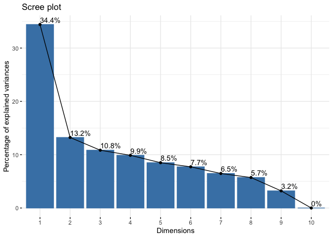

univariate
================
Paula Wu
6/9/2022

``` r
full_df_no_invalid = read.csv("./data/full_df.csv") %>% 
  select(-1)

# 1 for white, 2 for non-white
full_df_lm = full_df_no_invalid %>% 
  mutate(B1PF7A = ifelse(as.numeric(B1PF7A) != 1, 2, as.numeric(B1PF7A)),
         B1PF7A = as.factor(B1PF7A))
# D3TCOMP, D3TEM, D3TEF, ctq_total
drug_df = full_df_lm %>% 
  select(B1SA62A, B1SA62B, B1SA62C, B1SA62D, B1SA62E, B1SA62F, 
         B1SA62G, B1SA62H, B1SA62I, B1SA62J)
pca = prcomp(drug_df, scale = TRUE)
#pca$sdev^2 / sum(pca$sdev^2)
fviz_eig(pca, addlabels = TRUE)
```

<!-- -->

``` r
d_comp_lm = lm(D3TCOMP ~ B1PAGE_M2 + B1PRSEX + B1PF7A + B1PB1 + B1PTSEI + D1PB19 + B1PA39 + B4HMETMW + B1SA11W + B4ALCOH + B1SA62A + B1SA62B + B1SA62C + B1SA62D + B1SA62E + B1SA62F + B1SA62G + B1SA62H + B1SA62I, data = full_df_lm)
d_em_lm = lm(D3TEM ~ B1PAGE_M2 + B1PRSEX + B1PF7A + B1PB1 + B1PTSEI + D1PB19 + B1PA39 + B4HMETMW + B1SA11W + B4ALCOH + B1SA62A + B1SA62B + B1SA62C + B1SA62D + B1SA62E + B1SA62F + B1SA62G + B1SA62H + B1SA62I, data = full_df_lm)
d_ef_lm = lm(D3TEF ~ B1PAGE_M2 + B1PRSEX + B1PF7A + B1PB1 + B1PTSEI + D1PB19 + B1PA39 + B4HMETMW + B1SA11W + B4ALCOH + B1SA62A + B1SA62B + B1SA62C + B1SA62D + B1SA62E + B1SA62F + B1SA62G + B1SA62H + B1SA62I, data = full_df_lm)
ctq_lm = lm(ctq_total ~ B1PAGE_M2 + B1PRSEX + B1PF7A + B1PB1 + B1PTSEI + D1PB19 + B1PA39 + B4HMETMW + B1SA11W + B4ALCOH + B1SA62A + B1SA62B + B1SA62C + B1SA62D + B1SA62E + B1SA62F + B1SA62G + B1SA62H + B1SA62I, data = full_df_lm)
stargazer(d_comp_lm,d_em_lm, d_ef_lm, ctq_lm,
  type = 'html',
  header = FALSE,
  notes.label = "Significance levels"
  #title = "Results of 5 Regression Models",
#  column.labels = c("Model 1", "Model 2", "Model 3", "Model 4", "Model 5"),
  # colnames = FALSE,
  # model.numbers = FALSE,
  # dep.var.caption = " ",
   #keep.stat = c("rsq")
  # notes.align = "l",
  )
```

<table style="text-align:center">
<tr>
<td colspan="5" style="border-bottom: 1px solid black">
</td>
</tr>
<tr>
<td style="text-align:left">
</td>
<td colspan="4">
<em>Dependent variable:</em>
</td>
</tr>
<tr>
<td>
</td>
<td colspan="4" style="border-bottom: 1px solid black">
</td>
</tr>
<tr>
<td style="text-align:left">
</td>
<td>
D3TCOMP
</td>
<td>
D3TEM
</td>
<td>
D3TEF
</td>
<td>
ctq_total
</td>
</tr>
<tr>
<td style="text-align:left">
</td>
<td>
\(1\)
</td>
<td>
\(2\)
</td>
<td>
\(3\)
</td>
<td>
\(4\)
</td>
</tr>
<tr>
<td colspan="5" style="border-bottom: 1px solid black">
</td>
</tr>
<tr>
<td style="text-align:left">
B1PAGE_M2
</td>
<td>
0.005
</td>
<td>
-0.103<sup>\*\*\*</sup>
</td>
<td>
-0.010
</td>
<td>
-1.533<sup>\*\*\*</sup>
</td>
</tr>
<tr>
<td style="text-align:left">
</td>
<td>
(0.020)
</td>
<td>
(0.032)
</td>
<td>
(0.019)
</td>
<td>
(0.468)
</td>
</tr>
<tr>
<td style="text-align:left">
</td>
<td>
</td>
<td>
</td>
<td>
</td>
<td>
</td>
</tr>
<tr>
<td style="text-align:left">
B1PRSEX
</td>
<td>
-0.055
</td>
<td>
0.110<sup>\*</sup>
</td>
<td>
-0.038
</td>
<td>
2.794<sup>\*\*\*</sup>
</td>
</tr>
<tr>
<td style="text-align:left">
</td>
<td>
(0.040)
</td>
<td>
(0.066)
</td>
<td>
(0.039)
</td>
<td>
(0.953)
</td>
</tr>
<tr>
<td style="text-align:left">
</td>
<td>
</td>
<td>
</td>
<td>
</td>
<td>
</td>
</tr>
<tr>
<td style="text-align:left">
B1PF7A2
</td>
<td>
0.234<sup>\*\*\*</sup>
</td>
<td>
0.143
</td>
<td>
0.189<sup>\*\*\*</sup>
</td>
<td>
2.709<sup>\*\*</sup>
</td>
</tr>
<tr>
<td style="text-align:left">
</td>
<td>
(0.054)
</td>
<td>
(0.089)
</td>
<td>
(0.053)
</td>
<td>
(1.284)
</td>
</tr>
<tr>
<td style="text-align:left">
</td>
<td>
</td>
<td>
</td>
<td>
</td>
<td>
</td>
</tr>
<tr>
<td style="text-align:left">
B1PB1
</td>
<td>
-0.028<sup>\*\*\*</sup>
</td>
<td>
0.001
</td>
<td>
-0.026<sup>\*\*\*</sup>
</td>
<td>
-0.443<sup>\*\*</sup>
</td>
</tr>
<tr>
<td style="text-align:left">
</td>
<td>
(0.009)
</td>
<td>
(0.015)
</td>
<td>
(0.009)
</td>
<td>
(0.220)
</td>
</tr>
<tr>
<td style="text-align:left">
</td>
<td>
</td>
<td>
</td>
<td>
</td>
<td>
</td>
</tr>
<tr>
<td style="text-align:left">
B1PTSEI
</td>
<td>
-0.025
</td>
<td>
-0.012
</td>
<td>
-0.012
</td>
<td>
-0.471
</td>
</tr>
<tr>
<td style="text-align:left">
</td>
<td>
(0.023)
</td>
<td>
(0.037)
</td>
<td>
(0.022)
</td>
<td>
(0.535)
</td>
</tr>
<tr>
<td style="text-align:left">
</td>
<td>
</td>
<td>
</td>
<td>
</td>
<td>
</td>
</tr>
<tr>
<td style="text-align:left">
D1PB19
</td>
<td>
-0.063
</td>
<td>
-0.005
</td>
<td>
-0.076
</td>
<td>
1.009
</td>
</tr>
<tr>
<td style="text-align:left">
</td>
<td>
(0.052)
</td>
<td>
(0.085)
</td>
<td>
(0.051)
</td>
<td>
(1.225)
</td>
</tr>
<tr>
<td style="text-align:left">
</td>
<td>
</td>
<td>
</td>
<td>
</td>
<td>
</td>
</tr>
<tr>
<td style="text-align:left">
B1PA39
</td>
<td>
-0.005
</td>
<td>
-0.011
</td>
<td>
-0.001
</td>
<td>
-0.251<sup>\*</sup>
</td>
</tr>
<tr>
<td style="text-align:left">
</td>
<td>
(0.006)
</td>
<td>
(0.010)
</td>
<td>
(0.006)
</td>
<td>
(0.151)
</td>
</tr>
<tr>
<td style="text-align:left">
</td>
<td>
</td>
<td>
</td>
<td>
</td>
<td>
</td>
</tr>
<tr>
<td style="text-align:left">
B4HMETMW
</td>
<td>
0.010
</td>
<td>
0.056<sup>\*</sup>
</td>
<td>
0.006
</td>
<td>
-0.096
</td>
</tr>
<tr>
<td style="text-align:left">
</td>
<td>
(0.019)
</td>
<td>
(0.032)
</td>
<td>
(0.019)
</td>
<td>
(0.456)
</td>
</tr>
<tr>
<td style="text-align:left">
</td>
<td>
</td>
<td>
</td>
<td>
</td>
<td>
</td>
</tr>
<tr>
<td style="text-align:left">
B1SA11W
</td>
<td>
0.011
</td>
<td>
0.004
</td>
<td>
0.004
</td>
<td>
-2.685<sup>\*\*\*</sup>
</td>
</tr>
<tr>
<td style="text-align:left">
</td>
<td>
(0.019)
</td>
<td>
(0.032)
</td>
<td>
(0.019)
</td>
<td>
(0.459)
</td>
</tr>
<tr>
<td style="text-align:left">
</td>
<td>
</td>
<td>
</td>
<td>
</td>
<td>
</td>
</tr>
<tr>
<td style="text-align:left">
B4ALCOHcurrent_light
</td>
<td>
0.054
</td>
<td>
0.292<sup>\*</sup>
</td>
<td>
-0.060
</td>
<td>
-0.585
</td>
</tr>
<tr>
<td style="text-align:left">
</td>
<td>
(0.093)
</td>
<td>
(0.152)
</td>
<td>
(0.091)
</td>
<td>
(2.197)
</td>
</tr>
<tr>
<td style="text-align:left">
</td>
<td>
</td>
<td>
</td>
<td>
</td>
<td>
</td>
</tr>
<tr>
<td style="text-align:left">
B4ALCOHcurrent_moderate
</td>
<td>
0.069
</td>
<td>
0.209<sup>\*\*\*</sup>
</td>
<td>
0.022
</td>
<td>
0.842
</td>
</tr>
<tr>
<td style="text-align:left">
</td>
<td>
(0.050)
</td>
<td>
(0.081)
</td>
<td>
(0.048)
</td>
<td>
(1.169)
</td>
</tr>
<tr>
<td style="text-align:left">
</td>
<td>
</td>
<td>
</td>
<td>
</td>
<td>
</td>
</tr>
<tr>
<td style="text-align:left">
B4ALCOHformer_heavy
</td>
<td>
-0.035
</td>
<td>
0.062
</td>
<td>
-0.020
</td>
<td>
1.955
</td>
</tr>
<tr>
<td style="text-align:left">
</td>
<td>
(0.073)
</td>
<td>
(0.120)
</td>
<td>
(0.071)
</td>
<td>
(1.729)
</td>
</tr>
<tr>
<td style="text-align:left">
</td>
<td>
</td>
<td>
</td>
<td>
</td>
<td>
</td>
</tr>
<tr>
<td style="text-align:left">
B4ALCOHformer_light/abs
</td>
<td>
0.008
</td>
<td>
0.040
</td>
<td>
0.010
</td>
<td>
-1.767
</td>
</tr>
<tr>
<td style="text-align:left">
</td>
<td>
(0.066)
</td>
<td>
(0.107)
</td>
<td>
(0.064)
</td>
<td>
(1.548)
</td>
</tr>
<tr>
<td style="text-align:left">
</td>
<td>
</td>
<td>
</td>
<td>
</td>
<td>
</td>
</tr>
<tr>
<td style="text-align:left">
B4ALCOHformer_moderate
</td>
<td>
0.123<sup>\*</sup>
</td>
<td>
0.132
</td>
<td>
0.099
</td>
<td>
2.405
</td>
</tr>
<tr>
<td style="text-align:left">
</td>
<td>
(0.067)
</td>
<td>
(0.109)
</td>
<td>
(0.065)
</td>
<td>
(1.578)
</td>
</tr>
<tr>
<td style="text-align:left">
</td>
<td>
</td>
<td>
</td>
<td>
</td>
<td>
</td>
</tr>
<tr>
<td style="text-align:left">
B1SA62A
</td>
<td>
0.052<sup>\*\*</sup>
</td>
<td>
0.061<sup>\*</sup>
</td>
<td>
0.051<sup>\*\*</sup>
</td>
<td>
-0.554
</td>
</tr>
<tr>
<td style="text-align:left">
</td>
<td>
(0.020)
</td>
<td>
(0.033)
</td>
<td>
(0.020)
</td>
<td>
(0.479)
</td>
</tr>
<tr>
<td style="text-align:left">
</td>
<td>
</td>
<td>
</td>
<td>
</td>
<td>
</td>
</tr>
<tr>
<td style="text-align:left">
B1SA62B
</td>
<td>
-0.013
</td>
<td>
-0.077<sup>\*\*</sup>
</td>
<td>
-0.006
</td>
<td>
-0.407
</td>
</tr>
<tr>
<td style="text-align:left">
</td>
<td>
(0.021)
</td>
<td>
(0.034)
</td>
<td>
(0.020)
</td>
<td>
(0.489)
</td>
</tr>
<tr>
<td style="text-align:left">
</td>
<td>
</td>
<td>
</td>
<td>
</td>
<td>
</td>
</tr>
<tr>
<td style="text-align:left">
B1SA62C
</td>
<td>
-0.025
</td>
<td>
-0.009
</td>
<td>
-0.016
</td>
<td>
-1.058<sup>\*\*</sup>
</td>
</tr>
<tr>
<td style="text-align:left">
</td>
<td>
(0.021)
</td>
<td>
(0.034)
</td>
<td>
(0.021)
</td>
<td>
(0.496)
</td>
</tr>
<tr>
<td style="text-align:left">
</td>
<td>
</td>
<td>
</td>
<td>
</td>
<td>
</td>
</tr>
<tr>
<td style="text-align:left">
B1SA62D
</td>
<td>
0.023
</td>
<td>
0.037
</td>
<td>
0.004
</td>
<td>
-0.205
</td>
</tr>
<tr>
<td style="text-align:left">
</td>
<td>
(0.020)
</td>
<td>
(0.033)
</td>
<td>
(0.020)
</td>
<td>
(0.475)
</td>
</tr>
<tr>
<td style="text-align:left">
</td>
<td>
</td>
<td>
</td>
<td>
</td>
<td>
</td>
</tr>
<tr>
<td style="text-align:left">
B1SA62E
</td>
<td>
0.014
</td>
<td>
0.032
</td>
<td>
0.013
</td>
<td>
-0.675
</td>
</tr>
<tr>
<td style="text-align:left">
</td>
<td>
(0.020)
</td>
<td>
(0.033)
</td>
<td>
(0.020)
</td>
<td>
(0.477)
</td>
</tr>
<tr>
<td style="text-align:left">
</td>
<td>
</td>
<td>
</td>
<td>
</td>
<td>
</td>
</tr>
<tr>
<td style="text-align:left">
B1SA62F
</td>
<td>
-0.026
</td>
<td>
-0.007
</td>
<td>
-0.046
</td>
<td>
0.412
</td>
</tr>
<tr>
<td style="text-align:left">
</td>
<td>
(0.029)
</td>
<td>
(0.047)
</td>
<td>
(0.028)
</td>
<td>
(0.682)
</td>
</tr>
<tr>
<td style="text-align:left">
</td>
<td>
</td>
<td>
</td>
<td>
</td>
<td>
</td>
</tr>
<tr>
<td style="text-align:left">
B1SA62G
</td>
<td>
0.032
</td>
<td>
-0.021
</td>
<td>
0.027
</td>
<td>
-0.191
</td>
</tr>
<tr>
<td style="text-align:left">
</td>
<td>
(0.021)
</td>
<td>
(0.034)
</td>
<td>
(0.021)
</td>
<td>
(0.498)
</td>
</tr>
<tr>
<td style="text-align:left">
</td>
<td>
</td>
<td>
</td>
<td>
</td>
<td>
</td>
</tr>
<tr>
<td style="text-align:left">
B1SA62H
</td>
<td>
-0.044<sup>\*</sup>
</td>
<td>
0.024
</td>
<td>
-0.050<sup>\*\*</sup>
</td>
<td>
0.264
</td>
</tr>
<tr>
<td style="text-align:left">
</td>
<td>
(0.023)
</td>
<td>
(0.037)
</td>
<td>
(0.022)
</td>
<td>
(0.532)
</td>
</tr>
<tr>
<td style="text-align:left">
</td>
<td>
</td>
<td>
</td>
<td>
</td>
<td>
</td>
</tr>
<tr>
<td style="text-align:left">
B1SA62I
</td>
<td>
0.049<sup>\*</sup>
</td>
<td>
0.031
</td>
<td>
0.082<sup>\*\*\*</sup>
</td>
<td>
0.749
</td>
</tr>
<tr>
<td style="text-align:left">
</td>
<td>
(0.029)
</td>
<td>
(0.047)
</td>
<td>
(0.028)
</td>
<td>
(0.683)
</td>
</tr>
<tr>
<td style="text-align:left">
</td>
<td>
</td>
<td>
</td>
<td>
</td>
<td>
</td>
</tr>
<tr>
<td style="text-align:left">
Constant
</td>
<td>
0.044
</td>
<td>
-0.382<sup>\*\*</sup>
</td>
<td>
-0.128
</td>
<td>
37.478<sup>\*\*\*</sup>
</td>
</tr>
<tr>
<td style="text-align:left">
</td>
<td>
(0.103)
</td>
<td>
(0.168)
</td>
<td>
(0.100)
</td>
<td>
(2.426)
</td>
</tr>
<tr>
<td style="text-align:left">
</td>
<td>
</td>
<td>
</td>
<td>
</td>
<td>
</td>
</tr>
<tr>
<td colspan="5" style="border-bottom: 1px solid black">
</td>
</tr>
<tr>
<td style="text-align:left">
Observations
</td>
<td>
868
</td>
<td>
868
</td>
<td>
868
</td>
<td>
868
</td>
</tr>
<tr>
<td style="text-align:left">
R<sup>2</sup>
</td>
<td>
0.077
</td>
<td>
0.046
</td>
<td>
0.065
</td>
<td>
0.129
</td>
</tr>
<tr>
<td style="text-align:left">
Adjusted R<sup>2</sup>
</td>
<td>
0.052
</td>
<td>
0.020
</td>
<td>
0.039
</td>
<td>
0.105
</td>
</tr>
<tr>
<td style="text-align:left">
Residual Std. Error (df = 844)
</td>
<td>
0.555
</td>
<td>
0.905
</td>
<td>
0.541
</td>
<td>
13.091
</td>
</tr>
<tr>
<td style="text-align:left">
F Statistic (df = 23; 844)
</td>
<td>
3.059<sup>\*\*\*</sup>
</td>
<td>
1.786<sup>\*\*</sup>
</td>
<td>
2.538<sup>\*\*\*</sup>
</td>
<td>
5.441<sup>\*\*\*</sup>
</td>
</tr>
<tr>
<td colspan="5" style="border-bottom: 1px solid black">
</td>
</tr>
<tr>
<td style="text-align:left">
Significance levels
</td>
<td colspan="4" style="text-align:right">
<sup>*</sup>p\<0.1; <sup>**</sup>p\<0.05; <sup>***</sup>p\<0.01
</td>
</tr>
</table>
