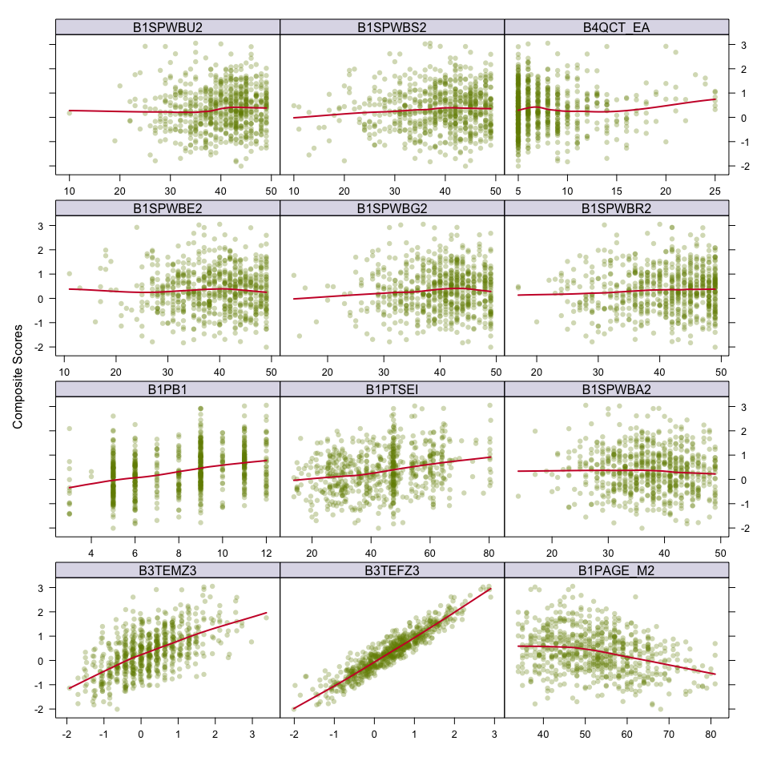
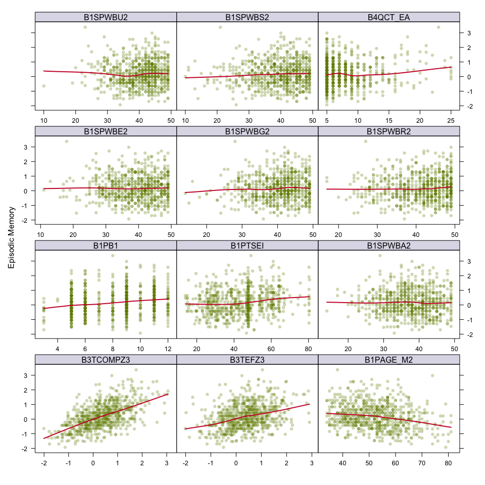
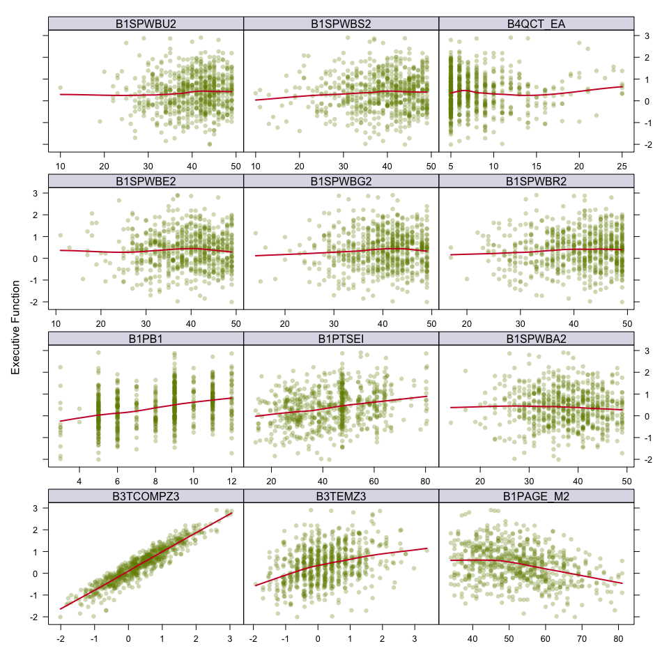
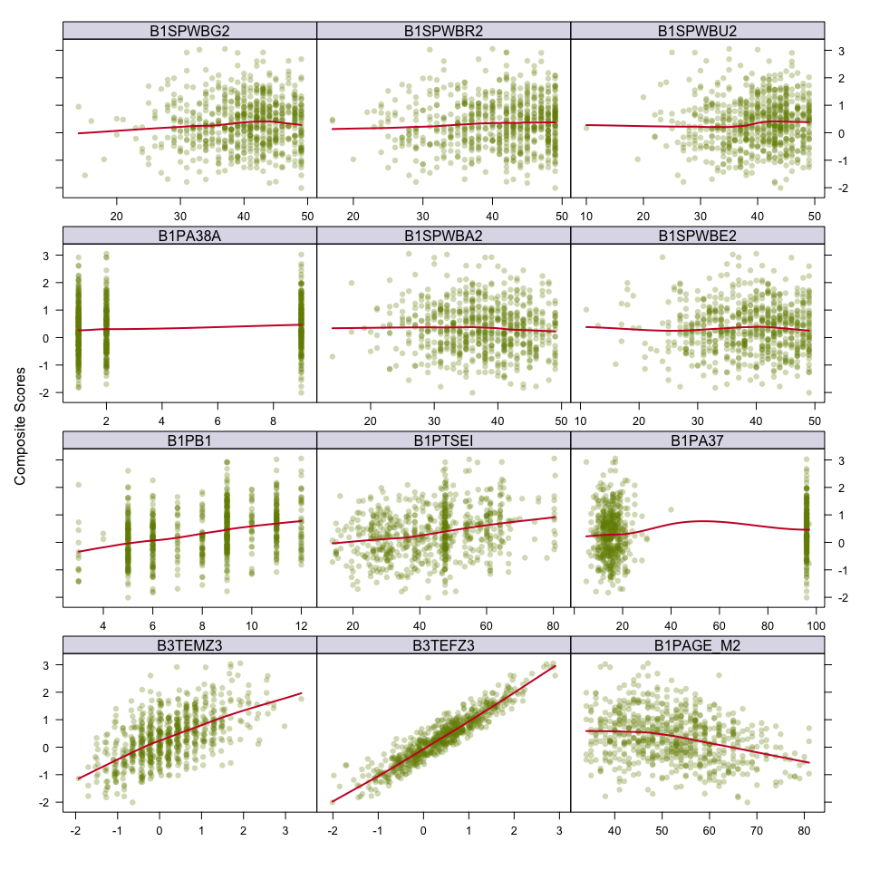
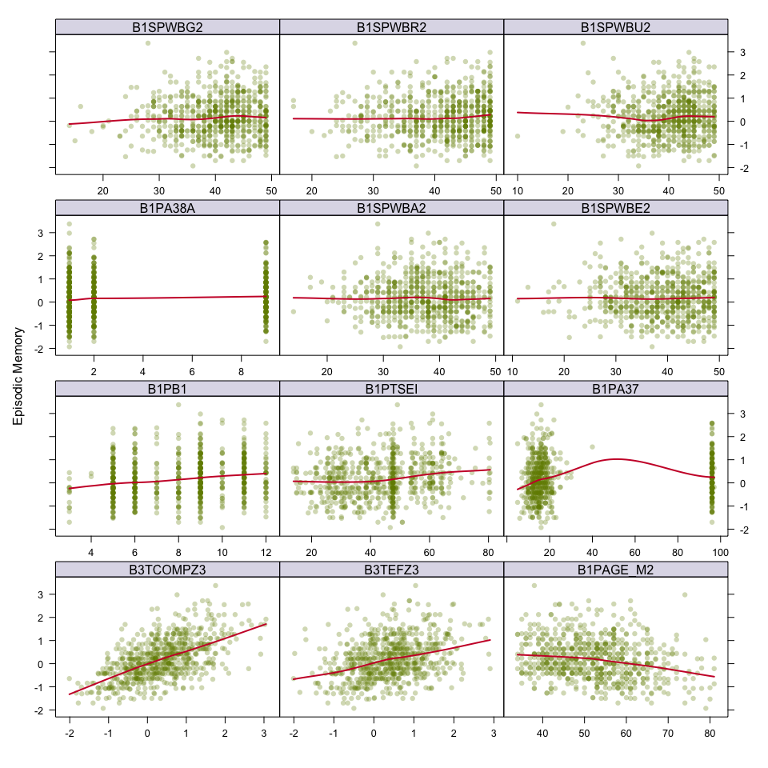
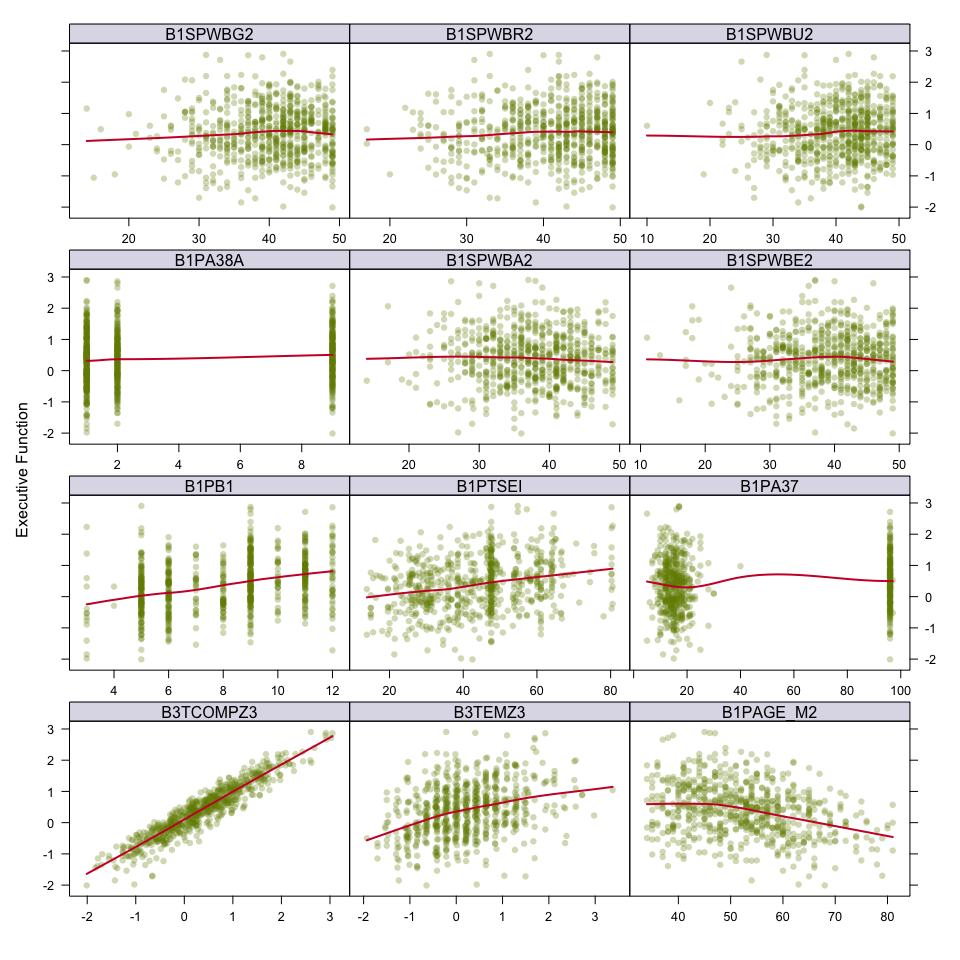
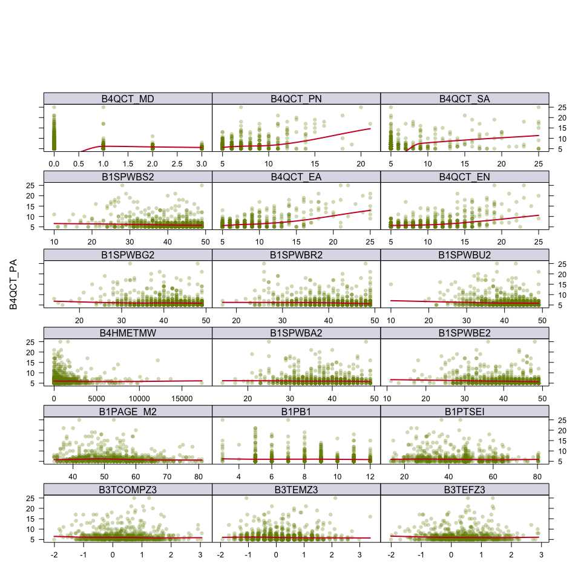
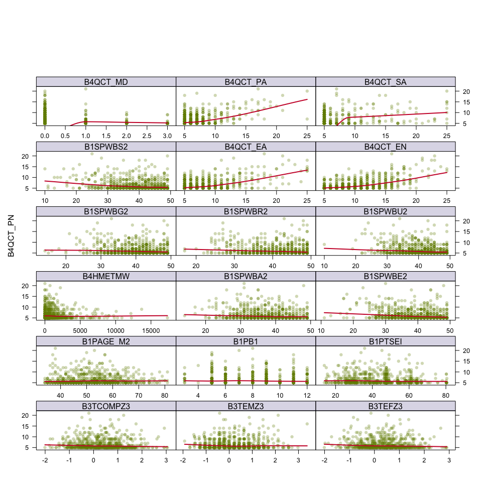
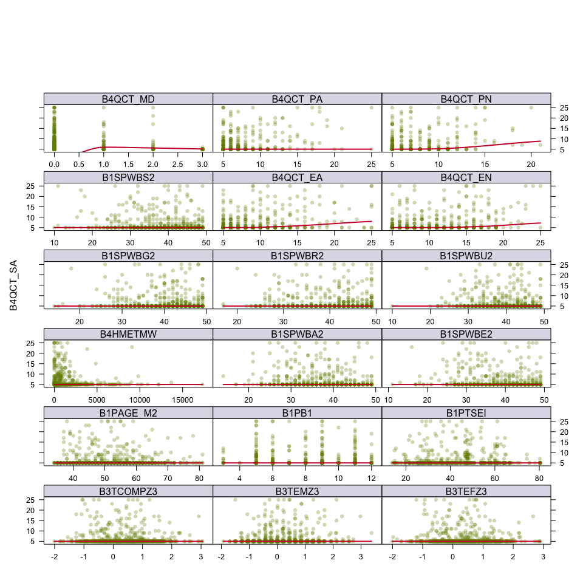
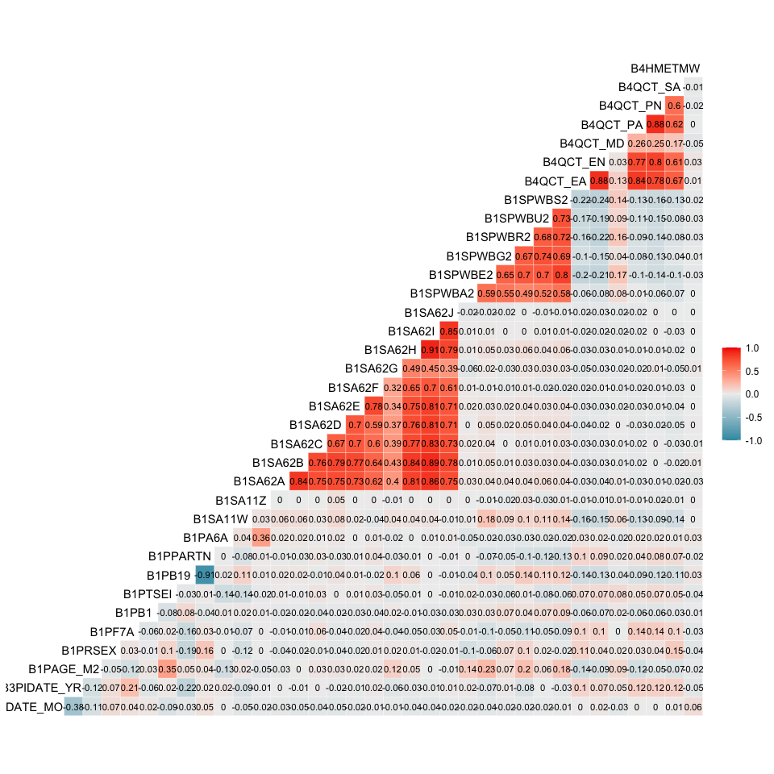

Updates
================
Paula Wu
4/20/2022

### Apr.20 Updates

1.  Get rid of the outliers in `B3TCOMPZ3`,`B3TEMZ3`, `B3TEFZ3` and
    re-draw the graphs.
2.  M3 family number investigation and imputation. Integrate the
    milwaukee sample data to the working datasets.
3.  For M2, only focus on subjects that has CTQ numbers. Integrate the
    milwaukee sample data to the working datasets.
4.  Recode for marital status (1 - married; 0 - other status)
5.  Correlation Plot

### Apr.28 Updates

1.  Stroke: report inconsistency - done
2.  Covariates investigations - partially done. I’m still working on how
    to visualize the categorical independent variales against CTQ values
3.  Resilience Factor - done
4.  Missing Data proportion - small dataset done before, full dataset?
    Not sure..
5.  Smoking - done
6.  Remove invalid entries - done

## MIDUS 2

``` r
# Data integration
m2_df = list(m2p3_selected, m2p1_selected, m2p4_selected) %>% reduce(full_join, by = "M2ID")

# Milwaukee sample family number filled in
m2_df = 
  m2_df %>% 
  mutate(M2FAMNUM = ifelse(is.na(M2FAMNUM), M2ID, M2FAMNUM))

# only keep those with CTQ numbers
m2_df = 
  m2_df %>% 
  filter(!(is.na(B4QCT_EA) & is.na(B4QCT_EN) & is.na(B4QCT_MD) & is.na(B4QCT_PA) & is.na(B4QCT_PN) & is.na(B4QCT_SA)))

# milwaukee sample information filled in
mke1_in_m2= intersect(m2_df$M2ID, mke1$M2ID)

# ethnicity: BACR7A = 2
# don't have cohabitation in mke1, impute as NA
mke1_to_add = 
  mke1 %>% 
  select(M2ID, BACRAGE, BACRSEX, BACB1, BACTSEI, BACB19, BACA6A, BACA39, BACAS11W, BACAS11Z, 
         BACAS62A, BACAS62B, BACAS62C, BACAS62D, BACAS62E, BACAS62F, BACAS62G, BACAS62H, BACAS62I, BACAS62J,
         BASPWBA2, BASPWBE2, BASPWBG2, BASPWBR2, BASPWBU2, BASPWBS2) %>% 
  filter(M2ID %in% mke1_in_m2) %>% 
  mutate(BACR7A = 2, BACPARTN = NA) %>%  # added two more columns
  select(M2ID, BACRAGE, BACRSEX, BACR7A, BACB1, BACTSEI, BACB19, BACPARTN, everything())

# fill in data
for (i in 1:(length(mke1_to_add)-1)){
  for (j in mke1_to_add$M2ID){
    m2_df[m2_df$M2ID == j, i+7] = mke1_to_add[mke1_to_add$M2ID == j, i+1]
  }
}

# Marital Status recoding (1-married; 0-others)
m2_df =
  m2_df %>% 
  mutate(B1PB19 = ifelse(B1PB19 == 1, 1, 0))

# resilience factor (part 1) investigation

a = m2_df %>% 
  select(M2ID, B1SPWBA2, B1SPWBE2, B1SPWBG2, B1SPWBR2, B1SPWBU2, B1SPWBS2)
a[!complete.cases(a), ] %>% 
  filter(M2ID %in% mke1_in_m2) # missing data entries are all from the milwaukee sample
```

    ## # A tibble: 20 × 7
    ##     M2ID B1SPWBA2 B1SPWBE2 B1SPWBG2 B1SPWBR2 B1SPWBU2 B1SPWBS2
    ##    <dbl>    <dbl>    <dbl>    <dbl>    <dbl>    <dbl>    <dbl>
    ##  1 11397       NA       NA       NA       NA       NA       NA
    ##  2 13870       NA       NA       NA       NA       NA       NA
    ##  3 14040       NA       NA       NA       NA       NA       NA
    ##  4 14087       NA       NA       NA       NA       NA       NA
    ##  5 14169       NA       NA       NA       NA       NA       NA
    ##  6 16335       NA       NA       NA       NA       NA       NA
    ##  7 17041       NA       NA       NA       NA       NA       NA
    ##  8 10993       NA       NA       NA       NA       NA       NA
    ##  9 11137       NA       NA       NA       NA       NA       NA
    ## 10 11461       NA       NA       NA       NA       NA       NA
    ## 11 12838       NA       NA       NA       NA       NA       NA
    ## 12 13084       NA       NA       NA       NA       NA       NA
    ## 13 13089       NA       NA       NA       NA       NA       NA
    ## 14 13657       NA       NA       NA       NA       NA       NA
    ## 15 14330       NA       NA       NA       NA       NA       NA
    ## 16 14842       NA       NA       NA       NA       NA       NA
    ## 17 15068       NA       NA       NA       NA       NA       NA
    ## 18 15326       NA       NA       NA       NA       NA       NA
    ## 19 16835       NA       NA       NA       NA       NA       NA
    ## 20 19102       NA       NA       NA       NA       NA       NA

``` r
# Smoking: B1PA39: now smoking cigarettes regularly. 1 - current, 2 - former, 9 - never (question skipped). No NA, no *big* imputation needed 
# Keep this variable as a dummy variable for now, may consider the B1PA40 (how many cig) later if found that this dummy variable is significant
m2_df %>% 
  select(M2ID, B1PA39) %>% 
  group_by(B1PA39) %>% 
  summarize(n = n())
```

    ## # A tibble: 3 × 2
    ##   B1PA39     n
    ##    <dbl> <int>
    ## 1      1   173
    ## 2      2   398
    ## 3      9   684

``` r
# maybe unnecessary, just re-level the three values
m2_df = m2_df %>% 
  mutate(B1PA39 = factor(B1PA39, levels = c(9,2,1)))
unique(m2_df$B1PA39)
```

    ## [1] 9 2 1
    ## Levels: 9 2 1

——- Done MIDUS 2 dataset integration and imputations ——- Stroke
investigation is down below

## MIDUS 3

``` r
m3_df = list(m3p3_selected, m3p1_selected) %>% reduce(left_join, by = "M2ID")

mke2_in_m3= intersect(m3_df$M2ID, mke2$M2ID)
```

All subjects whose don’t have family numbers are from the Milwaukee
sample (MKE2). Impute with their own ID.

``` r
m3_df = 
  m3_df %>% 
  mutate(M2FAMNUM = ifelse(is.na(M2FAMNUM), M2ID, M2FAMNUM))
```

``` r
# data imputation 
mke2_to_add = 
  mke2 %>% 
  select(M2ID, CACA6A, CACAS11Z, CACB19)

for (i in 1:(length(mke2_to_add)-1)){
  for (j in mke2_to_add$M2ID){
    m3_df[m3_df$M2ID == j, i+8] = mke2_to_add[mke2_to_add$M2ID == j, i+1]
  }
}

# no missing data in M3
m3_df %>% 
  select_if(function(x) any(is.na(x))) %>% 
  summarise_each(funs(sum(is.na(.))))
```

    ## data frame with 0 columns and 1 row

``` r
# strokes
# noted that this stroke dataframe is smaller than the previous one: only 1049 entries. M3 missing 206 participants with no stroke data
stroke_df = merge(x = m2_df[, c("M2ID", "B1PA6A", "B1SA11Z")], y = m3_df[,c("M2ID", "C1PA6A", "C1SA11Z")], by = "M2ID", all.x=TRUE) %>% 
  filter(!(is.na(C1PA6A) & is.na(C1SA11Z))) %>% 
  mutate(B1PA6A = recode(B1PA6A, `2` = 0),
         C1PA6A = recode(C1PA6A, `2` = 0),
         B1SA11Z = recode(B1SA11Z, `2` = 0),
         C1SA11Z = recode(C1SA11Z, `2` = 0),
         D1PA6A = C1PA6A - B1PA6A, # D for delta
         D1SA11Z = C1SA11Z - B1SA11Z) 

# inconsistency check: M2.
# (12month history - history ever): -1 - have had stroke but not within 12 months
stroke_df %>% 
  mutate(inconsistency_checker = B1SA11Z - B1PA6A) %>% 
  group_by(inconsistency_checker, B1PA6A, B1SA11Z) %>% 
  summarize(size = n())
```

    ## # A tibble: 3 × 4
    ## # Groups:   inconsistency_checker, B1PA6A [3]
    ##   inconsistency_checker B1PA6A B1SA11Z  size
    ##                   <dbl>  <dbl>   <dbl> <int>
    ## 1                    -1      1       0    22
    ## 2                     0      0       0  1022
    ## 3                     0      1       1     5

The inconsistency checker has only 2 values: 0 and -1. Two possibilities
for getting a 0: 1. had stroke before and/or had it within 12 months; 2.
never have a stroke. For -1, the subject had a stroke some time before
the questionnaire but it’s not within 12 months. No inexplicable
inconsistency here.

——- Done MIDUS 3 dataset integration and imputations ——-

### Univariate Analysis

``` r
# parameters setup 
theme1 = trellis.par.get()
theme1$plot.symbol$col = rgb(0.4556, 0.5444, 0, .3) 
theme1$plot.symbol$pch = 16
theme1$plot.line$col = rgb(0.8, 0, 0.2, 1)
theme1$plot.line$lwd = 2
theme1$strip.background$col = rgb(0.2611, 0.2124, 0.5265, .2)
trellis.par.set(theme1)
```

``` r
# some filtering first
m2_df_graph = m2_df %>% 
  drop_na() %>% # this step seems necessary, otherwise the dimensions are off
  filter(B4QCT_SA <= 25 & B1PTSEI <= 80.53 & B4HMETMW <= 26355 & B4QCT_EN <=25 & B4QCT_MD <= 3 & B4QCT_PN <= 21 &
           B1PB1 <= 12 & B4QCT_EA <= 25 & B3TCOMPZ3 < 4 & B3TEMZ3 < 4 & B3TEFZ3 < 4 & B1SPWBA2 < 50 & B1SPWBE2< 50 & B1SPWBG2<50 &
           B1SPWBR2 <50 & B1SPWBU2<50 & B1SPWBS2<50 & B1PF7A < 7 & B1PA6A < 3 & B1SA62A <3 & B1SA62B <3 &B1SA62C <3 
          & B1SA62D <3 & B1SA62E <3 & B1SA62F <3 & B1SA62G <3 & B1SA62H <3 & B1SA62I <3 & B1SA62J <3) 

# M2 continuous
m2_df_graph_cont = m2_df_graph %>% 
  select(-c(B1PRSEX, B1PF7A, B1PB19, B1PPARTN, B1PA6A, B1SA11W, B1SA11Z, B1SA62A, B1SA62B, 
            B1SA62C, B1SA62D, B1SA62E, B1SA62F, B1SA62G, B1SA62H, B1SA62I, B1SA62J, B3PIDATE_MO, B3PIDATE_YR, B1PA39))

# Cognition composite score
x_feature = model.matrix(`B3TCOMPZ3` ~., m2_df_graph_cont[3:15])[, -1]
y = m2_df_graph_cont$B3TCOMPZ3
featurePlot(x_feature, y, plot = "scatter", labels = c("", "Composite Scores"),
            type = c("p", "smooth"), layout = c(3,4))
```



``` r
# Episodic Memory
x_feature = model.matrix(`B3TEMZ3` ~., m2_df_graph_cont[3:15])[, -1]
y = m2_df_graph_cont$B3TEMZ3
featurePlot(x_feature, y, plot = "scatter", labels = c("", "Episodic Memory"),
            type = c("p", "smooth"), layout = c(3,4))
```



``` r
# Executive Function
x_feature = model.matrix(`B3TEFZ3` ~., m2_df_graph_cont[3:15])[, -1]
y = m2_df_graph_cont$B3TEFZ3
featurePlot(x_feature, y, plot = "scatter", labels = c("", "Executive Function"),
            type = c("p", "smooth"), layout = c(3,4))
```



``` r
# M2 categorical
m2_df_graph_cate = 
  m2_df[,!(colnames(m2_df) %in% colnames(m2_df_graph_cont[3:21]))] %>% 
  drop_na()
```

Covariates or confounding?

``` r
# graphs
# select variables that I thought are potential confounders
m2_df_cov = m2_df_graph %>% 
  select(B3TCOMPZ3, B3TEMZ3, B3TEFZ3, B1PAGE_M2, B1PRSEX, B1PF7A, B1PB1, B1PTSEI, B1PB19, B1PPARTN, B1PA39, B4HMETMW, B1SA11W, 
         B1SA62A, B1SA62B, B1SA62C, B1SA62D, B1SA62E, B1SA62F, 
         B1SA62G, B1SA62H, B1SA62I, B1SA62J, B1SPWBA2, B1SPWBE2, B1SPWBG2, B1SPWBR2, B1SPWBU2, B1SPWBS2, B4QCT_EA, B4QCT_EN,
         B4QCT_MD, B4QCT_PA, B4QCT_PN, B4QCT_SA)

m2_df_cov_cont = m2_df_cov[,!(colnames(m2_df_cov) %in% colnames(m2_df_graph_cate[3:22]))]

# B4QCT_EA
x_feature = model.matrix(`B4QCT_EA` ~., m2_df_cov_cont)[, -1]
y = m2_df_cov_cont$B4QCT_EA
featurePlot(x_feature, y, plot = "scatter", labels = c("", "B4QCT_EA"),
            type = c("p", "smooth"), layout = c(3,7))
```



``` r
# B4QCT_EN
x_feature = model.matrix(`B4QCT_EN` ~., m2_df_cov_cont)[, -1]
y = m2_df_cov_cont$B4QCT_EN
featurePlot(x_feature, y, plot = "scatter", labels = c("", "B4QCT_EN"),
            type = c("p", "smooth"), layout = c(3,7))
```



``` r
# B4QCT_MD
x_feature = model.matrix(`B4QCT_MD` ~., m2_df_cov_cont)[, -1]
y = m2_df_cov_cont$B4QCT_MD
featurePlot(x_feature, y, plot = "scatter", labels = c("", "B4QCT_MD"),
            type = c("p", "smooth"), layout = c(3,7))
```



``` r
# B4QCT_PA
x_feature = model.matrix(`B4QCT_PA` ~., m2_df_cov_cont)[, -1]
y = m2_df_cov_cont$B4QCT_PA
featurePlot(x_feature, y, plot = "scatter", labels = c("", "B4QCT_PA"),
            type = c("p", "smooth"), layout = c(3,7))
```



``` r
# B4QCT_PN
x_feature = model.matrix(`B4QCT_PN` ~., m2_df_cov_cont)[, -1]
y = m2_df_cov_cont$B4QCT_PN
featurePlot(x_feature, y, plot = "scatter", labels = c("", "B4QCT_PN"),
            type = c("p", "smooth"), layout = c(3,7))
```



``` r
# B4QCT_SA
x_feature = model.matrix(`B4QCT_SA` ~., m2_df_cov_cont)[, -1]
y = m2_df_cov_cont$B4QCT_SA
featurePlot(x_feature, y, plot = "scatter", labels = c("", "B4QCT_SA"),
            type = c("p", "smooth"), layout = c(3,7))
```



Correlation Plot of independent variables in M2 dataset
(i.e. `B3TCOMPZ3`,`B3TEMZ3`, `B3TEFZ3` are not included in the graph)

``` r
m2_df %>% 
  select(-c(M2ID, M2FAMNUM, B3TCOMPZ3, B3TEMZ3, B3TEFZ3)) %>% 
  ggcorr(label=TRUE, hjust = 0.9, layout.exp = 2, label_size = 3, label_round = 2)
```



High correlation between marital status and cohabitation, among the drug
use variables (`B1SA62A - J`), among the CTQ score variables
(`B4QCT_EA`, `B4QCT_EN`, `B4QCT_MD`, `B4QCT_PA`, `B4QCT_PN`,
`B4QCT_SA`).
